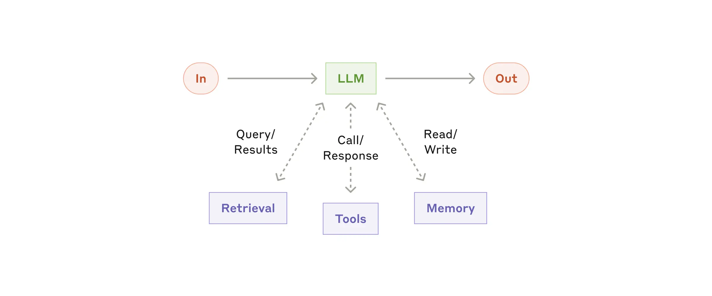
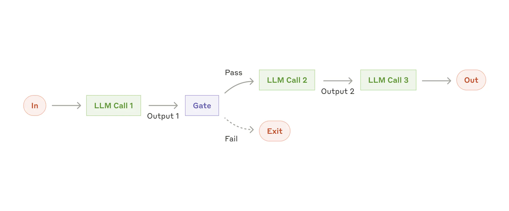
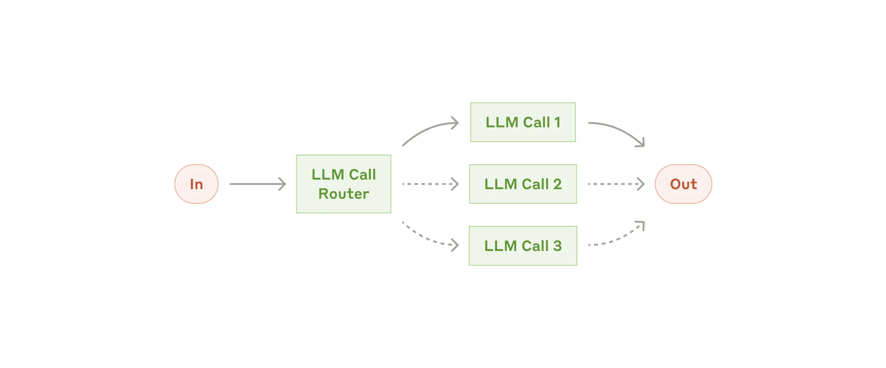

# 组成模块

## 构建模块-增强型LLM
代理系统的基本构建模块是一个通过检索(`Retrieval`)、工具(`Tools`)和内存(`Memory`)等增强功能的`LLM`。现有的模型可以主动利用这些能力---生成自己的搜索结果，选择合适的工具，并确定需要保留哪些信息。

## 工作流程-提示链

提示链(`Prompt Chain`)将任务分解为一系列步骤，每个`LLM`调用并处理前一个`LLM`的输出。

这种任务非常适合任何可以轻松且干净的分解为固定子任务的情况，主要目标是通过降低延迟以获得更高的准确性，让每次调用都变得更轻松。

案例：
* 生成营销文案，然后将其翻译成另外一种语言。
* 写一份文件的大纲，检查大纲是否符合某些标准，然后根据大纲写文件。

## 工作流程-路由

路由(`Routing`)对输入进行分类，并将其导向到专门的后续任务。这种工作流程允许关注点分离，并构建更专业的提示。没有这种工作流程，针对一种输入类型优化可能会影响到其他输入的性能。

路由适用于复杂任务，当有不同类别时更适合单独处理，且分类可以通过`LLM`或者更传统的分类模型/算法准确处理。

案例：
* 将不同类型的客户端问题(一般问题、退款、技术支持)引导到下游流程、提示和工具中。

## 工作流程-并行化

## 工作流程-编排工作者

## 工作流程-评估和优化器

## 参考链接
* [Building effective agents](https://www.anthropic.com/engineering/building-effective-agents)
* [LLM Powered Autonomous Agents](https://lilianweng.github.io/posts/2023-06-23-agent/)