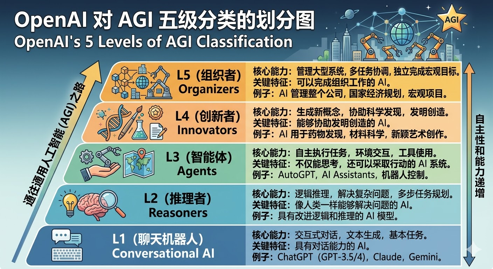
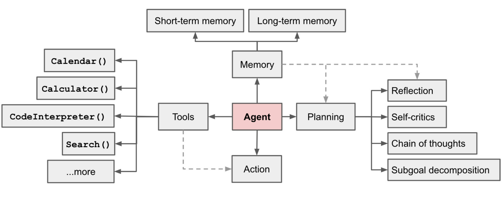

# 介绍

## AGI
**AGI(Artificial General Intelligence)**：通用人工智能，OpenAI对**AGI**进行过如下五级分类：



## Agent定义
**AI Agent** 是一种能够自主感知环境、进行决策并执行任务的智能系统，它不仅能“回答问题”（像传统 LLM），而是能够 理解目标 → 制定计划 → 调用工具 → 执行任务 → 根据结果继续决策。



## Agent特征
* **Autonomy(自主性)**: 不需要人类逐步指令，可以自己决定下一步行动。
* **Perception(感知能力)**: 能读取外部信息，例如：用户输入、数据库、API、文件和网络等。
* **Reasoning(推理能力)**: 使用 LLM 或其他模型进行思考与决策。
* **Action(行动能力)**: 调用工具或系统执行操作，例如：调用API、执行代码、操作浏览器、查询数据库等。
* **Memory(记忆能力)**: 保存历史信息用于后续决策。

## 典型架构
一个典型`Agent`架构通常包含 5 个核心模块。
```text
            +----------------+
            |     User       |
            +--------+-------+
                     |
                     v
            +----------------+
            |       LLM      |
            |  (Reasoning)   |
            +--------+-------+
                     |
        +------------+-------------+
        |                          |
        v                          v
+---------------+          +---------------+
|    Memory     |          |     Tools     |
| (向量数据库)   |          | API/代码/浏览器 |
+---------------+          +---------------+
                     |
                     v
               +-----------+
               |  Action   |
               +-----------+
```
核心流程：输入 → 思考 → 规划 → 调用工具 → 获取结果 → 再思考 → 输出。

## 开发框架
| 框架                            | 特点                                     | 适用场景                 |
| ----------------------------- | -------------------------------------- | -------------------- |
| **LangChain**          | 支持多工具调用、任务规划、Memory管理、Chain-of-Thought | 各类 Agent、RAG、企业知识库应用 |
| **LangGraph**                 | LangChain升级版，更偏向可视化任务流、可组合Agent        | 企业级复杂任务自动化           |
| **AutoGPT**                   | 自动多步任务执行、任务规划能力强、可持续运行                 | 自动化任务、Web操作、数据抓取     |
| **Microsoft Semantic Kernel** | Agent + LLM + Memory + Planner，企业级SDK  | 企业智能助手、自动化流程         |
| **CrewAI**                    | 多 Agent 协作框架，角色分工明确                    | 多 Agent 协作、复杂任务分工    |

## Agent产品

| 产品                             | 公司                 | 核心能力             | 特点               | 应用场景         |
| ------------------------------ | ------------------ | ---------------- | ---------------- | ------------ |
| **ChatGPT**      | OpenAI             | LLM + 插件调用       | 可调用外部插件完成任务      | 办公助手、开发、信息查询 |
| **Claude Code**         | Anthropic          | LLM + 多轮思维       | 安全、可控性强          | 企业问答、文档分析    |
| **Copilot** | Microsoft | 代码生成 + IDE操作     | 可自动生成代码、调用文档     | 编程辅助、代码自动化   |
| **Cursor**                     | Anysphere                 | 代码 Agent         | 自动完成代码任务         | 开发者生产力       |

## 低代码Agent平台
| 平台           | 核心特点             | 优势                      | 应用场景               |
| ------------- | ---------------- | ----------------------- | ------------------ |
| **Coze** | AI Agent 低代码平台 | 支持任务链 + 数据源接入 | 智能问答、自动化流程 |
| **Dify** | LLM + Agent 可视化构建 | 支持多 Agent、插件调用、低代码拖拽 | 企业办公、智能客服、自动化任务|
| **n8n**       | 可视化工作流 + API 集成  | 支持 LLM + 多系统集成，开源可自托管   | 自动化办公、任务调度、数据处理    |
| **FastGPT**   | LLM Agent 平台     | 支持多 Agent 协作、插件管理、低代码拖拽 | 自动化任务、知识问答、数据分析    |
| **AgentGPT**  | Web 可视化 Agent 创建 | 无需编程，直接拖拽任务节点           | 自动任务执行、爬虫、数据分析     |
