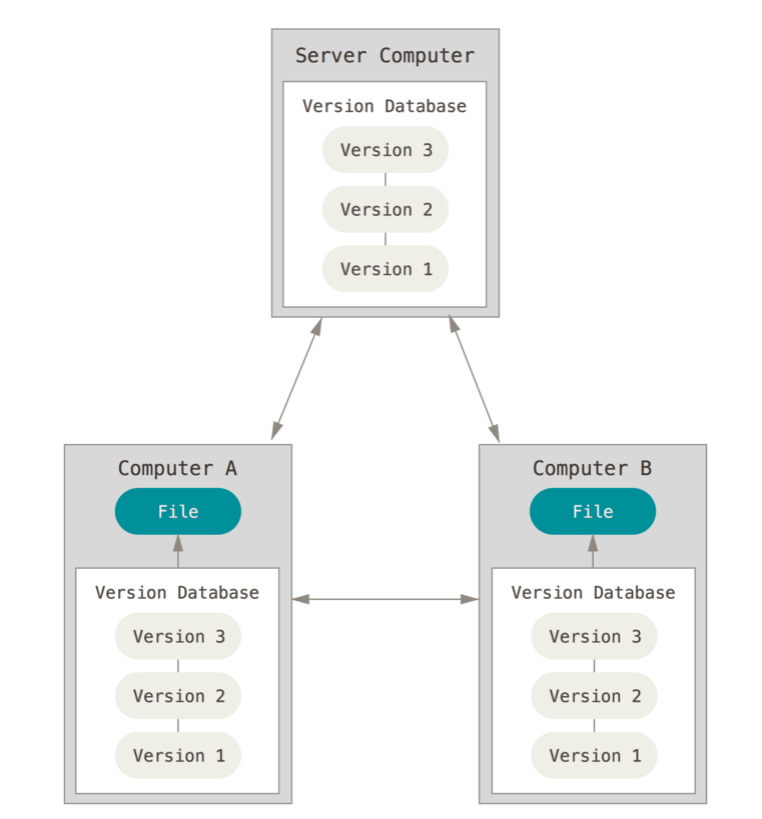
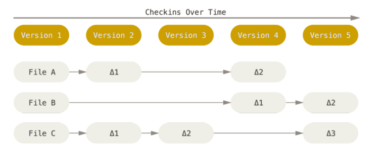

# 精通Git

## 起步

### 版本控制
版本控制`VCS`是一套系统，该系统按时间顺序记录某一个或一系列文件的变更，让我们可以查看其以前的特定版本，其有三种类别：**本地版本控制系统**、**集中式版本控制系统**、**分布式版本控制系统**。

#### 本地版本控制系统
很多人控制版本的方式是将文件复制到另一个文件目录，甚至还会给目录加上一个时间戳，这种做法很常见，而且很容易实现。但这种方式也同样出错，随后衍生出来的`RCS`工具，它是一种常见的`VCS`工具，它会在磁盘上以一种特殊的格式保存补丁集。


#### 集中式版本控制系统
由于本地版本控制系统无法解决多人协作问题，集中式版本控制系统`CVCS`也就应运而生了。它与本地版本控制系统相比，有多方面的优势：
* 所有人在一定程度上知道其他人在项目里做了什么。
* 管理员可以精细的控制每一个人的权限。
* 维护一个集中式版本控制系统要比在每台客户机上都维护一个数据库简单得多。

但集中式版本控制系统也不是没有缺点的，它最大的缺点是故障问题：如果集中式服务器存在故障宕机，那么这期间任何人都不能协作或者提交更改；如果中央数据库所在的硬盘受损，备份也没有保住的情况下，代码将会面临全面丢失的风险。


#### 分布式版本控制系统
为了针对解决以上集中式版本控制系统所存在的潜在问题，进而出现了分布式版本控制系统`DVCS`。对于一个分布式版本控制系统来说，客户端冰粉仅仅是检出文件的最新快照，而是对代码仓库进行完整的镜像。这样一来，无论哪一个服务器出现故障，任何一个客户端都可以使用自己本地的镜像来恢复服务器。



除了以上提到的有点，分布式版本控制系统可以很好的处理多个远程仓库。

### 简史
同许多伟大的事物一样，`Git`的诞生伴随着许多颠覆式的创新以及激烈的争论。

* 2002年，`Linux`内核项目开始采用一款叫做`BitKeeper`的专用分布式版本控制系统。
* 2005年，`Linux`开发者社区与`BitKeeper`研发公司关系破裂，该公司回收了软件的免费使用权，这个事情促使了`Linux`开发社区决定开发自己的版本控制系统。
* 2005年，`Git`版本控制系统诞生。

`Git`开发之初，它的设计目标如下：
* 速度快
* 设计简洁
* 对于非线性开发强有力的支持
* 完全的分布式设计
* 能够有效的处理大象项目

### Git基础

#### 快照，而非差异
`Git`与其他版本控制系统相比，最大的不同在于其对待数据的方式。
* 其他版本控制系统：将其存储的信息视为一组文件以及对这些文件随时间所作出的变更。



* `Git`版本控制系统：每次提交或在`Git`中保存项目的状态时，`Git`会抓取一张所有文件当前状态的快照，然后存储一个指向该快照的引用。


#### Git的完整性
`Git`的所有数据在存储前都会执行校验和计算，随后以校验和来引用对应的数据，其采用的校验和机制叫做`SHA-1`散列，它是一个由`40`个十六进制字符所组成的字符串，它是根据文件内容或`Git`的目录结构计算所得到的。一个`SHA-1`散列的案例如下：
```sh
24b9da6552252987aa493b52f8696cd6d3b00373
```

#### 三种状态
在`Git`中，文件可以处于以下三种状态之一：
* 已修改`modified`：已修改表示已经改动了文件，但尚未提交到数据库。
* 已暂存`staged`：已暂存表示对已修改文件的当前版本做出了标识并将其加入到下一次提交的快照中。
* 已提交`committed`：已提交表示数据已经被安全地存入本地数据库中。

根据以上文件的三种状态，由此便引入了`Git`的三个主要区域的概念：
* 工作目录：是项目某个版本的单次检出
* 暂存区：是一个文件，一般位于`Git`目录中，它保存了下一次所要提交内容的相关信息。
* `Git目录`：是保存项目元数据和对象数据库的地方，它是`Git`最核心最重要的部分。

根据以上的概念，我们不难推测出`Git`的基本工作流：
* 修改工作目录中的文件。
* 暂存文件，将这些文件的快照加入暂存区。
* 提交暂存区中的文件，将快照永久的保存在`Git`目录中。


## Git基础
在安装完毕`Git`后，我们首先需要做的就是配置`Git`信息配置：
::: tip 参数说明
`--global`参数代表在当前计算机中全局配置，如果不带此参数，则代表仅在当前的`Git`目录下配置用户名和邮箱地址。
:::
```sh
$ git config --global user.name 'your name'
$ git config --global user.email 'you email'
```
注意：配置用户名和电子邮件地址非常重要，因为`Git`的每一次提交都会用到这些信息，而且还会被写入到所创建的提交中，不可更改。

在配置完用户名和邮箱地址后，我们可以使用如下命令查看我们的相关配置信息：
```sh
# 列举所有配置
$ git config --list
user.email=your email
user.name=your name

# 查看单个配置后
$ git config user.name
your name
```
### 获取Git仓库
建立`Git`项目的方法主要有两种：第一种是把现有项目或者目录导入到`Git`中，另外一种是从服务器上克隆现有的`Git`仓库。

在现有目录下，使用如下命令可以把项目进行`Git`管理：
```sh
$ git init
```
这个命令会在当前目录下，新建一个`.git`文件夹，这个文件夹包含了构成`Git`仓库骨架的所有必须文件。

克隆仓库需要使用`git clone [url]`命令：
```sh
# 克隆现有仓库
$ git clone https://github.com/wangtunan/blog
```
执行这段命令后，会创建一个叫做`blog`的目录，并在其中初始化`.git`目录，然后将远程仓库中所有的数据拉取到本地并检出最新版本的可用副本。

如果我们在克隆的时候，需要更改创建目录的名字，可以如下方式：
```sh
# 克隆现有仓库，新创建的目录名字叫做newblog
$ git clone https://github.com/wangtunan/blog newblog
```
### 记录更改到仓库
在`Git`工作目录中，每一个文件都处于两种状态之一：
* 已跟踪：是指上一次快照中包含的文件，这些文件又可以分为未修改、已修改或已暂存三种状态。
* 未跟踪：工作目录中排出已跟踪文件之外的所有文件。

#### 查看当前文件的状态
如果我们在`git init`或者克隆仓库后立即使用`git status`命令来检查文件的状态，将会输出以下信息：
```sh
$ git status
On branch master
No commits yet
nothing to commit (create/copy files and use "git add" to track)
```
以上说明代表我们的工作目录是干净的，这个时候如果我们新建了一个`README.md`文件，再次使用`git status`后，它的输出信息就会变成如下所示：
```sh
$ git status
On branch master
No commits yet
Untracked files:
  (use "git add <file>..." to include in what will be committed)

        README.md

nothing added to commit but untracked files present (use "git add" to track)
```
在以上代码的提示中我们可以看到，新创建的`README.md`文件处于未跟踪状态。<br/>
在`Git`中判断一个文件是否已跟踪是根据上一次的快照为基础进行对比的。需要注意的是`Git`并不会主动的帮我们把这些文件包含到下一次提交的文件范围中，这样做是为了避免不小心把编译生成的二进制文件或者其他我们不想跟踪的文件包含进来。

**注意**：如果你觉得`git status`命令的输出消息过于全面，`Git`提供了一种显示简短状态命令行的选项，添加`--short`参数：
```sh
# 显示简短信息
$ git status -s
# 或者
$ git status --short
A  README.md
```
简写说明：
* `??`：表示未被跟踪的新文件。
* `A`：表示已暂存的新文件。
* `M`：表示已修改的文件。
* `MM`：表示被修改过两次的文件。

#### 跟踪新文件
在以上案例中，我们新创建的`README.md`处于未跟踪状态，我们可以使用`git add`命令来让`Git`跟踪此文件：
::: tip 参数说明
`git add`命令接受一个文件、多个文件或目录的路径名作为参数，如果提供的参数是目录，该命令会递归地添加该目录下的所有文件。
:::
```sh
# 跟踪README.md文件
$ git add README.md
# 跟踪完毕后，查看文件状态
$ git status
On branch master
No commits yet
Changes to be committed:
  (use "git rm --cached <file>..." to unstage)

        new file:   README.md
```

#### 忽略文件
有时候我们并不想某一类文件被`Git`自动添加，这个时候我们可以在根目录下新建`.gitignore`文件，然后把不想要被`Git`跟踪的文件名或者其他匹配模式填写进去即可：
```sh
package-lock.json # 不跟踪单个文件
node_modules/     # 不跟踪node_modules目录下的所有文件
dist/             # 不跟踪dist目录下的所有文件
*.txt             # 不跟踪所有.txt文件
```

#### 查看已暂存和未暂存的变更
如果`git status`命名显示的信息对你来说信息太过于泛泛，你想要知道具体修改了哪些内容，而不仅仅是更改了哪些文件，这时可以使用`git diff`命令：
```sh
# 查看未添加到暂存区的变更
$ git diff
diff --git a/README.md b/README.md
index 5628bfe..c557f44 100644
--- a/README.md
+++ b/README.md
@@ -1 +1,3 @@
-# 精通Git
\ No newline at end of file
+# 精通Git
+
+嘤嘤嘤
\ No newline at end of file
```

以上命令仅仅只是查看未添加到暂存区的变更，可以添加`--staged`参数，查看哪些已暂存的内容会进入下一次提交：
```sh
# 查看哪些已暂存的内容下一次会被提交
$ git diff --staged
# 或者
$ git diff --cached
diff --git a/README.md b/README.md
new file mode 100644
index 0000000..5628bfe
--- /dev/null
+++ b/README.md
@@ -0,0 +1 @@
+# 精通Git
\ No newline at end of file
```

#### 提交变更
假如我们的暂存区已经准备完毕，那么可以使用`git commit`命令来提交：
```sh
# 提交变更，并在命令行中键入提交信息
$ git commit -m add README.md
[master (root-commit) 7aca891] add
 1 file changed, 3 insertions(+)
 create mode 100644 README.md
```
在`Git`，暂存区非常有用，但就工作流而言，它有时候显得过于繁琐。如果我们想跳过暂存区直接提交，`Git`为我们提供了更快捷的方式：
```sh
# 添加-a参数，跳过暂存区，直接提交
$ git commit  -a -m "update README.md"
[master 6444834] update README.md
 1 file changed, 1 insertion(+), 3 deletions(-)
```

#### 重命名文件
如果我们重命名了文件，那么`Git`会检测到这种变动，同时我们可以使用`git mv`命令来重命名：
```sh
# 重命名
$ git mv README.md readme.md
# 查看重命名后的变更
$ git status
On branch master
Changes to be committed:
  (use "git reset HEAD <file>..." to unstage)

        renamed:    README.md -> readme.md
```

值得一提的是，虽然我们只键入了一条命令，但它相当于下面三条命令：
```sh
$ mv README.md readme.md
$ git rm README.md
$ git add readme.md
```

### 查看提交历史
在我们完成了几次提交以后，我们可以使用`git log`命令来查看提交历史：
```sh
# 查看提交历史
$ git log
commit 6444834e8debf9e407c26ee29ae5fb42b9b99511 (HEAD -> master)
Author: xxx <xxx@gmail.com>
Date:   Mon Mar 30 15:19:28 2020 +0800

    update README.md

commit 7aca89161b709f1f16f637703020815c0afb14ea
Author: xxx <xxx@gmail.com>
Date:   Mon Mar 30 15:13:38 2020 +0800

    add
```
你可以从以上看到，`git log`默认不加参数的情况下，会按时间顺序列出仓库中所有提交，其中最新的提交显示在最前面。

如果你觉得上述信息太过于繁琐，可以使用`--pretty=oneline`参数让以上信息显示在一行：
```sh
# 一行显示提交历史信息
$ git log --pretty=oneline
6444834e8debf9e407c26ee29ae5fb42b9b99511 (HEAD -> master) update README.md
7aca89161b709f1f16f637703020815c0afb14ea add
```

`--stat`参数可以查看每次提交的简要统计信息：
```sh
# 查看简要统计信息
$ git log --stat
commit 6444834e8debf9e407c26ee29ae5fb42b9b99511 (HEAD -> master)
Author: xxx <xxx@gmail.com>
Date:   Mon Mar 30 15:19:28 2020 +0800

    update README.md

 README.md | 4 +---
 1 file changed, 1 insertion(+), 3 deletions(-)

commit 7aca89161b709f1f16f637703020815c0afb14ea
Author: xxx <xxx@gmail.com>
Date:   Mon Mar 30 15:13:38 2020 +0800

    add

 README.md | 3 +++
 1 file changed, 3 insertions(+)
```

最后一个比较有意思的地方是`--graph`参数，它会使用`ASCII`字符形式的简单图来显示`Git`分支以及合并历史：
```sh
# 图形显示提交历史
$ git log --graph
* commit 6444834e8debf9e407c26ee29ae5fb42b9b99511 (HEAD -> master)
| Author: xxx <xxx@gmail.com>
| Date:   Mon Mar 30 15:19:28 2020 +0800
|
|     update README.md
|
* commit 7aca89161b709f1f16f637703020815c0afb14ea
  Author: xxx <xxx@gmail.com>
  Date:   Mon Mar 30 15:13:38 2020 +0800

      add
```

`git log`还有一些其他参数，下列表格列举了常用的选项：
| 选项 |  描述 |
|---|------------------------|
| `-p` | 按补丁格式显示每个提交引入的更改 |
| `--stat` | 显示每个提交中被更改的文件的统计信息 |
| `--shortstat` | 只显示上述`--stat`输出中包含“已更改/新增/删除”行的统计信息 |
| `--name-only` | 只显示每个提交信息后显示被更改的文件列表 |
| `--name-status` | 在上一个选项输出基础上还显示出“已更改/新增/删除”的统计信息 |
| `--abbrev-commit` | 只显示完整的`SHA-1`40位校验和字符串中的前几位 |
| `--relative-data` | 显示相对日期 |
| `--graph` | 在提交历史旁边显示`ASCII`图表，用于展示分支和合并的历史信息 |
| `--pretty` | 用一种可选格式显示提交，选项有`oneline`、`short`、`full`、`fuller`、`format`|


#### 限制提交历史的显示范围
用于限制`git log`显示范围的常用选项如下表：
| 选项 |  描述 |
|---|------------------------|
| `-(n)` | 只显示最新的`n`次提交 |
| `--since`, `--after` | 只输出指定日期之后的提交 |
| `--until`, `--before` | 只输出指定日期之前的提交 |
| `--author` | 只输出与指定字符相匹配作者的提交 |
| `--commit` | 只输出与指定字符相匹配提交者的提交 |
| `--grep` | 只输出与指定字符相匹配提交信息的提交 |
| `--S` | 只输出包含“添加或删除指定字符串”的更改的提交 |

```sh
# 只显示最近一次的提交
$ git log -1
# 只显示作者为xxx的提交
$ git log --author=wangtunan
# 只显示2020年3月31日之前的提交
$ git log --before='2020-03-31'
```

### 撤销操作

有一种撤销操作的场景场景是提交之后发现自己忘记添加某些文件或者写错了提交信息，此时如果想重新提交，可以使用如下命令：
```sh
# 重新添加提交信息
$ git commit -m --amend
```
注意：使用`--amend`重新提交，只会产生一个提交，这是因为重新提交的命令修改了第一个提交的结果。

#### 撤销已暂存的文件
假设我们不小心把不该提交的文件使用了`git add`命令暂存了，可以使用`git status`命令的提示信息来撤销已暂存的文件：
```sh
# 错误提交了README.md文件
$ git add README.md
# 查看文件状态
$ git status
On branch master
Changes to be committed:
  (use "git reset HEAD <file>..." to unstage)

        deleted:    README.md
```
在以上提示信息中，我们可以发现使用`git reset`命令可以取消已暂存的文件：
```sh
# 取消已暂存的文件
$ git reset HEAD README.md
```

#### 撤销对文件的修改
::: warning
`git checkout -- [file]`是一条危险的命令，因为它会丢弃已经修改的内容，而且这种撤销是不可恢复的，在执行这条命令之前务必确保一定不在需要某个文件的修改。
:::
在某些情况下，我们发现不再需要对某个文件的修改了，可以使用`git checkout`命令来帮着我们撤销已经修改的文件：
```sh
# 查看文件的状态
$ git status
  (use "git add <file>..." to update what will be committed)
  (use "git checkout -- <file>..." to discard changes in working directory)

        modified:   README.md
```
我们可以发现，提示的`git checkout -- [file]`命令可以帮助我们撤销对于`README.md`文件的修改：
```sh
# 撤销README.md文件的修改
$ git checkout -- README.md
```

### 远程仓库

#### 显示远程仓库
当我们使用`git clone`命令克隆远程仓库后，我们使用`git remote`显示远程仓库的信息：
```sh
# 克隆远程仓库
$ git clone xxxxxxx
# 显示远程仓库
$ git remote
origin
```
使用`git clone`时，默认情况下，`Git`给克隆服务器取一个叫做`origin`的默认名称。

我们也可以在使用`git remote`时，添加`-v`参数，来显示每一个远程仓库以及它对应的地址：
```sh
# 显示远程仓库信息
$ git remote -v
origin  https://github.com/wangtunan/blog.git (fetch)
origin  https://github.com/wangtunan/blog.git (push)
```

#### 添加远程仓库
要添加远程仓库，并给其取一个名字，可以使用`git remote add [shortname] [url]`命令：
```sh
# 添加远程仓库
$ git remote add origin https://github.com/wangtunan/blog.git
```

#### 从远程仓库拉取数据
要想从远程仓库拉取数据，可以使用`git fetch [remote-name]`命令：
```sh
# 从远程仓库拉取数据
$ git fetch origin
```
**注意**：`git fetch`命令只会把数据拉取到本地仓库，然而它并不会自动将这些数据合并到本地的工作成果中，也不会修改当前工作目录下的任何数据。如果要进行合并，可以使用`git pull [remote-name]`命令：
```sh
# 拉取远程仓库代码并合并到本地
$ git pull origin
```

#### 将数据推送到远程仓库
将数据推送到远程仓库，只需要使用`git push [remote-name] [branch-name]`命令：
```sh
# 将数据推送到远程仓库
$ git push origin master
```

#### 检查远程仓库
想要查看远程仓库的更多信息，可以使用`git remote show [remote-name]`命令：
```sh
# 查看远程仓库的更多信息
$ git remote show origin
  Fetch URL: https://github.com/wangtunan/blog.git
  Push  URL: https://github.com/wangtunan/blog.git
  HEAD branch: master
  Remote branches:
    gh-pages tracked
    master   tracked
  Local branch configured for 'git pull':
    master merges with remote master
  Local ref configured for 'git push':
    master pushes to master (fast-forwardable)
```

#### 删除和重命名远程仓库
可以使用`git remote rename [oldName] [newName]`命令来重命名远程仓库：
```sh
# 重命名远程仓库
$ git remote rename origin newOrigin
```

可以使用`git remote rm [remote-name]`命令来删除远程仓库：
```sh
# 删除远程仓库
$ git remote rm origin
```

### 标记
就像大多数版本控制系统一样，`Git`可以把特定的历史版本标记为重要的版本，其典型应用场景是标出发布版本。


#### 列举标签
使用`git tag`命令来列举所有可用的标签：
```sh
# 列举所有可用的标签
$ git tag
v0.1
v0.3
v0.5
v1.0
v1.2
v1.4
```
注意：`git tag`命令列举的标签会按照字母顺序列出，列举顺序的前后和标签的重要性无关。

如果标签过多，可以使用指定的字符串去匹配：
```sh
# 使用指定的字符串去匹配标签
$ git tag -l "v0."
v0.1
v0.3
v0.5
```

#### 创建标签
在`Git`中，标签分为两种类型：
* 轻量标签：轻量标签很像是一个不变的分支，它只是一个指向某次提交的指针。
* 注释标签：注释标签则会作为完整的对象存储在`Git`数据库中，一般推荐创建注释标签，因为它包含的信息比较多。

```sh
# 创建轻量标签
$ git tag v2.0.0

# 创建注释标签，携带-a参数
$ git tag -a  v2.1.0 -m '注释标签的提交信息'
```
添加完以上标签后，可以使用`git show [tag-name]`命令来显示标签对应的信息：
```sh
# 显示注释标签的信息
$ git show v2.1.0
```

#### 追加标签
我们已经知道可以使用`git log`查看提交历史，如果我们想要给以前某个的提交历史追加标签，可以像下面这样做：
```sh
# 查看提交历史
$ git log --pretty=oneline
6444834e8debf9e407c26ee29ae5fb42b9b99511 (HEAD -> master) update README.md
7aca89161b709f1f16f637703020815c0afb14ea add

# 为7aca89161b709f1f16f637703020815c0afb14ea这次提交追加标签
$ git tag -a v1.0 7aca8916
```

#### 共享标签
默认情况下，`git push`命令不会把标签传输到远程服务器，在创建标签后，必须明确的将标签提交到共享服务器上：
```sh
# 推送本地v1.0标签
$ git push origin v1.0

# 推送本地全部标签
$ git push origin --tags
```

### Git别名
在掌握了以上基本的`Git`操作后，如果你觉得完整的键入某些`Git`命令太繁琐的话，可以为某些命令进行配置别名：
```sh
# 配置别名
$ git config --global alias.ck checkout
$ git config --global alias.br branch

# 使用别名：切换到develop分支
$ git ck develop
```


## Git分支

### 分支机制

### 基本的分支与合并操作

### 分支管理

### 与分支有关的工作流

### 远程分支

### 变基


## 服务器上的Git

### 协议

### 在服务器上搭建Git

### 生成SSH公钥

### 配置服务器

### Git守护进程

### Smart HTTP

### GitWeb

### GitLab


## 分布式Git

### 分布式工作流程

### 对项目做出贡献

### 维护项目


## Git工具

### 选择修订版本

### 交互式暂存

### 存储与清理

### 签署工作

### 搜索

### 重写历史

### 重置揭秘

### 高级合并

### Refere

### 使用Git调试

### 子模块

### 打包

### 替换

### 凭证存储


## 自定义Git

### 配置Git

### Git属性

### Git钩子

### 使用强制策略


## Git内部原理

### 底层命令和高层命令

### Git对象

### Git引用

### 包文件

### 引用规格

### 传输协议

### 维护与数据恢复

### 环境变量