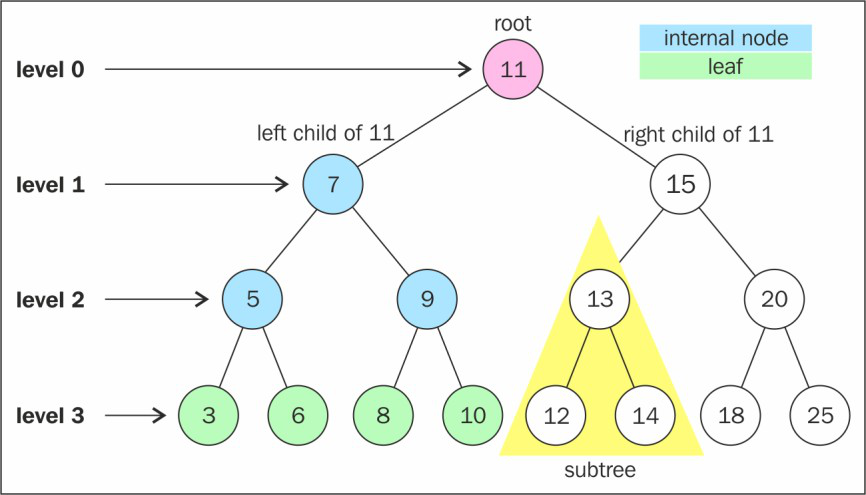
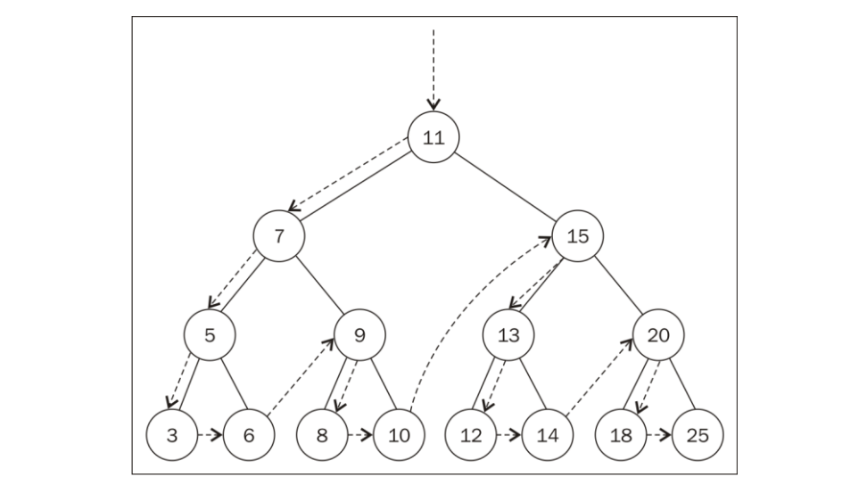

# JavaScript数据结构和算法

## 数组
数组存储了一系列同一种数据类型的值，虽然在`JavaScript`中，也可以在数组中保存不同类的值，但我们还是需要遵守最佳实践，避免这样做。

### 为什么用数组？
问：为什么我们需要使用数组？<br/>
答：在生活中，我们经常会碰到类似于如下这样的需求：保存所在城市每个月的平均温度。
```js
const averageTempJan = 31.9
const averageTempFeb = 35.3
const averageTempMar = 42.4
const averageTempApr = 52
const averageTempMay = 60.8
```
幸运的时，一年只有12个月，我们最多只需要定义12个变量便能满足以上的需求。但如果我们需要记录一年365天每一天的平均温度，那么我们是否需要定义365个变量呢？<br/>
这个时候，如果能够一种结构，能够存储这一类的数据，那么就可以解决我们当前遇到的问题，正如你所猜到的那样，这种结构就是数组：
```js
const averageTemp = []
averageTemp[0] = 31.9
averageTemp[1] = 35.3
averageTemp[2] = 42.4
averageTemp[3] = 52
averageTemp[4] = 60.8
```

### 创建和初始化数组

创建和初始化数组有两种方式：构造函数和字面量，使用构造函数创建和初始化数组像下面这样：
```js
let arr = new Array()           // 创建一个空数组
let arr1 = new Array(7)         // 创建一个长度为7的数组
let arr2 = new Array(1, 2, 3)   // 创建一个数组，其元素为1， 2， 3
console.log(arr)                // []
console.log(arr1)               // [empty*7]
console.log(arr2)               // [1, 2, 3]
```
除了使用`new`调用构造函数的方式以外，我们使用最常见的是字面量：
```js
let arr = []           // 创建一个空数组
let arr2 = [1, 2, 3]   // 创建一个数组，其元素为1， 2， 3
console.log(arr)       // []
console.log(arr2)      // [1, 2, 3]
```
#### 访问元素和迭代数组
::: tip
要访问数组中特定位置的元素，可以用中括号传递数值位置，进而得到想知道的值或赋新的值。
:::
```js
let arr = [1, 2, 3, 4, 5]
for (let i = 0; i < arr.length; i++) {
  console.log(arr[i])
}
// 输出
// 1
// 2
// 3
// 4
// 5
```

### 添加元素
在数组中添加和删除元素有时候很容易，有时候也很棘手，这取决于具体的情况。

#### 在数组末尾添加元素
```js
const numbers = [1, 2, 3, 4, 5, 6, 7, 8, 9]
numbers[numbers.length] = 10
console.log(numbers)  // [1, 2, 3, 4, 5, 6, 7, 8, 9, 10]
```
代码分析：在`JavaScript`中数组是一个可以修改的对象，如果添加元素，数组的长度就会动态增长，即：添加之前`numbers.length`值为9，添加之后`numbers.length`值为10。

如果只是在数组的末尾添加元素，那么数组已经提供给了我们一个简便的方法：`push()`方法：
```js
const numbers = [1, 2, 3, 4, 5, 6, 7, 8, 9]
numbers.push(10)
console.log(numbers)  // [1, 2, 3, 4, 5, 6, 7, 8, 9, 10]
numbers.push(11, 12)
console.log(numbers)  // [1, 2, 3, 4, 5, 6, 7, 8, 9, 10, 11, 12]
```

#### 在数组开头添加元素
不同于我们直接在数组的末尾添加一个元素那样简单，如果要在数组的开头添加一个元素，需要我们依次把数组中的每一个元素往后移动一位，最后把待添加的元素放置到最前面。
```js
Array.prototype.insertFirstPosition = function (value) {
  for (let i = this.length; i>=0; i--) {
    this[i] = this[i - 1]
  }
  this[0] = value
}
const numbers = [1, 2, 3]
numbers.insertFirstPosition(0)
console.log(numbers)  // [0, 1, 2, 3]
```
对于数组而言，在数组的开头添加元素是一个非常常见的场景，因此数组给我们提供了一个`unshift()`方法：
```js
const numbers = [1, 2, 3]
numbers.unshift(0)
console.log(numbers)  // [0, 1, 2, 3]
```

### 删除元素

#### 从数组末尾删除元素
::: tip
要删除数组末尾的元素，可以使用`pop()`方法，而通过`push()`方法和`pop()`方法，就能用数组来模拟栈结构。
:::
```js
let numbers = [1, 2, 3, 4, 5]
numbers.pop()
console.log(numbers)  // [1, 2, 3, 4]
```

#### 从数组开头删除元素
如果要从数组开头删除元素，其逻辑和在数组开头添加元素相反，需要把每一个元素向前挪动一位：
```js
let numbers = [1, 2, 3, 4, 5]
for(let i = 0; i < numbers.length; i++) {
  numbers[i] = numbers[i + 1]
}
console.log(numbers)  // [2, 3, 4, 5, undefined]
```
代码分析：虽然我们把每一位往前移动了以为，但数组的长度依然为5，其中最后一个元素的值为`undefined`，且最后一个` numbers[i + 1]`已经超出了数组的最大长度，在其他语言中这种做法会抛出错误。<br/>
为了处理这个问题，我们需要像前面提到的往数组开头添加元素一样，定义一个方法：
```js
Array.prototype.reIndex = function (array) {
  const newArray = []
  for(let i = 0; i < array.length; i++) {
    if (array[i] !== undefined) {
      newArray.push(array[i])
    }
  }
  return newArray
}
Array.prototype.removeFirstPosition = function () {
  for(let i = 0; i < this.length; i++) {
    this[i] = this[i + 1]
  }
  return this.reIndex(this)
}
let numbers = [1, 2, 3, 4, 5]
numbers.removeFirstPosition()
console.log(numbers)  // [2, 3, 4, 5]
```
::: tip
`shift()`方法和`unshift()`方法可以让数组模拟基本的队列数据结构。
:::
注意：上面的代码仅仅只是起到了在数组开头删除元素的示范作用，要真正运用到实际生产中，可以使用数组提供的`shift()`方法：
```js
let numbers = [1, 2, 3, 4, 5]
numbers.shift()
console.log(numbers)  // [2, 3, 4, 5]
```

### 在任意位置添加和删除元素
::: tip
使用`splice()`方法可以让我们在数组中的任意位置删除或添加元素，其参数为：
* 第一个参数：表示想要删除或插入的元素的索引。
* 第二个参数：表示删除元素的格式。
* 第三个参数：表示添加到数组中的值。
:::
```js
let numbers = [1, 2, 3, 4, 5, 6, 7, 8, 9, 10]
numbers.splice(0, 1)        // 表示：在索引为0处，删除一个元素
console.log(numbers)        // 结果：[2, 3, 4, 5, 6, 7, 8, 9, 10]
numbers.splice(3, 2)        // 表示：在索引为3处，删除两个元素
console.log(numbers)        // 结果：[2, 3, 4, 7, 8, 9, 10]
numbers.splice(5, 0, 0, 1)  // 表示：在索引为5处，添加0和1这两个元素
console.log(numbers)        // 结果：[2, 3, 4, 7, 8, 0，1，9, 10]
```

### 二维和多维数组
`JavaScript`只支持一维数组，并不支持矩阵，但我们可以在数组中嵌套数组，来实现矩阵或任一多维数组。

#### 二维数组
一个二维数组的案例：
```js
let numbers = [
  [1, 2, 3, 4, 5],
  [11, 12, 13, 14, 15],
  [21, 22, 23, 24, 25]
]
```

二维数组可以使用`for`循环嵌套来输出：
```js
let numbers = [
  [1, 2, 3, 4, 5],
  [11, 12, 13, 14, 15],
  [21, 22, 23, 24, 25]
]
for(let i = 0; i < numbers.length; i++) {
  for(let j = 0; j < numbers[i].length; j++) {
    console.log(numbers[i][j])
  }
}
```

### JavaScript的数组方法参考
以下是在`ES5`就支持数组核心方法：
| 方法 | 描述 |
|------|------------|
| concat  | 连接2个或者更多数组，并返回结果 |
| every  | 对数组中的每一个元素运行给定的函数，如果该函数对每一个元素都返回`true`，则返回`true` |
| filter  | 对数组中的每一个元素运行给定的函数，返回该函数会返回`true`的元素组成的数组 |
| forEach  | 对数组中的每一个元素运行给定的函数 |
| join  | 将所有的数组元素以指定的字符链接成一个字符串 |
| indexOf  | 返回第一个与给定参数相等的数组元素的索引，没有找到则返回-1 |
| lastIndexOf  | 从数组末尾开始搜索，并返回第一个与给定参数相等的数组元素的索引，没有找到则返回-1 |
| map  | 对数组中的每一个元素运行给定的函数，返回每次函数调用的结果组成的数组 |
| reverse  | 颠倒数组中元素的顺序 |
| slice  | 传入索引值，将数组里对应索引范围内的元素作为新数组返回 |
| some  | 对数组中的每个元素运行给定的函数，如果任一元素返回`true`，则返回`true` |
| sort  | 按照元素的`ASCII`值进行排序 |
| reduce  | 返回数组中所以元素值的合计 |
| toString  | 将数组作为字符串返回 |
| valueOf  | 和`toString`类似，将数组作为字符串返回 |


以下是`ES6`新增的数组方法：
| 方法 | 描述 |
|------|----------------|
| @@iterator  | 返回一个包含数组键值对的迭代器对象，可以通过同步调用的方式得到数组元素的键值对 |
| copyWhthin  | 复制数组中的一系列元素到同一数组指定的起始位置 |
| entries  | 返回包含数组所有键值对的`@@iterator` |
| find  | 根据回调函数给定的条件从数组中查找元素，如果找到则返回该元素 |
| findIndex  | 根据回调函数给定的条件从数组中查找元素，如果找到则返回该元素的索引 |
| fill  | 用静态值填充数组 |
| from  | 将一个类数组转换为一个真正的数组 |
| of  | 根据传入的参数创建一个新数组 |
| values  | 返回包含数组中所以值的`@@iterator` |

以下是`ES7`新增的数组方法：
| 方法 | 描述 |
|------|----------------|
| includes  | 如果数组中存在某个元素，则返回`true`，否则返回`false` |

## 栈
栈是一种遵从后进先出(`LIFO`)原则的邮箱有序集合，新添加或待删除的元素都保存在栈的同一端，称之为栈顶，另一端叫栈底。

### 创建一个基于数组的栈结构
在前面我们已经发现，数组因为有了`push()`和`pop()`方法，非常适合用来表示栈结构，因此我们将创建一个基于数组的类来表示栈：
```js
class Stack {
  constructor () {
    this.items = []
  }
}
```
接下来我们需要为栈声明一些方法：
* `push()`：在栈顶添加一个或者多个元素。
* `pop()`：移除栈顶的第一个元素，同时返回被移除的元素。
* `peek()`：返回栈顶的元素。
* `isEmpty()`：判断栈是否为空，是则返回`true`，否则返回`false`
* `clear()`：移除栈中的所有元素。
* `size()`：返回栈中元素的个数。

在梳理完以上方法后，我们需要撰写代码来完善它：
```js
class Stack {
  constructor () {
    this.items = []
  }
  push (element) {
    this.items.push(elememt)
  }
  pop () {
    return this.items.pop()
  }
  peek () {
    return this.items[this.size - 1]
  }
  isEmpty () {
    return this.size === 0
  }
  clear () {
    return this.items = []
  }
  size () {
    return this.items.length
  }
}
```

#### 使用Stack类
在完善完`Stack`类以后，我们需要写一点代码来测试一下：
```js
const stack = new Stack()
console.log(stack.isEmpty())  // true
stack.push(1)
stack.push(2)
console.log(stack.peek())     // 2
stack.push(4)
console.log(stack.size())     // 3
console.log(stack.pop())      // 4
console.log(stack.size())     // 2
stack.clear()
console.log(stack.isEmpty())  // true
```


### 创建一个基于对象的栈结构
创建一个`Stack`类最简单的方式就是使用一个数组来存储其元素，但在处理大量数据的时候，我们需要评估如何操作数据是最高效的，在使用数组的时候，大部分方法的时间复杂度为`O(n)`，另外数组是元素的一个有序集合，为了保证元素排列有序，它会占用更多的内存空间。<br/>

因此，接下来我们需要使用基于对象来创建一个栈结构：
```js
class Stack {
  constructor () {
    this.count = 0
    this.items = []
  }
}
```
与基于数组的栈结构拥有相同的方法，唯一区别是多了一个`toString()`方法：
* `push()`：在栈顶添加一个或者多个元素。
* `pop()`：移除栈顶的第一个元素，同时返回被移除的元素。
* `peek()`：返回栈顶的元素。
* `isEmpty()`：判断栈是否为空，是则返回`true`，否则返回`false`
* `clear()`：移除栈中的所有元素。
* `size()`：返回栈中元素的个数。
* `toString()`：将栈结构转换为字符串。

现在我们需要使用代码来完善：
```js
class Stack {
  constructor () {
    this.count = 0
    this.items = {}
  }
  push (element) {
    this.items[this.count] = element
    this.count++
  }
  size () {
    return this.count
  }
  isEmpty () {
    return this.size() === 0
  }
  pop () {
    if (this.isEmpty()) {
      return undefined
    }
    this.count--
    const result = this.items[this.count]
    delete this.items[this.count]
    return result
  }
  peek () {
    return this.items[this.count - 1]
  }
  clear () {
    this.count = 0
    this.items = {}
  }
  toString () {
    if (this.isEmpty()) {
      return ''
    }
    let str = this.items['0']
    for(let i = 1; i < this.count; i++) {
      str = `${str},${this.items[i]}`
    }
    return str
  }
}
```

代码分析：
* `push()`：我们知道`JavaScript`对象是键值对的集合，当我们使用如下例子后，它的结果如下：
```js
let stack = new Stack()
stack.push(1)
stack.push(2)

// 此时的stack相当于
const stack = {
  0: 1,
  1: 2
}
```

* `pop()`：首选我们需要判断当前对象的长度`count`是否为0，如果为0则直接返回`undefined`，如果不为0，我们需要把`count`减去1得到栈顶元素所属的键，随后使用`delete`删除这个对象的属性。
```js
let stack = new Stack()
stack.push(1)
stack.push(2)

// 此时的stack相当于
const stack = {
  0: 1,
  1: 2
}
// 此时count--后等于1，得到栈顶元素的键和其键对应的值
this.count--
const result = 2

// 随后删除这个键，返回result
delete this.items[1]
return 2
```

* `toString()`：我们在数组版本的`Stack`中并不需要关心`toString()`方法的实现，因为数组已经有`toString()`方法了，但对于对象版本的`Stack`，我们需要自己写一个`toString()`方法。其实现步骤第一步先拿到对象键为0的值，随后通过`count`的长度来从1开始遍历对象，并进行字符串拼接。

#### 使用Stack类
同样的，我们在撰写完这个版本`Stack`类以后，需要写一点代码测试一下：
```js
let stack = new Stack()
console.log(stack.isEmpty())  // true
stack.push(1)
stack.push(3)
stack.push(5)
console.log(stack.size())     // 3
console.log(stack.peek())     // 5
console.log(stack.pop())      // 5
console.log(stack.toString()) // 1,3
stack.clear()
console.log(stack.size())     // 0
console.log(stack.isEmpty())  // true
```

### 用栈解决实际问题
栈的实际应用非常广泛，在回溯问题中，它可以用来存储访问过的任务或路径、撤销等操作。

#### 十进制到二进制
**技巧**：要把十进制转换成二进制，我们可以将该十进制除以2并对商取整，直到结果为0。<br/>

使用`JavaScript`对象版的`Stack`：
```js
function decimalToBinary (decNumber) {
  const stack = new Stack()
  let number = decNumber
  let rem 
  let binaryString = ''
  while (number > 0) {
    rem = Math.floor(number % 2)
    stack.push(rem)
    number = Math.floor(number / 2)
  }
  while (!stack.isEmpty()) {
    binaryString += stack.pop().toString()
  }
  return binaryString
}
console.log(decimalToBinary(233))   // 11101001
console.log(decimalToBinary(10))    // 1010
console.log(decimalToBinary(1000))  // 1111101000
```

代码分析：当我们将十进制的`10`转换为二进制时，步骤如下：
1. `rem = Math.floor(10 % 2)`，此时`rem`结果为`0`。
2. 随后把`rem`的结果放置在栈中，此时如果使用数组来表示栈的话，结果为`[0]`。
3. 然后`number = Math.floor(10 / 2)`，此时`number`结果为`5`，第一轮循环完毕。
4. 第二轮循环开始，`rem = Math.floor(5 % 2)`，此时`rem`结果为`1`。
5. 随后把`rem`的结果放置在栈中，此时如果使用数组来表示栈的话，结果为`[0, 1]`。
6. 然后`number = Math.floor(5 / 2)`，此时`number`结果为`2`，第二轮循环完毕。
7. 第三轮循环开始，`rem = Math.floor(2 % 2)`，此时`rem`结果为`0`。
8. 随后把`rem`的结果放置在栈中，此时如果使用数组来表示栈的话，结果为`[0, 1, 0]`。
9. 然后`number = Math.floor(2 / 2)`，此时`number`结果为`1`，第三轮循环完毕。
7. 第四轮循环开始，`rem = Math.floor(1 % 2)`，此时`rem`结果为`1`。
8. 随后把`rem`的结果放置在栈中，此时如果使用数组来表示栈的话，结果为`[0, 1, 0, 1]`。
9. 然后`number = Math.floor(1 / 2)`，此时`number`结果为`0`，第四轮循环完毕。
10. `0 > 0`，循环条件不满足，循环终止。此时栈结构数组表示为`[0, 1, 0, 1]`。

随后根据栈结构后进先出的原则，我们将栈结构拼接在一起，就得到了十进制`10`转换为二进制后的结果，即：`1010`。

#### 通用进制转换算法
根据以上的思路，我们可以不仅可以把十进制转换为二进制，还可以把十进制转换成基数为`2~36`的任意进制。
```js
function baseConverter (decNumber, base) {
  const stack = new Stack()
  const digits = '0123456789ABCDEFGHIJKLMNOPQRSTUVWXYZ'
  let number = decNumber
  let rem
  let baseString = ''
  if (!(base >= 2 && base <= 36)) {
    return ''
  }
  while (number > 0) {
    rem = Math.floor(number % base)
    stack.push(rem)
    number = Math.floor(number / base)
  }
  while (!stack.isEmpty()) {
    baseString += digits[stack.pop()]
  }
  return baseString
}
console.log(baseConverter(100, 2))  // 1100100
console.log(baseConverter(100, 8))  // 144
console.log(baseConverter(100, 16)) // 64
console.log(baseConverter(100, 32)) // 34
```
代码分析：在将十进制转换为二进制时，余数为0或1；在将十进制转换八进制时，余数为`0~7`；在将十进制转换为十六进制时，余数为`0~9`+ `A、B、C、D、E、F`(分别对应10、11、12、13、14、15)。

## 队列和双端队列
队列是一种遵循先进先出(`FIFO`)原则的一组有序的项，队列在尾部添加新元素，并从顶部移除元素，而双端队列是一种将栈的原则和队列的原则混合在一起的数据结构。

### 队列数据结构
首先我们需要使用类来表示一个队列：
```js
class Queue {
  constructor () {
    this.count = 0
    this.lowestCount = 0
    this.items = {}
  }
}
```
代码分析：我们仿照栈数据结构，为了写出一个在获取元素时更高效的数据结构，我们使用一个对象来存储我们的元素，其中需要声明一个`count`变量来控制队列的大小，声明一个`lowestCount`变量来帮我们追踪第一个元素。

在撰写完队列的类以后，我们还需要为队列声明一下可调用的方法：
* `enqueue()`：向队列的尾部添加元素。
* `dequeue()`：在队列的开头移除第一个元素，并返回被移除的元素。
* `peek()`：返回队列的第一个元素。
* `isEmpty()`：判断队列是否为空。
* `size()`：返回队列包含元素的个数。
* `clear()`：清空队列。
* `toString()`：将队列转换成字符串格式。

```js
class Queue {
  constructor () {
    this.count = 0
    this.lowestCount = 0
    this.items = {}
  }
  size () {
    return this.count - this.lowestCount
  }
  isEmpty () {
    return this.size() === 0
  }
  enqueue (element) {
    this.items[this.count] = element
    this.count++
  }
  dequeue () {
    if (this.isEmpty()) {
      return undefined
    }
    const result = this.items[this.lowestCount]
    delete this.items[this.lowestCount]
    this.lowestCount++
    return result
  }
  peek () {
    if (this.isEmpty()) {
      return undefined
    }
    return this.items[this.lowestCount]
  }
  clear () {
    this.count = 0
    this.lowestCount = 0
    this.items = {}
  }
  toString () {
    if (this.isEmpty()) {
      return ''
    }
    let objStr = this.items[this.lowestCount]
    for(let i = this.lowestCount + 1; i < this.count; i++) {
      objStr = `${objStr},${this.items[i]}`
    }
    return objStr
  }
}
```
在撰写完队列的基本方法后，我们需要撰写一点代码来测试我们的队列：
```js
const queue = new Queue()
console.log(queue.isEmpty())  // true
queue.enqueue('AAA')
queue.enqueue('BBB')
queue.enqueue('CCC')
console.log(queue.isEmpty())  // false
console.log(queue.size())     // 3
console.log(queue.toString()) // AAA,BBB,CCC
console.log(queue.peek())     // AAA
queue.dequeue()
queue.clear()
console.log(queue.isEmpty())  // true
```

### 双端队列数据结构
双端队列是一种允许我们同时从前端和后端添加和移除元素的特殊队列，在计算机科学中，双端队列的一个常见应用是存储一系列撤销操作，每当用户在软件中进行了一个操作，该操作被存在一个双端队列中，当用户点击撤销按钮时，该操作会被从双端队列中弹出，表示它被从后面移除了。在进行预先定义的一定数量的操作后，最新进行的操作会被从双端队列的前端移除。<br/>

和之前一样，我们先声明一个`Deque`类：
```js
class Deque {
  constructor () {
    this.count = 0
    this.lowestCount = 0
    this.items = {}
  }
}
```
既然双端队列是一种特殊的队列，我们可以看到其构造函数中的部分代码和队列相同，同时也拥有一些相同的方法：`isEmpty()`、`clear()`、`size()`和`toString()`。除了这些相同的方法，双端队列还拥有一些特殊的方法方便我们去调用：
* `addFront()`：在双端队列的前端添加新元素。
* `addBack()`：在双端队列的后端添加新元素。
* `removeFront()`：在双端队列的前端移除新元素。
* `removeBack()`：在双端队列的后端移除新元素。
* `peekFront()`：返回双端队列前端的第一个元素。
* `peekBack()`：返回双端队列后端的第一个元素。

```js
class Deque {
  constructor () {
    this.count = 0
    this.lowestCount = 0
    this.items = {}
  }
  size () {
    return this.count - this.lowestCount
  }
  isEmpty () {
    return this.size() === 0
  }
  clear () {
    this.count = 0
    this.lowestCount = 0
    this.items = {}
  }
  toString () {
    if (this.isEmpty()) {
      return ''
    }
    let strObj = this.items[this.lowestCount]
    for (let i = this.lowestCount + 1; i < this.count; i++) {
      strObj = `${strObj},${this.items[i]}`
    }
    return strObj
  }
  addFront (element) {
    // 1.添加之前没有数据
    // 2.lowestCount > 0
    // 3.lowestCount = 0
    if (this.isEmpty()) {
      this.addBack(element)
    } else if (this.lowestCount > 0) {
      this.lowestCount--
      this.items[this.lowestCount] = element
    } else {
      for (let i = this.count; i > 0; i--) {
        this.items[i] = this.items[i - 1]
      }
      this.count++
      this.lowestCount = 0
      this.items[0] = element
    }
  }
  addBack (element) {
    this.items[this.count] = element
    this.count++
  }
  removeFront () {
    if (this.isEmpty()) {
      return undefined
    }
    const result = this.items[this.lowestCount]
    delete this.items[this.lowestCount]
    this.lowestCount++
    return result
  }
  removeBack () {
    if (this.isEmpty()) {
      return undefined
    }
    this.count--
    const result = this.items[this.count]
    delete this.items[this.count]
    return result
  }
  peekFront () {
    if (this.isEmpty()) {
      return undefined
    }
    return this.items[this.lowestCount]
  }
  peekBack () {
    if (this.isEmpty()) {
      return undefined
    }
    return this.items[this.count - 1]
  }
}
```

将一个元素添加到双端队列的前端，存在以下三种场景：
* 双端队里为空：这个时候只需要执行`addBack()`方法，在双端队列的后端添加元素即可。
* 已经从双端队列前端移除了元素：这种情况只需要把新元素放置到在`lowestCount-1`的位置即可。
* 双端队列前端未移除任何元素：我们可以设置一个负值的键，同时更新双端队列的长度。

在撰写完双端队里的实现代码后，我们需要写一点代码来测试:
```js
const deque = new Deque()
console.log(deque.isEmpty())  // true
deque.addBack('AAA')
deque.addBack('BBB')
console.log(deque.toString()) // AAA,BBB
deque.addBack('CCC')
console.log(deque.toString()) // AAA,BBB,CCC
console.log(deque.size())     // 3
deque.removeFront() 
console.log(deque.toString()) // BBB,CCC
deque.removeBack()
console.log(deque.toString()) // BBB
deque.addFront('DDD')
console.log(deque.peekFront())// DDD
console.log(deque.peekBack()) // BBB
console.log(deque.toString()) // DDD,BBB
```

### 使用队列和双端队列解决实际问题
由于队列经常被应用于计算机领域和我们的现实生活中，就出现了一些队列的修改版本，其中之一就叫做循环队列。在本章节，将讲述使用队列来模拟击鼓传花游戏和使用双端队列来检查一个短语是否为回文。

#### 击鼓传花
游戏规则：需要游戏参与者围成一个圈，并按固定的顺序传递给旁边的人，某一时刻传花结束，此时花在谁手里，谁就退出圆圈，结束游戏，重复这个过程，直到只剩最后一个孩子即为胜利者。
```js
function hotPotato (elementList, num) {
  const queue = new Queue()
  const elimitatedList = []
  for (let i = 0; i < elementList.length; i++) {
    queue.enqueue(elementList[i])
  }
  while (queue.size() > 1) {
    for (let i = 0; i < num; i++) {
      queue.enqueue(queue.dequeue())
    }
    elimitatedList.push(queue.dequeue())
  }
  return {
    elimitated: elimitatedList,
    winner: queue.dequeue()
  }
}
```

代码分析：
1. 首先我们使用到了最开始我们创建的队列`Queue`类。
2. 随后我们会得到一份游戏参与者的名单和给定的数字。
3. 开始迭代队列，从队列开头移除一个，并同时往队里的末尾添加，来模拟循环游戏的概念。
4. 当传递次数等于我们给定的数字时，拿着花的那个人就被淘汰，移除队列并同时添加到淘汰数组中。
5. 一直进行以上的操作，直到队列中只有一个人时，结束循环。

在撰写完以上的代码后，我们实际写一个例子来验证：
```js
const names = ['AAA', 'BBB', 'CCC', 'DDD', 'EEE']
const result = hotPotato(names, 7)
for (let i = 0; i < result.elimitated.length; i++) {
  console.log(`${result.elimitated[i]}在击鼓传花游戏中被淘汰。`)
}
console.log(`胜利者：${result.winner}`)
// CCC在击鼓传花游戏中被淘汰。
// BBB在击鼓传花游戏中被淘汰。
// EEE在击鼓传花游戏中被淘汰。
// DDD在击鼓传花游戏中被淘汰。
// 胜利者：AAA
```

#### 回文检查器
问：什么是回文？<br/>
答：回文是正反都能读通的单词、词组、数或一系列字符的序列，例如`madam`和`racecar`。<br>

有不同的算法可以检查一个词组或字符串是否为回文，最简单的方式是将字符串反向排列并检查它和原始字符串是否相同，如果相同，则它就是一个回文，在这个案例中我们使用双端队列来实现：
```js
function palindromeChecker (str) {
  if (str === undefined || str === null || (str !== null && str.length === 0)) {
    return false
  }
  const deque = new Deque()
  const lowerStr = str.toLowerCase().split('').join('')
  let isEqual = true
  let firstChar, lastChar
  for (let i = 0; i < lowerStr.length; i++) {
    deque.addBack(lowerStr.charAt(i))
  }
  while (deque.size() > 1 && isEqual) {
    firstChar = deque.removeFront()
    lastChar = deque.removeBack()
    if (firstChar !== lastChar) {
      isEqual = false
    }
  }
  return isEqual
}
```
代码分析：
1. 在我们检查是否回文之前，需要先对传入的字符串做一些校验，如果传递的是`undefined`，`null`或者空字符串直接返回`false`。
2. 随后我们实例化了一个我们在之前写好的双端队列`Deque`类。
3. 为了避免字符串大小写的问题，我们统一把传入的字符串转换成小写的形式。
4. 遍历字符串，并把字符串中的每一个字符依次添加到双端队列的末尾。
5. 循环在双端队列的前端和后端移除一个元素，并比较这两个元素，如果相等则进行下一次循环，如果不相等则结束循环。

在撰写问回文检查器代码后，我们写一点代码来测试一下：
```js
console.log(palindromeChecker('a'))      // true
console.log(palindromeChecker('aa'))     // true
console.log(palindromeChecker('kayak'))  // true
console.log(palindromeChecker('level'))  // true
console.log( palindromeChecker('ABBC'))  // false
```

## 链表
问：为什么在有了数组这种数据结构以后，还需要引入链表？<br/>
答：因为在大多数语言中数组的大小是固定的，在数组的起点或者中间插入或移除项的成本很高。

### 链表数据结构
**特点：** 链表存储有序的元素集合，但不同于数组，链表中的元素在内存中并不是连续放置的。每个与元素由一个存储自身的节点和一个指向下一个元素的引用组成，所以链表的一个好处在于：添加和移除元素的时候不需要移动其它元素。然而，链表需要使用指针，因此不像在数组中可以直接访问任何位置的任何元素，链表需要我们从起点或者头开始迭代链表直到找到所需的元素。<br/>

在理解了什么是链表以后，我们开始实现`LinkedList`类：
```js
class LinkedList {
  constructor (equalsFn = defaultEquals) {
    this.count = 0
    this.head = null
    this.equalsFn = equalsFn
  }
}
```
代码分析：
* `count`：我们使用`count`来记录链表中的总数。
* `head`：由于链表数据结构是动态的，因此我们需要将第一个元素的引用保存下来。
* `equalsFn()`：如果我们要在链表中遍历，判断当前节点是否是我们需要的节点，而链表中的节点不仅仅是值类型还可能是引用类型，因此需要我们提供一个比较方法，当没有这个方法的时候我们则使用默认的`defaultEquals()`方法，因为它可能会在其它数据结构中也使用到，因此我们把它提取到`utils.js`文件中：
```js
// utils.js
function defaultEquals (a, b) {
  return a === b
}
```

要表示链表中的节点，我们需要另外一个助手`Node`类，它表示我们想要添加到链表中的项，它包含：
* `element`：表示要加入链表元素的值。
* `next`：指向链表下一个元素的指针。

```js
class Node {
  constructor (element) {
    this.element = element
    this.next = null
  }
}
```

在搭建好`LinkedList`类的骨架后，我们需要实现一些方法，如下：
* `push(element)`：向链表尾部添加一个新元素。
* `insert(element,position)`：在链表指定位置插入一个新元素。
* `getElementAt(index)`：返回链表中特定位置的元素，如果没有则返回`undefined`。
* `remove(element)`：从链表中移除一个元素。
* `indexOf(element)`：返回元素在链表中的索引，如果没有则返回`-1`。
* `removeAt(position)`：从链表指定位置移除一个元素。
* `isEmpty()`：如果链表中不包含任何元素，则返回`true`，否则返回`false`。
* `size()`：返回链表包含的元素个数。
* `getHead()`：返回链表的第一个元素。
* `toString()`：返回表示整个链表的字符串。

#### 向链表尾部添加元素
向链表尾部添加元素时，有两种可能性：链表为空，添加的就是第一个元素；链表不为空，向其追加元素。
```js
push (element) {
  let current = null
  const node = new Node(element)
  if (this.head === null) {
    this.head = node
  } else {
    current = this.head
    while (current.next !== null) {
      current = current.next
    }
    current.next = node
  }
  this.count++
}
```
代码分析：
* 当`head`为`null`时，代表整个链表为空，因此我们要插入的元素就是第一个元素，直接赋值给`head`即可。
* 当`head`不为`null`时，代表链表有数据，即我们需要迭代链表一直到最后一个元素(`current.next=null`)，此时直接把要插入的元素赋值给`current.next`即可。
* 最后需要更新`count`的数量。

#### 迭代链表直到目标位置
```js
getElementAt (index) {
  if (index >= 0 && index <= this.count) {
    let current = this.head
    for (let i = 0; i < index && current !== null; i++) {
      current = current.next
    }
    return current
  }
  return undefined
}
```
代码分析：为了保证我们能够迭代链表直到找到一个合法的位置，因此我们需要对传入的`index`参数进行合法性验证，然后迭代整个链表直到我们需要的位置位置。

#### 从链表中移除指定位置元素
从链表中移除元素由两种场景：第一种是移除第一个元素，第二种是移除第一个元素之外的其它元素。
```js
removeAt (index) {
  if (index >= 0 && index < this.count) {
    let current = this.head
    if (index === 0) {
      this.head = current.next
    } else {
      const previous = this.getElementAt(index - 1)
      current = previous.next
      previous.next = current.next
    }
    this.count--
    return current.element
  }
  return undefined
}
```
代码分析：和`getElementAt()`方法相同的道理，我们需要对传入的`index`进行合法性校验，然后判断要移除的`index`是否为0，为0则表示移除第一个元素；不为0，则表示移除第一个元素之外其它元素，这个时候我们需要迭代整个列表找到目标位置之前的元素，我们可以借助已经实现的`getElementAt()`方法来简化我们的代码。随后，只需要`previous.next = current.next`跳过`current`，进而达到移除的目的。


#### 在任意位置插入元素
在链表中插入一个元素，也存在两种情况：在第一个位置插入元素，在第一个位置之外的位置插入元素。
```js
insert (element, index) {
  if (index >= 0 && index <= this.count) {
    const node = new Node(element)
    if (index === 0) {
      const current = this.head
      node.next = current
      this.head = node
    } else {
      const previous = this.getElementAt(index - 1)
      const current = previous.next
      node.next = current
      previous.next = node
    }
    this.count++
    return true
  }
  return false
}
```
代码分析：
* 与`removeAt()`方法类似，我们需要判断参数`index`是否合法，不合法则直接返回`false`。
* 与`removeAt()`直接跳过`current`不同的时，`insert`时需要我们先将`previous`和`node`链接起来，既：`node.next = current`，随后再将`previous`和`node`链接起来，既：`previous.next=node`。


#### 返回一个元素的位置
`indexOf()`方法接受一个元素的值，如果我们在链表中找到了它，就返回元素的位置，否则返回`-1`。
```js
indexOf (element) {
  let current = this.head
  for (let index = 0; index < this.count && current !== null; index++) {
    if (this.equalsFn(element, current.element)) {
      return index
    }
    current = current.next
  }
  return -1
}
```

#### 从链表中移除元素
`remove()`方法区别于`removeAt()`方法，对于前者而言我们并不知道改在什么地方移除，因此需要遍历一次链表以得到具体的索引位置，而对于后者而言由于接受的参数就是`index`，所以比`remove()`方法要简单一些，由于我们在上面已经实现了`indexOf()`方法和`removeAt()`方法，因此我们可以直接借用它们：
```js
remove (element) {
  let index = this.indexOf(element)
  return this.removeAt(index)
}
```
注意：我们并不关心`index`是否为-1，因为在`removeAt()`方法中已经检查了`index`参数的合法性，因此这里并不需要额外判断`index`等于-1的情况。


#### 链表剩余方法
在实现以上那些方法后，我们还有`size()`、`isEmpty()`、`getHead()`和`toString()`方法未实现，他们的代码如下：
```js
size () {
  return this.count
}
isEmpty() {
  return this.size() === 0
}
getHead () {
  return this.head === null ? undefined : this.head.element
}
toString () {
  if (this.count === 0) {
    return ''
  }
  let str = `${this.head.element}`
  let current = this.head.next
  for (let index = 1; index < this.count && current != null; index++) {
    str = `${str},${current.element}`
    current = current.next
  }
  return str
}
```

#### 使用链表
在完成所有的链表方法后，我们需要编写一段代码来测试我们的链表：
```js
const linkedList = new LinkedList()
console.log(linkedList.size())          // 0 
console.log(linkedList.isEmpty())       // true
linkedList.push(1)
console.log(linkedList.getHead())       // 1
linkedList.push(3)
linkedList.push(2)
linkedList.push(5)
console.log(linkedList.size())          // 4
let node = linkedList.getElementAt(2)
console.log(node.element)               // 2
console.log(linkedList.indexOf(5))      // 3
console.log(linkedList.indexOf(8))      // -1
console.log(linkedList.insert(9, 1))    // true
console.log(linkedList.toString())      // 1,9,3,2,5
console.log(linkedList.remove(2))       // true
console.log(linkedList.toString())      // 1,9,3,5
console.log(linkedList.removeAt(2))     // 3
console.log(linkedList.toString())      // 1,9,5
```

### 双向链表
双向链表和普通链表的区别在于：在链表中，一个节点只有链向下一个节点的链接，而在双向链表中，链表是双向的，一个链向下一个元素，另一个链向前一个元素。<br/>
在了解了双向链表的概念后，我们可以实现如下代码：
```js
class DoublyLinkedList extends LinkedList {
  constructor (equalsFn = defaultEquals) {
    super(equalsFn)
    this.tail = null
  }
}

class DoublyNode extends Node {
  constructor (element, next, prev) {
    super(element, next)
    this.prev = prev
  }
} 
```
代码分析：我们知道双向链表是一种特殊的链表，所以我们让其继承`LinkedList`类，在`DoublyLinkedList`双向链表的构造函数中，我们还需要定义一个变量`tail`，用来表示指向双向链表的最后一个元素。同时，我们还扩展了`DoublyNode`双线链表节点，它继承自`LinkedList`链表的`Node`节点，其还新增了一个指向上一个元素的指针`prev`。

#### 在任意位置插入元素
在双向链表中插入一个新元素跟普通(单向)链表非常相似，区别在于：普通(单向)链表只需要控制一个`next`指针，而双向链表同时需要控制`next`和`prev`两个指针。所以我们需要重写`insert()`方法。
```js
insert (element, index) {
  if (index >= 0 && index <= this.count) {
    const node = new DoublyNode(element)
    let current = this.head
    if (index === 0) {
      if (this.head === null) {
        this.head = node
        this.tail = node
      } else {
        node.next = this.head
        current.prev = node
        this.head = node
      }
    } else if (index === this.count) {
      current = this.tail
      current.next = node
      node.prev = current
      this.tail = node
    } else {
      const previous = this.getElementAt(index - 1)
      current = previous.next
      node.next = current
      previous.next = node
      current.prev = node
      node.prev = previous
    }
    this.count++
    return true
  }
  return false
}
```
代码分析：
* 场景一：假设我们在双向链表的第一个位置插入一个新元素，如果此时双向链表为空`this.head === null`，则我们只需要把`head`和`tail`都指向这个新节点。如果不为空`this.head !== null`，`current`变量将是双向链表中第一个元素的引用。
* 场景二：假设我们在双向链表的最后一个位置插入一个新元素，我们除了需要维护`current`和`node`的两个指针`next`和`prev`以外，我们还需要设置双向链表的最后一个元素`tail`的指针。
* 场景三：在双向链表的中间插入一个新元素，就像在普通(单向)链表中类似的做法，我们需要找到要插入位置的上一个元素：
```js
const previous = this.getElementAt(index - 1)
```
获取到以后，我们需要在`current`和`previous`中间插入一个新元素，此时我们需要维护`current`，`previous`和`node`的两个指针`next`和`prev`。

**注意**：如果我们在双向链表`insert()`插入新元素的时候，我们可以判断当`index`大于`length / 2`的时候，可以从双向链表的尾部开始迭代，而不是从头开始迭代，这样可在一定程度上提升性能。

#### 在任意位置移除元素
在双向链表中移除元素跟普通(单向)链表非常类似，唯一的区别就是：需要设置前一个元素`prev`位置的指针。
```js
removeAt (index) {
  if (index >= 0 && index < this.count) {
    let current = this.head
    if (index === 0) {
      this.head = current.next
      if (this.count === 1) {
        this.tail = null
      } else {
        this.head.prev = null
      }
    } else if (index === this.count - 1) {
      current = this.tail
      this.tail = current.prev
      this.tail.next = null
    } else {
      current = this.getElementAt(index - 1)
      const previous = current.prev
      previous.next = current.next
      current.next.prev = previous
    }
    this.count--
    return current.element
  }
  return undefined
}
```
代码分析：
* 场景一：假设我们移除双向链表的第一个元素，当双向链表只有一项的时候，我们只需要把最后一个元素指针`tail`设置为`null`即可，如果双向链表大于1个元素，只需要把新的`head`的`prev`指针设置为`null`。
* 场景二：假设我们移除双向链表的最后一个元素，只需要维护最后一个元素`tail`的`next`和`prev`指针。
* 场景三：假设我们在双向链表中间移除元素，需要找到当前移除元素的上一个元素的位置，然后更新`previous.next`和`current.next.prev`的引用，在双向链表中跳过它。


#### 在双向链表尾部添加新元素
在双向链表的尾部添加新元素同样和普通(单向)链表非常相似，却别任然是我们需要多维护一个`tail`指针。
```js
push (element) {
  const node = new DoublyNode(element)
  if (this.head === null) {
    this.tail = node
    this.head = node
  } else {
    this.tail.next = node
    node.prev = this.tail
    this.tail = node
  }
  this.count++
}
```

#### 其它方法
除了以上几种方法，我们还需要为双线链表重写一下几种方法：
```js
clear () {
  super.clear()
  this.tail = null
}
getTail () {
  return this.tail === null ? undefined : this.tail.element
}
inverseToString () {
  if (this.tail === null) {
    return ''
  }
  let str = `${this.tail.element}`
  let current = this.tail.prev
  for (let index = 0; index < this.count && current != null; index++) {
    str = `${str},${current.element}`
    current = current.prev
  }
  return str
}
```

#### 使用双向链表
双向链表撰写完毕后，我们需要撰写一些代码来测试：
```js
const linkedList = new DoublyLinkedList()
console.log(linkedList.size())            // 0 
console.log(linkedList.isEmpty())         // true
linkedList.push(1)
console.log(linkedList.getHead())         // 1
linkedList.push(3)
linkedList.push(2)
linkedList.push(5)
console.log(linkedList.size())            // 4
let node = linkedList.getElementAt(2)
console.log(node.element)                 // 2
console.log(linkedList.indexOf(5))        // 3
console.log(linkedList.indexOf(8))        // -1
console.log(linkedList.insert(9, 1))      // true
console.log(linkedList.toString())        // 1,9,3,2,5
console.log(linkedList.inverseToString()) // 5,2,3,9,1
console.log(linkedList.getTail())         // 5
console.log(linkedList.remove(2))         // 2
console.log(linkedList.toString())        // 1,9,3,5
console.log(linkedList.inverseToString()) // 5,3,9,1
console.log(linkedList.removeAt(2))       // 3
console.log(linkedList.toString())        // 1,9,5
```

### 循环链表
循环链表可以像普通(单向)链表一样只有单向引用，也可以像双向链表一样有双向引用。循环链表和普通(单向)链表的唯一区别在于：最后一个元素的指针不是`null`或者`undefined`，而是指向第一个元素`head`。

在了解了循环链表的概念后，我们可以撰写如下代码：
```js
class CircularLinkedList extends LinkedList {
  constructor (equalsFn = defaultEquals) {
    super(equalsFn)
  }
}
```

#### 在任意位置插入新元素
循环链表中插入新元素的逻辑和普通(单向)链表的逻辑是一样的，唯一的区别是我们需要维护最后有一个元素的指针，需要将它设置为指向第一个元素。
```js
insert (element, index) {
  if (index >= 0 && index <= this.count) {
    const node = new Node(element)
    let current = this.head
    if (index === 0) {
      if (this.head === null) {
        this.head = node
        node.next = this.head
      } else {
        node.next = current
        current = this.getElementAt(this.count)
        current.next = node
        this.head = node
      }
    } else {
      const previous = this.getElementAt(index - 1)
      node.next = previous.next
      previous.next = node 
    }
    this.count++
    return true
  }
  return false
}
```
代码分析：
* 场景一：我们在循环链表中的第一个位置插入新元素，当循环链表为空时，我们只需要在普通(单向)链表的基础上维护最后一个元素的指针指向`head`即可；当循环链表不为空的时候，我们首先需要迭代获取到最后一个元素，然后把最后一个元素的指针指向我们新插入元素即可。
* 场景二：在循环链表的中间插入新元素的逻辑和普通(单向)链表的逻辑是一直的，没有变动。

#### 在任意位置移除元素
在循环链表的任意位置移除元素的逻辑和普通(单向)链表的逻辑也十分相似，不过我们任然需要修改一些我们的代码：
```js
removeAt (index) {
  if (index >= 0 && index < this.count) {
    let current = this.head
    if (index === 0) {
      if (this.count === 0) {
        this.head = null
      } else {
        const removed = this.head
        current = this.getElementAt(this.count - 1)
        this.head = this.head.next
        current.next = this.head
        current = removed
      }
    } else {
      const previous = this.getElementAt(index - 1)
      current = previous.next
      previous.next = previous.next
    }
    this.count--
    return current.element
  }
  return undefined
}
```
代码分析：对于在循环链表任意位置移除元素，我们只需要考虑修改`head`的值即可：和`insert()`方法有点类似的道理，我们需要迭代获取到循环链表的最后一个元素，然后开始调整`head`元素的，让他等于`this.head.next`，随后需要把获取到的最后一个元素的指针指向`head`。

#### 在循环链表尾部添加元素
在循环链表的尾部添加元素的逻辑和普通(单向)链表的逻辑依然是相似的，唯一的区别依然是我们需要维护最后一个元素的指针。
```js
push (element) {
  const node = new Node(element)
  if (this.head === null) {
    this.head = node
  } else {
    const current = this.getElementAt(this.count - 1)
    current.next = node
  }
  node.next = this.head
  this.count++
}
```

#### 循环链表的使用
在撰写完循环链表的代码后，我们需要写一点代码来测试：
```js
const linkedList = new CircularLinkedList()
console.log(linkedList.size())            // 0 
console.log(linkedList.isEmpty())         // true
linkedList.push(1)
console.log(linkedList.getHead())         // 1
linkedList.push(3)
linkedList.push(2)
linkedList.push(5)
console.log(linkedList.size())            // 4
let node = linkedList.getElementAt(2)
console.log(node.element)                 // 2
console.log(linkedList.indexOf(5))        // 3
console.log(linkedList.indexOf(8))        // -1
console.log(linkedList.insert(9, 1))      // true
console.log(linkedList.toString())        // 1,9,3,2,5
console.log(linkedList.remove(2))         // 2
console.log(linkedList.toString())        // 1,9,3,5
console.log(linkedList.removeAt(2))       // 3
console.log(linkedList.toString())        // 1,9,5
```


## 集合
集合是由一组无序且唯一的项组成的，我们也可以把集合想象成一个既没有重复元素，也没有顺序概念的数组。

### 创建集合类
尽管`ES6`已经新增了一个`Set`结构，但我们依然会先使用`ES5`来封装我们自己的`Set`类：
```js
class Set {
  constructor () {
    this.items = {}
  }
}
```
接下来，我们需要声明一些集合可用的方法：
* `add(element)`：向集合中添加新元素。
* `delete(element)`：从集合移除一个元素。
* `has(element)`：判断元素是否在集合中，如果是则返回`true`，否则返回`false`。
* `clear()`：清空集合。
* `size()`：返回集合所包含元素的数量。
* `values()`：返回一个包含集合中所有值的数组。

```js
class Set {
  constructor () {
    this.items = {}
  }
  has (element) {
    return element in this.items
  }
  add (element) {
    if (!this.has(element)) {
      this.items[element] = element
      return true
    }
    return false
  }
  delete (element) {
    if (this.has(element)) {
      delete this.items[element]
      return true
    }
    return false
  }
  clear () {
    this.items = {}
  }
  size () {
    return Object.keys(this.items).length
  }
  values () {
    return Object.values(this.items)
  }
}
```
代码分析：
* `has()`方法：要判断一个对象是否有某个属性，我们可以使用`in`操作符来判断，但并不是所有的对象都继承了`Object.prototype`，所以更好的做法是：
```js
has (element) {
  return Object.prototype.hasOwnProperty.call(this.items, element)
}
```
* `size()`：对于此方法我们有几种方式来实现，第一种是新增一个变量，当`add`或者`delete`时，来维护这个变量；第二种方发生直接使用内置的`Object.keys()`方法；第三种是手动提取`this.items`对象中的属性合计：
```js
size () {
  let count = 0
  for(let key in this.items) {
    if (this.items.hasOwnProperty(key)) {
      count++
    }
  }
  return count
}
```
* `values()`：对于此方法我们可以直接使用内置的`Object.values()`，但这种在某些浏览器中可能无法使用，所以我们可以写如下的方法来替换：
```js
values () {
  let values = []
  for (let key in this.items) {
    if (this.items.hasOwnProperty(key)) {
      values.push(key)
    }
  }
  return values
}
```

#### 使用Set类
在撰写完以上的所有方法后，我们需要编写一些测试代码来验证我们的`Set`类：
```js
const set = new Set()
set.add(1)
console.log(set.values()) // [1]
console.log(set.has(1))   // true
console.log(set.size())   // 1
set.add(2)
console.log(set.values()) // [1, 2]
console.log(set.has(2))   // true
console.log(set.size())   // 2
set.delete(1)
console.log(set.values()) // [2]
set.delete(2)
console.log(set.values()) // []
```

### 集合运算
集合是数学中基础的概念，在计算机领域也非常重要，它在计算机科学中的主要应用之一是数据库，而数据库是大多数应用程序的根基。

集合被用于查询的设计和处理，当我们创建一条从关系型数据库中获取一个数据集合的查询语句时，使用的就是集合运算，并且数据库也会返回一个数据集合。当我们创建一条SQL语句查询命令时，可以指定是从表中获取全部数据还是获取其中的子集；也可以获取两张表共有的数据，只存在于一张表中的数据，或是存在于两张表内的数据，这些SQL领域的运算叫做联接，而SQL链接的基础就是集合运算。

在学习集合运算之前，我们需要先明白几个关于集合的概念：
* **并集**：对于给定的两个集合，返回一个包含两个集合中所有元素的新集合。
* **交集**：对于给定的两个集合，返回一个包含两个集合中共有元素的新集合。
* **差集**：对于给定的两个集合，返回一个包含所有存在于第一个集合且不存在于第二个集合的元素的新集合。
* **子集**：验证一个给定的集合是否是另一个集合的子集。

#### 并集
```js
union (otherSet) {
  const unionSet = new Set()
  this.values().forEach(item => {
    unionSet.add(item)
  })
  otherSet.values().forEach(item => {
    unionSet.add(item)
  })
  return unionSet
}
```
在转写完并集的方法后，我们需要写一点代码来测试：
```js
const setA = new Set()
setA.add(1)
setA.add(2)
setA.add(3)
const setB = new Set()
setB.add(4)
setB.add(5)
setB.add(6)
const result = setA.union(setB)
console.log(result.values()) // [1, 2, 3, 4, 5, 6]
```
#### 交集
```js
intersection (otherSet) {
  const intersectionSet = new Set()
  this.values().forEach(item => {
    if (otherSet.has(item)) {
      intersectionSet.add(item)
    }
  })
  return intersectionSet
}
```
在撰写完交集的方法后，我们需要写一点代码来测试：
```js
const setA = new Set()
setA.add(1)
setA.add(2)
setA.add(3)
const setB = new Set()
setB.add(2)
setB.add(3)
setB.add(4)
const result = setA.intersection(setB)
console.log(result.values()) // [2, 3]
```
**注意**：假设我们有如下两个集合，`setA = [1, 2, 3, 4, 5, 6, 7]`, `setB = [4, 6]`，我们创建的`intersection()`方法需要迭代七次`setA`，如果我们只需要迭代两次`setB`就好了，更少的迭代次数意味着更少的过程消耗。

优化后的代码：
```js
intersection (otherSet) {
  const intersectionSet = new Set()
  const values = this.values()
  const otherValues = otherSet.values()
  let biggerSet = values
  let smallerSet = otherValues
  if (biggerSet.length - smallerSet.length > 0) {
    biggerSet = otherValues
    smallerSet = values
  }
  smallerSet.forEach(item => {
    if (biggerSet.includes(item)) {
      intersectionSet.add(item)
    }
  })
  return intersectionSet
}
```
#### 差集
```js
difference (otherSet) {
  const differenceSet = new Set()
  this.values.forEach(item => {
    if (!otherSet.has(item)) {
      differenceSet.add(item)
    }
  })
  return differenceSet
}
```
在撰写完差集的方法后，我们需要写一点代码来测试：
```js
const setA = new Set()
setA.add(1)
setA.add(2)
setA.add(3)
const setB = new Set()
setB.add(2)
setB.add(3)
setB.add(4)
const result = setA.difference(setB)
console.log(result.values()) // [1]
```

**注意**：我们不能像优化交集`intersection`一样优化差集`difference`，因为`setA`和`setB`之间的差集可能和`setB`和`setA`之间的差集不同。

#### 子集
```js
isSubSetOf (otherSet) {
  if (this.size() > otherSet.size()) {
    return false
  }
  let isSubSet = this.values().every(item => {
    return otherSet.has(item)
  })
  return isSubSet
}
```
在撰写完子集的方法后，我们需要写一点代码来测试：
```js
const setA = new Set()
setA.add(1)
setA.add(2)
const setB = new Set()
setB.add(1)
setB.add(2)
setB.add(3)
const setC = new Set()
setB.add(2)
setB.add(3)
setB.add(4)
const result1 = setA.isSubSetOf(setB)
const result2 = setA.isSubSetOf(setC)
console.log(result1) // true
console.log(result2) // false
```

### ES6中的Set类
因为`ES6`已经提供了`Set`结构，所以我们为了更好的理解集合的概念，我们尝试使用`ES6`中的`Set`结构来改写我们的`Set`类：
```js
const set = new Set()
set.add(1)
console.log(set.values()) // @Iterator
console.log(set.has(1))   // true
console.log(set.size())   // 1
set.delete(1)
```

#### ES6中使用扩展运算符进行集合运算
```js
const setA = new Set()
setA.add(1)
setA.add(2)
const setB = new Set()
setB.add(2)
setB.add(3)
setB.add(4)
// 并集
console.log(new Set([...setA, ...setB]))  // [1, 2, 3, 4]
// 交集
console.log(new Set([...setA].filter(value => setB.has(value))))  // [2]
// 差集
console.log(new Set([...setA].filter(value => !setB.has(value))))  // [1]
```

## 字典和散列表

### 字典
字典也成映射、符号表或关联数组。在计算机科学中，字典经常用来保存对象的引用地址。

#### 创建字段
我们将要实现的`Map`类是以`ES5`为基础来实现的，你会发现我们实现的`Map`类和`Set`类非常相似，不同于存储`[值, 值]`对的形式，我们将要存储的是`[键， 值]`对。

```js
class Dictionary {
  constructor (toStrFn = defaultToString) {
    this.toStrFn = toStrFn
    this.table = {}
  }
}
```
除了定义我们的`Map`字典类，还需要定义一个将字典键转成字符串的方法，因为`ES5`中的对象的键只能是字符串：
```js
function defaultToString (item) {
  if (item === null) {
    return `NULL`
  } else if (item === undefined) {
    return 'UNDEFINED'
  } else if (typeof item === 'string' || item instanceof String) {
    return `${item}`
  }
  return item.toString()
}
```
然后，我们还需要声明一些映射/字典所能使用的方法：
* `set(key, value)`：向字典中添加新元素，如果`key`已经存在，那么已存在的`value`会被覆盖。
* `remove(key)`：在字典中移除指定键的元素。
* `hasKey(key)`：在字典中判断是否存在指定键的元素。
* `get(key)`：在字典中获取指定键的元素。
* `clear()`：清空字典。
* `size()`：返回字典所包含元素的数量。
* `isEmpty()`：判断字典是否为空。
* `keys()`：将字典中所有的键以数组的形式返回。
* `values()`：将字典中所有的值以数组的形式返回。
* `keyValues()`：将字典中所有的`[键， 值]`对返回。
* `forEach(callback)`：字典迭代方法。

#### hasKey()方法
```js
hasKey (key) {
  let value = this.table[this.toStrFn(key)]
  return value !== null && value != undefined
}
```
代码分析：正如我们前面提到过的，`ES5`只允许我们使用字符串作为对象的键名或者属性名，如果传入一个复杂对象作为键，我们需要将它转换为字符串。

#### set()方法
```js
set (key, value) {
  if (key != null && value != null) {
    const tableKey = this.toStrFn(key)
    this.table[tableKey] = new ValuePair(key, value)
    return true
  }
  return false
}
```
代码分析：我们接受`key`和`value`，首先需要判断`key`和`value`不能为`null`或者`undefined`，其次我们需要把传入的`key`转换为一个字符串，在存储在字典中。同时，为了方便存储`key`和`value`，也同时为了方便转换为字符串格式，我们定义了`ValuePair`类，并为其自定义了`toString()`方法：
```js
class ValuePair {
  constructor (key, value) {
    this.key = key
    this.value = value
  }
  toString () {
    return `{#${this.key}}: ${this.value}`
  }
}
```

#### remove()方法
```js
remove (key) {
  if (this.hasKey(key)) {
    delete this.table[this.toStrFn(key)]
    return true
  }
  return false
}
```
代码分析：在移除元素之前，我们首先需要判断给定的键是否在字典中存在，可以使用前面已经定义好的`hasKey()`方法，如果存在则使用`delete`操作符在字典中删除。


#### get()方法
```js
get (key) {
  const valuePair = this.table[this.toStrFn(key)]
  return valuePair == null ? undefined : valuePair.value
}
```
代码分析：我们首先根据传入的`key`获取到我们存储键值对元素，随后需要判断当前获取到的键值对元素是否为`null`或`undefined`，如果不是则返回`value`即可。

#### keys()、values()和keyValues()方法
```js
keyValues () {
  return Object.values(this.table)
}
keys () {
  return this.keyValues().map(valuePair => valuePair.key)
}
values () {
  return this.keyValues().map(valuePair => valuePair.value)
}
```
代码分析：因为我们字典中存储的是`valuePair`类的实例，所以对于`keyValues()`方法的实现，可以直接使用内置函数`Object.values()`，处理完`keyValues()`方法，对于剩下的`keys()`和`values()`方法的实现只需要再次调用`keyValues()`方法，然后再对其结果进行`map`函数映射。

#### forEach()方法
```js
forEach (callback) {
  const valuePairs = this.keyValues()
  for (let index = 0; index < valuePairs.length; index++) {
    const result = callback(valuePair.key, valuePair.value)
    if (result === false) {
      break
    }
  }
}
```
代码分析：我们首先获取到由`valuePair`类实例构成的数组，然后进行遍历调用`callback()`函数，如果`callback()`函数的返回结果为`false`，则终止`for`循环遍历。

#### 其它方法
在实现了以上的方法后，我们还剩下`clear()`、`size()`、`isEmpty()`和`toString()`没有实现，接下来我们来实现它们：
```js
size () {
  return this.keyValues(this.table).length
}
isEmpty () {
  return this.size() === 0
}
clear () {
  this.table = {}
}
toString () {
  if (this.isEmpty()) {
    return ''
  }
  const valuePairs = this.keyValues()
  let objStr = valuePairs[0].toString()
  for (let index = 1; index < valuePairs.length; index++) {
    objStr = `${objStr}, ${valuePairs[index].toString()}`
  }
  return objStr
}
```

#### 使用Dictionary类
在撰写完`Dictionary`类的所有方法后，我们需要撰写一点代码来测试一下：
```js
const dic = new Dictionary()
dic.set('AAA', 'AAA@qq.com')
dic.set('BBB', 'BBB@163.com')
dic.set('CCC', 'CCC@gmail.com')
console.log(dic.hasKey('AAA'))  // true
console.log(dic.size())         // 3
console.log(dic.get('AAA'))     // AAA@qq.com
console.log(dic.keys())         // ['AAA', 'BBB', 'CCC']
console.log(dic.values())       // ['AAA@qq.com', 'BBB@163.com', 'CCC@gmail.com']
console.log(dic.keyValues())    // [{key: 'AAA', value: 'AAA@qq.com'}， {key: 'BBB', value: 'BBB@qq.com'}， {key: 'CCC', value: 'CCC@qq.com'}]
dic.remove('BBB')
console.log(dic.keys())         // ['AAA', 'CCC']
console.log(dic.values())       // ['AAA@qq.com',  'CCC@gmail.com']
console.log(dic.keyValues())    // [{key: 'AAA', value: 'AAA@qq.com'}， {key: 'CCC', value: 'CCC@qq.com'}]
dic.forEach((key, value) => {
  console.log('forEach: ', `key: ${key}, value: ${value}`)
  // forEach: key: AAA, value: AAA@qq.com
  // forEach: key: CCC, value: CCC@gmail.com
})
```

### 散列表
**描述**：散列表也叫`HashTable`类或者`HashMap`类，它是`Dictionary`类的一种散列实现方式。

**散列算法**：散列算法的作用是尽可能的快的在数据结构中找到一个值，因为它是字典的一种实现，所以可以用作关联数组，它也可以用来对数据库进行索引。当我们使用关系型数据库的时候，创建一个新的表时，一个不错的做法是同时创建一个索引来更快的查询到记录的`key`，在这种情况下，散列表可以用来保存键和对表中记录的引用。

#### 创建散列表
我们使用一个关联对象来表示我们的数据结构，以下是我们创建的散列表的基础代码：
```js
class HashTable {
  constructor (toStrFn = defaultToString) {
    this.toStrFn = toStrFn
    this.table = {}
  }
}
```
其中我们依然沿用了`defaultToString()`方法：
```js
function defaultToString (item) {
  if (item === null) {
    return `NULL`
  } else if (item === undefined) {
    return 'UNDEFINED'
  } else if (typeof item === 'string' || item instanceof String) {
    return `${item}`
  }
  return item.toString()
}
```
在撰写完以上代码后，我们需要为散列表添加一些方法：
* `put(key, value)`：向散列表中添加一个新的项
* `remove(key)`：根据键值从散列表中移除值
* `get(key)`：返回根据键值检索到的特定的值。

#### 散列函数
在实现以上三个方法之前，我们需要先来实现一个散列函数：
```js
loseloseHashCode (key) {
  if (typeof key === 'number') {
    return key
  }
  const tableKey = this.toStrFn(key)
  let hash = 0
  for (let index = 0; index < tableKey.length; index++) {
    hash += tableKey.charCodeAt(index)
  }
  return hash % 37
}
hashCode (key) {
  return this.loseloseHashCode(key)
}
```
代码分析：我们首先需要检测传递的`key`是否为数字类型，如果是，则直接返回；如果不是则将其转换为字符串形式。随后需要把转换后的字符串的`ASCII`值进行求和。同时为了得到比较小的数值，我们会使用`hash`值和任意数做除法的余数，这可以规避操作数超过数值的表示范围。

#### put()方法
现在我们有了自己的`hashCode`函数，那么`put()`方法的实现如下：
```js
put (key, value) {
  if (key != null && value != null) {
    const hashCode = this.hashCode(key)
    this.table[hashCode] = new ValuePair(key, value)
    return true
  }
  return false
}
```
代码分析：我们首先需要检查传递的`key`和`value`是否为`null`或者`undefined`，其次还需要根据传递的`key`获取起`hashCode`，最后把这个`hashCode`当做键存储在`table`对象中。

#### get()方法
与`Dictionary`字段类的`get()`方法非常类似，我们的`get()`方法实现如下：
```js
get (key) {
  const valuePair = this.table[this.hashCode(key)]
  return valuePair == null ? undefined : valuePair.value
}
```

#### remove()方法
接下来是散列表的最后一个函数`remove()`方法的 实现：
```js
remove (key) {
  const hashCode = this.hashCode(key)
  const valuePair = this.table[hashCode]
  if (valuePair != null) {
    delete this.table[hashCode]
    return true
  }
  return false
}
```
代码分析：要移除一个值，首先我们需要得到传递的`key`对应的`hashCode`，随后我们需要判断根据当前的`hashCode`得到的值是否为`null`或者`undefined`，如果不是，则直接是否`delete`操作符删除并返回`true`，表示移除成功；如果是，则直接返回`false`，表示移除失败。

#### 使用HashTable
在撰写完`HashTable`以后，我们需要书写一点测试代码：
```js
const hash = new HashTable()
hash.put('AAA', 'AAA@qq.com')
hash.put('BBB', 'BBB@163.com')
hash.put('CCC', 'CCC@gmail.com')
console.log(hash.hashCode('AAA') + '- AAA') // 10
console.log(hash.hashCode('BBB') + '- BBB') // 13
console.log(hash.hashCode('CCC') + '- CCC') // 16
console.log(hash.get('AAA'))                // AAA@qq.com
console.log(hash.get('BBB'))                // BBB@163.com
console.log(hash.get('CCC'))                // CCC@gmail.com
hash.remove('BBB')
console.log(hash.get('AAA'))                // AAA@qq.com
console.log(hash.get('BBB'))                // undefined
console.log(hash.get('CCC'))                // CCC@gmail.com
```

## 递归

### 理解递归
**递归：** 递归是一种解决问题的方法，它从解决问题的各个小部分开始，直到解决最初的大问题，递归函数通常涉及函数调用自身。
```js
function recursiveFunction (params) {
  recursiveFunction (params)
}
```
**注意：** 每个递归函数都必须有一个基线条件，即一个不再递归调用的条件，以防止无线递归。

### 计算一个数的阶乘
一个数的阶乘非常适合用来当做递归的例子，一个数的阶乘公式为：`n * (n - 1) * (n - 2) * ... * 1`。

因此我们可以根据以上的公式撰写一下代码：
```js
function factorial (number) {
  if (number < 0) {
    return undefined
  }
  let total = 1
  for(let n = number; n > 1; n--) {
    total = total * n
  }
  return total
}
console.log(factorial(5)) // 120
```
以上是一个使用循环计算阶乘的代码，接下来我们使用递归来实现：
```js
function factorial (n) {
  if (n === 1 || n === 0) {
    return 1
  }
  return n * factorial(n  - 1)
}
console.log(factorial(5)) // 120
```

### 斐波那契数列
斐波那契数列是另一个可以用解决的问题，它是由一个：`0、1、1、2、3、5、8、13、21....`等数组成的序列。它的规律是：
* 位置0的斐波那契数为0
* 位置1 和 位置2的斐波那契为1
* 位置`n`处的斐波那契数为位置`n - 1`的斐波那契数加上位置`n - 2`的斐波那契数

因此根据以上规律，我们使用递归可以撰写如下代码：
```js
function fibonacci (n) {
  if (n < 1) {
    return 0
  } else if (n === 1 || n === 2) {
    return 1
  } else {
    return fibonacci(n - 1) + fibonacci(n - 2)
  }
}
console.log(fibonacci(6)) // 8
```


## 树

### 树数据结构
数是一种分层数据的抽象模型，现实生活中最常见的树的例子就是家谱或者公司的组织架构。


### 树的相关术语
**特点：** 一个树结构包含一系列存在父子关系的节点，每个节点都有一个父节点(除顶部的第一个节点)以及零个或多个子节点。

树的相关术语：
* **根节点**：位于树顶部的节点。
* **内部节点**：至少有一个子节点的节点称为内部节点。
* **外部节点**：没有子元素的节点称为外部节点或叶节点。
* **子树**：由节点和它的后代构成。
* **深度**：节点的深度取决于它的祖先节点的数量。
* **高度**：节点的高度取决于所有节点深度的最大值。



### 二叉树和二叉搜索树
**二叉树**：二叉树中的节点最多只能有两个子节点：一个是左侧子节点，另一个是右侧子节点，这个定义有助于我们写出更高效地在树中插入、查找和删除节点的算法。

**二叉搜索树(BST)**：是二叉树中的一种，但是只允许我们在左侧节点存储比父节点更小的值，在右侧节点存储比父节点大的值。
根据我们对于`BST`的理解，我们可以撰写以下基础代码：
```js
class BinarySearchTree {
  constructor (compareFn = defaultCompare) {
    this.compareFn = compareFn
    this.root = null
  }
}
class Node {
  constructor (key) {
    this.key = key
    this.left = null
    this.right = null
  }
}
```
代码分析：和链表类似，我们通过指针来表示节点之间的关系，在二叉搜索树中，`left`代表左侧节点，`right`代码右侧节点。在`BinarySearchTree`二叉搜索树的构造函数中，使用我们之前实现过的方法来比较节点：
```js
function defaultCompare (a, b) {
  if (a === b) {
    return 0
  }
  return a < b ? -1 : 1
}
```

下图展示了二叉搜索树数据结构的组织方式：


在实现了`BinarySearchTree`基础代码后，我们需要为其撰写一些方法：
* `insert(key)`：向树中插入一个新的键。
* `search(key)`：在树中查找一个键，如果节点存在，则返回`true`；如果不存在，则返回`false`。
* `inOrderTraverse()`：通过中序遍历方式遍历所有节点。
* `preOrderTraverse()`：通过先序遍历方式遍历所有节点。
* `postOrderTraverse()`：通过后序遍历方式遍历所有节点。
* `min()`：返回树中最小的值/键。
* `max()`：返回树中最大的值/键。
* `remove(key)`：从树中移除某个键。

#### insert()方法
向`BST`树中插入一个节点，我们需要使用到递归算法：
```js
insert (key) {
  if (this.root === null) {
    this.root = new Node(key)
  } else {
    this.insertNode(this.root, key)
  }
}
insertNode (node, key) {
  if (this.compareFn(key, node.key) === -1) {
    if (node.left === null) {
      node.left = new Node(key)
    } else {
      this.insertNode(node.left, key)
    }
  } else {
    if (node.right === null) {
      node.right = new Node(key)
    } else {
      this.insertNode(node.right, key)
    }
  }
}
```
代码分析：首先我们判断要插入的是否为树的顶部节点，如果是则插入，如果不是则需要再调用`insertNode()`方法，在这个方法里面，我们需要判断，当前要插入的`key`和当前比较的节点进行比较，如果小于，则插入在左侧；如果大于则插入在右侧。其中判断一个节点左侧或者右侧是否插入，只需要通过判断是否为`null`即可。

**实例分析**：如果我们有以下代码场景
```js
const tree = new BinarySearchTree()
tree.insert(11)
tree.insert(7)
tree.insert(15)
tree.insert(5)
tree.insert(3)
tree.insert(9)
tree.insert(8)
tree.insert(10)
tree.insert(13)
tree.insert(12)
tree.insert(14)
tree.insert(20)
tree.insert(18)
tree.insert(25)
```
上述代码撰写完毕后，我们将会得到如下图所示的二叉搜索树：


现在假设我们需要插入值为6的键，即执行如下代码：
```js
tree.insert(6)
```
其插入步骤分析如下：
* 树非空，执行`this.insertNode(this.root, key)`代码。
* 首先检测`6 < 11`，在左侧继续查找，随后检测`6 < 7`继续在左侧查找，然后判断`6 > 5`。
* 在值为`5`的节点右侧搜索，判断其右侧节点没有节点，则要插入的键就是此节点右节点。
* 最后递归方法会依次出栈，代码执行过程结束。

以上步骤的分析图以及插入效果如下：


### 树的遍历
遍历一个树是指访问树的每个节点并对它们进行某种操作的过程，访问树的所有节点有三种方式：中序、先序和后序。


#### 中序遍历
中序遍历是一种以上行顺序访问`BST`所有节点的遍历方式，也就是从最小到最大的顺序访问所以节点。
```js
inOrderTraverse (callback) {
  this.inOrderTraverseNode(this.root, callback)
}
inOrderTraverseNode (node, callback) {
  if (node !== null) {
    this.inOrderTraverseNode(node.left, callback)
    callback(node.key)
    this.inOrderTraverseNode(node.right, callback)
  }
}
```
代码分析：首先我们需要检查以参数形式传入的节点是否为`null`，因为这就是停止递归函数的判断条件。然后通过递归的形式先对左侧子节点进行访问，接着对根节点进行访问，最后再访问右侧子节点。

代码撰写完毕后，我们使用如下代码来测试中序遍历方法：
```js
const tree = new BinarySearchTree()
tree.insert(11)
tree.insert(7)
tree.insert(15)
tree.insert(5)
tree.insert(3)
tree.insert(9)
tree.insert(8)
tree.insert(10)
tree.insert(13)
tree.insert(12)
tree.insert(14)
tree.insert(20)
tree.insert(18)
tree.insert(25)
tree.insert(6)
const printNode = (value) => console.log(value)
tree.inOrderTraverse(printNode) // 依次输出：3 5 6 7 8 9 10 11 12 13 14 15 18 20 25
```
其遍历过程如下图所示：


#### 先序遍历
先序遍历是以优先后代节点的顺序访问每个节点的，先序遍历的一种应用是打印一个结构化的文档。
```js
preOrderTraverse (callback) {
  this.preOrderTraverseNode(this.root, callback)
}
preOrderTraverseNode (node, callback) {
  if (node !== null) {
    callback (node.key)
    this.preOrderTraverseNode(node.left, callback)
    this.preOrderTraverseNode(node.right, callback)
  }
}
```
代码分析：先序遍历和中序遍历的不同点是：先序遍历会先访问节点本身，然后再访问 它的左侧节点，最后访问右侧节点。

撰写以上代码后，我们撰写测试代码：
```js
const tree = new BinarySearchTree()
tree.insert(11)
tree.insert(7)
tree.insert(15)
tree.insert(5)
tree.insert(3)
tree.insert(9)
tree.insert(8)
tree.insert(10)
tree.insert(13)
tree.insert(12)
tree.insert(14)
tree.insert(20)
tree.insert(18)
tree.insert(25)
tree.insert(6)

const printNode = (value) => console.log(value)
tree.preOrderTraverse(printNode) // 依次输出：11 7 5 3 6 9 8 10 15 13 12 14 20 18 25
```
其遍历过程如下图所示：



#### 后序遍历
后续遍历则是先访问节点的后代节点，再访问节点本身。后续遍历的一种应用是计算一个目录及其子目录中所有文件所占空间的大小。
```js
postOrderTraverse (callback) {
  this.postOrderTraverseNode(this.root, callback)
}
postOrderTraverseNode (node, callback) {
  if (node !== null) {
    this.postOrderTraverseNode(node.left, callback)
    this.postOrderTraverseNode(node.right, callback)
    callback(node.key)
  }
}
```
代码分析：我们会发现中序、先序和后续遍历的实现方式是十分相似的，唯一的不同是访问根节点的顺序不一样。

撰写以上代码后，我们撰写测试代码：
```js
const tree = new BinarySearchTree()
tree.insert(11)
tree.insert(7)
tree.insert(15)
tree.insert(5)
tree.insert(3)
tree.insert(9)
tree.insert(8)
tree.insert(10)
tree.insert(13)
tree.insert(12)
tree.insert(14)
tree.insert(20)
tree.insert(18)
tree.insert(25)
tree.insert(6)

const printNode = (value) => console.log(value)
tree.postOrderTraverse(printNode) // 依次输出：3 6 5 8 10 9 7 12 14 13 18 25 20 15 11
```
其遍历过程如下图所示：


### 搜索树中的值
在一个树中，有三种经常执行的搜索类型：
* 搜索最小值
* 搜索最大值
* 搜索特定的值

#### 搜索最小值和最大值
如果我们看一眼我们现在已有的树，我们就会发现最左边是最小值，最右边是最大值，这种特定的树为我们搜索最大值和最小值提供了极大的方便。

首先我们来看寻找最小值的方法：
```js
min () {
  return this.minNode(this.root)
}
minNode (node) {
  let current = node
  while (current !== null && current.left !== null) {
    current = current.left
  }
  return current
}
```
和搜索最小值相似的逻辑，我们来看搜素最大值的方法：
```js
max () {
  return this.maxNode(this.root)
}
maxNode (node) {
  let current = node
  while (current !== null && current.right !== null) {
    current = current.right
  }
  return current
}
```
在撰写完以上代码后，我们使用以下代码来测试：
```js
const minNode = tree.min()
const maxNode = tree.max()
console.log(minNode.key)  // 3
console.log(maxNode.key)  // 25
```


#### 搜索特定的值

### 自平衡树

## 二叉堆和堆排序

### 二叉堆数据结构

### 堆排序算法

## 图

### 图的相关术语

### 图的表示

### 创建Graph类

### 图的遍历

### 最短路径算法

### 最小生成树


## 排序和搜索算法
常用到的**排序算法**有：冒泡排序、选择排序、插入排序、希尔排序、归并排序、快速排序、计数排序以及桶排序。

常用到的**搜索算法**有：顺序搜索、内插搜索和二分搜索算法。

### 排序算法

#### 冒泡排序
冒泡排序是比较相邻的两个项，如果第一个比第二个大，则交换它们。元素项向上移动至正确的顺序，就好像气泡升至表面一样，冒泡排序因此而得名。冒泡排序可能是所有排序算法中最简单的，但从运行时间的角度而言，冒泡排序是最差的一个。
```js
function bubbleSort (array) {
  const { length } = array
  for (let i = 0; i < length; i++) {
    for (let j = 0; j < length - 1 - i; j++) {
      if (array[j] > array[j + 1]) {
        const temp = array[j]
        array[j] = array[j + 1]
        array[j + 1] = temp
      }
    }
  }
  return array
}
const arr = bubbleSort([5, 4, 3, 2, 1])
console.log(arr) // [1, 2, 3, 4, 5]
```
下图展示冒泡排序的算法是如何执行的：


#### 选择排序
选择排序算法是一种原址比较排序算法。选择排序大致的思路是找到数据结构中的最小值并将其放置在第二位，接着找到第二小的值将其放在第二位，以此类推。
```js
function selectSort (array) {
  const { length } = array
  let indexMin = 0
  for (let i = 0; i < length - 1; i++) {
    indexMin = i
    for (let j = i; j < length; j++) {
      if (array[indexMin] > array[j]) {
        indexMin = j
      }
    }
    if (i != indexMin) {
      const temp = array[i]
      array[i] = array[indexMin]
      array[indexMin] = temp
    }
  }
  return array
}
const arr = selectSort([5, 4, 3, 2, 1])
console.log(arr) // [1, 2, 3, 4, 5]
```
下图展示了选择排序的算法是如何执行的：


#### 插入排序
插入排序每次排一个数组项，以此方式构建最后的排序数组。

```js
function insertSort (array) {
  const { length } = array
  for (let i = 1, temp = 0; i < length; i++) {
    let j = i
    temp = array[i]
    while (j > 0 && (array[j - 1] > temp)) {
      array[j] = array[j - 1]
      j--
    }
    array[j] = temp
  }
  return array
}
const arr = insertSort([3, 5, 1, 4, 2])
console.log(arr) // [1, 2, 3, 4, 5]
```
代码分析：
* 数组第一项3默认已被排序，所以我们从数组第二项(`i = 1`)值为5开始，因为3比5小，所以5待在原位，此时3和5已被排序。
* 下一个待排序的值为1，因为1比5小，所以5应该被移动到第三个位置，又因为1比3小，所以3被移动到第二个位置。
* 下一个待排序的值为4，因为4比5小，所以5应该被移动到第四个位置，又因为3比4小，所以4待在原位置不动。
* 下一个待排序的值为2，因为2比5小，所以5应该被移动到第五个位置，又因为2比4小，所以4被移动到第四个位置，又因为2比3小，所以3被移动到第三个位置，1比2小，所以2的位置不动。至此，数组已排序完毕。

下图展示了插入排序算法是如何执行的：


**注意**：在排序小型数组时，此算法比选择排序和冒泡排序性能要好。

#### 归并排序
归并排序是第一个可以实际使用的排序算法，我们之前的三种算法性能不是特别的好，但归并排序性能不错，在`JavaScript`中，`Array.prototype.sort()`方法，`ECMAScript`并没有定义使用哪种排序算法，而是交给浏览器厂商自己去实现，而对于谷歌`V8引擎`，其使用了快速排序的变体；在`Firefox`浏览器中，则是使用了归并排序。

归并排序是一种分而治之的算法，其思想是将原始数组切分为较小的数组，直到每个小数组只有一个位置，接着将小数组归并成较大的数组，直到最后只有一个排序完毕的大数组。
```js
function mergeSort(array) {
  if (array.length > 1) {
    const { length } = array
    const middle = Math.floor(length / 2)
    const left = mergeSort(array.slice(0, middle))
    const right = mergeSort(array.slice(middle, length))
    array = merge(left, right)
  }
  return array
}
function merge(left, right) {
  let i = 0
  let j = 0
  const result = []
  while (i < left.length && j < right.length) {
    const item = left[i] < right[j] ? left[i++] : right[j++]
    result.push(item)
  }
  return result.concat(i < left.length ? left.slice(i) : right.slice(j))
}
const result = mergeSort([8, 7, 6, 5, 4, 3, 2, 1])
console.log(result) // [1, 2, 3, 4, 5, 6, 7, 8]
```
下图展示了该排序的算法是如何执行的：


#### 快速排序

#### 计数排序
计数排序是我们学到的第一个分布式排序，分布式排序使用已组织好的辅助数据结构，然后进行合并，得到排好序的数组。计数排序使用一个用来存储每个元素在原始数组中出现次数的临时数组，在所有元素都计数完完成后，临时数组已排好序并可迭代已构建排序后的结果数组。

计数排序是一种用来排序整数优秀的算法，它的时间复杂度非常简单，但其额外引入了辅助数据结构从而需要更多的内存空间。

```js
function countingSort(array) {
  if (array.length < 2) {
    return array
  }
  const maxValue = findMaxValue(array)
  const counts = new Array(maxValue + 1)
  array.forEach(item => {
    if (!counts[item]) {
      counts[item] = 0
    }
    counts[item]++
  })
  let sortIndex = 0
  counts.forEach((item, index) => {
    while (item > 0) {
      array[sortIndex++] = index
      item--
    }
  })
  return array
}
function findMaxValue(array) {
  let max = array[0]
  for (let index = 1; index < array.length; index++) {
    if (array[index] > max) {
      max = array[index]
    }
  }
  return max
}

const result = countingSort([5, 4, 3, 2, 1])
console.log(result) // [1, 2, 3, 4, 5]
```

### 搜索算法

#### 顺序搜索
顺序搜索(线性搜索)是最基本的搜索算法，它的机制是，将每一个数据结构中的元素和我们要找的元素做比较，一直到找到位置。顺序搜索是最低效的一种搜索算法。

```js
function sequentSearch (array, value) {
  let result = -1
  for(let index = 0; index < array.length; index++) {
    if (array[index] === value) {
      result = index
      return
    }
  }
}
```
假定有如下数组，其搜索示意图如下：


#### 二分搜索
二分搜索算法的原理和猜数字游戏类似，假设有1-100的数，一个人猜，另一个人只需要回答高了还是低了，一直到找到这个数位置。

二分搜索算法对数据结构有一定的要求，它首先要求数据结构已经是排好序的，其次它还要遵守如下的规则：
* 首先选择数组的中间值。
* 如果选中的值是待搜索的值，那么停止搜索。
* 如果待搜索的值比选中的值要小，则返回步骤1并在选中值左边的子数组中查找。
* 如果待搜索的值比选中的值要大，则返回步骤1并在选中值的右边的子数组中查找。

```js
function binarySearch (array, value) {
  array.sort()
  let low = 0
  let high = array.length - 1
  while (low <= high) {
    const mid = Math.floor((low + high) / 2)
    const element = array[mid]
    if (value === element) {
      return true
    } else if (value < element) {
      high = mid - 1
    } else {
      low = mid + 1
    }
  }
  return false
}
console.log(binarySearch([8, 7, 6, 5, 4, 3, 2, 1], 2))  // true
```
代码分析：为了进一步简单化，我们使用了内置的`Array.prototype.sort()`方法来进行排序，也可以使用我们之前学到的任何排序算法来替换。

以下是二分搜索算法的搜索示意图：


#### 内插搜索


## 算法设计与技巧

### 分而治之

### 动态规划

### 贪心算法

### 回溯算法

### 函数式编程简介

## 算法复杂度

### 大`O`表示法

### 用算法娱乐身心