# FlexBox布局

## FlexBobx语法
::: tip
父元素设置display：flex后，子元素的clear，float，vertical-align无效
:::

### flex-direction

- **flex-direction:row(默认)**：     主轴为水平方向，从左向右
- **flex-direction:row-reverse**：   主轴为水平方向，从右向左
- **flex-direction:column**：        主轴为垂直方向，从上到下
- **flex-direction:column-reverse**：主轴为垂直方向，从下到上

#### css部分
```css
.box{
  margin: 50px auto;
  padding: 5px;
  width: 1000px;
  background-color: #58a;

  display: flex;
  flex-direction: row;
  /* flex-direction: row-reverse; */
  /* flex-direction: column; */
  /* flex-direction: column-reverse; */
}
.box .box-item{
  margin: 5px;
  width: 100px;
  height: 100px;
  text-align:center;
  line-height: 100px;
  color:#fff;
  background-color: #F60;
}
```
#### html部分
```html
<!-- flex-direction -->
<div class="box">
  <div class="box-item">1</div>
  <div class="box-item">2</div>
  <div class="box-item">3</div>
</div>
```
#### flex-direction:row结果
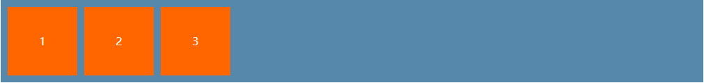
#### flex-direction:row-reverse结果
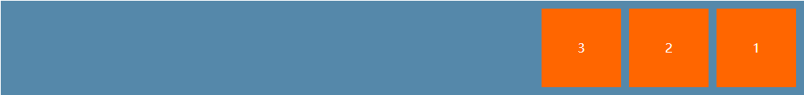
#### flex-direction:column结果
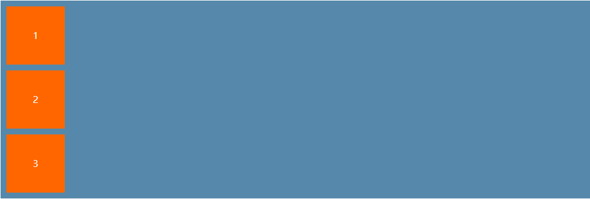
#### flex-direction:column-reverse结果
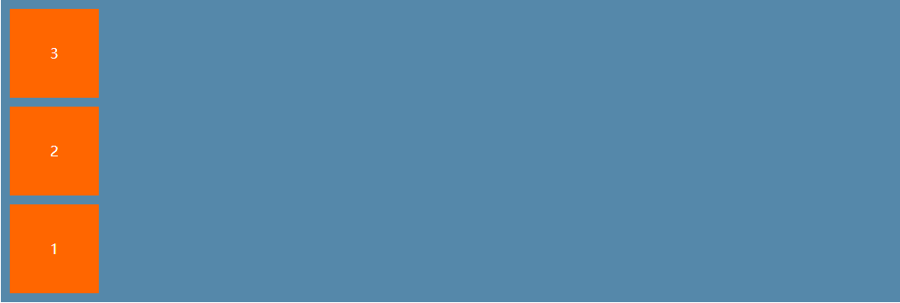

### flex-wrap
- **flex-wrap:nowrap(默认)**：  超出不折叠
- **flex-wrap:wrap**：  超出折叠，行正序排列
- **flex-wrap:wrap-reverse**：超出折叠，行倒序排列
#### css部分
```css
.box{
  margin: 50px auto;
  padding: 5px;
  width: 1000px;
  background-color: #58a;

  display: flex;
  flex-wrap: nowrap;
  /* flex-wrap: wrap; */
  /* flex-wrap: wrap-reverse; */
}
.box .box-item{
  margin: 5px;
  width: 100px;
  height: 100px;
  line-height: 100px;
  text-align:center;
  color:#fff;
  background-color: #F60;
}
```
#### html部分
```html
<!-- flex-wrap -->
<div class="box">
  <div class="box-item">1</div>
  <div class="box-item">2</div>
  <div class="box-item">3</div>
  <div class="box-item">4</div>
  <div class="box-item">5</div>
  <div class="box-item">6</div>
  <div class="box-item">7</div>
  <div class="box-item">8</div>
  <!-- <div class="box-item">9</div>
  <div class="box-item">10</div>
  <div class="box-item">11</div> -->
</div>
```
#### flex-wrap:nowrap结果(子项目未超出)
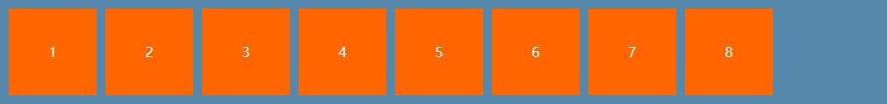
#### flex-wrap:nowrap结果(子项目超出)
::: tip
子项目总体宽度超出父元素宽度时，子元素宽度不再起作用，所有子项目均分父元素的宽度
:::
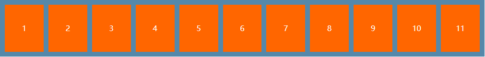
#### flex-wrap:wrap结果
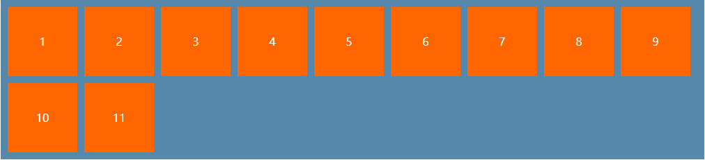
#### flex-wrap:wrap-reverse结果
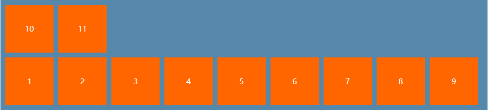


### align-items
::: tip
只展示常用属性，另外align-items:stretch(默认)和align-items:baseline未例举
:::
- **align-items:flex-start**：按侧轴方向，项目沿侧轴起点对齐
- **align-items:center**：    按侧轴方向，项目沿侧轴居中对齐
- **align-items:flex-start**：按侧轴方向，项目沿侧轴终点对齐
#### css部分
```css
.box{
  margin: 50px auto;
  padding: 5px;
  width: 1000px;
  background-color: #58a;

  display: flex;
  align-items: flex-start;
  /* align-items: center;
  align-items: flex-end; */
}
.box .box-item{
  margin: 5px;
  width: 100px;
  text-align:center;
  color:#fff;
  background-color: #F60;
}
```
#### html部分
```html
<!-- align-items -->
<div class="box">
  <div class="box-item" style="height:50px; line-height: 50px">1</div>
  <div class="box-item" style="height:150px;line-height: 150px">2</div>
  <div class="box-item" style="height:100px;line-height: 100px">3</div>
</div>
```
#### align-items:flex-start结果
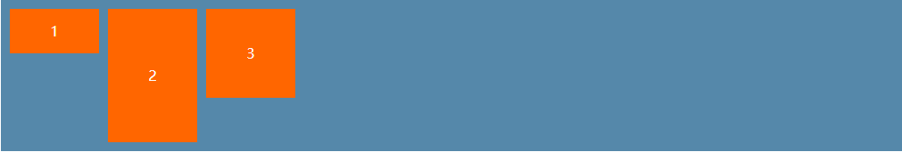
#### align-items:center结果
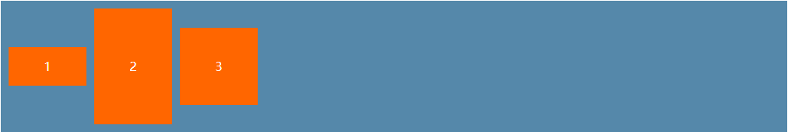
#### align-items:flex-end结果
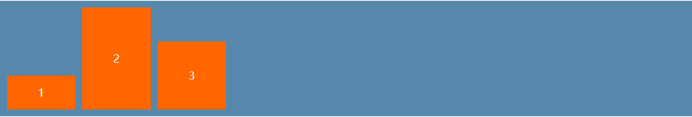

### justify-content
- **justify-content:flex-start**：按主轴方向，左对齐
- **justify-content:center**：    按主轴方向，居中对齐
- **justify-content:flex-end**：按主轴方向，右对齐
- **justify-content:space-around**：按主轴方向，项目两侧距离相等(即项目与项目之间的距离是项目与边距离的两倍)
- **justify-content:space-between**：按主轴方向，项目第一个和最后一个贴边，项目间距平均分配剩余空间
#### css部分
```css
.box{
  margin: 50px auto;
  padding: 5px;
  width: 1000px;
  background-color: #58a;

  display: flex;
  justify-content: flex-start;
  /* justify-content: center; */
  /* justify-content: flex-end; */
  /* justify-content: space-around; */
  /* justify-content: space-between; */
}
.box .box-item{
  margin: 5px;
  width: 100px;
  height: 100px;
  line-height: 100px;
  text-align:center;
  color:#fff;
  background-color: #F60;
}
```
#### html部分
```html
<!-- justify-content -->
<div class="box">
  <div class="box-item">1</div>
  <div class="box-item">2</div>
  <div class="box-item">3</div>
</div>
```
#### justify-content:flex-start结果
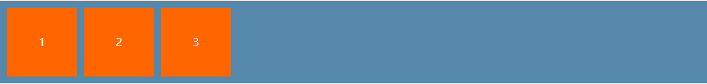
#### justify-content:center结果

#### justify-content:flex-end结果
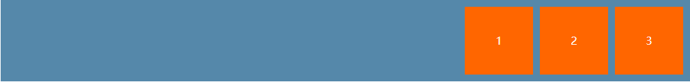
#### justify-content:space-around结果

#### justify-content:space-between结果
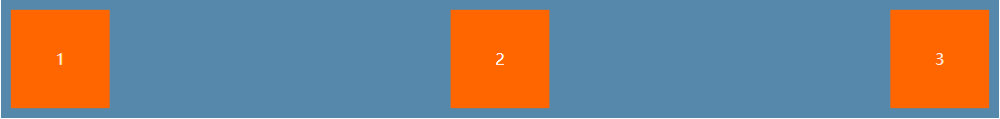
## FlexBox案例
### 栅格布局

#### 栅格布局一
#### css部分
```css
/* 栅格布局css*/
.Grid {
  margin: 50px auto;
  width: 1000px;
  background-color: #58a;
}

.Grid .Grid-row {
  margin: 5px;
  flex: 1;
  display: flex;
  justify-content: space-between;
}

.Grid .Grid-row .row-item {
  flex: 1;
  margin: 5px;
  height: 100px;
  line-height: 100px;
  text-align: center;
  color: #fff;
  background-color: #f60;
}
```

#### html部分
``` html
<!-- 栅格布局 -->
<div class="Grid">
  <div class="Grid-row">
    <div class="row-item">1/2</div>
    <div class="row-item">1/2</div>
  </div>
  <div class="Grid-row">
    <div class="row-item">1/3</div>
    <div class="row-item">1/3</div>
    <div class="row-item">1/3</div>
  </div>
  <div class="Grid-row">
    <div class="row-item">1/4</div>
    <div class="row-item">1/4</div>
    <div class="row-item">1/4</div>
    <div class="row-item">1/4</div>
  </div>
</div>
```

#### 栅格布局结果
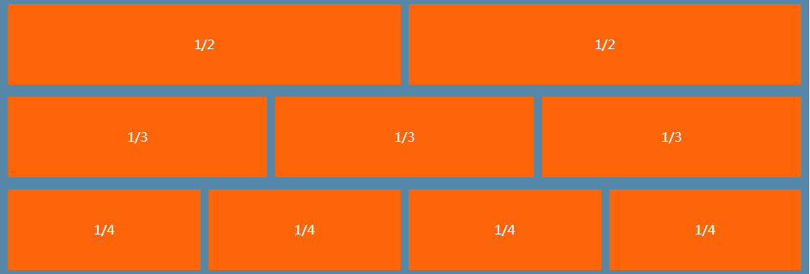


#### 栅格布局二
#### css部分
```css
/* 栅格布局二css*/
.Grid {
  margin: 50px auto;
  width: 1000px;
  background-color: #58a;
}
.Grid .Grid-row {
  display: flex;
  justify-content: space-between;
}
.Grid .Grid-row .row-item {
  flex: 1;
  margin: 5px;
  height: 100px;
  line-height: 100px;
  text-align: center;
  color: #fff;
  background-color: #f60;
}
.Grid .Grid-row:nth-child(1) .row-item:nth-child(2) {
  flex: 0 0 50%;
}
.Grid .Grid-row:nth-child(2) .row-item:nth-child(1) {
  flex: 0 0 30%;
}
.Grid .Grid-row:nth-child(3) .row-item:nth-child(3) {
  flex: 0 0 25%;
}
```

#### html部分
``` html
<!-- 栅格布局二 -->
<div class="Grid">
  <div class="Grid-row">
    <div class="row-item">auto</div>
    <div class="row-item">1/2</div>
    <div class="row-item">auto</div>
  </div>
  <div class="Grid-row">
    <div class="row-item">1/3</div>
    <div class="row-item">auto</div>
  </div>
  <div class="Grid-row">
    <div class="row-item">auto</div>
    <div class="row-item">auto</div>
    <div class="row-item">1/4</div>
  </div>
</div>
```

#### 栅格布局结果
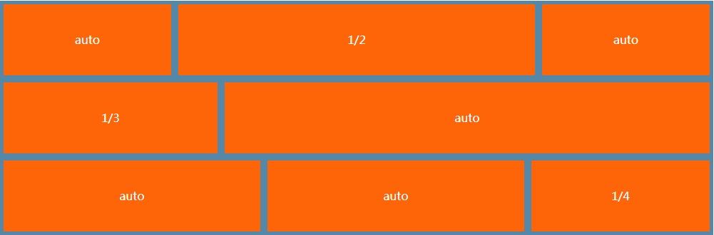

### 骰子
#### 基础骰子面和点数

##### css部分
``` css
/* 骰子css */
.face{
  width: 100px;
  height: 100px;
  background-color:#E7E7E7;
  border-radius: 10px;
  box-shadow: inset 0 5px #fff, /*上边阴影*/
              inset 0 -5px #bbb,/*下边阴影*/
              inset -5px 0 #bbb,/*右阴影*/
              inset 5px 0 #fff; /*左边阴影*/
}
/* 点数css */
.pie{
  display: block;
  margin: 4px;
  width: 24px;
  height: 24px;
  border-radius: 50%;
  background-color: #333;
  box-shadow: inset 0 3px #111, /*上边阴影*/
              inset 0 -3px #555 /*下边阴影*/
}
```
##### html部分
``` html
<div class="face">
  <span class="pie"></span>
</div>
```
##### 基础骰子面和点数结果


#### 一点骰子

##### css部分
``` css
/* 一点骰子css */
.first-face{
  display: flex;
  align-items: center;      /*侧轴居中*/
  justify-content: center;  /*主轴居中*/
}
```
##### html部分
``` html
<!-- 一点骰子 -->
<div class="first-face face">
  <span class="pie"></span>
</div>
```
##### 一点骰子结果


#### 二点骰子

##### css部分
``` css
/* 二点骰子css */
.second-face{
  display: flex;
  justify-content: space-between;
}
.second-face .pie:nth-child(2){
  align-self: flex-end;
}
```
##### html部分
``` html
<!-- 二点骰子 -->
<div class="second-face face">
  <span class="pie"></span>
  <span class="pie"></span>
</div>
```
##### 二点骰子结果

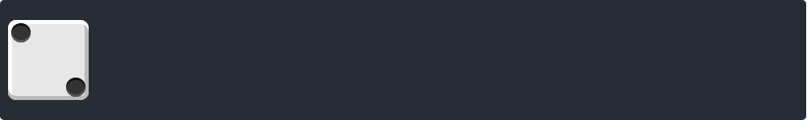

#### 三点骰子

##### css部分
``` css
/* 三点骰子css */
.three-face{
  display: flex;
  justify-content: space-between;
}
.three-face .pie:nth-child(2){
  align-self: center;
}
.three-face .pie:nth-child(3){
  align-self: flex-end;
}
```
##### html部分
``` html
<!-- 三点骰子 -->
<div class="second-face face">
  <span class="pie"></span>
  <span class="pie"></span>
  <span class="pie"></span>
</div>
```
##### 三点骰子结果

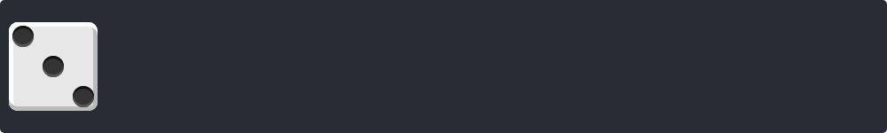

#### 四点骰子

##### css部分
``` css
/* 四点骰子css */
.four-face{
  display: flex;
  justify-content: space-between;
}
.four-face .face-column{
  display: flex;
  flex-direction: column;
  justify-content: space-between;
}
```
##### html部分
``` html
<!-- 四点骰子 -->
<div class="four-face face">
  <div class="face-column">
    <span class="pie"></span>
    <span class="pie"></span>
  </div>
  <div class="face-column">
    <span class="pie"></span>
    <span class="pie"></span>
  </div>
</div>
```
##### 四点骰子结果


#### 五点骰子

##### css部分
``` css
/* 五点骰子css */
.five-face{
  display: flex;
  justify-content: space-between;
}
.five-face .face-column{
  display: flex;
  flex-direction: column;
  justify-content: space-between;
}
.five-face .face-column:nth-child(2){
  justify-content: center;
}
```
##### html部分
``` html
<!-- 五点骰子 -->
<div class="five-face face">
  <div class="face-column">
    <span class="pie"></span>
    <span class="pie"></span>
  </div>
  <div class="face-column">
    <span class="pie"></span>
  </div>
  <div class="face-column">
    <span class="pie"></span>
    <span class="pie"></span>
  </div>
</div>
```
##### 五点骰子结果


#### 六点骰子

##### css部分
``` css
/* 六点骰子css */
.six-face{
  display: flex;
  justify-content: space-between;
}
.six-face .face-column{
  display: flex;
  flex-direction: column;
  justify-content: space-between;
}
```
##### html部分
``` html
<!-- 六点骰子 -->
<div class="six-face face">
  <div class="face-column">
    <span class="pie"></span>
    <span class="pie"></span>
  </div>
  <div class="face-column">
    <span class="pie"></span>
    <span class="pie"></span>
  </div>
  <div class="face-column">
    <span class="pie"></span>
    <span class="pie"></span>
  </div>
</div>
```
##### 六点骰子结果

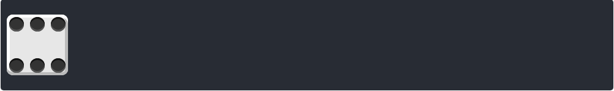

#### 九点骰子

##### css部分
``` css
/* 九点骰子css */
.nine-face{
  display: flex;
  justify-content: space-between;
}
.nine-face .face-column{
  display: flex;
  flex-direction: column;
  justify-content: space-between;
}
```
##### html部分
``` html
<!-- 九点骰子 -->
<div class="nine-face face">
  <div class="face-column">
    <span class="pie"></span>
    <span class="pie"></span>
    <span class="pie"></span>
  </div>
  <div class="face-column">
    <span class="pie"></span>
    <span class="pie"></span>
    <span class="pie"></span>
  </div>
  <div class="face-column">
    <span class="pie"></span>
    <span class="pie"></span>
    <span class="pie"></span>
  </div>
</div>
```
##### 九点骰子结果

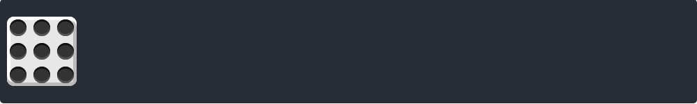

### 垂直居中

#### padding+margin
::: tip
父元素设置合适的padding-top，padding-bottom以及box-sizing:border-box<br/>
子元素设置margin: 0 auto
:::
##### css部分
``` css
.box {
  margin: 0 auto;
  width: 1000px;
  height: 200px;
  background-color: #58a;
  /* 父元素关键css */
  padding: 50px 0;
  box-sizing: border-box;
}
.box-item {
  width: 200px;
  height: 100px;
  background-color: #f60;
  /* 子元素关键css */
  margin: 0 auto;
}
```
##### html部分
``` html
<!-- padding+margin垂直居中 -->
<div class="box">
  <div class="box-item"></div>
</div>
```

##### padding+margin垂直居中结果


#### position+margin负边距
::: tip
父元素设置position:relative
子元素设置position:absoute，top:50%，left:50%，再利用margin实现自身一半的负边距
:::
##### css部分
``` css
.box {
  margin: 0 auto;
  width: 1000px;
  height: 200px;
  background-color: #58a;
  /* 父元素关键css */
  position: relative;
}
.box-item {
  width: 200px;
  height: 100px;
  background-color: #f60;
  /* 子元素关键css */
  position: absolute;
  left: 50%;
  top: 50%;
  margin-left: -100px;
  margin-top: -50px;
}
```
##### html部分
``` html
<!-- position+margin负边距 -->
<div class="box">
  <div class="box-item"></div>
</div>
```

##### position+margin垂直居中结果


#### position+transfrom
::: tip
父元素设置position:relative
子元素设置position:absoute，top:50%，left:50%，再利用transform移动
:::
##### css部分
``` css
.box {
  margin: 0 auto;
  width: 1000px;
  height: 200px;
  background-color: #58a;
  /* 父元素关键css */
  position: relative;
}
.box-item {
  width: 200px;
  height: 100px;
  background-color: #f60;
  /* 子元素关键css */
  position: absolute;
  left: 50%;
  top: 50%;
  transform: translate(-50%, -50%);
  -webkit-transform: translate(-50%, -50%);
}
```
##### html部分
``` html
<!-- position+margin负边距 -->
<div class="box">
  <div class="box-item"></div>
</div>
```

##### position+margin垂直居中结果


#### flex垂直居中
::: tip
父元素设置display:flex justify-content: center，align-items: center
:::
##### css部分
``` css
.box {
  margin: 50px auto;
  width: 1000px;
  height: 200px;
  background-color: #58a;
  /* 父元素关键css */
  display: flex;
  justify-content: center;
  align-items: center;
}

.box-item {
  width: 200px;
  height: 100px;
  background-color: #f60;
}
```
##### html部分
``` html
<!-- flex -->
<div class="box">
  <div class="box-item"></div>
</div>
```

##### flex垂直居中的结果


#### grid垂直居中
::: tip
父元素设置display:grid justify-content: center，align-items: center
:::
##### css部分
``` css
.box {
  margin: 50px auto;
  width: 1000px;
  height: 200px;
  background-color: #58a;
  /* 父元素关键css */
  display: grid;
  justify-content: center;
  align-items: center;
}

.box-item {
  width: 200px;
  height: 100px;
  background-color: #f60;
}
```
##### html部分
``` html
<!-- grid -->
<div class="box">
  <div class="box-item"></div>
</div>
```

##### grid垂直居中的结果


### 双飞翼布局

::: tip
双飞翼布局：两边固定，中间自适应
:::

#### float布局方式
##### css部分
```css
.box>div {
  height: 100px;
  line-height: 100px;
  text-align: center;
  color: #fff;
}
.box .left {
  float: left;
  width: 200px;
  background-color: #F60;
}
.box .right {
  float: right;
  width: 200px;
  background-color: #F60;
}
.box .center {
  background-color: #FF0000;
}
```
##### html部分
```html
<!-- float解决方案 -->
<div class="box">
  <div class="left">200px</div>
  <div class="right">200px</div>
  <div class="center">auto</div>
</div>
```

##### float布局结果
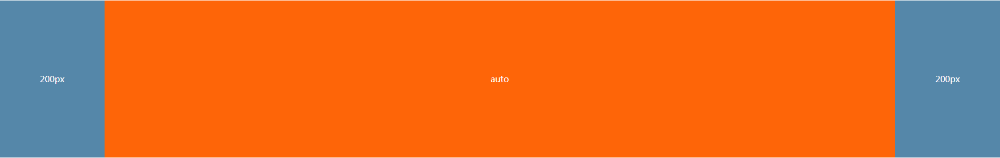

#### position布局方式
##### css部分
```css
.box {
  position: relative;
}
.box>div {
  height: 100px;
  line-height: 100px;
  text-align: center;
  color: #fff;
}
.box .left {
  position: absolute;
  left: 0;
  width: 200px;
  background-color: #F60;
}
.box .right {
  position: absolute;
  right: 0;
  width: 200px;
  background-color: #F60;
}
.box .center {
  position: absolute;
  left: 200px;
  right: 200px;
  background-color: #FF0000;
}
```
##### html部分
```html
<!-- position解决方案 -->
<div class="box">
  <div class="left">200px</div>
  <div class="center">auto</div>
  <div class="right">200px</div>
</div>
```

##### position布局结果


#### flex实现方式
##### css部分
```css
.box {
  display: flex;
}
.box>div {
  height: 200px;
  line-height: 200px;
  text-align: center;
  color: #fff;
}
.box .left {
  flex: 0 0 200px;
  width: 200px;
  background-color: #58a;
}
.box .right {
  flex: 0 0 200px;
  width: 200px;
  background-color: #58a;
}
.box .center {
  flex: 1;
  background-color: #F60;
}
```
##### html部分
```html
<!-- flex解决方案 -->
<div class="box">
  <div class="left">200px</div>
  <div class="center">auto</div>
  <div class="right">200px</div>
</div>
```

##### flex布局结果


#### Grid实现方式
##### css部分
```css
.box {
  display: grid;
  grid-template-rows: 200px;
  grid-template-columns: 200px auto 200px;
}
.box>div {
  line-height: 200px;
  text-align: center;
  color: #fff;
}
.box .left {
  background-color: #58a;
}
.box .right {
  background-color: #58a;
}
.box .center {
  background-color: #F60;
}
```
##### html部分
```html
<!-- grid解决方案 -->
<div class="box">
  <div class="left">200px</div>
  <div class="center">auto</div>
  <div class="right">200px</div>
</div>
```

##### grid布局结果


#### table实现方式
##### css部分
```css
.box {
  width: 100%;
  display: table;
}
.box>div {
  display: table-cell;
  height: 200px;
  line-height: 200px;
  text-align: center;
  color: #fff;
}
.box .left {
  width: 200px;
  background-color: #58a;
}
.box .right {
  width: 200px;
  background-color: #58a;
}
.box .center {
  background-color: #F60;
}
```
##### html部分
```html
<!-- table解决方案 -->
<div class="box">
  <div class="left">200px</div>
  <div class="center">auto</div>
  <div class="right">200px</div>
</div>
```

##### table布局结果


### 圣杯布局
::: tip
圣杯布局：常见网页布局合适，包括header，footer，中间部分分为两侧侧边栏，中间主体内容
:::

#### css部分
```css
html,body{
  margin: 0;
  padding: 0;
  height: 100%;
}
.container{
  display: flex;
  height: 100%;
  flex-direction: column;
}
.container .main-content{
  flex: 1;
}
.main-content{
  display: flex;
}
.main-content .center{
  flex: 1;
}
.header,.footer,.left,.right{
  flex: 0 0 20%;/*可以根据实际情况，更改相应的width和height*/
}
```

#### html部分
``` html
<div class="container">
  <div class="header">header</div>
  <div class="main-content">
    <div class="left">left</div>
    <div class="center">center</div>
    <div class="right">right</div>
  </div>
  <div class="footer">footer</div>
</div>
```

#### 圣杯布局结果
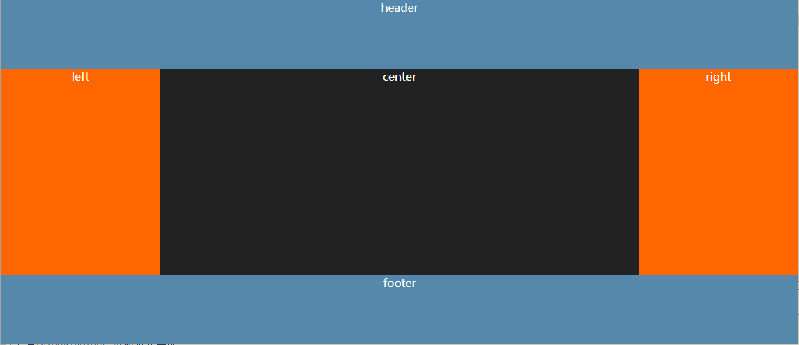

### 流式布局
#### css部分
``` css
.box{
  display: flex;
  /* 关键css */
  flex-wrap: wrap;
}
.box-item{
  flex: 0 0 33.3333%;
  height: 100px;
  box-sizing: border-box;
  border: 1px solid #F60;
  background-color:#58a;
  text-align: center;
  line-height: 100px;
  color:#fff;
}
```
#### css部分
``` html
<!-- 流式布局 -->
<div class="box">
  <div class="box-item">1</div>
  <div class="box-item">2</div>
  <div class="box-item">3</div>
  <div class="box-item">4</div>
  <div class="box-item">5</div>
  <!-- <div class="box-item">6</div> -->
</div>
```

#### 流式布局结果一
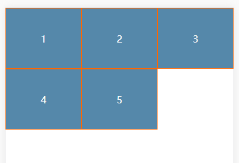

#### 流式布局结果二
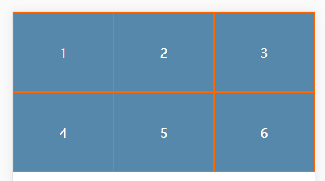


### sticky footer布局
::: tip
sticky footer：一种特定的网页布局效果，要求将footer始终固定在最底部<br>
要求：当内容不够长时，固定在浏览器或app最底部，当内容足够长时，始终在内容的底部
:::
#### 方法一：特殊的元素结构+合适的margin-bottom
##### css部分
``` css
html,body{
  margin: 0;
  padding:0;
  height: 100%;
}
.content{
  text-align: center;
  color: #fff;
  background-color: #58a;
  /* 内容关键css */
  min-height: 100%;
  margin-bottom: -50px;
}
.push,.footer{
  /* 底脚关键css */
  height: 50px;
}
.footer{
  text-align: center;
  line-height: 50px;
  color: #fff;
  background-color: #F60;
}
```
##### html部分
``` html
<div class="content">
  <p>汉皇重色思倾国，御宇多年求不得。</p>
  <p>杨家有女初长成，养在深闺人未识。</p>
  <p>天生丽质难自弃，一朝选在君王侧。</p>
  <p>回眸一笑百媚生，六宫粉黛无颜色。</p> 
  <p>春寒赐浴华清池，温泉水滑洗凝脂。</p>
  <p>侍儿扶起娇无力，始是新承恩泽时。</p>
  <p>云鬓花颜金步摇，芙蓉帐暖度春宵。</p>
  <p>春宵苦短日高起，从此君王不早朝。</p>
  <p>汉皇重色思倾国，御宇多年求不得。</p>
  <p>杨家有女初长成，养在深闺人未识。</p>
  <p>天生丽质难自弃，一朝选在君王侧。</p>
  <p>回眸一笑百媚生，六宫粉黛无颜色。</p> 
  <p>春寒赐浴华清池，温泉水滑洗凝脂。</p>
  <!-- 格外的元素标签 -->
  <div class="push"></div>
</div>
<div class="footer">footer</div>
```
##### 方法一结果


#### 方法二：position+合适的padding-bottom
##### css部分
``` css
html,body{
  height: 100%;
}
.container{
  width: 100%;
  position: relative;
  color:#fff;
  /* 内容关键css */
  min-height: 100%;
  padding-bottom: 50px;
  box-sizing: border-box;
}
.content{
  text-align: center;
  background-color: #58a;
}
.footer{
  position: absolute;
  bottom: 0;
  left: 0;
  right: 0;
  line-height: 50px;
  text-align: center;
  background-color:#f60;
  /* 底脚关键css */
  height: 50px;
}
```
##### html部分
``` html
<div class="container">
  <div class="content">
    <p>汉皇重色思倾国，御宇多年求不得。</p>
    <p>杨家有女初长成，养在深闺人未识。</p>
    <p>天生丽质难自弃，一朝选在君王侧。</p>
    <p>回眸一笑百媚生，六宫粉黛无颜色。</p> 
    <p>春寒赐浴华清池，温泉水滑洗凝脂。</p>
    <p>侍儿扶起娇无力，始是新承恩泽时。</p>
    <p>云鬓花颜金步摇，芙蓉帐暖度春宵。</p>
    <p>春宵苦短日高起，从此君王不早朝。</p>
    <p>汉皇重色思倾国，御宇多年求不得。</p>
    <p>杨家有女初长成，养在深闺人未识。</p>
    <p>天生丽质难自弃，一朝选在君王侧。</p>
    <p>回眸一笑百媚生，六宫粉黛无颜色。</p> 
    <p>春寒赐浴华清池，温泉水滑洗凝脂。</p>
    <p>侍儿扶起娇无力，始是新承恩泽时。</p>
    <p>云鬓花颜金步摇，芙蓉帐暖度春宵。</p>
    <p>春宵苦短日高起，从此君王不早朝。</p>
  </div>
  <div class="footer">footer</div>
</div>
```
##### 方法二结果
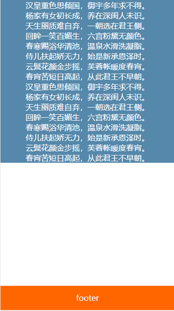

#### 方法三：flex
##### css部分
``` css
html,body{
  height: 100%;
}
.container{
  color:#fff;
  /* 父容器关键css */
  min-height: 100%;
  display: flex;
  flex-direction: column;
}
.content{
  text-align: center;
  background-color: #58a;
  /* 内容关键css */
  flex: 1;
}
.footer{
  line-height: 50px;
  text-align: center;
  background-color:#f60;
  /* 底脚关键css */
  flex: 0 0 50px;
  height: 50px;
}
```
##### html部分
``` html
<div class="container">
  <div class="content">
    <p>汉皇重色思倾国，御宇多年求不得。</p>
    <p>杨家有女初长成，养在深闺人未识。</p>
    <p>天生丽质难自弃，一朝选在君王侧。</p>
    <p>回眸一笑百媚生，六宫粉黛无颜色。</p> 
    <p>春寒赐浴华清池，温泉水滑洗凝脂。</p>
    <p>侍儿扶起娇无力，始是新承恩泽时。</p>
    <p>云鬓花颜金步摇，芙蓉帐暖度春宵。</p>
    <p>春宵苦短日高起，从此君王不早朝。</p>
    <p>汉皇重色思倾国，御宇多年求不得。</p>
    <p>杨家有女初长成，养在深闺人未识。</p>
    <p>天生丽质难自弃，一朝选在君王侧。</p>
    <p>回眸一笑百媚生，六宫粉黛无颜色。</p> 
    <p>春寒赐浴华清池，温泉水滑洗凝脂。</p>
    <p>侍儿扶起娇无力，始是新承恩泽时。</p>
    <p>云鬓花颜金步摇，芙蓉帐暖度春宵。</p>
    <p>春宵苦短日高起，从此君王不早朝。</p>
  </div>
  <div class="footer">footer</div>
</div>
```
##### 方法三结果
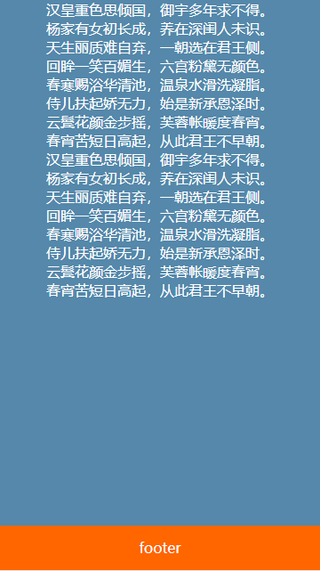

#### 方法四：grid
::: tip
grid为最新的网格布局方法，目前各浏览器兼容性一般，只做学习列举css，DOM结构和flex方法的DOM一致
:::

##### css部分
``` css
html,body{
  height: 100%;
}
.container{
  color:#fff;
  /* 父容器关键css */
  min-height: 100%;
  display: grid;
  grid-template-rows: 1fr 50px;
}
.content{
  text-align: center;
  background-color: #58a;
}
.footer{
  line-height: 50px;
  text-align: center;
  background-color:#f60;
  /* 底脚关键css */
  grid-row-start: 2;
  grid-row-end: 3;
}
```

##### 方法四结果


### 移动端导航栏实例
案例地址：[手机京东](https://m.jd.com/)
#### 京东导航栏案例


##### css部分
``` css
/* 京东webapp导航栏css */
.nav{
  z-index: 999;
  position: fixed;
  bottom: 0;
  left: 0;
  right: 0;
  display: flex;
  box-shadow: 0 0 10px rgba(0,0,0,0.1);
}
.nav-item{
  flex: 1;
  text-align: center;
}
.nav-item a{
  display: block;
}
.nav-item a >img{
  width: 16vw;
}
```

##### html部分
``` html
<!-- 京东webapp导航 -->
<div class="nav">
  <div class="nav-item">
    <a href="#">
      
    </a>
  </div>
  <div class="nav-item">
    <a href="#">
      
    </a>
  </div>
  <div class="nav-item">
    <a href="#">
      
    </a>
  </div>
  <div class="nav-item">
    <a href="#">
      
    </a>
  </div>
  <div class="nav-item">
    <a href="#">
      
    </a>
  </div>
</div>
```

##### 京东导航栏结果
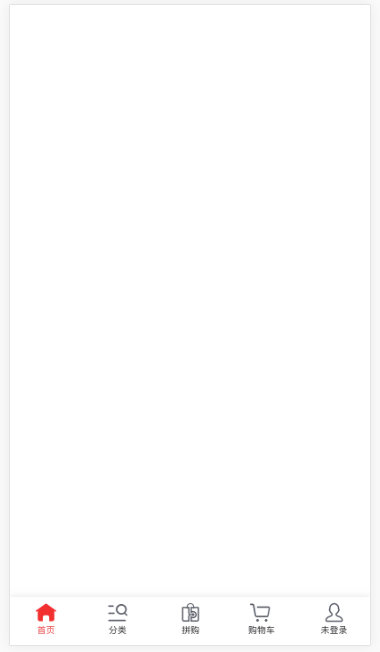
#### 去哪儿网导航栏案例
案例地址：[去哪儿网](http://touch.piao.qunar.com/)<br>

##### css部分
``` css
/*去哪儿网导航栏css*/
.nav{
  position: absolute;
  top: 0;
  left: 0;
  right: 0;
  display: flex;
  flex-wrap: wrap;
}
.nav-item{
  flex: 0 0 25%;
  text-align: center;
}
.nav-item .img-box{
  margin: 3px auto;
  width: 55px;
  height: 55px;
}
.nav-item .img-box >img{
  display: block;
  width: 55px;
  height: 55px;
}
.nav-item .nav-name{
  color:#212121;
  font-size: 14px;
}
```
##### html部分
``` html
<!-- 去哪儿网webapp导航栏 -->
<div class="nav">
  <div class="nav-item">
    <div class="img-box">
      
    </div>
    <p class="nav-name">景点门票</p>
  </div>
  <div class="nav-item">
    <div class="img-box">
      
    </div>
    <p class="nav-name">广州必游</p>
  </div>
  <div class="nav-item">
    <div class="img-box">
      
    </div>
    <p class="nav-name">动植物园</p>
  </div>
  <div class="nav-item">
    <div class="img-box">
      
    </div>
    <p class="nav-name">游乐场</p>
  </div>
  <div class="nav-item">
    <div class="img-box">
      
    </div>
    <p class="nav-name">两江夜游</p>
  </div>
  <div class="nav-item">
    <div class="img-box">
      
    </div>
    <p class="nav-name">水上乐园</p>
  </div>
</div>
```
##### 去哪儿网导航栏结果

### 移动端图文列表实例

#### 起点小说网
案例网址：[起点小说网](https://m.qidian.com/)
##### 起点小说网案例


##### css部分
``` css
/*起点小说图文列表css*/
.media-list{
  position: absolute;
  left: 0;
  top: 0;
  right: 0;
}
.media-item{
  display: flex;
  padding: 10px;
  align-items: center;
  border-bottom: 1px solid rgba(0,0,0,0.1);
}
.media-item .item-img{
  width: 66px;
  flex: 0 0 66px;
  margin-right: 10px;
}
.item-img >img{
  display: block;
  width: 66px;
  height: 88px;
}
.media-item .item-content{
  flex: 1;
  position: relative;
  font-size: 13px;
  color:#969ba3;
}
.item-content .name{
  margin-bottom: 10px;
  font-size: 16px;
  color:#000;
}
.item-content .desc{
  margin-bottom: 5px;
}
.item-content .tag-list{
  position: absolute;
  right: 0;
  bottom: 0;
}
.tag-list .tag-item{
  margin-right: 2px;
  padding:0px 2px;
  border:1px solid rgba(0,0,0,0.3);
  border-radius: 5px;
  font-size: 11px;
  color:#969ba3;
}
.tag-list .tag-item.red{
  color:#ed424b;
}
.tag-list .tag-item.blue{
  color:#4284ed;
}
```

##### html部分
``` html
<!-- 起点小说图文列表 -->
<div class="media-list">
  <div class="media-item">
    <div class="item-img">
      
    </div>
    <div class="item-content">
      <h1 class="name">全球高武</h1>
      <p class="desc">武者的世界～简介无力，被迫修改（群号555700424）</p>
      <p class="author">老鹰吃小鸡</p>
      <div class="tag-list">
        <span class="tag-item">都市</span>
        <span class="tag-item red">连载中</span>
        <span class="tag-item blue">147.76万字</span>
      </div>
    </div>
  </div>
  <div class="media-item">
    <div class="item-img">
      
    </div>
    <div class="item-content">
      <h1 class="name">全球高武</h1>
      <p class="desc">武者的世界～简介无力，被迫修改（群号555700424）</p>
      <p class="author">老鹰吃小鸡</p>
      <div class="tag-list">
        <span class="tag-item">都市</span>
        <span class="tag-item red">连载中</span>
        <span class="tag-item blue">147.76万字</span>
      </div>
    </div>
  </div>
</div>
```

##### 起点小说图文案例结果
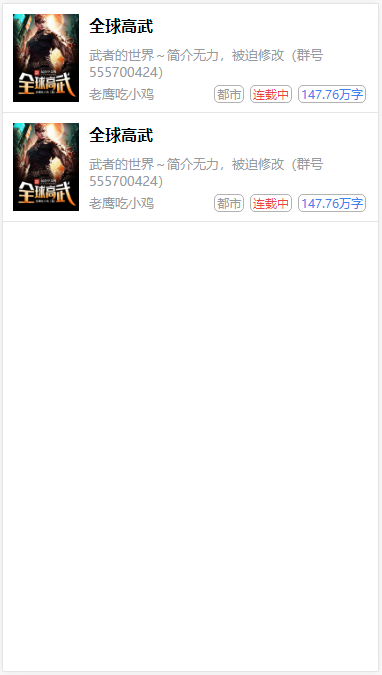
