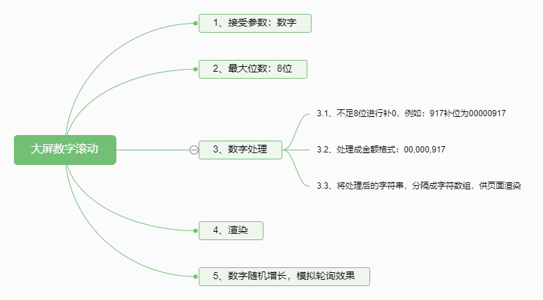
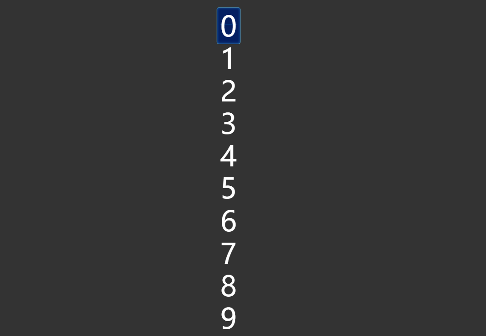
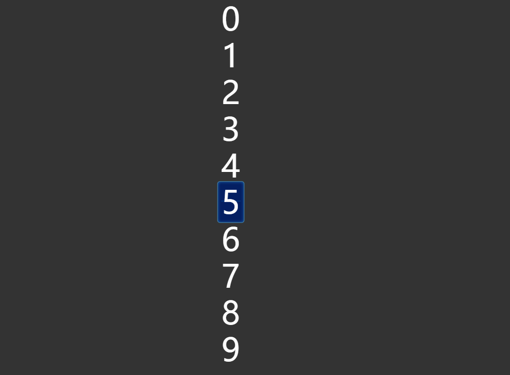
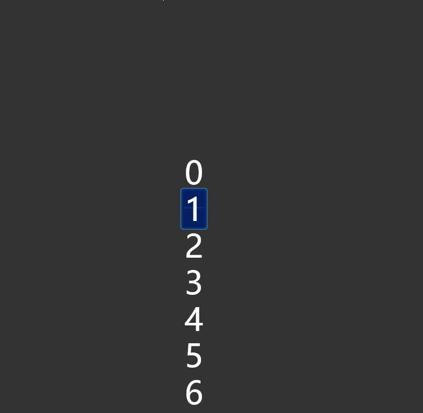

# Web开发实践

## 大屏数字滚动
大屏数字滚动效果来源于最近工作中一张大屏的UI图，该UI图上有一个模块需要有数字往上翻动的效果，以下是最终实现的效果：


### 思路
在实现此效果之前，我们先来捋一下思路，用思维导图来设计一下我们的实现步骤，如下：



### 初步实现
::: tip
你可以审查元素，下载数字背景图片
:::


<br/>
有了以上的设计流程，我们先来简单实现一下

`html`结构
```html
<div class="box">
  <p class="box-item">
    <span>1</span>
  </p>
</div>
```
关键`css`
```css
.box-item {
  position: relative;
  display: inline-block;
  width: 54px;
  height: 82px;
  /* 背景图片 */
  background: url(./number-bg.png) no-repeat center center;
  background-size: 100% 100%;
  font-size: 62px;
  line-height: 82px;
  text-align: center;
}
```
实现以上代码后，它的效果将是下面这样的：


**思考**：背景框中有了数字以后，我们现在来思考一下，背景框中的文字，一定是`0-9`之前的数字，要在不打乱以上`html`结构的前提下，如何让数字滚动起来呢？这个时候我们的魔爪就伸向了一个`CSS`属性：`writing-mode`，下面是它属性的介绍：
* `horizontal-tb`：默认值，表示水平排版，从上到下。
* `vertical-lr`：表示垂直排版，从左到右。
* `vertical-rl`：表示垂直排版，从右到左。
<vertical-text/>
:point_up_2: 你可以在上面切换单选框来查看不同属性的实时效果。

根据以上的灵感，我们可以实现下面这样的效果：



`html`改动部分：
```html {2}
<p class="box-item">
  <span>0123456789</span>
</p>
```

`css`改动部分：
```css
.box-item {
  display: inline-block;
  width: 54px;
  height: 82px;
  background: url(./number-bg.png) no-repeat center center;
  background-size: 100% 100%;
  font-size: 62px;
  line-height: 82px;
  text-align: center;

  /* 新加部分的代码 */
  position: relative;
  writing-mode: vertical-lr;
  text-orientation: upright;
  /* overflow: hidden; */
}
/* 新加部分的代码 */
.box-item span {
  position: absolute;
  top: 10px;
  left: 50%;
  transform: translateX(-50%);
  letter-spacing: 10px;
}
```

#### 计算滚动
**如果我们想让数字滚动到`5`，那么滚动的具体到底是多少？**<br>
答案是：向下滚动`-50%`

**那么其他的数字呢？**<br>
得益于我们特殊的实现方法，每一位数字的滚动距离有一个通用的公式：
```js
transform: `translate(-50%,-${number * 10}%)`
```
有了以上公式，我们让数字滚动到`5`，它的效果如下：



`css`改动部分：
```css {5}
.box-item span {
  position: absolute;
  top: 10px;
  left: 50%;
  transform: translate(-50%,-50%);
  letter-spacing: 10px;
}
```

#### 滚动动画的实现
在知道了每一个数字具体的滚动距离后，我们来设计一下，让数字能够随机滚动起来：


以下是具体的随机滚动`js`代码：
```js
setInterval(() => {
  let number = document.getElementById('Number')
  let random = getRandomNumber(0,10)
  number.style.transform = `translate(-50%, -${random * 10}%)`
}, 2000)
function getRandomNumber (min, max) {
  return Math.floor(Math.random() * (max - min + 1) + min)
}

至此，我们数字滚动效果已经初步实现了，在下一节中我们将会逐步完善此效果，以满足业务需求。
```

### 完善
在上一节中，我们初步完成了滚动的效果，这一节我们将根据最开始的思维导图来设计一个通用的`Vue`业务组件

### 接受参数
此组件只接受一个数字类型的参数，我们将它放在`Vue`组件的`props`中：
```js
props: {
  number: {
    type: Number,
    default: 0
  }
}
```

### 补位
因为我们的业务需要，我们最大的位数是`8`位数字，所以定义一个常量：
```js
const MAX_LEN = 8
```
假如传递的位数不足`8`位，我们需要对它进行补`0`的操作，补`0`完成以后，我们也需要把它转换成金额的格式
:::warning
由于此部分代码较常见，为节省篇幅，就不展示代码，可自行书写相关js代码。
:::

### 渲染
我们根据上面补位字符串，分隔成字符数组，在页面中进行渲染：
::: tip
`computeNumber`:为字符数组，例如：`['0','0',',','0','0','0',',','9','1','7']`
:::
`html`部分代码：
```html
<ul>
  <li
    :class="{'number-item': !isNaN(item) }"
    v-for="(item,index) in computeNumber"
    :key="index"
  >
    <span v-if="!isNaN(item)">
      <i ref="numberItem">0123456789</i>
    </span>
    <span v-else>{{item}}</span>
  </li>
</ul>
```
`css`部分代码：
```css
.number-item {
  width: 50px;
  background: url(./number-bg.png) no-repeat center center;
  background-size:100% 100%;
  & > span {
    position: relative;
    display: inline-block;
    margin-right: 10px;
    width: 100%;
    height: 100%;
    writing-mode: vertical-rl;
    text-orientation: upright;
    overflow: hidden;
    & > i {
      position: absolute;
      top: 0;
      left: 50%;
      transform: translate(-50%,0);
      transition: transform 0.5s ease-in-out;
      letter-spacing: 10px;
    }
  }
}
```
页面渲染效果：


### 数字随机增长，模拟轮询效果
页面渲染完毕后，我们来让数字滚动起来，设计如下两个方法，其中`increaseNumber`需要在`Vue`生命周期`mounted`函数中调用
```js
// 定时增长数字
increaseNumber () {
  let self = this
  this.timer = setInterval(() => {
    self.newNumber = self.newNumber + getRandomNumber(1, 100)
    self.setNumberTransform()
  }, 3000)
},
// 设置每一位数字的偏移
setNumberTransform () {
  let numberItems = this.$refs.numberItem
  let numberArr = this.computeNumber.filter(item => !isNaN(item))
  for (let index = 0; index < numberItems.length; index++) {
    let elem = numberItems[index]
    elem.style.transform = `translate(-50%, -${numberArr[index] * 10}%)`
  }
}
```

最终实现效果：


## tooltip

## 手风琴

## 进度条

## 优惠券

## 聊天框

## 圆形菜单

## loading

## 自定义scroll

## 绸带效果

## 九宫格解锁密码

## 词云

## 弹幕