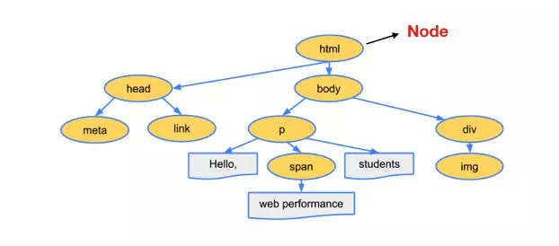
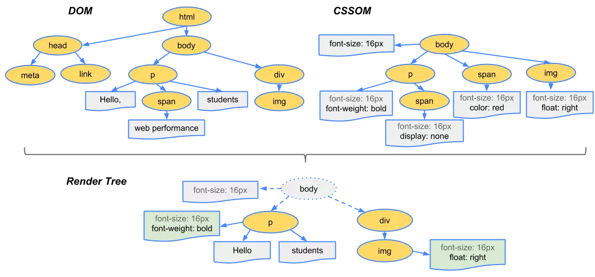

# 前端面试之道

## JavaScript基础知识面试题

### 原始类型
::: tip
JavaScript 中原始类型有六种，原始类型既只保存原始值，是没有函数可以调用的。
:::

#### 六种原始类型
* string
* number
* boolean
* null
* undefined
* symbol

::: warning 注意
为什么说原始类型没有函数可以调用，但`'1'.toString()`却又可以在浏览器中正确执行？
:::
因为`'1'.toString()`中的字符串`'1'`在这个时候会被封装成其对应的字符串对象，以上代码相当于`new String('1').toString()`，因为`new String('1')`创建的是一个对象，而这个对象里是存在`toString()`方法的。

#### null到底是什么类型
现在很多书籍把`null`解释成空对象，是一个对象类型。然而在早期`JavaScript`的版本中使用的是32位系统，考虑性能问题，使用低位存储变量的类型信息，`000`开头代表对象，而`null`就代表全零，所以将它错误的判断成`Object`，虽然后期内部判断代码已经改变，但`null`类型为`object`的判断却保留了下来，至于`null`具体是什么类型，属于仁者见仁智者见智，你说它是一个`bug`也好，说它是空对象，是对象类型也能理解的通。

### 对象类型
::: tip
在 JavaScript 中，除了原始类型，其他的都是对象类型，对象类型存储的是地址，而原始类型存储的是值。
:::
```js
var a = [];
var b = a;
a.push(1);
console.log(b); // 输出[1]
```
在以上代码中，创建了一个对象类型`a`(数组)，再把`a`的地址赋值给了变量`b`，最后改变`a`的值，打印`b`时，`b`的值也同步发生了改变，因为它们在内存中使用的是同一个地址，改变其中任何一变量的值，都会影响到其他变量。

#### 对象当做函数参数
```js
function testPerson(person) {
  person.age = 52;
  person = {
    name: '李四',
    age: 18
  }
  return person;
}
var p1 = {
  name: '张三',
  age: 23
}
var p2 = testPerson(p1);
console.log(p1.age);  // 输出52
console.log(p2.age);  // 输出18
```
**代码分析**：
1. `testPerson`函数中，`person`传递的是对象`p1`的指针副本
2. 在函数内部，改变`person`的属性，会同步反映到对象`p1`上，`p1`对象中的`age`属性发生了改变，即值为52
3. `testPerson`函数又返回了一个新的对象，这个对象此时和参数`person`没有任何关系，因为它分配了一个新的内存地址
4. 以上分析可以用如下图表示


### typeof和instanceof

#### typeof
::: tip
`typeof`能准确判断除`null`以外的原始类型的值，对于对象类型，除了函数会判断成`function`，其他对象类型一律返回`object`
:::
```js
typeof 1          // number
typeof '1'        // string
typeof true       // boolean
typeof undefined  // undefined
typeof Symbol()   // symbol

typeof []         // object
typeof {}         // object
typeof console.log// function
```

#### instanceof
::: tip
`instanceof`通过原型链可以判断出对象的类型，但并不是百分百准确
:::
```js
function Person(name) {
  this.name = name;
}
var p1 = new Person();
console.log(p1 instanceof Person) // true

var str = new String('abc');
console.log(str instanceof String)// true
```

### 类型转换
`JavaScript`中，类型转换只有三种：
1. 转换成数字
2. 转换成布尔值
3. 转换成字符串

#### 经典类型面试题
```js
console.log([]==![]); // true
```
**代码分析**：
1. 左侧是一个对象(数组)
2. 右侧是一个布尔值，对象`[]`转换成布尔值`true`，因为除了`null`所有对象都转换成布尔值，所以`![]`结果为`false`
3. 此时相当于`对象==布尔值`，依据类型转换规则，转换成数字类型进行比较
4. 对象(空数组)转换成`0`，布尔值`false`转换成`0`
5. 即`0==0`，返回`true`

类型转换规则，如下图：


### == 和 ===
如果你对上面的例子还一知半解，那么我们来详细介绍一下`==`和`===`的规则以及区别。

#### ===严格相等
::: tip
`===`叫做严格相等，是指：左右两边不仅值要相等，类型也要相等，例如`'1'===1`的结果是`false`，因为一边是`string`，另一边是`number`。
:::
```js
console.log('1'===1); // 输出false
```

#### ==不严格相等
::: tip
`==`不像`===`那样严格，对于一般情况，只要值相等，就返回`true`，但`==`还涉及一些类型转换，它的转换规则如下：
* 两边的类型是否相同，相同的话就比较值的大小，例如`1==2`，返回`false`
* 类型不相同会进行类型转换
* 判断的是否是`null`和`undefined`，是的话就返回`true`
* 判断的类型是否是`String`和`Number`，是的话，把`String`类型转换成`Number`，再进行比较
* 判断其中一方是否是`Boolean`，是的话就把`Boolean`转换成`Number`，再进行比较
* 如果其中一方为`Object`，且另一方为`String`、`Number`或者`Symbol`，会将`Object`转换成原始类型后，再进行比较
:::
```js
1 == {id: 1, name: 'AAA'}
        ↓
1 == '[object Object]'
```

#### 转boolean
除了`undefined`、`null`、`false`、`0`、`-0`、`NaN`和空字符串转换成`false`以外，其他所有值都转换成`true`，包括所有对象。

#### 对象转原始类型
对象转原始类型，会调用内置的[ToPrimitive]函数，对于该函数而言，其逻辑如下：
1. 是否已经是原始类型，是则直接返回
2. 调用`valueOf()`，如果转换为原始类型，则返回
3. 调用`toString()`，如果转换为原始类型，则返回
4. 也可以重写`Symbol.toPrimitive()`方法，优先级别最高
5. 如果都没有返回原始类型，会报错
```js
var obj = {
  value: 0,
  valueOf() {
    return 1;
  },
  toString() {
    return '2'
  },
  [Symbol.toPrimitive]() {
    return 3
  }
}
console.log(obj + 1); // 输出4
```

#### 对象转原始类型应用
```js
// 问：如何使if(a==1&&a==2&&a==3) {console.log('true')};正确打印'true'
var a = {
  value: 0,
  valueOf() {
    this.value++;
    return this.value;
  }
}
if(a==1 && a==2 && a==3) {
  console.log('true'); // 输出true
}
```
**代码分析**：
1. 重写对象`a`的`valueOf()`方法，使`value`属性每次调用时自增
2. 当判断`a==1`时，第一次调用`valueOf()`方法，此时`value`等于1，判断`1==1`，继续向下走
3. 判断`a==2`时，第二次调用`valueOf()`方法，此时`value`等于2，判断`2==2`，继续向下走
4. 判断`a==3`时，第三次调用`valueOf()`方法，此时`value`等于3，判断`3==3`，`if`判断结束
5. `if`条件判断为`true && true && true`，执行`console.log('true')`，打印`true`


### new构造调用的过程
无论是通过字面量还是通过`new`进行构造函数调用创建出来的对象，其实都一样。调用`new`的过程如下：
1. 创建一个新对象
2. 原型绑定
3. 绑定this到这个新对象上
4. 返回新对象 

### this全解析
`JavaScript`中的`this`只有如下几种情况，并按他们的优先级从低到高划分如下：
1. 独立函数调用，例如`getUserInfo()`，此时`this`指向全局对象`window`
2. 对象调用，例如`stu.getStudentName()`，此时`this`指向调用的对象`stu`
3. `call()`、`apply()`和`bind()`改变上下文的方法，`this`指向取决于这些方法的第一个参数，当第一个参数为`null`时，`this`指向全局对象`window`
4. 箭头函数没有`this`，箭头函数里面的`this`只取决于包裹箭头函数的第一个普通函数的`this`
5. `new`构造函数调用，`this`永远指向构造函数返回的实例上，优先级最高。
```js
var name = 'global name';
var foo = function() {
  console.log(this.name);
}
var Person = function(name) {
  this.name = name;
}
Person.prototype.getName = function() {
  console.log(this.name);
}
var obj = {
  name: 'obj name',
  foo: foo
}
var obj1 = {
  name: 'obj1 name'
}

// 独立函数调用，输出：global name
foo();
// 对象调用，输出：obj name
obj.foo();
// apply()，输出：obj1 name
obj.foo.apply(obj1);
// new 构造函数调用，输出：p1 name
var p1 = new Person('p1 name');
p1.getName();
```

#### this解析流程图


### 闭包
::: tip
当一个函数能够记住并访问它所在的词法作用域的时候，就产生了闭包，即使函数是在词法作用域之外执行
:::

#### 闭包的几种表现形式
::: tip
1. 返回一个函数
2. 作为函数参数传递
3. 回调函数
4. 非典型闭包IIFE(立即执行函数表达式)
:::

**返回一个函数**：这种形式的闭包在`JavaScript`的代码编写中，是非常常见的一种方式。
```js
var a  = 1;
function foo(){
  var a = 2;
  // 这就是闭包
  return function(){
    console.log(a);
  }
}
var bar = foo();
// 输出2，而不是1
bar();
```
**作为函数参数传递**：无论通过何种手段将内部函数传递到它所在词法作用域之外，它都会持有对原始作用域的引用，无论在何处执行这个函数，都会产生闭包。
```js
var a = 1;
function foo(){
  var a = 2;
  function baz(){
    console.log(a);
  }
  bar(baz);
}
function bar(fn){
  // 这就是闭包
  fn();
}
// 输出2，而不是1
foo();
```

**回调函数**：在定时器、事件监听、Ajax请求、跨窗口通信、Web Workers或者任何异步中，只要使用了回调函数，实际上就是在使用闭包。
```js
// 定时器
setTimeout(function timeHandler(){
  console.log('timer');
}，100)

// 事件监听
$('#container').click(function(){
  console.log('DOM Listener');
})
```
**IIFE**：IIFE(立即执行函数表达式)并不是一个典型的闭包，但它确实创建了一个闭包。
```js
var a = 2;
(function IIFE(){
  // 输出2
  console.log(a);
})();
```

#### 经典循环和闭包面试题
::: tip
以下代码运行结果是什么，如何改进？
:::
```js
for(var i=1;i<=5;i++){
  setTimeout(function timer(){
    console.log(i)
  }, i*1000)
}
```
**代码分析**：<br>
1. `for`循环创建了5个定时器，并且定时器是在循环结束后才开始执行
2. `for`循环结束后，用`var i`定义的变量`i`此时等于6
3. 依次执行五个定时器，都打印变量`i`，所以结果是打印5次6

**第一种改进方法**：利用`IIFE(立即执行函数表达式)`当每次`for`循环时，把此时的`i`变量传递到定时器中
```js
for(var i=1;i<=5;i++){
  (function(j){
    setTimeout(function timer(){
      console.log(j)
    }, i*1000)
  })(i)
}
```

**第二种方法**：`setTimeout`函数的第三个参数，可以作为定时器执行时的变量进行使用
```js
for(var i=1;i<=5;i++){
  setTimeout(function timer(j){
    console.log(j)
  }, i*1000, i)
}
```
**第三种方法(推荐)**：在循环中使用`let i`代替`var i`
```js
for(let i=1;i<=5;i++){
  setTimeout(function timer(){
    console.log(i)
  }, i*1000)
}
```

### 原型、原型链
撰写中......

### 浅拷贝、深拷贝
由于`JavaScript`中对象是引用类型，保存的是地址，深、浅拷贝的区别是，当拷贝结束后，在一定程度上改变原对象中的某一个引用类型属性的值，新拷贝出来的对象依然受影响的话，就是浅拷贝，反之就是深拷贝。

#### 浅拷贝的几种实现方法
::: tip
1. 利用`Object.assign()`方法
2. 利用`...`扩展运算符
:::


**第一种方法：** `Object.assign()`会拷贝原始对象中的所有属性到一个新对象上，如果属性为对象，则拷贝的是对象的地址，改变对象中的属性值，新拷贝出来的对象依然会受影响。
```js
var obj = {
  name: '张三',
  age: 23,
  isStudent: false,
  job: {
    name: 'FE',
    money: 12
  }
}
var newObj = Object.assign({}, obj);
obj.job.money = 21;
console.log(newObj.name);     // 输出张三
console.log(newObj.age);      // 输出23
console.log(newObj.job.money);// 输出21，受影响
```

**第二种方法：**`...`扩展运算符是`ES6`新增加的内容
```js
var obj = {
  name: '张三',
  age: 23,
  isStudent: false
}
var newObj = {...obj};
console.log(newObj.name);     // 输出张三
console.log(newObj.age);      // 输出23
```

#### 深拷贝几种实现方式
::: tip
1. 配合使用`JSON.parse()`和`JSON.stringify()`两个函数(局限性比较大)
2. 实现自己的简易深拷贝方法
3. `lodash`第三方库实现深拷贝
:::

**第一种方法：** 利用`JSON`的序列化和反序列化方法，可以实现简易对象深拷贝，但此种方法有较大的限制：<br>
1. 会忽略属性值为`undefined`的属性
2. 会忽略属性为`Symbol`的属性
3. 不会序列化函数
4. 不能解决循环引用的问题，直接报错
```js
var obj = {
  name: '张三',
  age: 23,
  address: undefined,
  sayHello: function() {
    console.log('Hello');
  },
  isStudent: false,
  job: {
    name: 'FE',
    money: 12
  }
}
var newObj = JSON.parse(JSON.stringify(obj));
obj.job.money = 21;
console.log(newObj.name);      // 输出张三
console.log(newObj.age);       // 输出23
console.log(newObj.job.money); // 输出12

console.log(newObj.address);   // 报错
console.log(newObj.sayHello());// 报错
```
**第二种：** 实现自己简易的深拷贝函数
```js
function deepClone(obj) {
  function isObject(o) {
    return typeof o === 'object' && o !== null;
  }
  if(!isObject(obj)) {
    throw new Error('非对象');
  }
  var isArray = Array.isArray(obj);
  var newObj = isArray ? [...obj] : {...obj};
  Reflect.ownKeys(newObj).forEach(key => {
    newObj[key] = isObject(newObj[key]) ? deepClone(newObj[key]) : newObj[key];
  })
  return newObj;
}
var obj = {
  name: 'AAA',
  age: 23,
  job: {
    name: 'FE',
    money: 12000
  }
}
var cloneObj = deepClone(obj);
obj.job.money = 13000;
console.log(obj.job.money);     // 输出13000
console.log(cloneObj.job.money);// 输出12000
```

**第三种方法：** 使用[lodash](https://lodash.com/docs#cloneDeep)第三方函数库实现(需要先引入lodash.js)
```js
var obj = {
  name: '张三',
  age: 23,
  isStudent: false,
  job: {
    name: 'FE',
    money: 12
  }
}
var newObj = _.cloneDeep(obj);
obj.job.money = 21;
console.log(newObj.name);     // 输出张三
console.log(newObj.age);      // 输出23
console.log(newObj.job.money);// 输出12，不受影响
```

### 继承
在`JavaScript`ES6之前，实现继承需要依赖原型、原型链和构造函数等等技术手段组合使用，在ES6之后，可以使用`Class`类继承(并没有真正的类，只是一个语法糖，实质依然是函数)
::: tip 继承的几种方式
1. 原型链实现继承
2. 借用构造函数实现继承
3. 组合继承
4. 寄生组合继承
5. 类继承
:::

#### 原型链实现继承
::: tip
通过重写子类的原型，并将它指向父类的手段实现。这种方式实现的继承，创建出来的实例既是子类的实例，又是父类的实例。它有如下几种缺陷：
1. 不能向父类构造函数传参
2. 父类上的引用类型属性会被所有实例共享，其中一个实例改变时，会影响其他实例
:::
```js
function Animal() {
  this.colors = ['red','blue'];
}
function Dog(name) {
  this.name = name;
}
Dog.prototype = new Animal();

var dog1 = new Dog('旺财');
var dog2 = new Dog('钢镚');
dog2.colors.push('yellow');
console.log(dog1.colors); // ["red", "blue", "yellow"]
console.log(dog2.colors); // ["red", "blue", "yellow"]

console.log(dog1 instanceof Dog);   // true
console.log(dog1 instanceof Animal);// true
```

#### 借用构造函数实现继承
:::tip
借用构造函数实现继承，通过在子类中使用`call()`方法，实现借用父类构造函数并向父类构造函数传参的目的。但这种方法，无法继承父类原型对象上的属性和方法。
:::
```js
function Animal(name) {
  this.name = name;
  this.colors = ['red','blue'];
}
Animal.prototype.eat = function() {
  console.log(this.name + ' is eating!');
}
function Dog(name) {
  Animal.call(this,name);
}

var dog1 = new Dog('旺财');
var dog2 = new Dog('钢镚');
dog2.colors.push('yellow');

console.log(dog1.colors); // ["red", "blue"]
console.log(dog2.colors); // ["red", "blue", "yellow"]

console.log(dog1 instanceof Dog);   // true
console.log(dog2 instanceof Animal);// false

console.log(dog1.eat()); // 报错
```

#### 组合继承
::: tip
组合继承是组合了原型链继承和借用构造函数继承这两种方法，它保留了两种继承方式的优点，但它并不是百分百完美的：
* 父类构造函数被调用多次。
:::
```js
function Animal(name) {
  this.name = name;
  this.colors = ['red','blue'];
}
Animal.prototype.eat = function() {
  console.log(this.name + ' is eatting');
}
function Dog(name) {
  Animal.call(this,name);
}
Dog.prototype = new Animal(); // 第一次调用
var dog1 = new Dog('dog1');   // 第二次调用
var dog2 = new Dog('dog2');   // 第三次调用
dog1.colors.push('yellow');
console.log(dog1.name);  // 输出dog1
console.log(dog2.colors);// 输出['red','blue']
console.log(dog2.eat()); // 输出dog2 is eatting
```

#### 寄生组合继承
::: tip
寄生组合继承是在组合继承的基础上，采用`Object.create()`方法来改造实现
:::
```js
function Animal(name) {
  this.name = name;
  this.colors = ['red','blue'];
}
Animal.prototype.eat = function() {
  console.log(this.name + ' is eatting');
}
function Dog(name) {
  Animal.call(this,name);
}
Dog.prototype = Object.create(Animal.prototype);
Dog.prototype.constructor = Dog;
var dog1 = new Dog('dog1');
var dog2 = new Dog('dog2');
dog1.colors.push('yellow');
console.log(dog1.name);  // 输出dog1
console.log(dog2.colors);// 输出['red','blue']
console.log(dog2.eat()); // 输出dog2 is eatting
```

#### Class实现继承
::: tip
运用ES6 class新特性来实现继承
:::
```js
class Animal {
  constructor(name) {
    this.name = name;
    this.colors = ['red','blue'];
  }
  eat() {
    console.log(this.name + ' is eatting');
  }
}
class Dog extends Animal {
  constructor(name) {
    super(name);
  }
}
var dog1 = new Dog('dog1');
var dog2 = new Dog('dog2');
dog1.colors.push('yellow');
console.log(dog1.name);  // 输出dog1
console.log(dog2.colors);// 输出['red','blue']
console.log(dog2.eat()); // 输出dog2 is eatting
```

### ES6
本章节只介绍ES6常考知识点，更多基础知识请直接跳转至[你不知道的JavaScript(中)](/books/javascript/know-down.md)
#### var、let和const的区别
::: tip
1. `var`声明的变量会提升到作用域的顶部，而`let`和`const`不会进行提升
2. `var`声明的全局变量会被挂载到全局`window`对象上，而`let`和`const`不会
3. `var`可以重复声明同一个变量，而`let`和`const`不会
4. `var`声明的变量作用域范围是函数作用域，而`let`和`const`声明的变量作用域范围是块级作用域。
5. `const`声明的常量，一旦声明则不能再次赋值，再次赋值会报错(更改对象属性不会，因为对象地址没有变)
:::

**作用域提升：**
```js
console.log(a);  // 输出undefined
console.log(b);  // 报错
console.log(PI); // 报错
var a = 'abc';
let b = 'ABC';
const PI = 3.1415;
```

**挂载到全局变量：**
```js
var a = 'abc';
let b = 'ABC';
const PI = 3.1415;

console.log(window.a);  // 输出abc
console.log(window.b);  // 输出undefined
console.log(window.PI); // 输出undefined
```

**重复声明变量：**
```js
var a = 'abc';
var a;
console.log(a); // 输出abc

let b = 'ABC';
let b;// 报错
```

**变量的作用域范围：**
```js
function foo() {
  var flag = true;
  if(flag) {
    var a = 'abc';
    let b = 'ABC';
    console.log(a); // 输出abc
    console.log(b); // 输出ABC
  }
  console.log(a); // 输出abc
  console.log(b); // 报错
}
foo();
```

**const常量：**
```js
const PI = 3.1415;
PI = 3.1415926; // 报错
```

#### 扩展/收缩符
::: tip
ES6新增加的运算符`...`，称为扩展或者收缩，具体作用取决于到底如何使用。
:::

```js
// ...的扩展
function foo(x,y,z) {
  console.log(x,y,z); // 输出1,2,3
}
var arr = [1,2,3];
foo(...arr);          // 扩展数组：ES6写法
foo.apply(null,arr);  // 扩展数组：ES5写法


// ...的收缩
// 1.收集参数：ES6写法
function bar(...arr) {
  console.log(arr);   // 输出[1,2,3,4,5]
}
// 2.收集参数：ES5写法
function foo(){
  var args = Array.prototype.slice.call(arguments);
  console.log(args);  // 输出[1,2,3,4,5]
}
bar(1,2,3,4,5);
foo(1,2,3,4,5)
```

#### 解构赋值
::: tip
常用的解构赋值，有如下两种情况：<br/>
1. 对象的解构
2. 数组的解构
:::

```js
// 常用解构方式:解构对象 or 解构数组

// ES6之前的获取返回数组和返回对象的方式
function foo() {
  return [1,2,3];
}
function bar() {
  return {
    X: 4,
    Y: 5,
    Z: 6
  }
}
var arr = foo();
var a = arr[0];
var b = arr[1];
var c = arr[2];
var obj = bar();
var x = obj.X;
var y = obj.Y;
var z = obj.Z;
console.log(a,b,c); // 输出1,2,3
console.log(x,y,z); // 输出4,5,6

// ES6之后获取返回数组和返回对象的方式
var [A,B,C] = foo();
var {X,Y,Z} = bar();
console.log(A,B,c); // 输出1,2,3
console.log(X,Y,Z); // 输出4,5,6
```

#### 字符串模板
::: tip
`${内容}`：字符串模板里的内容可以是变量、函数调用以及表达式。
:::
```js
// 字符串模板
var name = 'why';
var age = 23;
var address = '广州';

// ES5拼接字符串
var str = '我叫：'+name+',我的年龄是：'+age+',我的地址是：'+address;

// ES6模板字符串
var newStr = `我叫：${name},我的年龄是：${age},我的地址是：${address}`;

console.log(str);     // 输出:我叫：why,我的年龄是：23，我的地址是：广州
console.log(newStr);  // 输出:我叫：why,我的年龄是：23，我的地址是：广州
```

#### map和set结构

**Map结构：** 对象是创建无序键值对数据结构映射的主要机制，在ES6之前，对象的属性只能是字符串，在ES6之后，`Map`结构允许使用对象、数组等作为键。`Map`结构的方法或者属性如下：

* `set()`：新增一个map结构的数据
* `get(key)`：根据键获取值
* `size`：获取map结构的长度
* `delete(key)`：根据指定的键删除
* `has(key)`：判断指定的键是否存在于map结构中
* `keys()`遍历，`values()`遍历，`entries()`键值对遍历
* `clear()`清空map结构
```js
// Map结构
var map = new Map();
var x = { id: 1 },
    y = { id: 2 };

// 设置map数据
map.set(x,'bar');
map.set(y,'foo');

// 获取map数据
console.log(map.get(x));  // 输出bar
console.log(map.get(y));  // 输出foo

// 获取map结构的长度
console.log(map.size);    // 输出2

// 根据指定键删除map数据
map.delete(x);

// 根据指定的键判断是否存在于map结构中
console.log(map.has(x));  // 输出false

// 遍历map键
for(var key of map.keys()) {
  console.log(key);       // 输出{id:2}
}

// 遍历map值
for(var value of map.values()) {
  console.log(value);     // 输出foo
}

// 遍历map键值对
for(var item of map.entries()) {
  console.log(item[0]);   // 输出y
  console.log(item[1]);   // 输出{id:2}
}
```

**Set结构：** `Set`是一个集合，它里面的值是唯一的，重复添加会被忽略(`Set`结构不允许强制类型转换，`1`和`"1"`被认为是两个不同的值)。`Set`结构的方法和属性如下： <br/>
* `add()`：添加新值
* `size`：获取`Set`结构的长度
* `delete()`：根据指定的键删除
* `has()`：判断指定的键是否存在`Set`集合中
* `keys()`遍历、`values()`遍历、`entries()`遍历
* `clear()`：清空`Set`结构

```js
// Set结构
var set = new Set();
var x = { id: 1 };
var y = { id: 2 };
var a = 1;
var b = "1";
var c = true

// 添加Set数据
set.add(x);
set.add(y);
set.add(a);
set.add(b);
set.add(c);

// 获取Set数据的长度
console.log(set.size);  // 输出5

// 删除Set数据
set.delete(c);

// 判断某个值是否存在Set结构中
console.log(set.has(c));// 输出false

// 遍历Set的键
for(var key of set.keys()) {
  console.log(key);     // 输出{id：1} {id:2} 1 "1"
}

// 遍历Set的值
for(var value of set.values()) {
  console.log(value);   // 输出{id:1} {id:2} 1 "1"
}

// 遍历Set的键值对
for(var item of set.entries()) {
  console.log(item[0]); // 输出 {id:1} {id:2} 1 "1"
  console.log(item[1]); // 输出 {id:1} {id:2} 1 "1"
}
```

**Set结构的扩展运用：** 数组去重、并集、交集、差集
```js
// Set集合的运用：数组的去重、并集、交集、差集
var arr1 = [1,2,1,3,4,5];
var arr2 = [4,5,6,7];

// 去重：输出1,2,3,4,5
console.log(Array.from(new Set(arr1)));

// 并集：输出1,2,3,4,5,6,7
var union = Array.from(new Set([...arr1,...arr2]));
console.log(union);  

// 交集：输出4,5
var intec = Array.from(new Set(arr1.filter(x => arr2.includes(x))));
console.log(intec);

// 差集
var diff1 = Array.from(new Set(arr1.filter(x => !arr2.includes(x))));
var diff2 = Array.from(new Set(arr2.filter(x => !arr1.includes(x))));
console.log(diff1);    // 输出：1,2,3
console.log(diff2);    // 输出：6,7
```

#### Proxy能干什么
在`Vue2.0+`的版本中，`Vue`使用`Object.definedProperty()`方法来实现数据的响应式，在`Vue3.0`的开发计划中，作者计划使用ES6新增加的`Proxy`代理来实现数据的响应式，它相比于`Object.definedProperty()`有如下几个特点： <br/>
1. `Proxy`可以一次性为所有属性实现代理，无需遍历，性能更佳
2. `Proxy`能监听到以前使用`Object.definedProperty()`监听不到的数据变动。
3. 由于是ES6新增加的特性，所以浏览器兼容性方面比`Object.definedProperty()差`
```js
let onWatch = function(obj,setBind, getLogger) {
  return new Proxy(obj, {
    get(target, property, receiver) {
      getLogger(target, property);
      return Reflect.get(target, property, receiver);
    },
    set(target, property, value, receiver) {
      setBind(value, property);
      return Reflect.set(target, property, value);
    }
  })
}

let obj = { a: 1}
let p = onWatch(obj, (value, property) => {
  console.log(`监听到${property}属性的改变，其值为${value}`)
}, (target, property) => {
  console.log(`监听到获取属性${property},其值为${target[property]}`)
})
p.a = 2;        // 监听到a属性的改变，其值为2
console.log(a); // 监听到获取属性a,其值为2
```

#### 数组的map、filter和reduce的区别

**map：** `map`方法的作用是生成一个新数组(把原数组中的所有元素做一些变动，放进新数组中)
```js
var newArr = [1,2,3].map(v => v*2);
console.log(newArr); // 输出[2,4,6];
```

**filter：** `filter`方法的作用是从原数组中过滤出符合条件的元素，并生成一个新数组
```js
var newArr = [1,2,3,4,5,6].filter(item => item%2==0);
console.log(newArr); // 输出[2,4,6];
```

**reduce：** `reduce`方法的作用是通过回调函数的形式，把原数组中的元素最终转换成一个值，第一个参数是回调函数，第二个参数是初始值
```js
var arr = [1,2,3,4,5,6];
var sum = arr.reduce((account, current) => {
  return account + current;
}, 0);
console.log(sum); // 21
```

### JavaScript异步

#### 并发和并行
并行和并发是两个概念，容易混淆是因为并行和并发在中文意思上相近，其实在英文中，这是完全不相同的东西，并行(parallelism)、并发(concurrency)
::: tip 概念理解
并行(parallelism)：是微观概念，假设CPU有两个核心，则我们就可以同时完成任务A和任务B，同时完成多个任务的情况就可以称之为并行。<br/>
并发(concurrency)：是宏观概念，现在有任务A和任务B，在一段时间内，通过任务之间的切换完成这两个任务，这种情况称之为并发。
:::

#### 回调函数
回调函数广泛存在于我们所编写的`JavaScript`代码中，它表现在事件绑定，Ajax请求或者其他的情况下，一个回调函数可表现成如下形式
```js
ajax(url, () => {
  console.log('这里是回调函数');
})
```
**回调地狱：** 回调函数很好的解决了某些异步情况，但过度滥用回调函数会造成回调地狱，即回调函数过长，嵌套过深。过长或者嵌套过深的回调函数，会让回调函数存在强耦合关系，一旦有一个函数有所改动，那么可能会牵一发而动全身。一个回调地狱可能如下所示：
```js
ajax(firstUrl, () => {
  console.log('这里是首次回调函数');
  ajax(secondUrl, () => {
    console.log('这里是第二次回调函数');
    ajax(threeUrl, () => {
      console.log('这里是第三次回调函数');
      // todo更多
    })
  })
})
```

#### Generator
在ES6之前，一个函数一旦执行将不会被中断，一直到函数执行完毕，在ES6之后，由于`Generator`的存在，函数可以暂停自身，待到合适的机会再次执行。用`Generator`可以解决回调地狱。
```js
function *fetch() {
  yield ajax(url, () => {console.log('这里是首次回调函数');});
  yield ajax(url, () => {console.log('这里是第二次回调函数');});
  yield ajax(url, () => {console.log('这里是第三次回调函数');});
}
var it = fetch();
var result1 = it.next();
var result2 = it.next();
var result3 = it.next();
```

#### Promise
`Promise`翻译过来就是承诺的意思，`Promise`一共有三种状态：`pending(等待中)`、`resolve(完成)`和`reject(拒绝)`，这个承诺意味着在将来一定会有一个表决，并且只能表决一次，表决的状态一定是`resolve(完成)`或者`reject(拒绝)`，一个`Promise`可能会是如下的形式：
```js
// 普通的Promise
function foo() {
  return new Promise((resolve,reject) => {
    // 第一次表决有效，其后无论是resolve()还是reject()都无效
    resolve(true); 
    resolve(false);
  })
}

// Promise解决回调地狱
ajax(url).then(res => {
  console.log('这里是首次回调函数');
}).then(res => {
  console.log('这里是第二次回调函数');
}).then(res => {
  console.log('这里是第三次回调函数');
})
```

**Promise.all()：** `Promise.all()`方法是把一个或者几个`Promise`组合在一个数组里，只有当数组中的所有`Promise`全部表决完成，才返回。
```js
var p1 = Promise.resolve(1);
var p2 = new Promise((resolve) => {
  setTimeout(() => {
    resolve(2);
  }, 100);
})
var p3 = 3;
Promise.all([p1,p2,p3]).then((res) => {
  console.log(res); // 输出[1,2,3]
})
```
**Promise.race()：** `Promise.race()`方法把一个或者几个`Promise`组合在一个数组里，只要数组中有一个表决了，就返回。
```js
var p1 = Promise.resolve(1);
var p2 = new Promise((resolve) => {
  setTimeout(() => {
    resolve(2);
  }, 100);
})
var p3 = 3;
Promise.race([p2,p1,p3]).then((res) => {
  console.log(res); // 输出1
})
```


#### async/await
如果一个方法前面加上了`async`，那么这个方法就会返回一个`Promise`，`async`就是将函数用`Promise.resolve()`包裹了下，并且`await`只能配合`async`使用，不能单独出现。一个`async/await`可能会是如下的形式：
```js
// 普通的async/await
async function foo() {
  let number = await 3; // await自动用promise.resolve()包装
  console.log(number);
}
foo();

// async/await解决回调地狱
async function fetch() {
  var result1 = await ajax(url1);
  var result2 = await ajax(url2);
  var result3 = await ajax(url3);
}
fetch();
```

#### setInterval、setTimeout和requestAnimationFrame
**setTimeout** `setTimeout`延时执行某一段代码，但`setTimeout`由于`EventLoop`的存在，并不百分百是准时的，一个`setTimeout`可能会表示如下的形式：
```js
// 延时1s之后，打印hello,world
setTimeout(() => {
  console.log('hello,world');
}, 1000)
```
**setInterval：** `setInterval`在指定的时间内，重复执行一段代码，与`setTimeout`类似，它也不是准时的，并且有时候及其不推荐使用`setInterval`定时器，因为它与某些耗时的代码配合使用的话，会存在执行积累的问题，它会等耗时操作结束后，一起一个或者多个执行定时器，存在性能问题。一个`setInterval`可能会表示如下的形式：
```js
setInterval(() => {
  console.log('hello,world');
}, 1000)
```

**requestAnimationFrame：** 翻译过来就是请求动画帧，它是html5专门用来设计请求动画的API，它与`setTimeout`相比有如下优势：
1. 根据不同屏幕的刷新频率，自动调整执行回调函数的时机。
2. 当窗口处于未激活状态时，`requestAnimationFrame`会停止执行，而`setTimeout`不会
3. 自带函数节流功能
```js
var progress = 0;
var timer = null;
function render() {
  progress += 1;
  if (progress <= 100) {
    console.log(progress);
    timer = window.requestAnimationFrame(render);
  } else {
    cancelAnimationFrame(timer);
  }
}
//第一帧渲染
window.requestAnimationFrame(render);
```


### EventLoop事件循环

#### 进程和线程
::: tip
`JavaScript`是单线程执行的，在`JavaScript`运行期间，有可能会阻塞UI渲染，这在一方面说明`JavaScript`引擎线程和UI渲染线程是互斥的。`JavaScript`被设计成单线程的原因在于，`JavaScript`可以修改DOM，如果在`JavaScript`工作期间，UI还在渲染的话，则可能不会正确渲染DOM。单线程也有一些好处，如下：
1. 节省内存空间
2. 节省上下文切换时间
3. 没有锁的问题存在
:::
**进程：** CPU在运行指令及加载和保存上下文所需的时间，放在应用上一个程序就是一个进程，一个浏览器tab选项卡就是一个进程 <br/>
**线程：** 线程是进程中更小的单位，描述了执行一段指令所需的时间。

#### 执行栈
::: tip
可以把执行栈看成是一个存储函数调用的栈结构，遵循先进后出的原则，一个执行栈可能表现如下：
:::


#### EventLoop
上面讲到函数会在执行栈中执行，那么当遇到异步代码后，该如何处理呢？其实当遇到异步代码的时候，会被挂起在Task队列中，一旦执行栈为空，就会从Task中拿出需要执行的代码执行，所以本质上讲JS中的异步还是同步行为。


如上图，可以看到，不同的异步任务是有区别的，异步任务又可以划分如下：
1. 宏任务(`script`、`setTimeout`、`setInterval`、`setImmidiate`、`I/O`、`UI Rendering`)可以有多个队列
2. 微任务(`procress.nextTick`、`Promise.then`、`Object.observe`、`mutataionObserver`)只能有一个队列

**执行顺序：** 当执行栈执行完毕后，会首先执行微任务队列，当微任务队列执行完毕再从宏任务中读取并执行，当再次遇到微任务时，放入微任务队列。
```js
setTimeout(() => {
  console.log(1);
  Promise.resolve().then(() => {
    console.log(2);
  })
}, 0)
setTimeout(() => {
  console.log(3);
}, 0)
Promise.resolve().then(() => {
  console.log(4);
})
console.log(5);
// 输出结果：5 4 1 2 3
```

**代码分析：**
1. `console.log(5)`是唯一的同步任务，首先执行，输出5
2. 将所有异步任务放在Task队列中，挂起
3. 同步任务执行完毕，开始执行微任务队列，即`Promise.then`，输出4
4. 微任务队列执行完毕，执行宏任务队列`setTimeout`
5. 宏任务队列中首先执行同步任务，再次遇到微任务，放入微任务队列中，输出1
6. 同步任务执行完毕，执行微任务队列，输出2
7. 微任务队列执行完毕，执行宏任务队列`setTimeout`，输出3

## JavaScript进阶面试题

### 手写getQueryString
::: tip
给定一段URL和参数的名称，获取此参数的值
:::
```js
var url = 'https://www.baidu.com/s?id=123&name=why&phone=13876769797';
function getQueryString(name) {
  var strs = '';
  var index = url.indexOf('?');
  if (index === -1) {
    return undefined
  }
  strs = url.substring(index+1).split('&');
  for (let index = 0; index < strs.length; index++) {
    var splitItem = strs[index].split('=');
    if(splitItem[0]==name) {
      return splitItem[1];
    }
  }
};

// 测试：输出why
console.log(getQueryString('name')); 
```

### 手写自己的setInterval
::: tip
用`requestAnimationFrame`实现自己的`setInterval`方法
:::
```js
const obj = {
  timer: null,
  setInterval: function (callback, interval) {
    const now = Date.now
    let startTime = now()
    let endTime = startTime
    const self = this
    const loop = function () {
      self.timer = requestAnimationFrame(loop)
      endTime = now()
      if (endTime - startTime >= interval) {
        startTime = endTime = now()
        callback && callback()
      }
    }
    this.timer = requestAnimationFrame(loop)
    return this.timer
  },
  clearInterval: function () {
    cancelAnimationFrame(this.timer)
  }
}
let count = 0
const timer = obj.setInterval(() => {
  console.log('interval...')
  count++
  if (count >= 3) {
    obj.clearInterval()
  } 
}, 500)
```

### 手写call、apply和bind方法
#### 手写Call
```js
Function.prototype.myCall = function (context) {
  if (typeof this !== 'function') {
    throw new TypeError('not a function')
  }
  const symbolFn = Symbol()
  const args = [...arguments].slice(1)
  context = context || window
  context[symbolFn] = this
  const result = context[symbolFn](...args)
  delete context[symbolFn]
  return result
}
const obj = {
  name: 'obj'
}
function foo () {
  console.log(this.name)
}
foo.myCall(obj) // obj
```

#### 手写apply
```js
Function.prototype.myApply = function(context) {
  if(typeof this !== 'function') {
    throw new TypeError('error');
  }
  context = context || window;
  context.fn = this;
  var result = arguments[1] ? context.fn(...arguments[1]) : context.fn();
  delete context.fn;
  return result;
}
function foo(){
  console.log(this.age);
}
var obj = {
  age: 101
}
foo.myApply(obj); // 输出101
```

#### 手写bind
```js
Function.prototype.myBind = function(context) {
  if(typeof this !== 'function') {
    throw TypeError('error');
  }
  const self = this;
  const args = [...arguments].slice(1);
  return function F() {
    if(this instanceof F) {
      return new self(...args, ...arguments);
    }
    return self.apply(context, args.concat(...arguments));
  }
}
function foo() {
  console.log(this.age);
}
var obj = {
  age: 121
}
var newFunc = foo.myBind(obj);
newFunc(); // 输出121
```

### 手写Promise
**简易Promise：** 简易`Promise`并不完全符合`Promise/A+`规范，但面试时能写出简易`Promise`算是已经过关了。
```js
// promise三个状态：pending(等待)、resolved(完成)、rejected(拒绝)
const PENDING = 'pending';
const RESOLVED = 'resolved';
const REJECTED = 'rejected';
// 简易Promise
function MyPromise(fn) {
  const self = this;
  self.state = PENDING;
  self.value = null;
  self.resolvedCallbacks = [];
  self.rejectedCallbacks = [];
  // 完成方法
  function resolve(value) {
    if(self.state===PENDING) {
      self.state = RESOLVED;
      self.value = value;
      self.resolvedCallbacks.map(cb => cb(self.value));
    }
  }
  // 拒绝方法
  function reject(value) {
    if(self.state === PENDING) {
      self.state = REJECTED;
      self.value = value;
      self.rejectedCallbacks.map(cb => cb(self.value));
    }
  }
  // 执行传入的方法
  try {
    fn(resolve, reject);
  } catch (e) {
    reject(e);
  }
}
// then方法
MyPromise.prototype.then = function(success, error) {
  const self = this;
  success = typeof success === 'function' ? success : v => {
    return v;
  };
  error = typeof error === 'function' ? error : r => {
    throw r;
  };
  if(self.state === PENDING) {
    self.resolvedCallbacks.push(success);
    self.rejectedCallbacks.push(error);
  }
  if(self.state === RESOLVED) {
    success(self.value);
  }
  if(self.state === REJECTED) {
    error(self.value)
  }
}
// 执行自定义Promise
new MyPromise((resolve, reject) => {
  setTimeout(() => {
    resolve(100);
  }, 3000)
}).then(value => {
  console.log(value);
}, error => {
  console.log(error);
})
```


### 手写函数节流
::: tip
函数节流：将原本1秒可能执行10次的函数，节流成1秒只执行2次-3次，有许多函数需要节流，例如：<br/>
1. `window.onresize`事件
2. `mouseover`事件
3. `scroll`事件
4. 其他事件
:::
```js
function throttle (fn, interval = 500) {
  let timer = null
  let firstTime = true
  return function () {
    const args = arguments
    const self = this
    if (firstTime) {
      fn.apply(self, args)
      firstTime = false
      return false
    }
    if (timer) {
      return false
    }
    timer = setTimeout(() => {
      clearTimeout(timer)
      timer = null
      fn.apply(self, args)
    }, interval)
  }
}
// 运用
window.onresize = throttle(function() {
  console.log('window onresize');
}, 500)
```

### 手写函数防抖
::: tip
函数防抖：函数防抖的核心思路是利用`setTimeout`延迟执行某个方法，只有在指定的事件后才执行，中间触发的事件不执行。最常见的函数防抖就是，搜索框只有用户在输入完毕后才去服务器执行查询。
:::
```js
function debounce(fn, delay) {
  var timer = null;
  return function () {
    var context = this;
    if(timer) {
      clearTimeout(timer);
    }
    timer = setTimeout(() => {
      fn.call(context, ...arguments);
    }, delay || 500);
  }
}
window.onresize = debounce(function() {
  console.log('window onresize end');
}, 500)
```

### 手写instanceof
::: tip
`instanceof`原理是在对象原型链中是否能找到执行类型的`prototype`
:::
```js
function myInstanceOf (left, right) {
  if (typeof left !== 'object') {
    return false
  }
  while(true) {
    if (left === null) {
      return false
    }
    if (left.__proto__ === right.prototype) {
      return true
    }
    left = left.__proto__
  }
}
function Person (name) {
  this.name = name
}
const p1 = new Person('AAA')
console.log(myInstanceOf(p1, Person)) // true
console.log(myInstanceOf(p1, Object)) // true
console.log(p1 instanceof Person)     // true
console.log(p1 instanceof Object)     // true
```

### 手写简易深拷贝
::: tip
案例只实现了简易的深拷贝函数，工作中推荐使用`lodash`的深拷贝方法。
:::
```js
function isObject (obj) {
  return (typeof obj === 'object') && obj !== null
}
function deepClone (obj) {
  if (!isObject(obj)) {
    return
  }
  const isArray = Array.isArray(obj)
  const newObj = isArray ? [] : {}
  Reflect.ownKeys(obj).forEach(key => {
    const value = obj[key]
    newObj[key] = isObject(value) ? deepClone(value) : value
  })
  return newObj
}
const obj = {
  id: Symbol('id'),
  name: 'AAA',
  age: 23,
  colors: ['red'],
  job: {
    name: 'FE',
    salary: 200
  },
  sayName: function () {
    console.log('funciton')
  }
}
const cloneObj = deepClone(obj)
console.log(cloneObj.id)
console.log(cloneObj.colors, obj.colors)
console.log(cloneObj.job, obj.job)
obj.job.name = 'UI'
obj.job.salary = 300
obj.colors.push('green')
obj.sayName()
console.log(cloneObj.colors, obj.colors)
console.log(cloneObj.job, obj.job)
cloneObj.sayName()
```

### 手写对象属性值迭代器
::: tip
自定义对象属性值迭代器，使之能使用`for of`循环遍历对象属性的值
:::
```js
var obj = {
  name: 'AAA',
  age: 23,
  address: '广州'
}
Object.defineProperty(obj, Symbol.iterator, {
  writable: false,
  enumerable: false,
  configurable: true,
  value: function() {
    var self = this;
    var index = 0;
    var keys = Object.keys(self);
    return {
      next: function() {
        return {
          done: index >= keys.length,
          value: self[keys[index++]]
        }
      }
    }
  }
})
for (const val of obj) {
  console.log(`属性值为：${val}`);
}
```

### 手写图片懒加载
::: tip
图片懒加载是一种常用的技术，如果直接给某个img标签设置src属性，由于图片过大或者网络不佳，图片的位置会出现一片空白，图片懒加载就是使用一个`loading`图片来进行站位，等真正的图片加载完毕后再显示出来。
:::

#### 不使用代理模式实现图片懒加载
```js
const loadingSrc = 'https://www.imooc.com/static/img/index/logo2020.png'
const imgSrc = 'https://img1.sycdn.imooc.com/5c09123400014ba418720632.jpg'
const myImage = (function () {
  const imgNode = document.createElement('img')
  document.body.appendChild(imgNode)
  const img = new Image()
  img.onload = function () {
    imgNode.src = img.src
  }
  return {
    setSrc: function (src) {
      imgNode.src = loadingSrc
      img.src = src
    }
  }
})()
myImage.setSrc(imgSrc)
```

#### 使用代理模式实现图片懒加载
```js
const loadingSrc = 'https://www.imooc.com/static/img/index/logo2020.png'
const imgSrc = 'https://img1.sycdn.imooc.com/5c09123400014ba418720632.jpg'
const myImage = (function(){
  const imgNode = document.createElement('img')
  document.body.appendChild(imgNode)
  return {
    setSrc: function (src) {
      imgNode.src = src
    }
  }
})()
const proxyImage = (function(){
  const img = new Image()
  img.onload = function () {
    myImage.setSrc(img.src)
  }
  return {
    setSrc: function (src) {
      myImage.setSrc(loadingSrc)
      img.src = src
    }
  }
})()
proxyImage.setSrc(imgSrc)
```

### 手写事件委托
::: tip 题目
循环创建10个li标签，当点击li标签时，打印其对应的索引
:::
```html
<ul id="list"></ul>
```
```js
function loadNode(len) {
  var html = '';
  for (let index = 0; index < 10; index++) {
    html += '<li>'+index+'</li>';
  }
  var list = document.getElementById('list');
  list.onclick = function(event) {
    event = event || window.event;
    var target = event.target || event.srcElement;
    if(target.nodeName.toLowerCase() === 'li') {
      console.log(target.innerText);
    }
  }
  list.innerHTML = html;
}
loadNode();
```

### 手写原生Ajax请求
::: tip 原生ajax步骤
1. 创建`XMLHttpRequest`对象
2. 使用`open`方法设置和服务器的交互信息
3. 使用`send`发送数据
4. 注册事件
:::

#### get请求
```js
var xhr = new XMLHttpRequest();
xhr.open('get','https://www.baidu.com/getUserInfo?name=AAA&age=18');
xhr.send();
xhr.onreadystatechange = function() {
  if(xhr.readyState ==4 && xhr.status==200) {
    console.log('请求成功');
  }
}
```
#### post请求
```js
var xhr = new XMLHttpRequest();
xhr.setRequestHeader('Content-type', 'application/x-www-form-urlencoded');
xhr.open('post','https://www.baidu.com/getUserInfo');
xhr.send('name=AAA&age=18');
xhr.onreadystatechange = function() {
  if(xhr.readyState ==4 && xhr.status==200) {
    console.log('请求成功');
  }
}
```

### 手写函数AOP
::: tip
AOP(面向切面编程)的主要作用是把一些跟核心业务逻辑模块无关的功能抽离出来，这些跟业务逻辑无关的功能通常包括日志统计，安全控制，异常处理等。把这些功能抽离出来后，再通过动态织入的方式掺入业务逻辑模块中
:::
```js
Function.prototype.before = function (beforeFn) {
  const self = this
  return function beforeFunc () {
    const args = arguments
    beforeFn.apply(this, args)
    return self.apply(this, args)
  }
}
Function.prototype.after = function (afterFn) {
  const self = this
  return function afterFunc () {
    const args = arguments
    const result = self.apply(this, args)
    afterFn.apply(this, args)
    return result
  }
}
function func () {
  console.log('2')
}
const newFunc = func.before(() => {
  console.log('1')
}).after(() => {
  console.log('3')
})
newFunc() // 1 2 3
```

### 手写柯里化
**柯里化**：又称部分求值，一个柯里化参数首先会接受一些参数，接受这些参数之后，该函数并不会立即求值，而是继续返回另外一个函数，刚才传入的参数在函数形成的闭包中被保存起来，待到合适的时机一起求值。<br>
```js
// 通用的柯里化
var currying = function(fn) {
  var args = [];
  return function() {
    if(arguments.length==0) {
      return fn.apply(this,args);
    } else {
      Array.prototype.push.apply(args,arguments);
      return arguments.callee;
    }
  }
}

var cost = (function(){
  var money = 0;
  return function() {
    for(var i = 0,len = arguments.length;i<len;i++) {
      money +=arguments[i];
    }
    return money;
  }
})()
var cost = currying(cost);
cost(100);
cost(200);
cost(20);
cost(10);
console.log(cost()); // 输出330
```

### 手写分时函数
::: tip
分时函数案例：把1秒创建1000个DOM节点，改成每隔200毫秒创建10个节点，这样不用短时间在页面中创建大量的DOM。
:::
```js
var timeChunk = function(arr,fn,count,interval) {
  var timer = null;
  var data = null;
  var start = function() {
    for(var i = 0 ; i < Math.min(count || 1 , arr.length) ; i++) {
      fn(arr.shift());
    }
  }
  return function() {
    timer = setInterval(function(){
      if(arr.length == 0) {
        clearInterval(timer);
        timer = null;
        return;
      }
      start();
    }, interval || 200)
  }
}

var arr = [];
for(var i = 0 ; i < 1000 ; i++) {
  arr.push(i);
}

var renderDOMList = timeChunk(arr, function(data) {
  var div = document.createElement('div');
  div.innerHTML = data;
  document.body.appendChild(div);
},10,200);
renderDOMList();
```


### 手写JSONP
::: tip 原理
JSONP实现跨域的原理是利用`script`标签没有跨域限制，通过`src`指向一个`ajax`的URL，最后跟一个回调函数`callback`
:::
```js
function JSONP (url, data, callback) {
  const cbName = 'callback_' + new Date().getTime()
  const queryString = normalizeParams(data)
  const hasIndex = url.indexOf('?') !== -1
  url = `${hasIndex ? url : url + '?'}${queryString}&jsoncallback=${cbName}`
  const script = document.createElement('script')
  script.src = url
  window[cbName] = function (data) {
    callback(data)
    document.body.removeChild(script)
  }
  document.body.appendChild(script)
}
function normalizeParams (data) {
  if (!data || Object.keys(data).length === 0) {
    return ''
  }
  return Object.keys(data).map((key, index) => {
    return `${index ? '&' : ''}${key}=${data[key]}`
  })
}
const params = {
  name: 'AAA',
  age: 23,
  address: '广东'
}
JSONP('https://www.runoob.com/try/ajax/jsonp.php', params, function (data) {
  console.log(data)
})
```

### 手写new关键词方法
`new`关键词调用构造函数的过程如下：
1. 创建一个空对象，这个对象讲会作为执行构造函数执行之后返回对象的实例。
2. 将空对象的`__proto__`指向构造函数的`prototype`。
3. 将这个空对象赋值给构造函数内部的`this`，并执行构造函数。
4. 根据构造函数的逻辑，返回第一步创建的对象或者构造函数显示的返回值。
```js
function myNew (...args) {
  // 1.获取构造函数
  const constructor = args.shift()
  // 2.创建空对象并设置原型
  const obj = Object.create(constructor.prototype)
  // 3.绑定this并执行构造函数
  const result = constructor.apply(obj, args)
  // 4.返回构造函数显示返回的值或新对象
  return isObject(result) ? result : obj
}
function isObject (obj) {
  return obj !== null && typeof obj === 'object'
}
// 案例一
function Person (name) {
  this.name = name
}
const p1 = myNew(Person, 'AAA')
console.log(p1 instanceof Person)   // true
console.log(p1.name)                // AAA

// 案例二
function Student (name) {
  this.name = name
  return {
    name: 'AAA',
    age: 23
  }
}
const stu = myNew(Student, 'BBB')
console.log(stu instanceof Student) // false
console.log(stu) 
```

### 手写类extends关键词方法
```js
function inherit (child, parent) {
  // 1.继承父类原型上的属性
  child.prototype = Object.create(parent.prototype)
  // 2.修复子类的构造函数
  child.prototype.constructor = child
  // 3.存储父类
  child.super = parent
  // 4.继承静态属性
  if (Object.setPrototypeOf) {
    Object.setPrototypeOf(child, parent)
  } else if (child.__proto__) {
    child.__proto__ = parent
  } else {
    for (const key in parent) {
      if (parent.hasOwnProperty(k) && !(k in child)) {
        child[key] = parent[key]
      }
    }
  }
}
// 父类
function Parent (name) {
  this.name = name
  this.parentColors = ['red']
}
Parent.prototype.sayName = function () {
  console.log(this.name)
}
Parent.create = function (name) {
  return new Parent(name)
}
// 子类
function Child (name) {
  this.name = name
  this.childColors = ['green']
}
// 继承
inherit(Child, Parent)

// test
const child1 = new Child('child1')
console.log(child1 instanceof Child)  // true
console.log(child1 instanceof Parent) // true
console.log(child1.name)              // child1
console.log(child1.childColors)       // ['green']
console.log(child1.parentColors)      // undefined

const child2 = Child.create('child2')
console.log(child2 instanceof Child)  // false
console.log(child2 instanceof Parent) // true
console.log(child2.name)              // child2
console.log(child2.childColors)       // undefined
console.log(child2.parentColors)      // ['red']
```

### 手写Object.create方法
```js
function create (obj, properties) {
  const strType = typeof obj
  const isObject = strType === 'object' || strType === 'function'
  const isUndefined = strType === 'undefined'
  if (isUndefined || !isObject) {
    throw new TypeError('Object prototype may only be an Object or null')
  }
  // 设置原型
  function F () {}
  F.prototype = obj
  const ret = new F()
  // 兼容第二个参数
  if (properties !== null && properties !== undefined) {
    Object.defineProperties(ret, properties)
  }
  // 兼容null
  if (obj === null) {
    ret.__proto__ = null
  }
  return ret
}
const obj = {
  age: 23,
  name: 'AAA'
}
const myObj1 = create(obj, {
  address: {
    value: '广东'
  }
})
const originObj1 = Object.create(obj, {
  address: {
    value: '广东'
  }
})
console.log(myObj1.name)        // 23
console.log(myObj1.address)     // 广东
console.log(originObj1.name)    // 23
console.log(originObj1.address) // 广东

const myObj2 = create(null)
const originObj2 = Object.create(null)
console.log('toString' in myObj2)     // false
console.log('toString' in originObj2) // false
```

### 手写数组降维flat方法
原生`Array.prototype.flat`方法接受一个`depth`参数，默认值为`1`，`depth`表示要降维的维数：
```js
const arr = [1, [2, 3], [4, [5, 6]]]
console.log(arr.flat(1))         // [1, 2, 3, 4, [5, 6]]
console.log(arr.flat(Infinity))  // [1, 2, 3, 4, 5, 6]
```

#### reduce + 递归实现方案
```js
// MDN: 可查看更多flat实现方法
function flat (arr = [], depth = 1) {
  if (arr.length === 0) {
    return []
  }
  let result = []
  if (depth > 0) {
    result = arr.reduce((acc, val) => {
      return acc.concat(Array.isArray(val) ? flat(val, depth - 1) : val)
    }, [])
  } else {
    result = arr.slice()
  }
  return result
}
const arr = [1, 2, 3, [1, 2, 3, 4, [2, 3, 4]]]
const myResult1 = flat(arr, 1)
const originResult1 = arr.flat(1)
const myResult2 = flat(arr, Infinity)
const originResult2 = arr.flat(Infinity)
console.log(myResult1)      // [1, 2, 3, 1, 2, 3, 4, [2, 3, 4]]
console.log(originResult1)  // [1, 2, 3, 1, 2, 3, 4, [2, 3, 4]]
console.log(myResult2 )     // [1, 2, 3, 1, 2, 3, 4, 2, 3, 4]
console.log(originResult2 ) // [1, 2, 3, 1, 2, 3, 4, 2, 3, 4]
```

#### forEach + 递归实现方案
```js
// MDN: 可查看更多flat实现方法
function flat (arr = [], depth = 1) {
  if (arr.length === 0) {
    return []
  }
  const result = [];
  // 注意：立即执行函书前的语句必须要有分号
  (function flatFunc(arr, depth) {
    arr.forEach(item => {
      if (Array.isArray(item) && depth > 0) {
        flatFunc(item, depth - 1)
      } else {
        result.push(item)
      }
    })
  })(arr, depth)
  return result
}
const arr = [1, 2, 3, [1, 2, 3, 4, [2, 3, 4]]]
const myResult1 = flat(arr, 1)
const originResult1 = arr.flat(1)
const myResult2 = flat(arr, Infinity)
const originResult2 = arr.flat(Infinity)
console.log(myResult1)      // [1, 2, 3, 1, 2, 3, 4, [2, 3, 4]]
console.log(originResult1)  // [1, 2, 3, 1, 2, 3, 4, [2, 3, 4]]
console.log(myResult2 )     // [1, 2, 3, 1, 2, 3, 4, 2, 3, 4]
console.log(originResult2 ) // [1, 2, 3, 1, 2, 3, 4, 2, 3, 4]
```

#### generator方案
```js
// MDN: 可查看更多flat实现方法
function * flat (arr = [], depth = 1) {
  if (arr.length === 0) {
    return []
  }
  for (const item of arr) {
    if (Array.isArray(item) && depth > 0) {
      yield * flat(item, depth - 1)
    } else {
      yield item
    }
  }
}
const arr = [1, 2, 3, [1, 2, 3, 4, [2, 3, 4]]]
const myResult1 = [...flat(arr, 1)]
const originResult1 = arr.flat(1)
const myResult2 = [...flat(arr, Infinity)]
const originResult2 = arr.flat(Infinity)
console.log(myResult1)      // [1, 2, 3, 1, 2, 3, 4, [2, 3, 4]]
console.log(originResult1)  // [1, 2, 3, 1, 2, 3, 4, [2, 3, 4]]
console.log(myResult2 )     // [1, 2, 3, 1, 2, 3, 4, 2, 3, 4]
console.log(originResult2 ) // [1, 2, 3, 1, 2, 3, 4, 2, 3, 4]
```

### 手写数组map方法
`map`方法接受两个参数，其中第二个参数为`callback`回调函数执行时的`this`。

#### while循环方案
```js
// MDN: Array.prototype.map
Array.prototype.myMap = function (callback, context) {
  if (this === null) {
    throw new TypeError('this is null or not defined')
  }
  if (typeof callback !== 'function') {
    throw new TypeError(`${callback} is not a function`)
  }
  let arr = Object(this)
  let thisArg = arguments.length > 1 ? arguments[1] : undefined
  const len = arr.length >>> 0
  let result = new Array(len)
  let index = 0
  while (index < len) {
    let value, mapValue
    if (index in arr) {
      value = arr[index]
      mapValue = callback.call(this.thisArg, value, index, arr)
      result[index] = mapValue
    }
    index++
  }
  return result
}
const arr = [1, 2, 3, , 4]
const myResult = arr.myMap(value => value + 1)
const originResult = arr.map(value => value + 1)
console.log(myResult)     // [2, 3, 4, empty, 5]
console.log(originResult) // [2, 3, 4, empty, 5]
```

#### reduce方案
```js
// MDN: Array.prototype.reduce
Array.prototype.myMap = function (callback, context) {
  return this.reduce((acc, cur, index, array) => {
    acc[index] = callback.call(context, cur, index, array)
    return acc
  }, [])
}
const arr = [1, 2, 3, , 4]
const myResult = arr.myMap(value => value + 1)
const originResult = arr.map(value => value + 1)
console.log(myResult)     // [2, 3, 4, empty, 5]
console.log(originResult) // [2, 3, 4, empty, 5]
```

### 手写数组reduce方法
此小节先介绍`reduce`方法的实现，再介绍基于`reduce`方法的两个经典案例。
#### reduce实现
```js
// MDN: Array.prototype.reduce
Array.prototype.myReduce = function (callback, initialValue) {
  if (this === null) {
    throw new TypeError('Array.prototype.reduce called on null or undefined')
  }
  if (typeof callback !== 'function') {
    throw new TypeError(`${callback} is not a function`)
  }
  const array = Object(this)
  const len = array.length >>> 0
  let index = 0
  let result
  // 处理初始值
  if (arguments.length > 1) {
    result = initialValue
  } else {
    // example: [,,,,5]
    while(index < len && !(index in array)) {
      index++
    }
    if (index >= len) {
      throw new TypeError('Reduce of empty array with no initial value')
    }
    value = array[index++]
  }
  while (index < len) {
    if (index in array) {
      result = callback(result, array[index], index, array)
    }
    index++
  }
  return result
}
const array = [1, , 2, 3, , , 5]
const myResult = array.myReduce((acc, cur) => acc + cur, 0)
const originResult = array.reduce((acc, cur) => acc + cur, 0)
console.log(myResult)     // 11
console.log(originResult) // 11
```

#### 基于reduce顺序执行promise
```js
function p1 (val) {
  return new Promise(resolve => {
    resolve(val * 1)
  })
}
function p2 (val) {
  return new Promise(resolve => {
    resolve(val * 2)
  })
}
function p3 (val) {
  return val * 3
}
function runPromiseInSequence (promiseArr, val) {
  return promiseArr.reduce((promiseChain, currentFunc) => {
    return promiseChain.then(currentFunc)
  }, Promise.resolve(val))
}

const promiseArr = [p1, p2, p3]
runPromiseInSequence(promiseArr, 1).then(console.log) // 6
```

#### 基于reduce实现管道函数pie
```js
// pie顺序执行每一个参数函数
const pieFunc1 = x => x + 1
const pieFunc2 = x => x + 2
const pieFunc3 = x => x + 3
function pie () {
  const funcArr = [...arguments]
  return function (val) {
    return funcArr.reduce((acc, fn) => {
      acc = fn(acc)
      return acc
    }, val)
  }
}
const func1 = pie(pieFunc1, pieFunc2)
const func2 = pie(pieFunc1, pieFunc3)
console.log(func1(0))   // 3
console.log(func2(10))  // 14
```

### 手写数组去重方法
数组去重有很多种方法，这里只介绍两种：`Set`结构去重和`reduce`方法去重。
```js
// 定义变量
const arr = [1, 2, 3, 1, 3, 4, 5, 4]
let uniqueArray = []

// 1.Set结构去重
uniqueArr = Array.from(new Set(arr))
console.log(uniqueArr) // [1, 2, 3, 4, 5]

// 2.reduce方法去重
function deDuplicationArray (array) {
  if (!array || array.length === 0) {
    return []
  }
  return array.reduce((acc, cur) => {
    if (acc.indexOf(cur) === -1) {
      acc.push(cur)
    }
    return acc
  }, [])
}
uniqueArr = deDuplicationArray(arr)
console.log(uniqueArr) // [1, 2, 3, 4, 5]
```

### 手写基于发布/订阅的事件系统
事件系统包括如下几个方法：
1. `on`监听事件方法。
2. `off`取消监听事件方法。
3. `emit`触发事件方法。
4. `once`绑定一次事件监听方法。
```js
function invokeCallback (callback, context, args) {
  try {
    callback && callback.apply(context, args)
  } catch {
    console.log('invoke callback error')
  }
}
const event = {
  subs: {},
  on: function (event, callback) {
    if (Array.isArray(event)) {
      for (let index = 0; index < event.length; index++) {
        this.on(event[index], callback)
      }
    } else {
      if (!this.subs[event]) {
        this.subs[event] = []
      }
      this.subs[event].push(callback)
    }
  },
  off: function (event, callback) {
    // 1、一个参数都没有，解绑全部
    // 2、只传event，解绑改event所有事件
    // 3、两个参数都传递，只移除指定某一个
    if(!arguments.length) {
      this.subs = Object.create(null)
      return
    }
    if (Array.isArray(event)) {
      for (let index = 0; index < event.length; index++) {
        this.off(event[index], callback)
      }
      return
    }
    const cbs = this.subs[event]
    if (!cbs || cbs.length === 0) {
      return
    }
    if (!callback) {
      this.subs[event] = null
      return
    }
    let cb
    let i = cbs.length
    while(i--) {
      cb = cbs[i]
      if (cb === callback || cb.fn === callback) {
        cbs.splice(i, 1)
        break
      }
    }
  },
  once: function (event, callback) {
    const self = this
    function on () {
      self.off(event, on)
      callback.apply(self, arguments)
    }
    this.on(event, on)
  },
  emit: function (event) {
    const cbs = this.subs[event]
    if (cbs && cbs.length > 0) {
      const args = [...arguments].slice(1)
      for (let index = 0, len = cbs.length; index < len; index++) {
        invokeCallback(cbs[index], this, args)
      }
    }
  }
}
const speakCallback1 = () => {
  console.log('speak callback1')
}
const speakCallback2 = () => {
  console.log('speak callback2')
}
const combineCallback = () => {
  console.log('write or listen callback')
}
const runningCallback1 = (msg) => {
  console.log('running callback1')
}
const runningCallback2 = (msg) => {
  console.log('running callback2')
}
event.on('speak', speakCallback1)
event.on('speak', speakCallback2)
event.on(['write', 'listen'], combineCallback)
event.once('running', runningCallback1)
event.once('running', runningCallback2)

event.emit('speak')   // speak callback1, speak callback2
event.emit('running') // running callback1
event.emit('running') // running callback2
event.emit('write')   // write or listen callback

event.off('speak', speakCallback1)
event.off(['write', 'listen'])
event.emit('speak')   // speak callback2
event.emit('write')   //
event.emit('listen')  // 

event.off()
event.emit('speak')   // 
event.emit('running') //
```

### 手写Vue 数据响应式原理

#### Object.defineProperty方案
```js
function observe (obj) {
  if (typeof obj !== 'object' || obj === null) {
    return
  }
  Object.keys(obj).forEach(key => {
    defineReactive(obj, key, obj[key])
  })
}
function defineReactive (target, key, val) {
  observe(val)
  Object.defineProperty(target, key, {
    enumerable: true,
    configurable: true,
    get: function () {
      console.log('get value')
      return val
    },
    set: function (newVal) {
      val = newVal
      console.log('change value')
    }
  })
}
const obj = {
  name: 'AAA',
  age: 23,
  job: {
    name: 'FE',
    salary: 1000
  }
}
observe(obj)
const name = obj.name
obj.name = 'BBB'
const jobName = obj.job.name
obj.job.name = 'fe'
```

#### Proxy方案
```js
function observe (obj) {
  if (typeof obj !== 'object' || obj === null) {
    return
  }
  const handler = {
    get: function (target, key) {
      const val = target[key]
      if (typeof val === 'object' && val !== null) {
        return new Proxy(val, handler)
      }
      console.log('get value')
      return Reflect.get(target, key)
    },
    set: function (target, key, val) {
      console.log('change value')
      return Reflect.set(target, key, val)
    }
  }
  return new Proxy(obj, handler)
}
const obj = {
  name: 'AAA',
  age: 23,
  job: {
    name: 'FE',
    salary: 1000
  }
}
const proxyObj = observe(obj)
const name = proxyObj.name
proxyObj.name = 'BBB'
const jobName = proxyObj.job.name
proxyObj.job.name = 'fe'
```


### 手写Vue nextTick方法
`nextTick`支持两种形式使用方式：
1. 回调函数形式。
2. 如果当前环节支持`Promise`，还支持`Promise.then`的形式。
```js
this.$nextTick(() => {
  // callback形式
})
this.$nextTick().then(() => {
  // Promise.then形式
})
```
基于`Vue`源码，`nextTick`手写代码如下：
```js
let pending = false
let timeFunc
const callbacks = []
function flushCallbacks () {
  pending = false
  const cbs = callbacks.slice()
  callbacks.length = 0
  for (let index = 0, len = cbs.length; index < len; index++) {
    cbs[index]()
  }
}

function invokeCallback (callback, context) {
  try {
    callback.call(context)
  } catch {
    console.log('invoke nextTick callback error')
  }
}

function nextTick (cb, context) {
  context = context || window
  let _resolve
  callbacks.push(() => {
    if (cb) {
      invokeCallback(cb, context)
    } else if (_resolve) {
      _resolve(context)
    }
  })
  if (!pending) {
    pending = true
    timeFunc()
  }
  if (!cb && typeof Promise !== 'undefined') {
    return new Promise(resolve => {
      _resolve = resolve
    })
  }
}
function setTimeFunc () {
  if (typeof Promise !== 'undefined') {
    const p = Promise.resolve()
    timeFunc = () => {
      p.then(flushCallbacks)
    }
  } else if (typeof MutationObserver !== 'undefined') {
    let number = 1
    const observer = new MutationObserver(flushCallbacks)
    const textNode = document.createTextNode(String(number))
    observer.observe(textNode, {
      characterData: true
    })
    timeFunc = () => {
      number = (number + 1) % 2
      textNode.data = number
    }
  } else if (typeof setImmediate !== 'undefined') {
    timeFunc = () => {
      setImmediate(flushCallbacks)
    }
  } else {
    timeFunc = () => {
      setTimeout(flushCallbacks, 0)
    }
  }
}
setTimeFunc()

nextTick(() => {
  console.log('nextTick callback')
})
nextTick().then(() => {
  console.log('nextTick promise')
})
```

## 浏览器相关基础面试题

### 事件机制

#### 注册事件
注册事件，我们一般使用`addEventListener(name, callback, boolean)`函数，该函数支持三个参数，参数说明如下：
1. `name`：代表待注册事件的名字，例如：`click`或者`mouseover`
2. `callback`：代表注册事件的回调函数
3. `boolean`：一个`boolean`值，为`true`代表事件捕获时触发，为`false`时代表事件冒泡时触发。参数缺省时默认为`false`
```js
// 一个注册事件的案例
// 点击DOM元素时。顺序打印出：捕获时触发 冒泡时触发
var box = document.getElementById('box');
box.addEventListener('click', () => {
  console.log('捕获时触发');
}, true);
box.addEventListener('click',() => {
  console.log('冒泡时触发');
}, false);
```


#### 事件触发顺序
在浏览器中，事件的触发顺序一般而言依据：**捕获**->**目标阶段**->**冒泡**三个顺序。但事件的触发顺序并不总是按以上顺序执行，当我们给同一个DOM元素同时注册捕获和冒泡事件时，事件的触发顺序是按你注册事件的顺序来执行的。
```js
// 点击DOM元素时。顺序打印出：冒泡时触发 捕获时触发
var box = document.getElementById('box');
box.addEventListener('click',() => {
  console.log('冒泡时触发');
}, false);
box.addEventListener('click', () => {
  console.log('捕获时触发');
}, true);
```

**阻止事件冒泡：** `stopPropagation()`和`stopImmediaPropagation()`方法都能阻止事件的向上冒泡，但这两者是有区别的：`stopImmediaPropagation()`还能阻止目标执行别的注册事件。
```js
// 阻止事件冒泡
// 1. 当不阻止冒泡时，window的click会触发
// 2. 当使用stopPropagation()时，window的click不会被触发
// 3. 当使用stopImmediatePropagation()时，DOM的捕获事件不会触发，window的click不会触发
var box = document.getElementById('box');
box.addEventListener('click',(event) => {
  console.log('冒泡时触发');
  // event.stopPropagation();
  // event.stopImmediatePropagation();
}, false);
box.addEventListener('click', (event) => {
  console.log('捕获时触发');
}, true);
window.addEventListener('click', (event) => {
  console.log('子元素点击事件向上冒泡时触发');
})
```

### 跨域
::: tip 同源策略
同源策略是指，一个源的客户端脚本在没有明确授权的情况下，不能访问另一个源的客户端脚本。当一个URL和另一个URL，只要**协议**、**域名**或者**端口号**有一个不同，则就会出现跨域。
解决跨域常用方法有：
1. JSONP
2. CORS
3. document.domain
4. postMessage
:::

#### JSONP实现跨域
::: tip 原理
JSONP实现跨域的原理是利用`script`标签没有跨域限制，通过`src`指向一个`ajax`的URL，最后跟一个回调函数`callback`
:::
```js
// 一个JSONP跨域的案例
<script src="http://www.baidu.com/getUserInfo?name=张三&callback=jsonp"></script>
function jsonp() {
  console.log('JSONP实现跨域');
}
```
```js
// 实现自己的JSONP
var jsonp = function (url, data, callback) {
  var cbName = 'callback_' + new Date().getTime();
  var queryString = url.indexOf('?') == -1 ? '?' : '&';
  for (var k in data) {
    queryString += k + '=' + data[k] + '&';
  }
  queryString += 'callback=' + cbName;
  var script = document.createElement('script');
  script.src = url + queryString;
  window[cbName] = function (data) {
    callback(data);
    document.body.removeChild(script);
  };
  document.body.appendChild(script);
}
// 实测
jsonp('http://api.douban.com/v2/movie/in_theaters', {'count': 1}, function (data) {
  console.log(data)
})
```

#### CORS实现跨域
::: tip
CORS：`CORS`需要浏览器和后端同时配合才能生效，后端通过设置`Access-Control-Allow-Origin`就可以开启哪些域名可以使用`CORS`跨域，在进行`CORS`跨域请求时，会出现简单请求或者复杂请求。
:::

**CORS简单请求**：当请求方式为`get`，`head`、`post`之一并且`Content-Type`为`text/plain`、`multipart/form-data`、`application/x-www-form-urlencoded`三种之一时，就是简单请求。

**CORS复杂请求：** 当不符合简单请求时，就是复杂请求，对于复杂请求来说，首先会发送一个`option`请求，用于知道服务器是否允许跨域请求。

#### document.domain实现跨域
::: tip
document.domain只能用于**二级域名相同**的情况下
```js
// 域名a.test.com 和域名b.test.com
// 设置如下代码后，二级域名为test.com的网站都能实现跨域
document.domain = 'test.com'
```
:::

#### postMessage
::: tip
`postMessage`一般用于获取嵌套在页面中的第三方页面的数据，一个页面发送请求，另外一个页面判断来源并接受请求。
:::
```html
<body>
  <iframe src="https://www.baidu.com" frameborder="0"></iframe>
</body>
```
```js
// 父页面发送请求
window.frames[0].postMessage('getcolor','*');
// 父页面接受请求
window.addEventListener('message',function(e){
  console.log(e.data); // 打印red
},false);

// 子页面发送请求
window.addEventListener('message',function(e){
  window.parent.postMessage('red','*');
},false);
```

### 浏览器存储
::: tip
浏览器存储有如下四种方法，每种方法都有不同支持，具体特性请参考表格
1. cookie
2. localStorage
3. sessionStorage
4. indexDB
:::


#### Cookie
**设置cookie**
```js
function setCookie(cname, cvalue, exdays) {
  var d = new Date();
  d.setTime(d.getTime() + (exdays*24*60*60*1000));
  var expires = "expires="+d.toUTCString();
  document.cookie = cname + "=" + cvalue + "; " + expires;
}
setCookie('name', 'why', 30);
```

**获取cookie**
```js
function getCookie(name) {
  var arr, reg = new RegExp("(^| )" + name + "=([^;]*)(;|$)");
  if (arr = document.cookie.match(reg))
    return unescape(arr[2]);
  else
    return null;
}
setCookie('name', 'why', 30);
console.log(getCookie('name')); // 打印why
```

#### localStorage 和 sessionStorage
**设置localStorage和sessionStorage**
```js
localStorage.setItem('name','why');
sessionStorage.setItem('age',23);
```

**获取localStorage和sessionStorage**
```js
localStorage.setItem('name','why');
console.log(localStorage.getItem('name')); // 打印why
sessionStorage.setItem('age',23);
console.log(sessionStorage.getItem('age'));// 打印23
```

#### service worker
`Service Worker`是运行在浏览器背后的独立进程，一般可以用来实现缓存功能，实现`Service Worker`的话，必须使用https传输协议，一个实现`Service Worker`缓存`js`文件可以如下写
```js
if('serviceWorker' in navigator) {
  navigator.serviceWorker.register('./1.js').then(success => {
    console.log('注册成功');
  }).catch(error => {
    console.log('注册失败');
  })
}
```

## 浏览器其他面试题
一个浏览器数据请求会经历三个步骤：**发起网络请求**、**后端处理**、**浏览器响应**。浏览器缓存可以让我们在第一步和第三步中优化性能。

### 缓存机制

#### 缓存位置
::: tip
缓存在不同的位置，它的优先级是不同的，缓存按优先级可以划分为：
1. Service Worker可以让我们自由控制应该缓存哪些文件(PWA实现的重要手段)
2. Memory Cache(内存缓存)内存缓存读取效率高，但一旦我们关闭了浏览器，内存缓存也就没有了。
3. Disk Cache(硬盘缓存)与内存缓存相比，硬盘缓存具有量大以及时效的两大优点。
4. Push Cache当前三者缓存都没有命中时，才会读取Push Cache中的缓存信息，但此种方式的缓存信息时间较短，只在会话`Session`中存在，一旦会话结束也就释放了。
5. 当以上缓存都没有命中时，才会发起请求。
:::

#### 缓存策略
::: tip
通常来说，浏览器缓存策略分为两种：**强缓存**和**协商缓存**，缓存策略可通过HTTP Header来实现。
:::

**强缓存：** 强缓存可以通过设置`Expires`和`Cache-Control`来实现，强缓存表示在缓存期间，不需要请求，`State Code`为200，`Cache-Control`可以组合使用多个指令，常见指令如下所示：


**协商缓存：** 协商缓存表示如果缓存过期了，那么就需要重新发起请求验证资源是否有更新，可通过设置HTTP Header的`Last-Modified`和`ETag`来实现，如果资源没有改变，`State Code`为304

### 渲染原理

#### DOM树
浏览器在接受到服务器传递回来的字节流数据后，会经过转换，把`0`和`1`的字节流数据转换成DOM树结构，会经历如下图所示的过程：


最终可能回渲染成如下的DOM树结构：



#### CSSDOM
与DOM树渲染过程类似，CSSOM树渲染过程会经历如下图所示的过程：


#### DOM和CSSOM树合并
当DOM树和CSSOM树渲染完毕后，就会合并在一起形成一个渲染树，渲染树并不是简单的将DOM树和CSSOM树简单的合并在一起，渲染树只包含需要显示的DOM节点。渲染树合并完毕后，然后会根据渲染树进行布局，随后调用GPU进行绘制，显示在屏幕上。




## 安全防范面试题

### XSS跨域脚本攻击
::: tip
XSS攻击简单来说就是攻击者想尽一切办法把可执行的代码嵌入到页面中，以达到非法窃取某些数据或者破坏的目的。
:::
依据情景的不同，XSS攻击可分为几种类型。
#### 反射性XSS
反射性XSS也叫做非持久性XSS，是指发生请求时，XSS代码会出现在请求的URL中，作为参数提交到服务器，服务器接受并响应。响应结果中包含XSS代码，最后通过浏览器进行解析并执行，一个反射性XSS可能如下所示
```js
function ajax(url) {
  return new Promise((resolve,reject) => {
    setTimeout(() => {
      resolve(url.split('?')[1]);
    }, 1500)
  })
}
var url = 'https://www.baidu.com/getUserInfo?name=<script>alert(document.cookie)</script>';
ajax(url).then(data => {
  document.body.insertAdjacentHTML('beforeend', data.split('=')[1])
})
```

#### 存储型XSS
存储型XSS也叫持久性XSS，它的主要攻击方式是将代码发送到服务器，最常见的存储型XSS攻击就是评论或者浏览攻击，一个存储型XSS可能如下图所示：


#### XSS防御
::: tip
1. 将由用户输入的内容，进行必要的标签转义，包括`<`、`>`、`/`等
2. 再服务端设置`cookie`属性`httpOnly`防止客户端通过`document.cookie`读取
3. 过滤一些危险属性或者方法，例如`onerror`方法、`href`属性、`src`属性等
:::


### CSP内容安全策略
::: tip
CSP内容安全策略本质上来说是建立白名单机制，告诉浏览器哪些外部资源可以加载和执行，我们只需要配置，拦截主要交给浏览器。
:::

通常有两种方法设置CSP：
1. 通过设置`HTTP Header`的`Content-Security-Policy`
2. 通过`meta`标签来设置，例如：`<meta http-equiv="Content-Security-Policy">`

### CSRF跨域请求伪造
::: tip
CSRF攻击原理上是攻击者伪造一个后端请求地址，诱导用户进行点击，如果用户在已登录的情况下点击了这个危险链接，则后端服务器会认为是用户在正常访问，攻击者从而可以从请求中拿到一些信息，进而进行攻击。
:::
#### CSRF防御
::: tip
CSRF防御有如下几种方式：
1. `Get`请求不对数据进行修改
2. 不让第三方网站访问用户的`Cookie`，可以通过`Cookie`的`SameSite`属性
3. 阻止第三方网站请求
4. 在进行请求时，附加`refer`验证和`token`验证
:::

### 点击劫持
::: tip
点击劫持是一种视觉欺骗的攻击手段。攻击者将需要攻击的网站通过 iframe 嵌套的方式嵌入自己的网页中，并将 iframe 设置为透明，在页面中透出一个按钮诱导用户点击。
:::

#### 防御手段
设置HTTP响应头`X-FRAME-OPTIONS`，它可以设置`DENY`、`SAMEORIGIN`、`ALLOW-FROM`分别表示不允许`iframe`展示、只允许同源`iframe`展示、表示页面可以在指定来源的`iframe`中展示。


### 中间人攻击
::: tip
中间人攻击是攻击方同时与服务端和客户端建立起了连接，并让对方认为连接是安全的，但是实际上整个通信过程都被攻击者控制了。攻击者不仅能获得双方的通信信息，还能修改通信信息。一般来说使用`HTTPS`协议可以有效防止中间人攻击，但并不是说`HTTPS`就可以高枕无忧，因为攻击者可以通过某种方式从`HTTPS`降级到`HTTP`进行访问。
:::


## 前端监控面试题
### 页面埋点
### 性能监控
### 异常监控
### 错误上报

## 性能优化面试题
### 图片优化
图片优化分为多个方面，可实行的图片优化可能如下所示：
1. 压缩图片大小
2. 适当将合适的图片合成在一起形成雪碧图
3. 图片懒加载

### 函数节流和防抖
函数节流和函数防抖运用在合适的地方，能有效提升页面性能和服务器压力，可实行的方案可能如下所示：
1. 函数节流(`Scroll`滚动事件、`mouse`相关事件、`onresize`事件等)
2. 搜索框实时查询利用函数防抖

### 预解析、预加载和预渲染
```js
// DNS解析需要时间，可利用如下代码实现DNS预解析
<link rel="dns-prefetch" href="https://www.baidu.com">
// 有些资源需要马上使用，可以使用如下代码实现，预加载不会阻塞onload事件
<link rel="preload" href="https://www.baidu.com/logo.png">
// 将用户大概率会打开的资源进行预渲染，可以提升网页的加载速度
<link rel="prerender" href="https://www.baidu.com/login.html"> 
```

### CDN分布式缓存
CDN的原理是尽可能的在各地部署机房缓存数据，这样即使主服务器在国外，国内的用户可能通过国内的机房快速进行访问。


## HTTP相关面试题

### TCP和UDP

### HTTP组成及TLS

### HTTP2.0和HTTP3.0

## 常见设计模式面试题
强烈建议阅读[JavaScript设计模式与开发实践](/designPattern/)

## 常见数据结构和算法面试题
推荐阅读[常见数据结构和算法](/books/javascript/algorithm.md)

## Vue相关面试题
强烈建议阅读[Vue源码分析](/vueAnalysis/introduction/)
