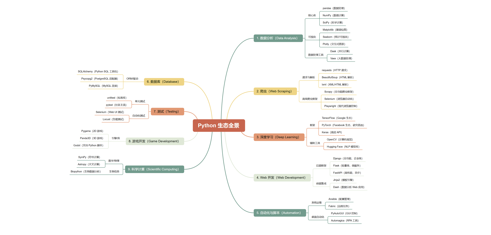
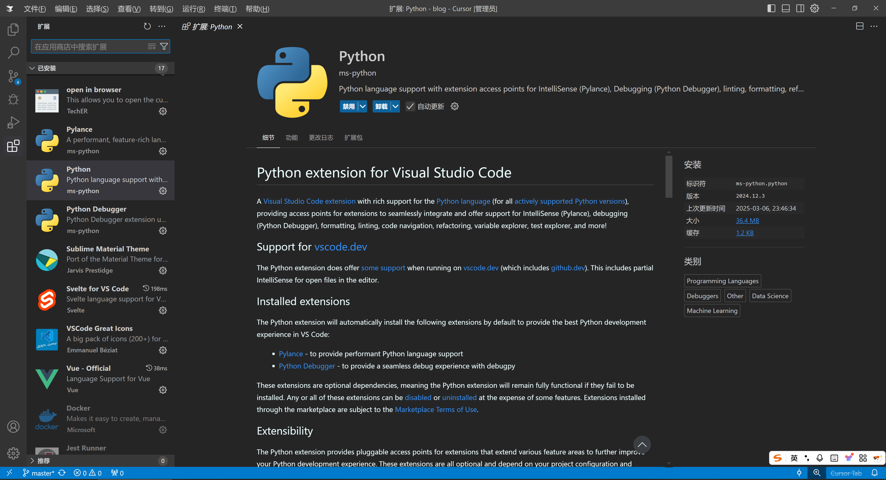

# Python快速入门

## 生态全景


## 文档
* [官方文档](https://docs.python.org/zh-cn/3.13/)
* [第三方库](https://pypi.org/)
* [Conda](https://docs.conda.io/projects/conda/en/stable/)
* [Miniconda](https://www.anaconda.com/docs/main)

## 安装
* Python：推荐安装v3.10+版本，以下所有代码示例均基于Python@3.10+。
* Conda：推荐安装Miniconda。

## VSCode插件


## 虚拟环境
强烈建议任何时候都通过类似`Conda`这样的工具创建一个虚拟环境并指定`Python`版本。
```py
# 规则
$ conda create -n your_env_name python=版本号

# 示例
$ conda create -n open_webui python=3.11
```
`Conda`常见命令如下：
```py
# 激活某个虚拟环境
$ conda activate your_env_name

# 取消激活当前虚拟环境
$ conda deactivate

# 查看所有虚拟环境
$ conda env list

# 删除某个虚拟环境
$ conda env remove -n your_env_name
```

## 数据类型
在`Python`中，主要有6个标准的数据类型，分别是：数字、字符串、列表、元组、集合、字典。

### Number数字
Number数字: 主要有四种类型，整数、布尔型(布尔型继承Int)、浮点数和复数。

```py
# 整数
num1 = 1

# 布尔型
flag = True

# 浮点数
num2 = 3.1415926

# 复数
num3 = 1 + 2j
```

### String字符串
字符串：多个字符组合在一起就是字符串。
```py
str = 'hello'
```
字符串的常见操作如下：
* `startswith`：判断字符串是否以指定的子字符串开头。
* `endswith`：判断字符串是否以指定的字符串结尾。
* `find`: 查找子字符串的索引位置，未找到返回-1。
* `replace`: 将指定的子字符串全部替换为新的子字符串。
* `split`: 按指定字符进行分割，返回列表。
* `strip`: 移除字符串前、后的空白符。
* `upper`：将所有字符全部大写。
* `lower`: 将所有字符全部小写。
```py
# 字符串的常见操作
str = 'abcdef'

print(str.startswith('a')) # true
print(str.endswith('f'))   # true

print(str.find('c')) # 2
print(str.find('C')) # -1

print(str.replace('def', 'xyz')) # 'abcxyz'

print('a,b,c,d,e,f'.split(',')) # ['a', 'b', 'c', 'd', 'e', 'f']

print(' abc def '.strip()) # 'abc def'

print('AbcDef'.upper()) # 'ABCDEF'
print('AbcDef'.lower()) # 'abcdef'
```

### List列表
列表：把多个元素排放在一起，就形成了列表。
```py
list1 = ['Blue', 'Yellow', 'Red']
list2 = [1, 2, 3, 4, 5]
```
列表的常见操作如下：
* `append`: 向列表尾部添加新元素。
* `insert`: 在指定索引位置插入新元素。
* `pop`: 移除制定索引位置的元素，不传索引则默认移除列表最后一个，返回被移除的元素。
* `remove`: 和pop用法一样，区别是不会返回被移除的元素。
* `reverse`: 反转列表
* `sort`: 排序列表
* `clear`: 清除列表

```py
list1 = [1, 2, 3, 4, 5]

list1.append(6)
print(list1) # [1, 2, 3, 4, 5, 6]

list1.insert(1, 20)
print(list1) # [1, 20, 2, 3, 4, 5, 6]

list1.pop()
print(list1) # [1, 20, 2, 3, 4, 5]
list1.pop(1)
print(list1) # [1, 2, 3, 4, 5]

list1.reverse()
print(list1) # [5, 4, 3, 2, 1]

list1.clear()
print(list1) # []
```

### Tuple元组
元组：元组和列表类似，不同的是：元组的元素不能修改，元组使用的是小括号定义，而列表使用方括号。
```py
# 元组
tup1 = ('Blue', 'Yellow', 'Red')
tup2 = tuple(['Blue', 'Yellow', 'Red']) # 和tup1等价

tup3 = (1, 2, 3, 4, 5)
```

### Set集合
`Set`集合是一组由唯一集合对象构成的无序、多项集合，其核心功能是自动去重，因此特别适合进行集合运算，例如：交集、并集。
```py
# 通过set函数创建
s1 = set('abc')

# 通过花括号创建
s2 = { 'Blue', 'Red', 'Yellow' }
```

`Set`集合常见的操作如下：
* `add`：向集合中添加元素，如果已存在则自动去重。
* `remove`: 移除列表元素，如果被移除的元素不存在，则会报`KeyErrorc`错误。
* `discard`: 移除列表元素，和remove不同的是，被删除元素如果不存在，则不会报错。
* `clear`: 清空元素列表。

```py
s1.add('x')
print(s1) # {'a', 'b', 'c', 'd'}

if 'd' in s1:
  s1.remove('d')
  print(s1) # { 'a', 'b', 'c' }

s1.discard('d')
print(s1) # {'a', 'b', 'c'}

s1.clear()
```
### Dictionary集合
`Dictionary`字典是一系列key/value键值对的集合。
```py
dict1 = { 'admin': 'AAA', 'age': 18 }
dict2 = dict(admin='AAA', age=18)

print(dict1) # { 'admin': 'AAA', 'age': 18 }
print(dict2) # { 'admin': 'AAA', 'age': 18 }
```

dict字段常见的操作如下：
* `d[key] = value`: 设置一个新的键值对。
* `get`: 获取指定键的值。
* `pop`: 移除指定key，如果key不存在则报错KeyError。
* `keys`: 返回由key组成的视图对象。
* `values`: 返回由value组成的视图对象。
* `items`: 返回由key/value组成的视图对象。
* `clear`: 清空列表。

```py
dict1['phone'] = '18222221111'
print(dict1) # { 'admin': 'AAA', 'age': 18, 'phone': '18222221111' }

print(dict1.get('phone', None)) # '18222221111'
print(dict1.get('address', None)) # key不存在，返回None

if 'phone' in dict1:
  dict1.pop('phone')
  print(dict1) # { 'admin': 'AAA', 'age': 18 }

for key in dict1.keys():
  print(key) # 'admin';'age'

for value in dict1.values():
  print(value) # 'AAA'; 18

for key, value in dict1.items():
  print(key, value) 'admin' 'AAA'; 'age' 18

dict1.clear()
print(dict1) # {}
```

### 类型判断
类型判断一般常用`type`和`isinstance`这两个函数，其用法如下：
* `type`: 
```py
# type用法
n = 123
s = 'abc'
f = True
l = [1, 2, 3]

print(type(n) == int) # True
print(type(s) == str) # True
print(type(f) == bool) # True
print(type(l) == list) # True
```
* `isinstance`：
```py
# isinstance用法
class Animal: pass;
class Dog(Animal): pass;
dog = Dog()

print(isinstance(123, int)) # True
print(isinstance('abc', str)) # True
print(isinstance(True, bool)) # True
print(isinstance([1, 2, 3], list)) # True
print(isinstance(dog, Dog)) # True
print(isinstance(dog, Animal)) # True
```

### 类型转换
类型转换一般可通过对应的构造函数进行，例如`int()`, `str()`等，其用法如下：
```py
s1 = '123'
n1 = int(s1)
print(type(n1) == int) # True

n2 = 456
s2 = str(n1)
print(type(s2) == str) # True
```

## 流程控制语句
流程控住语句常用的是`if/else`和`match`。

### if/else
```py
a=3
b=5

if a<b:
    print("a<b") # a<b
elif a==b:
    print("a==b")
else:
    print("a>b")
```

### match
`match`语句是`Python 3.10+`引入的新语法。
```py
def http_status(status):
  match status:
    case 200:
      return "OK"
    case 404:
      return "Not Found"
    case 500:
      return "Server Error"
    case _:  # 默认情况
      return "Unknown Status"

print(http_status(200)) # OK
print(http_status(404)) # Not Found
print(http_status(503)) # Unknown Status
```
## 循环语句

循环语句一般常用的是`for`循环和`while`循环。

### for循环
```py
# 遍历列表
for fruit in ["apple", "banana", "cherry"]:
  print(fruit) # apple banana cherry

# 遍历字符串
for char in "Python":
  print(char) # P y t h o n

# 遍历字典
person = {"name": "Alice", "age": 25, "city": "New York"}
for key, value in person.items():
  print(f"{key}: {value}") # name: Alice age: 25 city: New York

# 遍历范围
for i in range(1, 6):  # 从1到5
  print(i) # 1 2 3 4 5
```

### while循环
`while`循环中可以使用`continue`和`break`继续和中断。
```py
count = 0
while count < 5:
  # break中断
  if(count == 3):
    break
  print(count) # 0 1 2
  count += 1
```

## 函数

### 内置函数
在`Python`中有一些内置函数，可以直接使用。
```py
# 数字类
print(max(1, 2, 3, 4, 5)) # 5
print(round(3.1415)) # 3
print(abs(-10)) # 10

# 字符串类
print("Hello, World".upper()) # HELLO, WORLD
print("Hello, World".lower()) # hello, world
print("Hello, World".startswith("He")) # True
print("Hello, World".endswith("ld")) # True
```

### 函数定义
以实现`abs`函数为例，其定义如下：
```py
def my_abs(num):
  if num >= 0:
    return num
  else:
    return -num

print(my_abs(10)) # 10
print(my_abs(-10)) # 10
print(my_abs(0)) # 0
```
如果函数体没有什么内容，称为空函数。
```py
def noop():
  pass; # pass表示什么都不做
```

### 函数参数
函数支持多种参数传递形式，主要有如下几种：
```py
# 位置参数，按顺序传入
def add(a, b):
  return a + b # a = 3 b = 5

print(add(3, 5))  # 8

# 不用按顺序传入，只要和参数名对应即可
def greet(name, message):
  return f"{message}, {name}!"

print(greet(message="Hi", name="Bob"))  # Hi, Bob!

# 有些参数可以不传，不传则运用默认值
def greet(name, message="Hello"):
  return f"{message}, {name}!"

print(greet("Alice"))  # Hello, Alice!
print(greet("Bob", "Hi"))  # Hi, Bob!
```

### 函数返回值
函数可以返回一个或者多个值，返回多个值是实质上是一个元组。
```py
# 返回一个值
def is_even(num):
  if num % 2 == 0:
    return True
  return False

print(is_even(4))  # True
print(is_even(5))  # False

# 返回多个值
def min_max(numbers):
  return min(numbers), max(numbers)

low, high = min_max([3, 1, 4, 1, 5, 9])
print(low, high)  # 1 9
```

## 模块
Python中的模块一般主要有三类：
* 内置模块：`Python`中自带的，可直接使用，例如`math`。
* 第三方模块：社区开发的模块，需要安装。
* 自定义模块：自己实现的模块。

### 内置模块
```py
# 内置math和datetime模块
import math
from datetime import datetime

print(math.sqrt(16))  # 4.0
print(math.pi)        # 3.141592653589793
print(math.factorial(5))  # 120

print(datetime.now())
```

### 第三方模块
::: tip
第三方模块包地址：[https://pypi.org/](https://pypi.org/)
:::
第三方模块需要安装，安装后才能使用。
```sh
$ pip install pandas
```
```py
import pandas as pd

data = {"Name": ["Alice", "Bob"], "Age": [25, 30]}
df = pd.DataFrame(data)
print(df)

# 输出
   Name  Age
0  Alice   25
1    Bob   30
```

### 自定义模块
自定义模块是指项目中自己模块。
```py
# env_tools.py
import os
from dotenv import load_dotenv, find_dotenv

def get_api_key():
  load_dotenv(find_dotenv())
  return os.getenv('OPENAI_API_KEY')

def get_base_url():
  load_dotenv(find_dotenv())
  return os.getenv('OPENAI_BASE_URL')
```
在其它模块中引入(例如`main.py`)：
```py
# main.py中引入
from env_tools import get_api_key, get_base_url

print(get_api_key())
print(get_base_url())
```

## 面向对象编程
面向对象编程(OOP)是`Python`的核心特性之一，它通过类(`Class`)和对象(`Object`)组织代码，提高代码的复用性和可维护性。

### 类和实例
* 类(`Class`): 类是定义对象的模版(属性和方法)。
* 实例(`Instance`)：实例是根据类创建的具体对象。
```py
class Dog:
  # 类属性（所有实例共享）
  species = "Canis familiaris"

  # 初始化方法（构造函数）
  def __init__(self, name, age):
    self.name = name  # 实例属性
    self.age = age

  # 实例方法
  def bark(self):
    return f"{self.name} says Woof!"

# 创建实例
dog1 = Dog("Buddy", 3)
dog2 = Dog("Milo", 5)

print(dog1.bark())  # 输出: Buddy says Woof!
print(dog2.species)  # 输出: Canis familiaris
```

### 访问限制
`Python`通过命名约定实现封装，控制属性和方法的访问权限。

* 公有成员：默认，例如命名为`name`。
* 受保护成员：约定为内部使用，例如命名为`_name`。
* 私有成员：无法直接访问，例如命名为`__name`。
```py
class BankAccount:
  def __init__(self, name, balance, phone):
    self.name = name # 公共属性
    self._phone = phone # 受保护属性
    self.__balance = balance  # 私有属性

  # 公有方法访问私有属性
  def get_balance(self):
    return self.__balance
  
  def get_phone(self):
    return self._phone

  def deposit(self, amount):
    print(self._phone)
    if amount > 0:
      self.__balance += amount

# 创建实例
account = BankAccount('admin', '13211112222', 1000)
print(account.name) # 'admin'
print(account.get_phone()) # 13211112222
print(account.get_balance())  # 1000

print(account._phone)  # 访问受保护属性，不报错
print(account.__balance)  # 访问私有属性，会报错
```
### 继承
子类可以继承父类(一个或者多个)的属性和方法，并可以扩展或重写。
```py
class Animal:
  def __init__(self, name):
    self.name = name

  def speak(self):
    raise NotImplementedError("子类必须实现此方法")

class Cat(Animal):
  def speak(self):
    return f"{self.name} says Meow!"

class Dog(Animal):
  def speak(self):
    return f"{self.name} says Woof!"

# 创建子类实例
cat = Cat("Whiskers")
dog = Dog("Buddy")

print(cat.speak())  # 输出: Whiskers says Meow!
print(dog.speak())  # 输出: Buddy says Woof!
```