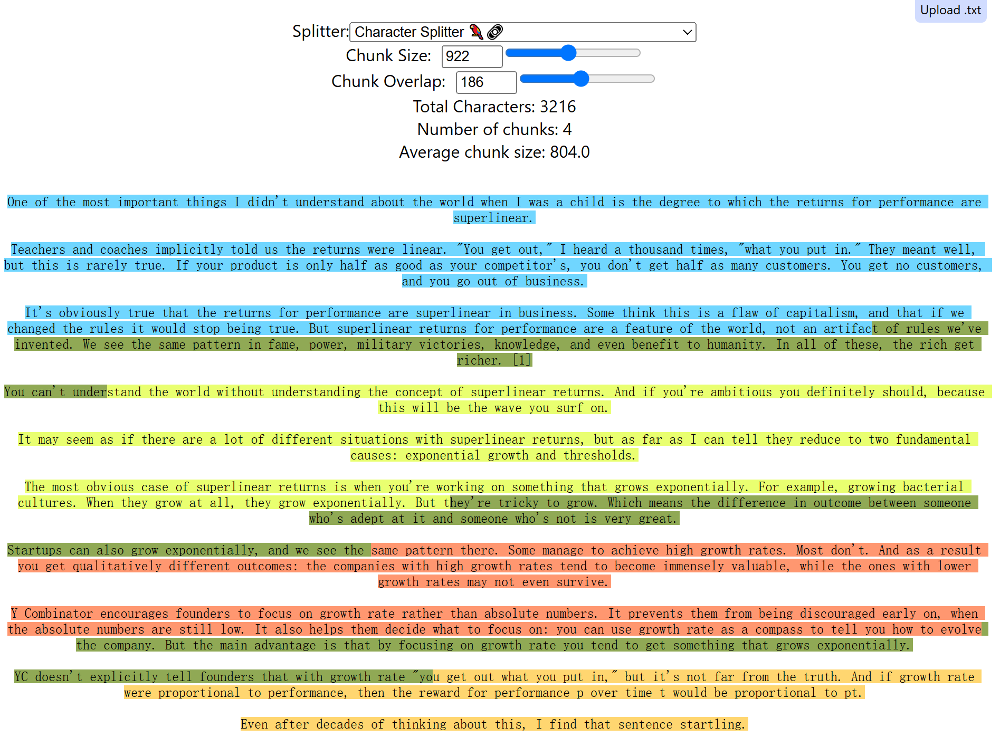

# 介绍

## 为什么要切块
将比较长的文本分解成适当大小的片段，有助于嵌入、索引和存储，并提高检索的精确度。

具体体现在：
* 大模型一次处理文本`Token`的数量是有限制的。
* 对嵌入模型而言，其向量一般都有维度限制，如果文本比较长，则必然在压缩向量维度时**丢失**一些相关信息。
* 对生成模型而言，如果上线文太长，则在检索信息时必然低效和不精确。

## 分块可视化工具
::: tip
[ChunkViz](https://chunkviz.up.railway.app/)
:::

