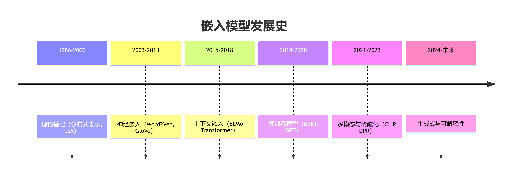

# 介绍
::: tip
`Embedding`是AI领域的基石技术，它将抽象符号转化为可计算的数学表示，从而赋能各类机器学习任务。
:::

## 什么是Embedding
`Embedding`是将高维、离散或复杂的数据（如单词、图像、用户行为等）映射到低维连续向量空间的技术。这些向量（即嵌入）能够捕捉原始数据的语义、关系或特征，使机器更容易处理和计算。

## Embedding类型

* `Word Embedding`: 将单词映射为向量，例如`Word2Vec`、`GloVe`。
* `Image Embedding`: 用`CNN`提取图像的向量表示，例如`ResNet`的特征向量。
* `Graph Embedding`: 将图中的节点/边表示为向量，例如：`Node2Vec`、`GNN`。
* 用户/商品嵌入(推荐系统)：将用户/商品表示为向量，用于预测偏好，例如：矩阵分解、深度学习。

## Embedding维度
::: tip
`Embedding`维度就是其向量的长度。
:::

`Embedding`维度：即向量的长度，是嵌入技术中的关键参数，直接影响模型的表达能力、计算效率和下游任务效果。

**维度的本质**：是将离散对象(如单词)映射到的连续向量的长度，例如：`[0.1, -0.3, ..., 0.8]`，理论而言，维度越高，能编码的信息越丰富，但也可能带来冗余和过拟合。

常见维度设置案例：
| 分类 | 模型 | 维度 |
| --- | --- | --- |
| **词嵌入** | `Word2Vec`、`GloVe`、`FastText` | 50/100/200/300/ |
| **推荐系统** | YouTube推荐 | 256 |
| **预训练模型** | `BERT-base`、`BERT-large` | 768、1024 |
| **图像嵌入** | `ResNet-50` | 2048 |

## 发展历史

**初始阶段：分布式表示**
* 特点：每个词对应一个唯一的`ID`或`One-Hot`向量(大多数值为0，某一位为1)。
* 局限性：无法表达词与词之间的语义关系(如“狗”和“猫”是独立的)。

**分布式词向量：Word2Vec 时代**
* 特点：词的意义来自上下文分布，词向量低维稠密，支持词向量计算。
* 影响：开启词嵌入大规模训练的时代。
* 模型：`Word2Vec`(2013 Google)、`GloVe`(2014 Stanford)、`FastText`(2016 Facebook)。

**上下文相关嵌入：BERT 革命**
* 特点：词的表示取决于上下文，输出的是句子中每个词的上下文相关表示。
* 模型：`ELMo`(2018 AllenNLP)、`BERT`(2018 Google)、`GPT-2`(2019 OpenAI)。

**多模态嵌入**
* 特点：可以将图像和文本映射到同一向量空间，支持跨语言的嵌入，不同语言语义相近的句子有相近向量表示。
* 影响：嵌入模型从单一文本向多模态、任务无关、可解释性发展。
* 模型：`LoRA`(2021)、`CLIP`(2021 OpenAI)、`Flamingo`(2022 DeepMind)。

**API和应用时代**
* 特点：支持全语言、支持超长文本、适配向量数据库。
* 模型：`BGE`(2023 BAAI)、`text-embedding-3`(2024 OpenAI)。
