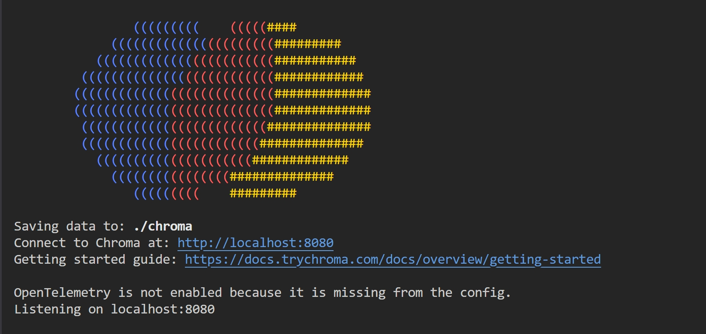

# Chroma
::: tip
[Chroma 文档](https://docs.trychroma.com/docs/overview/introduction)
:::

## 安装

执行此命令安装`chroma`包：
```sh
$ pip install chromadb
```

## 客户端
`Chroma`中的客户端一般分为如下几种类型：
* **临时客户端(Ephemeral Client)**：数据存储在本地内存中，适合快速验证一些特性。
* **持久化客户端(Persistent Client)**：数据存储在本地硬盘中，`Chroma`在启动时，自动加载硬盘已经存储的数据。
* **客户端-服务端模式(Client Server Mode)**：服务端和客户端可分离。

### 临时客户端
通过如下代码创建临时客户端：
```py
import chromadb

client = chromadb.EphemeralClient()
```

### 持久化客户端
通过如下代码创建持久化客户端：
```py
import chromadb

client = chromadb.PersistentClient(
  path="./data"
)
```
上述代码执行后会创建一个本地`db`：
```sh
| - data
| - | - chroma.sqlite3
```

### 服务端-客户端模式
通过如下代码启动服务端：
```sh
# 默认端口和host
$ chroma run --path /db_path

# 自定义端口和host
$ chroma run --host localhost --port 80000 --path /db_path
```


通过如下代码链接服务端：
```py
import chromadb

client = chromadb.HttpClient(
  host="localhost",
  port=8080,
)
```

## 集合(Collection)
::: tip
`Collection`是向量数据库中存储一组相似数据的逻辑单元，类似于传统数据库中的表`Table`
:::

集合相关操作如下：
```py
# 创建集合(仅创建)
collection = client.create_collection(
  name="test_collection"
)
# 创建集合(如果存在则返回，如果不存在则创建)
collection = client.get_or_create_collection(
  name="test_collection"
)


# 修改集合名称
collection.modify(name="dev")

# 删除集合(不可逆，谨慎操作)
client.delete_collection(
  name="test_collection"
)

# 集合其它方法
print(collection.peek()) # 返回一组items列表
print(collection.count()) # 返回items的数量
```

## 集合数据(Collection Data)
在操作集合数据时，有如下几个关键参数：
* **documents**: 可选，与`embeddings`不能同时为空，原始文档对象的列表。
* **embeddings**：可选，与`documents`不能同时为空，一组向量列表。
* **metadatas**：可选，元数据列表，需要和`documents` 和 `embeddings`在维度上相同。
* **ids**：必填，一组唯一`id`的列表，需要和`documents` 和 `embeddings`在维度上相同。


### 添加集合数据
```py
# 添加数据
collection.add(
  documents=["Vue.js", "React.js", "Svelte.js"],
  metadatas=[
    { "framework": "FE", "version": "2.7" },
    { "framework": "FE", "version": "18.0" },
    { "framework": "FE", "version": "5.0" }
  ],
  ids=["id1", "id2", "id3"]
)
print(collection.count())
```

### 更新集合数据
```py
# 同时更新document和metadata
collection.update(
  ids=["id1"],
  documents=["Vue.js"]
  metadatas=[
    { "framework": "FE", "version": "3.0" }
  ]
)

# 插入数据
collection.upsert(
  documents=["Angular.js"],
  metadatas=[
    { "framework": "FE", "version": "20.0" }
  ],
  ids=["id4"]
)
```

### 删除集合数据
```py
# ids可选，如果不提供，则删除满足where条件所有的数据
collection.delete(
  ids=["id3"],
  where={
    "version": "5.0"
  }
)
```

## 查询集合(Query Collection)
::: tip
[Collection Query API 文档](https://docs.trychroma.com/reference/python/collection#query) <br/>
[Collection Get API 文档](https://docs.trychroma.com/reference/python/collection#get)
:::
```py
# 根据查询内容查询
result = collection.query(
  query_texts=["Vue.js"],
  n_results=1 # 仅返回最匹配的一项
)

# 根据id查询
result = collection.get(
  ids=["id1", "id2", "id3"],
  where={
    "version": "3.0"
  }
)
```

## 元数据过滤(Metadata Filter)
在查询时，可以对元数据(`metadata`)进行过滤，在`Chroma`中支持的操作符如下：
| 类型     | 操作符 | 含义  | 示例                   |
| ----- | ------ | ---- | -------------------------- |
| 数值比较 | `$eq`  | 等于   | `"age": { "$eq": 25 }`     |
| 数值比较 | `$ne`  | 不等于  | `"status": { "$ne": "A" }` |
| 数值比较 | `$gt`  | 大于   | `"score": { "$gt": 70 }`   |
| 数值比较 | `$gte` | 大于等于 | `"score": { "$gte": 70 }`  |
| 数值比较 | `$lt`  | 小于   | `"price": { "$lt": 100 }`  |
| 数值比较 | `$lte` | 小于等于 | `"price": { "$lte": 100 }` |
| 集合判断 | `$in`  | 在集合内（包含） | `"tags": { "$in": ["red", "blue"] }`   |
| 集合判断 | `$nin` | 不在集合内    | `"tags": { "$nin": ["green", "yellow"] }` |
| 逻辑判断 | `$and` | 与  | `"$and": [{ "age": { "$gt": 20 } }, { "status": "A" }]`  |
| 逻辑判断 | `$or`  | 或  | `"$or": [{ "status": "A" }, { "score": { "$lt": 60 } }]` |
| 逻辑判断 | `$not` | 非  | `"age": { "$not": { "$gte": 18 } }`                      |

```py
collection.add(
  documents=["Vue.js", "React.js", "Svelte.js"],
  metadatas=[
    { "framework": "FE", "version": "2.7", "age": 8 },
    { "framework": "FE", "version": "18.0", "age": 10 },
    { "framework": "FE", "version": "5.0", "age": 12 }
  ],
  ids=["id1", "id2", "id3"]
)

version_result = collection.get(
  where={
    "version": {
      "$in": ["5.0", "18.0"]
    },
  }
)

print(version_result.get('ids')) # ['id2', 'id3']

age_result = collection.get(
  where={
    "age": {
      "$gte": 12
    },
  }
)
print(age_result.get('ids')) # ['id3']
```

## 自定义Embedding
`Chroma`中默认的`Embedding`模型是`all-MiniLM-L6-v2`，但其允许提供自定义`Embedding`模型，以`BAAI/bge-m3`为例。

首先安装以下包：
```sh
$ pip install transformers
$ pip install torch
```

创建`bge_m3_embedding.py`，其代码如下：
```py
from chromadb.utils.embedding_functions import EmbeddingFunction
from transformers import AutoTokenizer, AutoModel
import torch

class BGE_M3_Embedding(EmbeddingFunction):
  def __init__(self, model_name="BAAI/bge-m3", device=None):
    self.device = device or ("cuda" if torch.cuda.is_available() else "cpu")
    self.tokenizer = AutoTokenizer.from_pretrained(model_name)
    self.model = AutoModel.from_pretrained(model_name).to(self.device).eval()

  def __call__(self, texts):
    if isinstance(texts, str):
      texts = [texts]
    # 批量编码
    inputs = self.tokenizer(
      texts,
      return_tensors="pt",
      truncation=True,
      padding=True,
      max_length=512
    ).to(self.device)
    # 前向传播
    with torch.no_grad():
      outputs = self.model(**inputs)
      # Mean Pooling
      embeddings = outputs.last_hidden_state.mean(dim=1)
    # 转成 list of list
    return embeddings.cpu().tolist()

```

在`main.py`中使用`BGE_M3_Embedding`：
```py
from bge_m3_embedding import BGE_M3_Embedding

# 创建 Collection
collection = client.get_or_create_collection(
  name="my_bge_m3_collection",
  embedding_function=BGE_M3_Embedding()
)

# 添加数据
collection.add(
  ids=["doc1", "doc2"],
  documents=[
    "OpenAI develops advanced AI models.",
    "BAAI's bge-m3 is a state-of-the-art embedding model."
  ],
  metadatas=[
    {"source": "openai"},
    {"source": "baai"}
  ]
)

# 查询相似文档
results = collection.query(
  query_texts=["Who is embedding model?"],
  n_results=1
)

print(results.get('ids')) # ['doc2']
```

## 多模态(MultiModal)