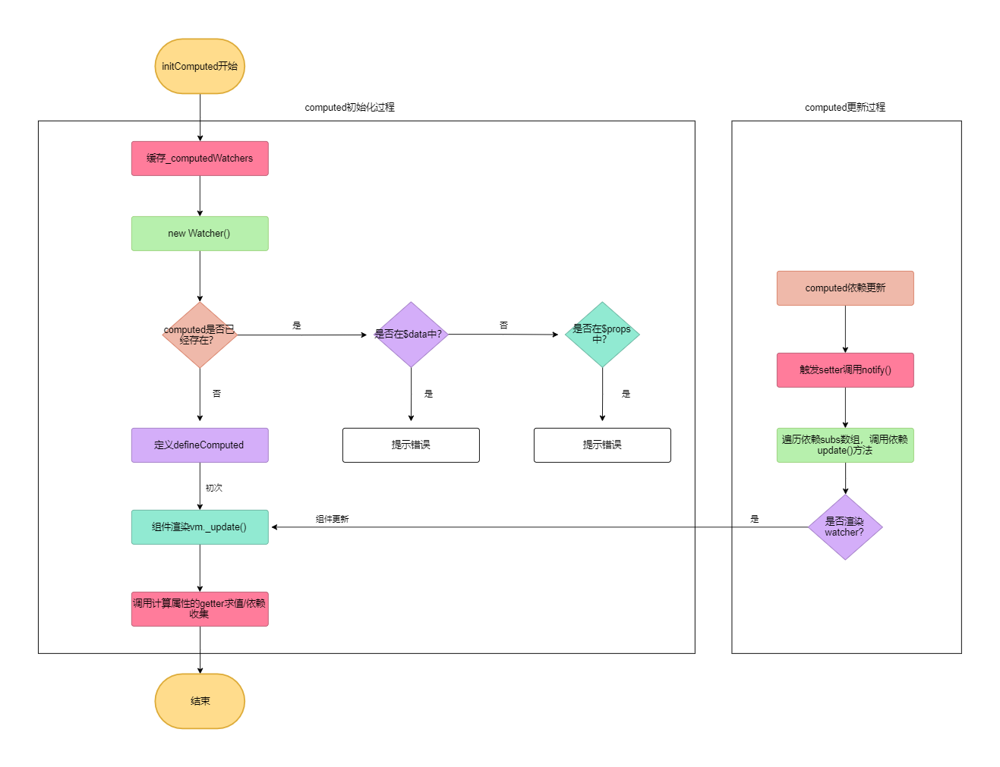

# computed处理
处理`computed`相关的逻辑，发生在`initState`中，接下来我们详细分析与`computed`相关的逻辑。
```js
export function initState (vm: Component) {
  // 省略代码
  const opts = vm.$options
  if (opts.computed) initComputed(vm, opts.computed)
}
```

我们知道`computed`计算属性是依赖于其它响应式变量的，因此我们分析`computed`的时候会分为两个步骤：**computed初始化**和**computed更新**。

## computed初始化

在`initState()`方法中如果我们传递了`computed`，那么会调用`initComputed()`方法。`initComputed()`方法定义在`src/core/instance/state.js`文件中，其代码如下：
```js
const computedWatcherOptions = { lazy: true }
function initComputed (vm: Component, computed: Object) {
  // $flow-disable-line
  const watchers = vm._computedWatchers = Object.create(null)
  // computed properties are just getters during SSR
  const isSSR = isServerRendering()
  for (const key in computed) {
    const userDef = computed[key]
    const getter = typeof userDef === 'function' ? userDef : userDef.get
    if (process.env.NODE_ENV !== 'production' && getter == null) {
      warn(
        `Getter is missing for computed property "${key}".`,
        vm
      )
    }
    if (!isSSR) {
      // create internal watcher for the computed property.
      watchers[key] = new Watcher(
        vm,
        getter || noop,
        noop,
        computedWatcherOptions
      )
    }
    // component-defined computed properties are already defined on the
    // component prototype. We only need to define computed properties defined
    // at instantiation here.
    if (!(key in vm)) {
      defineComputed(vm, key, userDef)
    } else if (process.env.NODE_ENV !== 'production') {
      if (key in vm.$data) {
        warn(`The computed property "${key}" is already defined in data.`, vm)
      } else if (vm.$options.props && key in vm.$options.props) {
        warn(`The computed property "${key}" is already defined as a prop.`, vm)
      }
    }
  }
}
```
代码分析：
* 在`initComputed()`方法中，首先定义了一个`_computedWatchers`的变量，这个变量的作用是缓存当前实例所有计算属性的`watcher`。
* 接下来遍历所有的`computed`，然后对每一个`computed`进行类型判断，如果是`function`类型，那么直接使用，如果是对象则代表是`get/set`形式，则直接取`get`。如果最后获取到的`computed`的`getter`为`null`，则在开发环境下提示错误。
```js
// 两种类型的计算属性
export default {
  props: ['index'],
  data () {
    return {
      firstName: 'first',
      lastName: 'last'
    }
  },
  computed: {
    fullName () {
      return this.firstName + this.lastName
    },
    active: {
      get: function () {
        return this.index
      },
      set: function (newVal) {
        this.$emit('update:index', newVal)
      } 
    }
  }
}
```
以上面代码为例，两种类型的`computed`获取到的`getter`分别如下：
```js
// function类型
const getter = function () {
  this.firstName + this.lastName
}

// get/set类型
const getter = function () {
  return this.index
}
```
* 然后在非`SSR`服务端渲染的情况下，会在`_computedWatchers`上新建一个`Watcher`的实例。以上面代码为例，`_computedWatchers`在遍历完毕后，可以用如下代码表示：
```js
// 当前vm实例
{
  _computedWatchers: {
    fullName: new Watcher(),
    active: new Watcher()
  }
}
```

* 最后、首先判断了当前遍历的`computed`是否已经在`vm`实例上，如果不在则调用`defineComputed()`方法，如果在还需要判断当前遍历的`computed`是否和`props`、`data`命名冲突，如果冲突则提示错误。

**注意**：对于子组件而言，这个时候当前遍历的`computed`已经在`vm`实例上了，所以并不会调用`defineComputed()`方法，我们从上面代码注释也能看的出来。对于子组件而言，真正`initComputed`的过程是发生在`Vue.extend`方法中：
```js
Vue.extend = function (extendOptions) {
  // 省略代码
  const Super = this
  const Sub = function VueComponent (options) {
    this._init(options)
  }
  Sub.prototype = Object.create(Super.prototype)
  Sub.prototype.constructor = Sub

  // 初始化子组件的computed
  if (Sub.options.computed) {
    initComputed(Sub)
  }
}

// extend.js中的initComputed定义
function initComputed (Comp) {
  const computed = Comp.options.computed
  for (const key in computed) {
    defineComputed(Comp.prototype, key, computed[key])
  }
}
```
然后`initComputed`调用的`defineComputed()`方法，就和我们现在的`defineComputed()`方法是同一个方法，它和此时的`initComputed()`方法定义在同一个位置(`src/core/instance/state.js`)：
```js
const sharedPropertyDefinition = {
  enumerable: true,
  configurable: true,
  get: noop,
  set: noop
}
export function defineComputed (
  target: any,
  key: string,
  userDef: Object | Function
) {
  const shouldCache = !isServerRendering()
  if (typeof userDef === 'function') {
    sharedPropertyDefinition.get = shouldCache
      ? createComputedGetter(key)
      : createGetterInvoker(userDef)
    sharedPropertyDefinition.set = noop
  } else {
    sharedPropertyDefinition.get = userDef.get
      ? shouldCache && userDef.cache !== false
        ? createComputedGetter(key)
        : createGetterInvoker(userDef.get)
      : noop
    sharedPropertyDefinition.set = userDef.set || noop
  }
  if (process.env.NODE_ENV !== 'production' &&
      sharedPropertyDefinition.set === noop) {
    sharedPropertyDefinition.set = function () {
      warn(
        `Computed property "${key}" was assigned to but it has no setter.`,
        this
      )
    }
  }
  Object.defineProperty(target, key, sharedPropertyDefinition)
}
```
`defineComputed()`方法的逻辑很简单，根据不同的类型的`computed`，对`sharedPropertyDefinition`的`get`和`set`进行赋值。`sharedPropertyDefinition`在之前的`proxy`中，我们已经介绍过， 它就是`Object.defineProperty()`方法`descriptor`参数的一个共享配置。

在非`SSR`服务端渲染的情况，`sharedPropertyDefinition.get`的值是调用了`createComputedGetter()`方法，而在`SSR`服务端渲染的情况下是调用了`createGetterInvoker()`方法。我们在分析`Vue`源码的过程中，因为侧重于`Web`浏览器端的表现，因此我们接下来会分析`createComputedGetter()`方法的实现。`createComputedGetter()`方法和`defineComputed()`方法定义在同一个位置，代码如下：
```js
function createComputedGetter (key) {
  return function computedGetter () {
    const watcher = this._computedWatchers && this._computedWatchers[key]
    if (watcher) {
      if (watcher.dirty) {
        watcher.evaluate()
      }
      if (Dep.target) {
        watcher.depend()
      }
      return watcher.value
    }
  }
}
```
我们可以看到`createComputedGetter()`方法返回了一个函数，这个函数会在获取`computed`的时候被调用，例如组件渲染的时候：
```vue
<template>
  <div>{{fullName}}</div>
</template>
```
根据以上代码我们再来看`computedGetter()`方法：组件渲染的时候会获取`fullName`计算属性，然后调用`computedGetter()`方法，在这个方法执行的时候，首先判断`watcher.dirty`属性，这个属性在`new Watcher()`的时候与我们传入的`const computedWatcherOptions = { lazy: true }`有关。在`Watcher`类的构造函数中，有这样一段代码：
```js
class Watcher {
  // 省略代码
  constructor (vm, expOrFn, cb, options, isRenderWatcher) {
    if (options) {
      this.lazy = !!options.lazy
    } else {
      this.lazy = false
    }
    this.dirty = this.lazy
  }
}
```
因为我们传入的`lazy`值为`true`，因此`watcher.dirty`条件判断为真，进行`watcher.evaluate()`计算。随后判断了`Dep.target`为真，则进行依赖收集`watcher.depend()`，关于依赖收集我们会在之后的章节详细介绍。我们只要知道，当在组件渲染的时候触发的`computed`依赖收集，收集的是`render watcher`。最后，我们看一下`watcher.evaluate()`方法的实现：
```js
class Watcher {
  /**
   * Evaluate the value of the watcher.
   * This only gets called for lazy watchers.
   */
  evaluate () {
    this.value = this.get()
    this.dirty = false
  }
}
```
`evaluate()`方法它的实现非常简单，就是触发`computed`的`getter`进行求值，然后把`dirty`设置为`false`。

## computed更新
在介绍完了`computed`的初始化后，我们在来看`computed`的更新过程，以下面例子为例：
```js
export default {
  template: `
    <div>{{fullName}}</div>
    <button @click="change">change</button>
  `
  data () {
    return {
      total: 0,
      firstName: 'first',
      lastName: 'last'
    }
  },
  computed: {
    fullName () {
      if (this.total > 0) {
        return this.firstName + this.lastName
      } else {
        return 'pleace click'
      }
    }
  },
  methods: {
    change () {
      this.total++
    }
  }
}
```
因为`total`、`firstName`和`lastName`全部为响应式变量，所以`fullName`这个计算属性初始化的时候，此时`total`值为`0`，`fullName`计算属性有两个`Watcher`，其中一个是计算属性`watcher`，另外一个是渲染`watcher`。当点击按钮触发事件后，会触发`total`属性的`setter`方法，进而调用一个叫做`notify`的方法。
```js
set： function reactiveSetter (newVal) {
  // 省略
  dep.notify()
}
```
其中`notify()`是定义在`Dep`类中的一个方法：
```js
export default class Dep {
   constructor () {
    this.subs = []
  }
  notify () {
    // stabilize the subscriber list first
    const subs = this.subs.slice()
    if (process.env.NODE_ENV !== 'production' && !config.async) {
      // subs aren't sorted in scheduler if not running async
      // we need to sort them now to make sure they fire in correct
      // order
      subs.sort((a, b) => a.id - b.id)
    }
    for (let i = 0, l = subs.length; i < l; i++) {
      subs[i].update()
    }
  }
}
```
代码分析：
* `subs`就是我们收集起来的`watcher`，它是一个数组，对应上面案例的话它是一个长度为2的数组并且其中一个元素为`render watcher`，另一个元素为`computed watcher`。
* 在`notify()`方法调用时，会遍历`subs`数组，然后依次调用当前`watcher`的`update`方法。其中`update`方法是定义在`Watcher`类中的一个实例方法，代码如下：
```js
class Watcher {
  // 省略其它
  update () {
    /* istanbul ignore else */
    if (this.lazy) {
      this.dirty = true
    } else if (this.sync) {
      this.run()
    } else {
      queueWatcher(this)
    }
  }
}
```
当第一次遍历时，此时的`watcher`为计算属性`watcher`，我们已经在前面介绍过计算属性`watcher`它的`this.lazy`值为`true`，因此会进行`this.dirty = true`。<br/>
当第二次遍历时，此时的`watcher`为渲染`watcher`，对于渲染`watcher`而言，它的`lazy`值为`false`，`this.sync`为`false`，因此会调用`queueWatcher()`方法。我们目前不需要知道`queueWatcher`是怎么实现的，只需要知道`queueWatcher()`方法在调用时，会触发`updateComponent()`方法：
```js
updateComponent = () => {
  vm._update(vm._render(), hydrating)
}
```
我们可以看到`updateComponent()`方法调用了`vm._update`方法，而这个方法的作用就是重新进行组件渲染，在组件渲染的过程中，会再次读取`fullName`的值，也就是说会调用下面这段代码：
```js
fullName () {
  if (this.total > 0) {
    return this.firstName + this.lastName
  } else {
    return 'pleace click'
  }
}
```
因为此时的`total`值为`1`，所以会返回`this.firstName + this.lastName`的值，而`firstName`和`lastName`又是定义在`data`中的响应式变量，会依次触发`firstName`和`lastName`的`getter`，然后进行依赖收集。在组件渲染完毕后，`fullName`的依赖数组`subs`此时会有四个`watcher`，分别是三个计算属性`watcher`和一个渲染`watcher`。无论这三个计算属性`watcher`哪一个值更新了，都会再次重复以上的流程，这就是`computed`更新的过程。

在分析完`computed`的相关流程后，我们可以得到如下流程图
<div style="text-align: center">
  
</div>
