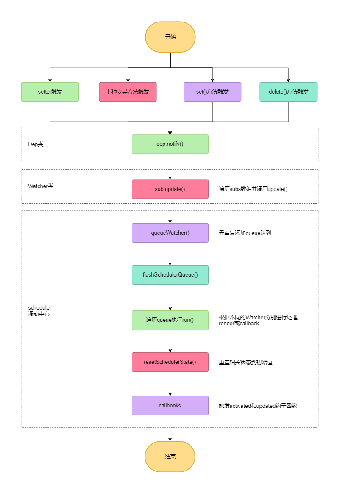

# 派发更新
在介绍完依赖收集后，我们紧接着来分析一下派发更新。在这一小节，我们的目标是弄清楚派发更新主要做什么事情以及派发更新的具体过程实现。

我们先来回答第一个问题：<br/>
问：派发更新主要做什么事情？<br/>
答：派发更新就是当响应式数据发生变动的时候，通知所有订阅了这个数据变化的`Watcher`(既`Dep`依赖)执行`update`。对于`render watcher`渲染`Watcher`而言，`update`就是触发组件重新进行渲染；对于`computed watcher`计算属性`Watcher`而言，`update`就是对计算属性重新求值；对于`user watcher`用户自定义`Watcher`而言，`update`就是调用用户提供的回调函数。

## 场景
大多数人分析派发更新的场景，只说明了`Object.defineProperty()`方法中`setter`被触发的时候会进行派发更新，其实一共有四处派发更新的地方，其它三处分别为：

* `Vue.js`中七种数组变异方法被调用时，会进行派发更新。
```js
const methodsToPatch = ['push', 'pop', 'shift', 'unshift', 'splice', 'sort', 'reverse']

methodsToPatch.forEach(function (method) {
  def(arrayMethods, method, function mutator (...args) {
    // 精简代码
    ob.dep.notify()
    return result
  })
})
```

* `Vue.set`或者`this.$set`的时候，会进行派发更新。
```js
export function set (target: Array<any> | Object, key: any, val: any): any {
  // 精简代码
  defineReactive(ob.value, key, val)
  ob.dep.notify()
  return val
}
```

* `Vue.delete`或者`this.$delete`的时候，会进行派发更新。
```js
export function del (target: Array<any> | Object, key: any) {
  // 精简代码
  delete target[key]
  if (!ob) {
    return
  }
  ob.dep.notify()
}
```

其中，以上三种派发更新与`Object.defineProperty()`方法中的`setter`被触发时的派发更新有一点不一样，`setter`中的派发更新，它的`dep`是一个在`defineReactive`方法中定义的闭包变量，意味着其只能服务于`defineReactive`方法。前者的`dep`是从`this.__ob__`对象中取的，`this.__ob__`属性是在`Observer`被实例化的时候被定义的，它指向`Observer`实例，我们在之前已经介绍过。这种独特的处理方式，方便了我们在以上三种场景下，能方便的读取到`dep`依赖，进而进行依赖的派发更新。

## 过程
在以上代码中，我们以及了解到了`dep.notify()`被调用的各种时机，在这一个小节中我们需要来看一下派发更新的过程。

当`dep.notify()`被调用时，它会执行`notify()`方法中的代码，我们来看一下`Dep`类中关于这个方法的实现：
```js
notify () {
  const subs = this.subs.slice()
  for (let i = 0, l = subs.length; i < l; i++) {
    subs[i].update()
  }
}
```
可以发现，`notify`主要做的就是遍历`subs`数组，然后调用`update`方法。下一步，我们来看一下`Watcher`类中关于`update`方法的代码实现：
```js
import { queueWatcher } from './scheduler'
update () {
  if (this.lazy) {
    this.dirty = true
  } else if (this.sync) {
    this.run()
  } else {
    queueWatcher(this)
  }
}
```
在`update`方法被执行的时候，首先判断了`this.lazy`和`this.sync`两个属性，其中`this.lazy`为`computed watcher`计算属性的标志，因为计算属性会延后进行求值，因此这里只是把`this.dirty`赋值为`true`，`this.sync`不属于派发更新这一章节的重点，因此不做过多的介绍。

我们来重点分析`queueWatcher`，它是撰写在`observer/scheduler.js`文件中的一个方法：
```js
const queue: Array<Watcher> = []
let has: { [key: number]: ?true } = {}
let waiting = false
let flushing = false
let index = 0

export function queueWatcher (watcher: Watcher) {
  const id = watcher.id
  if (has[id] == null) {
    has[id] = true
    if (!flushing) {
      queue.push(watcher)
    } else {
      // if already flushing, splice the watcher based on its id
      // if already past its id, it will be run next immediately.
      let i = queue.length - 1
      while (i > index && queue[i].id > watcher.id) {
        i--
      }
      queue.splice(i + 1, 0, watcher)
    }
    // queue the flush
    if (!waiting) {
      waiting = true

      if (process.env.NODE_ENV !== 'production' && !config.async) {
        flushSchedulerQueue()
        return
      }
      nextTick(flushSchedulerQueue)
    }
  }
}
```
我们可以在以上代码最顶部发现定义了几个变量，其中有几个比较重要的变量，它们的作用如下：
* `queue`：各种`Watcher`执行队列，无论是`render watcher`、`user watcher`还是`computed watcher`，只要不是重复的`Watcher`，最终都会被推入到`queue`队列数组中。
* `has`：用来防止重复添加`Watcher`的标志对象：
```js
// 表示id为1,2的Watcher实例已经被添加到了queue
// 后续遇到同样的Watcher实例，不会重复添加到队列中
const has = {
  1: true,
  2: true
}
```
* `index`：当前遍历的`Watcher`实例索引，它就是`flushSchedulerQueue`方法中使用`for`循环遍历`queue`队列数组的`index`。

介绍完以上几个重要变量后，我们来分析一下`queueWatcher`的过程：
* 代码首先通过获取当前`Watcher`的自增`id`，判断在标志对象`has`中是否已经存在，如果不存在，则对这个`id`进行标记，赋值为`true`。
* 随后判断是否为`flushing`状态，如果不是，则代表我们可以正常的把当前`Watcher`推入到`queue`队列数组中。
* 接着判断了是否为`waiting`状态，如果不是，则代表可以执行`queue`队列数组，然后设置`waiting`为`true`，最后调用`nextTick(flushSchedulerQueue)`，`nextTick`方法是`Vue.js`自己封装的一个处理异步逻辑的工具函数，我们现在只要知道：`nextTick`中的函数参数，会在下一个`tick`执行。

接着，我们来看`flushSchedulerQueue`函数是如何实现的：
```js
function flushSchedulerQueue () {
  currentFlushTimestamp = getNow()
  flushing = true
  let watcher, id

  // Sort queue before flush.
  // This ensures that:
  // 1. Components are updated from parent to child. (because parent is always
  //    created before the child)
  // 2. A component's user watchers are run before its render watcher (because
  //    user watchers are created before the render watcher)
  // 3. If a component is destroyed during a parent component's watcher run,
  //    its watchers can be skipped.
  queue.sort((a, b) => a.id - b.id)

  // do not cache length because more watchers might be pushed
  // as we run existing watchers
  for (index = 0; index < queue.length; index++) {
    watcher = queue[index]
    if (watcher.before) {
      watcher.before()
    }
    id = watcher.id
    has[id] = null
    watcher.run()
    // in dev build, check and stop circular updates.
    if (process.env.NODE_ENV !== 'production' && has[id] != null) {
      circular[id] = (circular[id] || 0) + 1
      if (circular[id] > MAX_UPDATE_COUNT) {
        warn(
          'You may have an infinite update loop ' + (
            watcher.user
              ? `in watcher with expression "${watcher.expression}"`
              : `in a component render function.`
          ),
          watcher.vm
        )
        break
      }
    }
  }

  // keep copies of post queues before resetting state
  const activatedQueue = activatedChildren.slice()
  const updatedQueue = queue.slice()

  resetSchedulerState()

  // call component updated and activated hooks
  callActivatedHooks(activatedQueue)
  callUpdatedHooks(updatedQueue)

  // devtool hook
  /* istanbul ignore if */
  if (devtools && config.devtools) {
    devtools.emit('flush')
  }
}
```
我们粗略观看`flushSchedulerQueue`函数代码，可以发现它主要做几件事情：**还原flushing状态**、**排序queue队列**、**遍历queue**、**还原状态**、**触发组件钩子函数**。我们按照这几个步骤，分别说明:
* **还原flushing状态**：在`flushSchedulerQueue`首先对`flushing`进行了还原，这样做的目的是为了不影响在执行`queue`队列的时候，有`Watcher`推入到`queue`队列中。
* **排序queue队列**：使用数组的`sort`方法，把`queue`队列中的`Watcher`按照自增`id`的值从小到大进行了排序，这样做是为了保证以下三种场景：
1. 我们都知道，组件的更新是从父组件开始，然后到子组件。在组件渲染的时候，会从父组件开始渲染，这时候会创建父组件的`render watcher`，假设此时的`parent render watcher`自增`id`为`1`，接着渲染子组件，实例化子组件的`render watcher`，假设此时的`child render watcher`自增`id`为`2`。进行`queue.sort()`排序后，`id`值小的排序到数组前面，这样在`queue`进行遍历的时候，就能保证首先处理`parent render watcher`，然后再处理`child render watcher`
2. 因为用户自定义`Watcher`可以在组件渲染之前创建，因此对于用户自定义`Watcher`而言，需要优先于`render watcher`执行。
```vue
<template>
  <p>{{msg}}</p>
  <button @click="change">Add</button>
</template>
<script>
export default {
  data () {
    return {
      count: 0,
      msg: 'msg',
      age: 23
    }
  },
  created () {
    this.$watch('msg', () => {
      // 先执行回调函数，再组件渲染
      console.log(this.msg)
    })
  },
  methods: {
    change () {
      this.msg = Math.random()
    }
  }
}
</script>
```
3. 如果一个子组件在父组件执行`queueWatcher`的过程中被销毁了，那么子组件所有的`Watcher`执行都应该跳过。

* **遍历queue**：在使用`for`循环遍历的时候，我们需要注意遍历条件，它先对`queue`的长度进行了求值，然后再判断循环条件，这样做是因为在遍历`queue`数组的过程中，`queue`数组中的元素有可能会发生变动。在遍历的过程中，首先会释放当前`Watcher`在`has`标志对象中的状态，然后调用`watcher.run()`方法。`run`是定义在`Watcher`类中的一个方法：
```js
export default class Watcher {
  // 精简代码
  run () {
    if (this.active) {
      const value = this.get()
      if (
        value !== this.value ||
        // Deep watchers and watchers on Object/Arrays should fire even
        // when the value is the same, because the value may
        // have mutated.
        isObject(value) ||
        this.deep
      ) {
        // set new value
        const oldValue = this.value
        this.value = value
        if (this.user) {
          try {
            this.cb.call(this.vm, value, oldValue)
          } catch (e) {
            handleError(e, this.vm, `callback for watcher "${this.expression}"`)
          }
        } else {
          this.cb.call(this.vm, value, oldValue)
        }
      }
    }
  }
}
```
`run`方法的代码不是很复杂，就是对不同的`Watcher`进行不同的处理，如果是`render watcher`，它在执行`this.get()`的过程中会执行`this.getter`，`this.getter`对应以下方法：
```js
updateComponent = () => {
  // 组件渲染方法
  vm._update(vm._render(), hydrating)
}
```
如果是`user watcher`，其`this.user`值为`true`，会调用`this.cb.call()`，此时的`this.cb`就是用户写的`user callback`：
```js
export default {
  data () {
    return {
      msg: 'msg'
    }
  },
  created () {
    // user callback
    // this.cb = userCallback
    const userCallback = () => {
      console.log(this.msg)
    }
    this.$watch(this.msg, userCallback)
  }
}
```
如果是`computed watcher`，其`this.user`值为`false`，会调用`this.cb.call()`，此时的`this.cb`就是我们提供的计算属性方法:
```js
export default {
  data () {
    return {
      msg: 'msg'
    }
  },
  computed: {
    // this.cb = newMsg () {}
    newMsg () {
      return this.msg + '!!!'
    }
  }
}
```
* **还原状态**：调用`resetSchedulerState`函数的目的是，当`queue`队列都执行完毕时，把所有相关状态还原为初始状态，这其中包括`queue`、`has`和`index`等：
```js
function resetSchedulerState () {
  index = queue.length = activatedChildren.length = 0
  has = {}
  if (process.env.NODE_ENV !== 'production') {
    circular = {}
  }
  waiting = flushing = false
}
```
* **触发组件钩子函数**：调用`callActivatedHooks`和`callUpdatedHooks`分别是为了触发组件`activated`和`updated`钩子函数，其中`activated`是与`keep-alive`相关的钩子函数。

## 死循环
在使用`Vue.js`进行开发的时候，有时候我们会不小心写出死循环的代码，例如：
```vue
<template>
  <p>{{msg}}</p>
  <button @click="change">Add</button>
</template>
<script>
export default {
  data () {
    return {
      msg: 'msg'
    }
  },
  methods: {
    change () {
      this.msg = Math.random()
    }
  },
  watch: {
    msg () {
      this.msg = Math.random()
    }
  }
}
</script>
```
当我们点击按钮调用`change`方法修改`this.msg`的值的时候，因为我们使用`watch`监听了`msg`的值更新，所以会执行`watch`监听函数，但是在`watch`监听函数中我们又修改了`this.msg`的值，这样会导致一直调用我们写的监听函数，存在一个死循环。在`Vue.js`中，为了避免死循环导致浏览器崩溃，它做了特殊处理。

在`queueWatcher`的时候，我们并没有分析以下`else`这段代码：
```js
export const MAX_UPDATE_COUNT = 100
let circular: { [key: number]: number } = {}

if (!flushing) {
  queue.push(watcher)
} else {
  // if already flushing, splice the watcher based on its id
  // if already past its id, it will be run next immediately.
  let i = queue.length - 1
  while (i > index && queue[i].id > watcher.id) {
    i--
  }
  queue.splice(i + 1, 0, watcher)
}
```
我们以上面的例子来分析以下这段代码：
* 当我们点击按钮修改`this.msg`的值的时候，触发`msg`的`setter`，然后进行`dep.notify`派发更新，接着调用`queueWatcher`，此时`msg`存在两个`Dep`依赖，一个是`render watcher`，另外一个是`user watcher`，因此`this.subs`是一个长度为`2`的`Watcher`数组。当初次`queueWatcher`的时候，`flushing`状态为`false`，因为`user watcher`比`render watcher`先创建，因此这个时候`user watcher`会先推入到`queue`队列，接着是`render watcher`:
```js
// 展示使用，实际为Watcher实例
const queue = ['user watcher', 'render watcher']
```
* 接着会执行`watch`监听函数，再次执行`queueWatcher`的时候，此时的`flushing`为`false`，走`else`分支逻辑，`while`循环的作用主要是为了查找应该在`queue`数组什么位置插入新的`watcher`，例如：
```js
const queue = [
  { id: 1, type: 'user watcher' },
  { id: 2, type: 'render watcher' },
]
// 当执行watch监听函数的时候，此时的watcher应该插入到数组第二项
const queue = [
  { id: 1, type: 'user watcher' },
  { id: 1, type: 'user watcher' },
  { id: 2, type: 'render watcher' },
]
```
因为我们撰写的特殊例子，`queue`数组会不断的推入`user watcher`，当`queue`中的数量超过限制的时候，`Vue.js`提前终止这种行为(某些`Watcher`被遍历超过100次时)，`Vue.js`使用`circular`标记对象来进行计数，它标记了每一个`Watcher`被遍历的次数，例如：
```js
// id为1的Watcher被遍历了101次
// id为2的Watcher被遍历了1次
const circular = {
  1: 101,
  2: 1
}
```
`circular`计数更新和终止的代码在`flushSchedulerQueue`函数中：
```js
for (index = 0; index < queue.length; index++) {
  watcher = queue[index]
  if (watcher.before) {
    watcher.before()
  }
  id = watcher.id
  has[id] = null
  watcher.run()
  // in dev build, check and stop circular updates.
  if (process.env.NODE_ENV !== 'production' && has[id] != null) {
    circular[id] = (circular[id] || 0) + 1
    if (circular[id] > MAX_UPDATE_COUNT) {
      warn(
        'You may have an infinite update loop ' + (
          watcher.user
            ? `in watcher with expression "${watcher.expression}"`
            : `in a component render function.`
        ),
        watcher.vm
      )
      break
    }
  }
}
```
因此对于以上例子，`Vue.js`会在控制台输出这样一个错误信息：
```js
// You may have an infinite update loop in watcher with expression "msg"
```
## 整体流程图
在分析完以上派发更新的过程后，我们可以得到如下流程图。

<div style="text-align: center">
  
</div>
