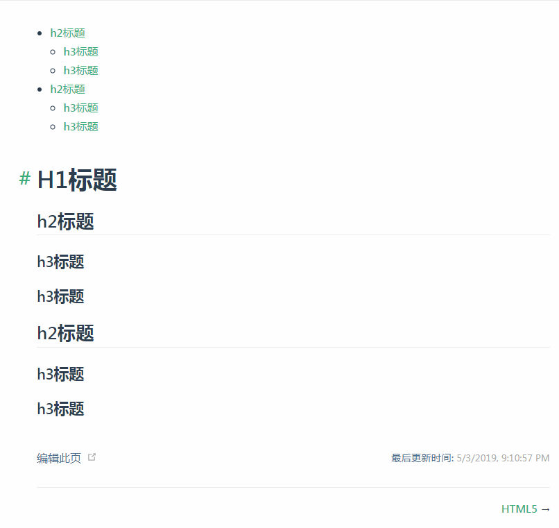
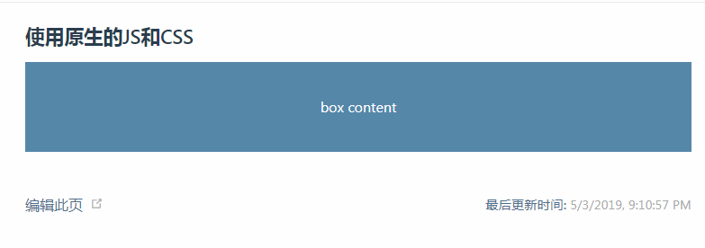
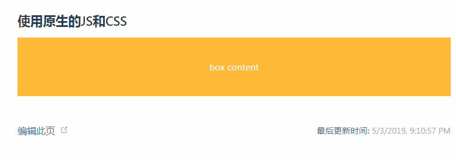

# VuePress <Badge text="0.x"/>
本`blog`配套了一个基于 VuePress 的一个简单的配置案例，此配置案例包含了本`blog`绝大部分配置案例，更多详情请移步这里[VuePress配置案例](https://github.com/wangtunan/vuepress-blog-demo)
## 介绍

### 如何而来
VuePress 是一个**静态网站生成器**，使用它我们一方面可以专注输出技术类文档，也可以使用基于Vue的开发方式来开发我们其它的静态网站。<br/>
每一个由 VuePress 生成的静态页面都是经过服务端渲染(SSR)而来，因此由 VuePress 生成的页面在加载性能和搜索引擎优化(SEO)上有很明显的优势。


### 组成部分
通常而言，一个由 VuePress 生成的网站，它是用`Vue`、`Vue-router`、`Webpack`以及利用服务端渲染(`SSR`)而来，它不仅支持 Vue 组件的写法，还内置 `Stylus` 语法。

## 安装
::: warning 注意
本博客VuePress主版本为`0.x`，相关配置最新的`1.x`也兼容，请放心使用。另请确认你的Node.js >= 8 
:::

### 全局安装(推荐)
通常而言，全局安装 VuePress 会非常省心，可以通过如下命令进行全局安装
``` sh
$ npm install -g vuepress
```

### 本地安装
区别于全局安装，本地安装会把`npm`包安装在本项目上，生成一个叫`node_modules`目录，可以通过如下命令进行本地安装（需同时安装`vuepress`和`webpack-dev-middleware`）
``` sh
$ npm install vuepress webpack-dev-middleware --save-dev
```

## 基本配置
::: tip 提醒
基本配置下的内容适用于 VuePress 的默认主题，对于自定义主题配置可能会不太一样
:::

### 脚本命令
我们需要至少两个脚本命令，分别用于本地开发和打包上线，脚本命令需要配置在根目录`package.json`文件中，它的配置如下
``` json
{
  "scripts": {
    // 本地开发
    "docs:dev": "vuepress dev docs",
    // 打包上线
    "docs:build": "vuepress build docs"
  }
}
```
本地开发请使用如下命令，它在本地启用了一个小型的服务器，你可以在浏览器中使用`localhost:8080`(默认情况下)进行访问
``` sh
$ npm run docs:dev
```
打包命令请使用如下命令，它在`.vuepress`目录下生成一个`dist`文件夹
``` sh
$ npm run docs:build
```
### 项目目录
VuePress 作为一个静态网站生成器，它对于项目的目录是有一定的限制的，一个基本的项目结构如下所示
``` js
|-- docs // 特定的目录
    |-- README.md // 首页
    |-- .vuepress // 特定的目录
        |-- config.js // 特定的配置文件
|-- package.json // 脚本命令
```

### 首页
默认主题提供了一个首页(`HomePage`)，即上面目录结构中的`README.md`文件中的内容，首页是可选的，对于 VuePress 中默认主题的首页，我们可以进行如下配置
``` yaml
---
home: true
lang: zh-CN
heroText: A  Personal Blog
heroImage: /logo.jpg
actionText: 开始 →
actionLink: /interview/
features:
- title: A Blog
  details: 专注写作前端博客，记录日常所得。
- title: For Me
  details: 故九万里，则风斯在下矣，而后乃今培风；背负青天，而莫之夭阏者，而后乃今将图南。
- title: For Interview
  details: 广州，已入坑ღ( ´･ᴗ･` )比心
footer: Copyright © 2019-present Wangtunan
---
```
以上配置即为本博客的首页效果


#### 首页配置说明
在首页的`YAML`格式配置中，我们填写了一些配置，下面我们将详细描述每一个配置的具体含义
* `home:true`：标记此页面是否为首页
* `lang:zh-CN`：表示本页面的语言为zh-CN(简体中文)
* `heroText`: 首页的标题内容
* `heroImage`: 首页的标题图片，其中全路径为`docs/.vuepress/public/logo.jpg`，默认去`public`目录下找静态资源
* `actionText`: 首页跳转按钮的内容
* `actionLink`: 首页跳转按钮挑战的路径，其中全路径为`docs/interview/readme.md`，默认`readme`命名的文件可以省略不写链接的后面内容，省略后的链接如上
* `features`: 表明首页的特征，固定的格式为`title` + `details`，以三栏流式布局的方式展示
* `footer`: 为底部内容，与普通的网页一样，我们可以在`footer`里面写版权信息
### 配置icon图标
配置`icon`需要在`config.js`进行设置，其中`icon`图标**必须**存放在`.vuepress/public`文件夹下面，它的配置如下：
``` js
module.exports = {
  head: [
    ['link', { rel: 'icon', href: '/icon.png' }]
  ]
}
```
按上面的要求放置图片后，我们的`public`文件夹的目录如下：
```js
|-- public
|   |-- logo.png
|   |-- icon.png
```

### 导航栏
::: tip 提示
配置导航栏需要在`.vuepress/config.js`文件中进行配置
:::
在默认主题下，导航栏需要在`themeConfig`属性上进行配置`nav`，导航栏的两个重要属性为`text`和`link`，其中`text`指明了导航的文字内容，`link`指明了导航的链接。

#### 基本导航栏
一个基本的导航栏链接可以配置成如下所示
``` js
module.exports = {
  // 其它配置
  themeConfig: {
    nav: [
      { text: '首页', link: '/' },
      { text: 'HTML', link: '/html/' },
      { text: 'CSS', link: '/CSS/' },
      { text: 'JavaScript', link: '/JavaScript/' }
    ]
  }
}
```
基本导航栏配置结果


#### 导航栏下拉列表
下拉列表需要配置`items`属性，它是一个数组，数组里的对象依然是一个普通导航对象，即拥有`text`和`link`属性，一个导航栏下拉列表可以配置成如下所示
```js
module.exports = {
  // 其它配置
  themeConfig: {
    nav: [
      { text: '首页', link: '/' },
      { text: '前端三剑客', items: [
        { text: 'HTML', link: '/html/' },
        { text: 'CSS', link: '/CSS/' },
        { text: 'JavaScript', link: '/JavaScript/' }
      ]},
      { text: 'Vue.jss', link: '/vue/' },
    ]
  }
}
```
导航栏下拉列表配置结果


#### 下拉列表分组
::: tip 说明
下拉列表分组适用于下拉选项较多的情况
:::
相信熟悉`Vue.js`官网的你，一定看过如下的下拉框情况


要实现以上的情况，可以如下进行配置
``` js
module.exports = {
  themeConfig: {
    nav: [
      { text: '首页', link: '/' },
      { text: '前端三剑客', items: [
        { text: 'HTML', link: '/html/' },
        { text: 'CSS', link: '/CSS/' },
        { text: 'JavaScript', link: '/JavaScript/' }
      ]},
      { text: 'Vue.jss', link: '/vue/' },
      {
        text: '生态系统',
        items: [
          {
            text: '帮助',
            items: [
              { text: '论坛', link: '/xxx' },
              { text: '聊天室', link: '/xxx' },
              { text: '聚会', link: '/xxx' },
            ]
          },
          {
            text: '工具',
            items: [
              { text: 'Devtools', link: '/xxx' },
              { text: 'Vue Cli', link: '/xxx' },
              { text: 'Vue Loader', link: '/xxx' },
            ]
          },
        ]
      }
    ]
  }
}
```
以上配置完毕后，务必重新启动一下服务器，再查看效果，会有惊喜哦。:heart::heart::heart:


#### 禁用导航栏
禁用导航栏分为两种情况，第一种禁用所有的导航栏，第二种在某个页面禁用导航栏，针对这两种不同的情况，相关的配置是不同的，具体如下所示<br/>
**第一种：** 禁用所有导航栏，通过配置`navbar`属性为`false`，此种方式禁用后，将**不会存在**任何导航栏
```js
module.exports = {
  // 其它配置
  themeConfig: {
    navbar: false
  }
}
```
**第二种：** 单个禁用导航栏，在每一个页面(`.md`文件)最顶部，配置`navbar`属性为false，此种方式禁用后，对应的导航栏依然存在，只是**不能点击跳转**。
```yaml
---
navbar: false
---
```

### 内置搜索
我们在以上配置导航栏的过程中，除了我们配置的导航，还会出现一个搜索框，这就是 VuePress 内置的搜索，内置的搜索只能搜索页面的`h2`和`h3`标题构成的索引，我们依然可以对内置的搜索进行一下配置：
* `search`: 通过配置此属性为`false`，来禁用内置搜索
* `searchMaxSuggestions`: 通过配置此属性为一个数字，对内置的搜索进行最多结果数量的限制
```js
module.exports = {
  // 其它配置
  themeConfig: {
    search: false,
    searchMaxSuggestions: 10
  }
}
```

### 侧边栏

#### 侧边栏分组
::: tip 解释
侧边栏分组即意味着把链接进行分组，每一个链接对应一个页面，配置侧边栏分组后，自动生成侧边栏`sidebar:auto`会自动失效。
:::
侧边栏分组可以如下进行配置，其中`collapsable`属性设置为`false`，意味着展开这个分组，属性设置为`true`，意味着折叠这个分组。
```js
module.exports = {
  themeConfig: {
    // 其它配置
    sidebar: [
      {
        title: '前端三剑客',
        collapsable: false,
        children: [
          '/CSS/',
          '/HTML/',
          '/JavaScript/'
        ]
      },
      {
        title: 'Vue.js',
        collapsable: false,
        children: [
          '/Vue/',
          '/Vue/Vuex.md',
          '/Vue/Vue-Router.md',
        ]
      }
    ]
  }
}
```
要实现以上分组结果，目录结构可以如下所示
```js
|-- docs
|   |-- CSS
|   |   |-- README.md
|   |-- HTML
|   |   |-- README.md
|   |-- JavaScript
|   |   |-- README.md
|   |-- Vue
|       |-- README.md
|       |-- Vue-Router.md
|       |-- Vuex.md
|   |-- README.md
```
侧边栏分组的结果


#### 自动生成侧边栏
::: tip 说明
如果我们仅仅只是希望能根据`.md`中的标题自动生成侧边栏的话，可以设置`sidebar: auto`属性即可
:::
如果我们要为所有`.md`都开启自动生成侧边栏的话，需要进行如下配置
```js
module.exports = {
  themeConfig: {
    // 所有页面全部开启自动生成侧边栏
    sidebar: 'auto',
  }
}
```
如果我们只是针对某一个`.md`文件开启自动生成侧边栏的话，需要在`.md`文件的最上方，通过设置`YAML`属性，相关配置如下
``` yaml
---
sidebar: auto
---
# Vue.js
这里是Vue.js文件的内容部分
```

#### 禁用侧边栏
正如上面所提到的单独配置文件的侧边栏，同样的道理，我们也能单独禁用侧边栏。
```yaml
---
sidebar: false
---
# Vue.js
这里是Vue.js文件的内容部分
```

### 最后更新时间
::: tip 说明
最后更新时间默认**不开启**，它是基于`git`提交的时间戳，所以我们的静态站点是需要通过`git init`的仓库进行管理的，并且它是按`git commit`的时间来计算的。 
:::
最后更新时间可以通过配置`lastUpdated`，它的默认值为`false`，接受字符串（`String`）和布尔值`boolean`
```js
module.exports = {
  themeConfig: {
    // 1.接受字符串，它设置了最后更新时间的label，例如：最后更新时间：2019年5月3日 21:51:53
    lastUpdated: '最后更新时间',
    // 2.设置true，开启最后更新时间
    lastUpdated: true,
    // 3.设置false，不开启最后更新时间(默认)
    lastUpdated: false
}
```

### 上一篇/下一篇
::: tip 提醒
如果我们没有上一篇或者下一篇，只需要把其对应的`YAML`属性设置为`false`即可
:::
上一篇下一篇可以通过配置`YAML`的`prev`和`next`来显示的配置，链接地址同导航的地址一样的书写规则，一个配置了上一篇/下一篇的`.md`文件可以如下所示
```yaml
---
prev: /HTML/
next: /JavaScript/
---
# HTML5

这里是HTML5的内容部分
```

上一篇/下一篇的配置结果如下图所示


### Git仓库和编辑链接
在输出我们的静态网站的时候，我们可能需要有一个导航链接到我们的`GitHub`仓库，对于这个需求我们可以通过如下配置来解决
::: tip Git仓库说明
`repo`代表我们的链接地址，`repoLabel`代表链接的名称，配置后它会自动出现在我们`nav`导航的最后一个位置
:::
```js
module.exports = {
  themeConfig: {
    // 其它配置
    repo: 'https://github.com/wangtunan/blog',
    repoLabel: 'Github',
    nav: [
      { text: '首页', link: '/' },
      { text: '前端三剑客', items: [
        { text: 'HTML', link: '/html/' },
        { text: 'CSS', link: '/CSS/' },
        { text: 'JavaScript', link: '/JavaScript/' }
      ]},
      { text: 'Vue.jss', link: '/vue/' },
    ]
  }
}
```
::: tip 编辑链接说明
编辑功能默认是没有开启的，我们可以通过配置`editLinks`来设置是否出现编辑链接，`editLinkText`指明编辑功能的文字内容
:::
一个启用了编辑链接的配置可以如下所示
```js
module.exports = {
  themeConfig: {
    // 其它配置
    repo: 'https://github.com/wangtunan/blog',
    repoLabel: 'Github',
    editLinks: true,
    editLinkText: '编辑此页',
    nav: [
      { text: '首页', link: '/' },
      { text: '前端三剑客', items: [
        { text: 'HTML', link: '/html/' },
        { text: 'CSS', link: '/CSS/' },
        { text: 'JavaScript', link: '/JavaScript/' }
      ]},
      { text: 'Vue.jss', link: '/vue/' },
    ]
  }
}
```
配置了编辑链接后结果可能如下图所示


你也可以通过设置`YAML`来单独禁止某个`.md`文件启用编辑链接功能
``` yaml
---
editLink: false
---
```


## Markdown扩展

### 链接
#### 锚链接
在VuePress 中所有`.md`文件中的标题(默认`h2`和`h3`)都会自动添加锚点链接(`anchor`)，所以如果我们需要跳转至固定的锚点，可以如下进行设置
```md
[锚点链接](/vuepress/#pwa配置)
```

#### 内部链接
在 VuePress 内部，以`.md`或者`.html`结尾的文件，会被转换成`<router-link>`用于`SPA`导航，它是大小写敏感的。<br/>
如果文件名为`README.md`，它会被编译成`index.html`，所以当我们访问`/vuepress/`时，其实就是在访问`/vuepress/README.md`或者`/vuepress/index.html`

### 自定义容器
VuePress 内置了三种不同状态的自定义容器，分别有`tip`、`warning`和`danger`三种类型，在紧挨着类型的旁边，可以设置自定义容器标题，不写的话默认为`TIP`，它们的书写规则如下所示
``` md
::: tip 提醒
这里是tip容器
:::

::: warning 警告
这里是警告容器
:::

::: danger 危险
这里是危险容器
:::
```
三种自定义容器的结果如下图所示
::: tip 提醒
这里是tip容器
:::

::: warning 警告
这里是警告容器
:::

::: danger 危险
这里是危险容器
:::

### 代码块类别
对于不同的代码块，需要设置不同的类型进行展示，常见的代码块类型有如下所示
* **`html`** 类型：它表示代码块是`html`格式的
* **`css`** 类型：它表示代码块是`css`格式的
* **`js`** 类型：它表示代码块是`javascript`格式的
* **`stylus`** 类型：它表示代码块是`stylus`格式的，类似的类型还有`less`和`scss`
* **`md`** 类型：它表示代码块是`markdown`格式的
* **`json`** 类型：它表示代码块是`json`格式的<br>

他们的对应的配置如下所示<br>
`HTML`格式的代码块(观测代码块右上角小角标)
```html
<div class="box">html类型的代码块</html>
```
`css`格式的代码块(观测代码块右上角小角标)
```css
.box {
  width: 100px;
  height: 100px;
}
```
`js`格式的代码块(观测代码块右上角小角标)
```js
console.log('js格式的代码块')
```
其它格式的代码块**同理**，就不再次累述


### 代码块高亮和行号

#### 代码块高亮
在`Markdown`中，我们可以如下所示来进行代码块的高亮设置(**类型后跟一个花括号**)
``` md
`` js{4}
export default {
  data () {
    return {
      msg: 'Highlighted!'
    }
  }
}
``
```
它的结果可能会是这样的(第四行高亮，**行数不是从0开始的**)
``` js{4}
export default {
  data () {
    return {
      msg: 'Highlighted!'
    }
  }
}
```
多行高亮，只需要把行号用逗号隔开即可，例如`js {1,3,5}`
``` js{1,3,5}
export default {
  data () {
    return {
      msg: 'Highlighted!'
    }
  }
}
```
#### 代码块行号
代码块行号配置同样需要在`config.js`中进行配置，如下所示
```js
module.exports = {
  // 其它配置
  markdown: {
    // 显示代码块行号
    lineNumbers: true
  }
}
```
配置后，代码块行号的结果如下图所示


### 使用Emoji表情
::: warning 注意
并不是所有`Emoji`表情都支持
:::
在`.md`文件中，我们可以使用`Emoji`表情，你也可以访问[Emoji Search](https://emoji.muan.co/)来查询你喜欢的`Emoji`表情，访问[Common Emoji](https://gitmoji.carloscuesta.me/)来访问常用的`Emoji`，一个`Emoji`可以是这样写的
```md
#### 这里是Emoji表情 :tada:
:100: :rocket:
```
#### 这里是Emoji表情 :tada:
:100: :rocket:

### Github风格的表格
有时候我们想要在`.md`文件中列一些简单的表格，可以像下面这样配置
```md
| 序号          | 订单编号      | 订单金额|
| -------------|:-------------:| ------:|
| 1             | 20180101     | $1600  |
| 2             | 20180102     |   $12  |
| 3             | 20180103     |    $1  |
```
以上表格同`Github`表格风格是一致的，它的结果如下所示
| 序号          | 订单编号      | 订单金额|
| -------------|:-------------:| ------:|
| 1             | 20180101     | $1600  |
| 2             | 20180102     |   $12  |
| 3             | 20180103     |    $1  |

### 自动生成目录
我们有时候希望根据标题自动生成目录，可以使用`[[toc]]`来输出我们的目录，它默认只列举`h2`标题和`h3`标题
```md
[[toc]]

# H1标题

## h2标题
### h3标题
### h3标题

## h2标题
### h3标题
### h3标题
```
它的结果可能如下所示



### 使用Vue模板语法

#### 使用插值
在`.md`文件中，可以使用 Vue 的插值表达式，像下面这样
```md
# 插值表达式
1 + 1 的结果是 {{1+1}}
```
1 + 1 的结果是 {{1+1}}

#### 指令
除了像上面那样使用插值表达式，我们还可以使用`v-for`等指令，下面是一个使用`v-for`指令的例子
```html
列表渲染的结果是：<span v-for="number in 5">{{number}}</span>
```
列表渲染的结果是：<span v-for="number in 5">{{number}}</span>

### 使用原生JavaScript和CSS
::: warning 注意
如果我们要在原生JS中操作DOM，那么一定要记住VuePress的页面是经过服务端渲染而来，最好是在页面加载完毕之后再操作DOM
:::
VuePress 赋予了我们在`.md`文件中直接书写原生`js`和`css`的能力，它们可以是下面这样的形式
```md
<style>
.box {
  width: 100%;
  height: 100px;
  line-height: 100px;
  text-align: center;
  color: #fff;
  background-color: #58a;
}
</style>
#### 使用原生的JS和CSS
<div id="container"></div>

<script>
window.onload = function() {
  var dom = document.getElementById('container');
  dom.innerHTML = 'box content'
  dom.className = 'box'
}
</script>
```
以上代码的结果如下图所示



### 使用CSS预处理器
VuePress 不仅像上面一样赋予我们使用原生`JS`和`CSS`的能力，还赋予我们使用`CSS`预处理器的能力，它内置了相关`CSS`预处理器的配置，我们只需要安装对应的依赖并使用即可，特别要注意的是，VuePress 内置了`Stylus`，我们无需安装，直接使用即可，现在让我们使用`Stylus`来改写上面的例子
``` html {1, 8}
<style lang="stylus">
.box
  width: 100%
  height: 100px
  line-height: 100px
  text-align: center
  color: #fff
  background-color: #fb3
</style>
#### 使用原生的JS和CSS
<div id="container"></div>

<script>
window.onload = function() {
  var dom = document.getElementById('container');
  dom.innerHTML = 'box content'
  dom.className = 'box'
}
</script>
```
使用`Stylus`预处理器后的结果如下图所示:



### 使用内置组件

#### 外部链接
::: tip 说明
`OutboundLink`用来标识一个外部链接，它紧跟在链接后面，在`.md`文件中设置外部链接时，已默认使用了此组件。
:::
下面是一个外部链接的配置，它链接到百度
```md
[百度一下](https://www.baidu.com)
```
此时，百度一下文字后面的小图标就是内置组件`OutboundLink`
[百度一下](https://www.baidu.com)

#### Badge(角标)
::: tip 说明
内置组件`Badge`有三个属性需要传递：
* `text`：它指明了角标的内容
* `type`：同自定义容器类似，它有三种不同的类型，分别是`tip`、`warn`和`error`，默认是`tip`
* `vertical`：它指明了角标同内容的对齐方式，有两个值，分别是`top`和`middle`，默认是`top`
:::
角标的使用如下所示
```md
#### Vue <Badge text="2.5.0+"/> 
#### Vuex <Badge text="beta" type="warn" vertical="top"/> 
#### Vue-Resource<Badge text="废弃" vertical="middle" type="error"/>
```
#### Vue <Badge text="2.5.0+"/> 
#### Vuex <Badge text="beta" type="warn" vertical="top"/> 
#### Vue-Resource<Badge text="废弃" vertical="middle" type="error"/>

### 使用Vue组件
VuePress 除了让我们使用内置组件以外，还可以让我们使用自己的组件，它默认把在`.vuepress/components`目录下所有的组件全局注册，注册后我们可以直接在`.md`文件中使用。
我们先在`.vuepress/components`目录下(无则新建)一个`customer-component`的`.vue`文件，它的内容如下所示
```js
<template>
  <div class="customer-component">
    todoList:
    <div v-for="item in list" :key="item.id">
      项目：{{item.text}}，状态：{{item.done ? '完成': '进行中'}}
    </div>
  </div>
</template>
<script>
export default {
  name: 'CustomerComponent',
  data () {
    return {
      list: []
    }
  },
  created () {
    this.list = [
      { id: 1, text: 'JavaScript', done: false },
      { id: 2, text: 'HTML', done: false },
      { id: 3, text: 'CSS', done: true },
      { id: 4, text: 'Vue.js', done: true },
      { id: 5, text: 'VuePress', done: true }
    ]
  }
}
</script>
```
在`.md`文件中引入
```md
### 使用自定义组件
<customer-component/>
```
VuePress 运行结果


## 进阶配置

### 基本配置API

#### title(标题)
::: tip 说明
`title`标题能让我们配置静态站点的标题，它固定在我们顶部左上角
:::
可以像下面这样来配置`title`
```js
module.exports = {
  // 其它配置
  title: 'VuePress Blog'
}
```
配置后的结果如下图所示


#### description(网站的描述)
::: tip 说明
`description`它将会以 `<meta>` 标签渲染到当前页面的 HTML 中，它是给搜索引擎去识别的，这属于`SEO`配置
:::
可以像下面这样配置`description`
```js
module.exports = {
  // 其它配置
  title: 'VuePress Blog',
  description: 'VuePress Blog 的网站描述'
}
```
配置后的结果如下图所示


#### base
::: tip 说明
`base`默认值为`/`,它属于部署环节，配置它我们可以在`GitHub Pages`哪个目录下访问我们的项目
:::
简单来说，如果我们要配置在`https://xxx.github.io/blog/`这个地址，那么我们的`base`需要进行如下配置
```js
module.exports = {
  // 其它配置
  base: '/blog/',
  title: 'VuePress Blog',
  description: 'VuePress Blog 的网站描述'
}
```

#### host(主机名)和post(端口)
::: tip 说明
`host`默认值为`0.0.0.0`，此参数可以指明我们主机名(IP地址)<br>
`port`默认值为`8080`，此参数可以指明我们的端口号
:::
配置了`host`和`port`后，我们可以在浏览器上通过`IP`地址+`port`端口进行访问，例如
```js
module.exports = {
  // 其它配置
  port: 3000,
  host: '127.0.0.1',
  base: '/blog/',
  title: 'VuePress Blog',
  description: 'VuePress Blog 的网站描述'
}
```
以上配置成功后我们可以`127.0.0.1:3000`来访问我们的项目


#### dest(输出目录)
::: tip 说明
`dest`默认值为`.vuepress/dist`，配置它可以显示的帮助我们设置打包文件的输出目录
:::
如果我们想把`dist`目录输出在根路径下，而不是`.vuepress`文件夹下，可以进行如下配置
```js
module.exports = {
  // 其它配置
  dest: 'dist',
  port: 3000,
  host: '127.0.0.1',
  base: '/blog/',
  title: 'VuePress Blog',
  description: 'VuePress Blog 的网站描述'
}
```


### 简单的样式覆盖
如果你只是希望能够在默认样式中进行一些简单的样式覆盖，你需要在`.vuepress`目录下创建两个样式文件`override.styl`和`style.styl`，它们都是`stylus`文件(**也可以是其它类型的样式文件**)，这两个文件的具体作用如下
1. **`override.styl`** 重置默认主题的样式变量
2. **`style.styl`** 运用到默认主题下的自定义样式

#### override.styl
对于 VuePress 的默认主题，它提供了一些主题常量来让我们可以自由配置，可以配置的常量和其对应的解释如下
``` stylus
// 默认主题下的hover颜色(主题绿)
$accentColor = #3eaf7c 
// 默认主题下的文本颜色
$textColor = #2c3e50
// 默认主题下的border颜色
$borderColor = #eaecef
// 默认主题下的代码块背景色(背景黑)
$codeBgColor = #282c34
```
为了演示效果，我们给这些常亮设置一个醒目的颜色
``` stylus
$accentColor = #fb3 
$textColor = green
$borderColor = red
$codeBgColor = #58a
```
以上设置的效果如下


#### style.styl
什么是自定义的样式？举个栗子，如果我们觉得默认主题下单行代码块的文字颜色和背景色不够醒目，在利用浏览器审查元素后，我们可以这样设置我们的自定义样式
``` stylus
.content
  code
    background-color: #fff5f5;
    color: #ff502c;
```
运用以上自定义样式后，默认主题下的单行代码块的效果如下


### 引入代码片段
如果我们在写`.md`文档中，需要导入我们已经存在的`js`代码，而我们又不想再去使用代码块复制粘贴一遍，这个时候 VuePress 允许我们引入已经存在的`js`代码片段，它的语法如下
``` md
<<< @filepath
// 导入的同时也支持高亮
<<< @filepath{highlightLines}
```
具体示例如下
``` md
<<< @/docs/.vuepress/js/hello.js {2}
```
导入代码片段的结果

<<< @/docs/.vuepress/js/hello.js {2}

### Algolia搜索
在基础配置章节我们讲到了内置搜索，内置搜索只会为页面的`h2`和`h3`标题建立索引，而如果我们想进行全文搜索，就需要使用到本小结的`Algolia`搜索了，它的配置可以是下面这样的
```js
module.exports = {
  // 其它配置
  themeConfig: {
    algolia: {
      apiKey: '<API_KEY>',
      indexName: '<INDEX_NAME>'
    }
  }
}
```
::: warning 注意
不同于内置搜索的开箱即用，使用`Algolia`搜索，需要我们将网站提交给它们以建立索引
:::
此小结的配置由于特殊性，并没有配置成功，如果你感兴趣，请移步这里:point_right:[Algolia搜索](https://community.algolia.com/docsearch/)<br/>
如果你配置成功了，它们的搜索效果会是下面这样子的(**Vue官网**)


### 管理静态资源
在`.md`文件中，如果我们要使用静态资源，我们有如下几种方式来引用资源
* 相对路径/绝对路径
* `Webpack` 别名<br>

下面我们来一一进行介绍
#### 相对路径
要在`.md`文件中引用一个图片资源，它的固定格式如下
``` md
// 格式


// 示例：绝对路径

// 示例：相对路径

```
如果你的目录结构相对简单，那么使用相对路径或者利用图床技术，先把图片上传到图床服务器，再填写绝对路径，这往往是**非常简便和易懂**的一种做法。

#### Webpack别名
就像`Vue-cli`脚手架那样，在路径比较长或者目录结构比较复杂的时候，使用`Webpack`别名进行访问，它通常是非常友好的，它的配置可以是这样的
```js
// .vuepress/config.js下配置
module.exports = {
  // 其它配置
  configureWebpack: {
    resolve: {
      alias: {
        '@vuepress': '../images/vuepress',
        '@vue': '../images/vue',
        '@interview': '../images/interview'
      }
    }
  }
}
```
通过上面的配置以后，我们就可以在`.md`文件中这样使用
```md
// 不使用别名


// 使用别名

```

### 自定义页面样式类
有时候我们希望在特定的页面使用特定的样式，VuePress允许我们这样做，你只需要在`.vuepress/style.styl`中编写自定义样式并在对应的页面使用即可，它们可能是这样配置的
```stylus
// .vuepress/style.styl
.customer-page-class
  color: #fb3;
  background-color: #333;
```
在对应的`.md`文件的最顶部，使用`YAML`语法进行引用自定义样式
```yaml
---
pageClass: customer-page-class
---
```
使用自定义样式它的结果


### 自定义页面布局
在默认主题下，每一个`.md`文件都会被渲染在`<div class="page"></div>`这样的一个标签中，同时生成页面的侧边栏、编辑链接(如果有)、最新更新时间(如果有)以及上一篇/下一篇(如果有)。<br/>
但是如果我们不想生成这样的页面，而是想使用自定义布局，也就是使用`Vue`组件来进行自定义页面开发，VuePress提供给了我们这样的能力，它在**保留导航栏**的基础上，其它一切我们都可以自定义的，它的配置可能是这样的
```yaml
// 在需要自定义的.md文件中使用YAML语法
---
layout: customerComponent
---
```
上面这样的一个组件名，它对应的路径为`.vuepress/components/customerComponent.vue`，由于 VuePress会自动帮我们把`.vuepress/components`目录下的所有组件全部注册，这样我们可以在任何一个`.md`文件中进行使用，`customerComponent.vue`中的代码可以是下面这样的
```vue
<template>
  <div class="customer-component">
    <div class="left">123</div>
    <div class="center">123</div>
    <div class="right">123</div>
  </div>
</template>
<style lang="stylus">
  .customer-component
    height: calc(100vh - 60px);
    display: flex;
    background-color: #333;
    color: #fff;
    & > div
      flex: 0 0 200px;
      width: 200px;
      text-align: center
    .left
      background-color: #58a;
    .center
      flex: 1;
      background-color: #fb3;
    .right
      background-color: #58a;
</style>
```
使用自定义布局的结果如下


### 使用第三方主题
VuePress支持使用第三方主题，需要在`.vuepress/config.js`中如下进行配置即可
::: tip 提醒
VuePress的插件，命名是固定的，一般为`vuepress-theme-xxx`，`npm install`安装第三方主题后，在配置时只需要写最后一个名字即可。例如：`vuepress-theme-reco`主题，只需如下进行配置即可。
:::
```js
module.exports = {
  // 其它配置
  theme: 'reco'
}
```

### 使用第三方库
在写文档的时候，我们如果希望使用`npm`包或者其它第三方库，我们该如何进行使用，VuePress提供给我们`enhanceApp.js`来让我们可以进行应用级别的配置，它的路径为`.vuepress/enhanceApp.js`，相关配置如下
```js
// 使用自定义样式
import './style/index.styl'
// 使用第三方包
import _ from 'lodash'
// 其它
// import xxx from xxx

export default ({
  Vue,
  options,
  router,
  siteData 
}) => {
  // ...做一些其他的应用级别的优化
}
```

#### 引入Element-ui案例
先使用如下命令安装`element-ui`
```sh
$ npm install element-ui --save
```
安装完毕后，在`enhanceApp.js`中引入`element-ui`
```js
import ElementUI from 'element-ui'
import 'element-ui/lib/theme-chalk/index.css'

export default ({
  Vue,
  options,
  router,
  siteData 
}) => {
  // 使用element-ui
  Vue.use(ElementUI)
}
```
以上配置完毕后，就可以在 VuePress 中使用`element-ui`了，快去试一试吧。

## 部署

### 部署到Github Pages
部署到`Github Pages`，我们需要以下几个步骤
* 打包生成`dist`文件夹
* 新建一个仓库，再在此仓库下新建一个`gh-pages`分支
* 提交代码到远程仓库(包含`master`分支和`gh-pages`分支)


#### 打包
在部署前，我们需要使用我们配置的打包命令
```json {4}
{
  "scripts": {
    "docs:dev": "vuepress dev docs",
    "docs:build": "vuepress build docs"
  }
}
```
运行打包命令`npm run docs:build`，它会在`.vuepress`目录下生成一个`dist`文件夹，随后我们只需要把这个文件夹上传到`Github`即可，它的打包结果可以参考如下
``` js
> vuepress build docs
 WAIT  Extracting site metadata...
[23:53:00] Compiling Client
[23:53:00] Compiling Server
Language does not exist sh
Language does not exist sh
[23:53:07] Compiled Server in 7s
[23:53:12] Compiled Client in 12s
WAIT  Rendering static HTML...
DONE  Success! Generated static files in docs\.vuepress\dist.
```

#### 新建仓库并创建Github Pages分支
新建一个`github`仓库和新建分支的具体步骤就不在此累述，如果你新建成功了的话，你的仓库看起来应该是这样子的


#### 提交到Github
上面我们新建了一个远程仓库，我们可以在`dist`目录下进行如下的命令
```sh
// 新建仓库
$ git init

// 关联你的远程仓库
$ git remote add origin xxxx

// 切换到gh-pages分支
$ git checkout gh-pages

// 提交代码到gh-pages分支
$ git push origin gh-pages

// 合并到master分支
$ git checkout master
$ git merge gh-pages
```
在提交成功后，可以通过`https://xxx.github.io`或者`https://xxx.github.io/xxx/`进行访问

::: warning 提醒
关于自动化部署，如果你是新手，那么按照正常的流程提交代码到远程仓库即可，不建议新手使用自动化部署。
:::