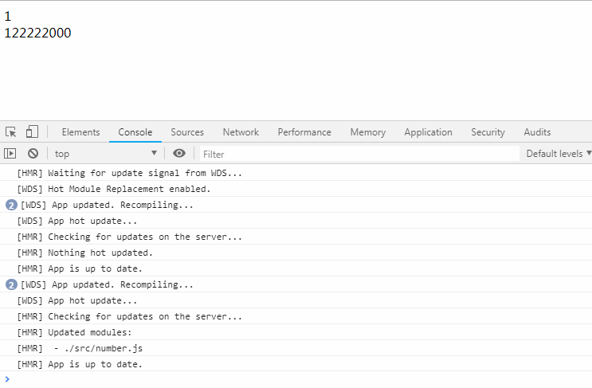

# Webpack <Badge text="4.0+" type="tip"/>
::: tip 说明
本篇博客由慕课网视频[从基础到实战手把手带你掌握新版Webpack4.0](https://coding.imooc.com/class/316.html)(**Dell-Lee**)阅读整理而来，观看视频请支持正版。
:::
::: warning 注意
本篇博客 Webpack 版本是`4.0+`，请确保你安装了`Node.js`最新版本。
:::

Webpack 的核心概念是一个 **模块打包工具** ，它的主要目标是将`js`文件打包在一起，打包后的文件用于在浏览器中使用，但它也能胜任 **转换(`transform`)** 、**打包(`bundle`)** 或 **包裹(`package`)** 任何其他资源。

## 追本溯源
在学习 Webpack 之前，我们有必要来了解一些前端领域的开发历程，只有明白了这些开发历程，才能更加清楚 Webpack 是怎么应运而生的，又能给我们解决什么样的问题。


### 面向过程开发
**特征：** 一锅乱炖<br/>
在早期 `js` 能力还非常有限的时候，我们通过面向过程的方式把代码写在同一个`.js`文件中，一个面向过程的开发模式可能如下所示。<br/>
```html
<!-- index.html代码 -->
<p>这里是我们网页的内容</p>
<div id="root"></div>
<script src="./index.js"></script>
```
```js
// index.js代码
var root = document.getElementById('root');

// header模块
var header = document.createElement('div');
header.innerText = 'header';
root.appendChild(header);

// sidebar模块
var sidebar = document.createElement('div');
sidebar.innerText = 'sidebar';
root.appendChild(sidebar);

// content模块
var content = document.createElement('div');
content.innerText = 'content';
root.appendChild(content);
```

### 面向对象开发
**特征：** 面向对象开发模式便于代码维护，深入人心。<br/>
随着 `js` 的不断发展，它所能解决的问题也越来越多，如果再像**面向过程**那样把所有代码写在同一个`.js`文件中，那么代码将变得非常难以理解和维护，此时**面向对象**开发模式便出现了，一个面向对象开发模式可能如下所示。<br/>


在`index.html`中引入不同的模块：
```html
<!-- index.html代码 -->
<p>这里是我们网页的内容</p>
<div id="root"></div>
<script src="./src/header.js"></script>
<script src="./src/sidebar.js"></script>
<script src="./src/content.js"></script>
<script src="./index.js"></script>
```

`header.js`代码：
```js
// header.js代码
function Header() {
  var header = document.createElement('div');
  header.innerText = 'header';
  root.appendChild(header);
}
```

`sidebar.js`代码：
```js
// sidebar.js代码
function Sidebar() {
  var sidebar = document.createElement('div');
  sidebar.innerText = 'sidebar';
  root.appendChild(sidebar);
}
```

`content.js`代码：
```js
// content.js代码
function Content() {
  var content = document.createElement('div');
  content.innerText = 'content';
  root.appendChild(content);
}

```
`index.js`代码：
```js
var root = document.getElementById('root');
new Header();
new Sidebar();
new Content();
```

**不足：** 以上的代码示例中，虽然使用**面向对象**开发模式解决了**面向过程**开发模式中的一些问题，但似乎又引入了一些新的问题。<br/>
1. 每一个模块都需要引入一个`.js`文件，随着模块的增多，这会影响页面性能
2. 在`index.js`文件中，并不能直接看出模块的逻辑关系，必须去页面才能找到
3. 在`index.html`页面中，文件的引入顺序必须严格按顺序来引入，例如：`index.js`必须放在最后引入，如果把`header.js`文件放在`index.js`文件后引入，那么代码会报错


### 现代开发模式
**特征：** 模块化加载方案让前端开发进一步工程化 <br>
根据**面向对象**开发模式中的一系列问题，随后各种**模块化**加载的方案如雨后春笋，例如：`ES Module`、`AMD`、`CMD`以及`CommonJS`等，一个`ES Module`模块化加载方案可能如下所示。<br/>

`index.html`代码：
```html
<!-- index.html代码 -->
<p>这里是我们网页的内容</p>
<div id="root"></div>
<script src="./index.js"></script>
```
`header.js`代码：
```js
// header.js
export default function Header() {
  var root = document.getElementById('root');
  var header = document.createElement('div');
  header.innerText = 'header';
  root.appendChild(header);
}
```
`sidebar.js`代码：
```js
// sidebar.js
export default function Sidebar() {
  var root = document.getElementById('root');
  var sidebar = document.createElement('div');
  sidebar.innerText = 'sidebar';
  root.appendChild(sidebar);
}
```
`content.js`代码：
```js
// content.js代码
export default function Content() {
  var root = document.getElementById('root');
  var content = document.createElement('div');
  content.innerText = 'content';
  root.appendChild(content);
}
```
`index.js`代码：
```js
// index.js代码
import Header from './src/header.js';
import Sidebar from './src/sidebar.js';
import Content from './src/content.js';

new Header();
new Sidebar();
new Content();
```
**注意：** 以上代码并不能直接在浏览器上执行，因为浏览器并不能直接识别`ES Module`代码，需要借助其他工具来进行翻译，此时 Webpack 就粉墨登场了。

### Webpack初体验

不建议跟随此小结一起安装，此次示例仅仅作为一个例子，详细学习步骤请直接阅读下一章节[安装](/webpack/#安装)


#### 生成package.json文件
::: tip 参数说明
`-y`参数表示直接生成默认配置项的`package.json`文件，不加此参数需要一步步按需进行配置。
:::
```sh
$ npm init -y
```
生成的`package.json`文件：
```json
{
  "name": "webpack-vuepress",
  "version": "1.0.0",
  "description": "",
  "main": "index.js",
  "scripts": {
    "test": "echo \"Error: no test specified\" && exit 1"
  },
  "keywords": [],
  "author": "",
  "license": "ISC"
}

```

#### 安装Webpack
::: tip 参数说明
`-D`参数代表在本项目下安装 Webpack ，它是`--save-dev`的简写
:::
```sh
$ npm install webpack webpack-cli -D
```

#### 修改代码
::: tip 配置说明
`webpack`默认打包路径到`dist`文件夹，打包后的`.js`文件名字叫`main.js`
:::
其他代码不动，将`index.html`中的`.js`文件改成如下引用方式(引用打包后的文件)：
```html
<!-- index.html代码 -->
<p>这里是我们网页的内容</p>
<div id="root"></div>
<script src="./dist/main.js"></script>
```
#### Webpack打包
::: tip 参数说明
1. `npx webpack`代表在本项目下寻找 Webpack 打包命令，它区别于`npm`命令
2. `index.js`参数代表本次打包的入口是`index.js`
:::
``` sh
$ npx webpack index.js
```
打包结果：


正如上面你所看到的那样，网页正确显示了我们期待的结果，这也是 Webpack 能为我们解决问题的一小部分能力，下面将正式开始介绍 Webpack 。

## 安装

### 全局安装
::: warning 注意
如果你只是想做一个 Webpack 的 Demo 案例，那么全局安装方法可能会比较适合你。如果你是在实际生产开发中使用，那么推荐你使用本地安装方法。
:::
#### 全局安装命令
:::tip 参数说明
`webpack4.0+`的版本，必须安装`webpack-cli`，`-g`命令代表全局安装的意思
:::
``` sh
$ npm install webpack webpack-cli -g
```

### 卸载
::: tip 参数说明
通过`npm install`安装的模块，对应的可通过`npm uninstall`进行卸载
:::
```sh
$ npm uninstall webpack webpack-cli -g
```

### 本地安装(推荐)
::: tip 参数说明
本地安装的`Webpack`意思是，只在你当前项目下有效。而通过全局安装的`Webpack`，如果两个项目的`Webpack`主版本不一致，则可能会造成其中一个项目无法正常打包。本地安装方式也是实际开发中推荐的一种`Webpack`安装方式。
:::
```sh
$ npm install webpack webpack-cli -D 或者 npm install webpack webpack-cli --save-dev
```

### 版本号安装
::: tip 参数说明
如果你对`Webpack`的具体版本有严格要求，那么可以先去github的`Webpack`仓库查看历史版本记录或者使用`npm view webpack versions`查看`Webpack`的`npm`历史版本记录
:::
```sh
// 查看webpack的历史版本记录
$ npm view webpack versions

// 按版本号安装
$ npm install webpack@4.25.0 -D
```

## 起步

### 创建项目结构
现在我们来创建基本的项目结构，它可能是下面这样
``` sh
|-- webpack-vuepress
|   |-- index.html
|   |-- index.js
|   |-- package.json
```
其中`package.json`是利用下面的命令自动生成的配置文件
``` sh
$ npm init -y
```


### 添加基础代码
在创建了基本的项目结构以后，我们需要为我们创建的文件添加一些代码<br>

`index.html`页面中的代码：
```html
<p>这是最原始的网页内容</p>
<div id="root"></div>
<!-- 引用打包后的js文件 -->
<script src="./dist/main.js"></script>
```
`index.js`文件中的代码：
```js
console.log('hello,world');
```

### 安装Webpack
运行如下命令安装`webpack4.0+`和`webpack-cli`：
```sh
$ npm install webpack webpack-cli -D
```

### 添加配置文件
使用如下命令添加 Webpack 配置文件：
```sh
$ touch webpack.config.js
```
使用此命令，变更后的项目结构大概如下所示：
```sh
|-- webpack-vuepress
|   |-- index.html
|   |-- index.js
|   |-- webpack.config.js
|   |-- package.json
```

至此我们的基础目录已创建完毕，接下来需要改写`webpack.config.js`文件，它的代码如下：
::: tip 解释
1. `entry`配置项说明了`webpack`打包的入口文件。
2. `output`配置项说明了`webpack`输出配置：`filename`配置了打包后的文件叫`main.js`
3. `path`配置了打包后的输出目录为`dist`文件夹下
:::
```js
// path为Node的核心模块
const path = require('path');

module.exports = {
  entry: './index.js',
  output: {
    filename: 'main.js',
    path: path.resolve(__dirname, 'dist')
  }
}
```

### 改写package.json文件
::: tip 改写说明
1. 添加`private`属性并设置为`true`：此属性能让我们的项目为私有的，防止意外发布代码
2. 移除`main`属性：我们的项目并不需要对外暴露一个入口文件
3. 添加`scripts`命令：即我们的打包命令
:::
改写后的`package.json`文件如下所示：
```json {5,7}
{
  "name": "webpack-vuepress",
  "version": "1.0.0",
  "description": "",
  "private": true,
  "scripts": {
    "bundle": "webpack"
  },
  "keywords": [],
  "author": "",
  "license": "ISC",
  "devDependencies": {
    "webpack": "^4.31.0",
    "webpack-cli": "^3.3.2"
  }
}
```

### 第一次打包
::: tip 命令说明
`npm run`代表运行一个脚本命令，而`bundle`就是我们配置的打包命令，即`npm run bundle`就是我们配置的`webpack`打包命令。
:::
运行如下命令进行项目打包：
```sh
$ npm run bundle
```
打包后的效果如下所示：


打包后的项目目录如下所示，可以看到我们多出了一个叫`dist`的目录，它里面有一个`main.js`文件
``` sh
|-- webpack-vuepress
|   |-- dist
|   |   |-- main.js
|   |-- index.html
|   |-- index.js
|   |-- webpack.config.js
|   |-- package.json
```
打包成功后，我们需要在浏览器中运行`index.html`，它的运行结果如下图所示


### 理解webpack打包输出
在上一节中，我们第一次运行了一个打包命令，它在控制台上有一些输出内容，这一节我们详细来介绍这些输出是什么意思：


1. **Hash：** `hash`代表本次打包的唯一`hash`值，每一次打包此值都是不一样的

2. **Version：** 详细展示了我们使用`webpack`的版本号

3. **Time：** 代表我们本次打包的耗时

4. **Asset：** 代表我们打包出的文件名称

5. **Size：** 代表我们打包出的文件的大小

6. **Chunks：** 代表打包后的`.js`文件对应的`id`，`id`从`0`开始，依次往后`+1`

7. **Chunks Names：** 代表我们打包后的`.js`文件的名字，至于为何是`main`，而不是其他的内容，这是因为在我们的`webpack.config.js`中，`entry:'./index.js'`是对如下方式的简写形式：
```js
// path为Node的核心模块
const path = require('path');

module.exports = {
  // entry: './index.js',
  entry: {
    main: './index.js'
  }
  // 其它配置
}
```
8. **Entrypoint main = bundle.js：** 代表我们打包的入口为`main`

9. **warning in configuration：** 提示警告，意思是我们没有给`webpack.config.js`设置`mode`属性，`mode`属性有三个值：`development`代表开发环境、`production`代表生产环境、`none`代表既不是开发环境也不是生产环境。如果不写的话，默认是生产环境，可在配置文件中配置此项，配置后再次打包将不会再出现此警告。
```js
// path为Node的核心模块
const path = require('path');

module.exports = {
  // 其它配置
  mode: 'development'
}
```


## 打包静态资源

### 什么是loader？
::: tip 概念
`loader`是一种打包规则，它告诉了 Webpack 在遇到非`.js`文件时，应该如何处理这些文件
:::
`loader`有如下几种固定的运用规则：
* 使用`test`正则来匹配相应的文件
* 使用`use`来添加文件对应的`loader`
* 对于多个`loader`而言，从 **右到左** 依次调用


### 使用loader打包图片
::: tip 安装依赖
打包图片需要用到`file-loader`或者`url-loader`，需使用`npm install`进行安装
:::

#### 一点小改动
在打包图片之前，让我们把`index.html`移动到上一节打包后的`dist`目录下，`index.html`中相应的`.js`引入也需要修改一下，像下面这样
```html
<script src="./main.js"></script>
```

#### 添加打包图片规则
对于打包图片，我们需要在`webpack.config.js`中进行相应的配置，它可以像下面这样
```js
// path为Node的核心模块
const path = require('path');

module.exports = {
  // 其它配置
  module: {
    rules: [
      {
        test: /\.(png|jpg|gif)$/,
        use: {
          loader: 'file-loader'
        }
      }
    ]
  }
}
```
#### 改写`index.js`
```js
import avatar from './avatar.jpg'

var root = document.getElementById('root');
var img = document.createElement('img');
img.src = avatar
root.appendChild(img)
```
#### 打包后的项目目录
```js
|-- dist
|   |-- bd7a45571e4b5ccb8e7c33b7ce27070a.jpg
|   |-- main.js
|   |-- index.html
|-- index.js
|-- avatar.jpg
|-- package.json
|-- webpack.config.js
```
#### 打包结果


#### 运用占位符
在以上打包图片的过程中，我们发现打包生成的图片好像名字是一串乱码，如果我们要原样输出原图片的名字的话，又该如何进行配置呢？这个问题，可以使用 **占位符** 进行解决。
::: tip 占位符说明
文件占位符它有一些固定的规则，像下面这样：
* `[name]`代表原本文件的名字
* `[ext]`代表原本文件的后缀
* `[hash]`代表一个`md5`的唯一编码
:::
根据占位符的规则再次改写`webpack.config.js`文件，
```js
// path为Node的核心模块
const path = require('path');

module.exports = {
  // 其它配置
  module: {
    rules: [
      {
        test: /\.(png|jpg|gif)$/,
        use: {
          loader: 'file-loader',
          options: {
            name: '[name]_[hash].[ext]'
          }
        }
      }
    ]
  }
}
```
根据上面占位符的运用，打包生成的图片，它的名字如下
```sh
|-- dist
|   |-- avatar_bd7a45571e4b5ccb8e7c33b7ce27070a.jpg
```


### 使用loader打包CSS
::: tip 打包说明
样式文件分为几种情况，每一种都需要不同的`loader`来处理：
1. 普通`.css`文件，使用`style-loader`和`css-loader`来处理
2. `.less`文件，使用`less-loader`来处理
3. `.sass或者.scss`文件，需要使用`sass-loader`来处理
4. `.styl`文件，需要使用`stylus-loader`来处理
:::


#### 打包css文件
::: tip 安装依赖
首先安装`style-loader`和`css-loader`
:::
改写webpack配置文件：
```js
// path为Node的核心模块
const path = require('path');

module.exports = {
  // 其它配置
  module: {
    rules: [
      {
        test: /\.(png|jpg|gif)$/,
        use: {
          loader: 'file-loader',
          options: {
            name: '[name]_[hash].[ext]'
          }
        }
      },
      {
        test: /\.css$/,
        use: ['style-loader', 'css-loader']
      }
    ]
  }
}
```
根目录下创建`index.css`
```css
.avatar{
  width: 150px;
  height: 150px;
}
```
改写`index.js`文件
```js
import avatar from './avatar.jpg';
import './index.css';

var root = document.getElementById('root');
var img = new Image();
img.src = avatar;
img.classList.add('avatar');
root.appendChild(img);
```

**打包结果**


#### 打包Sass文件
::: tip 安装依赖
需要安装`sass-loader`和`node-sass`
:::

改写`webpack.config.js`文件
```js
// path为Node的核心模块
const path = require('path');

module.exports = {
  // 其它配置
  module: {
    rules: [
      {
        test: /\.(png|jpg|gif)$/,
        use: {
          loader: 'file-loader',
          options: {
            name: '[name]_[hash].[ext]'
          }
        }
      },
      {
        test: /\.css$/,
        use: ['style-loader', 'css-loader']
      },
      {
        test: /\.(sass|scss)$/,
        use: ['style-loader','css-loader','sass-loader']
      }
    ]
  }
}
```
根目录下添加`index-sass.sass`文件
```scss
body{
  .avatar-sass{
    width: 150px;
    height: 150px;
  }
}
```

改写`index.js`
```js
import avatar from './avatar.jpg';
import './index.css';
import './index-sass.sass';

var img = new Image();
img.src = avatar;
img.classList.add('avatar-sass');

var root = document.getElementById('root');
root.appendChild(img);
```

根据上面的配置和代码改写后，再次打包，打包的结果会是下面这个样子


#### 自动添加CSS厂商前缀
当我们在`css`文件中写一些需要处理兼容性的样式的时候，需要我们分别对于不同的浏览器书添加不同的厂商前缀，使用`postcss-loader`可以帮我们在`webpack`打包的时候自动添加这些厂商前缀。
::: tip 安装依赖
自动添加厂商前缀需要`npm install`安装`postcss-loader`和`autoprefixer`
:::
```sh
npm install postcss-loader autoprefixer -D
```
修改`index-sass.sass`
```css
.avatar-sass {
  width: 150px;
  height: 150px;
  transform: translate(50px,50px);
}
```

在修改`sass`文件代码后，我们需要对`webpack.config.js`
```json {23}
// path为Node的核心模块
const path = require('path');

module.exports = {
  // 其它配置
  module: {
    rules: [
      {
        test: /\.(png|jpg|gif)$/,
        use: {
          loader: 'file-loader',
          options: {
            name: '[name]_[hash].[ext]'
          }
        }
      },
      {
        test: /\.css$/,
        use: ['style-loader', 'css-loader']
      },
      {
        test: /\.(sass|scss)$/,
        use: ['style-loader','css-loader','sass-loader','postcss-loader']
      }
    ]
  }
}
```
根目录下添加`postcss.config.js`，并添加代码
```js
module.exports = {
  plugins: [require('autoprefixer')]
}
```

根据上面的配置，我们再次打包运行，在浏览器中运行`index.html`，它的结果如下图所示


#### 模块化打包CSS文件
::: tip 概念
`CSS`的模块化打包的理解是：除非我主动引用你的样式，否则你打包的样式不能影响到我。
:::
根目录下添加`createAvatar.js`文件，并填写下面这段代码
```js
import avatar from './avatar.jpg';
export default function CreateAvatar() {
  var img = new Image();
  img.src = avatar;
  img.classList.add('avatar-sass');

  var root = document.getElementById('root');
  root.appendChild(img);
}
```

改写`index.js`，引入`createAvatar.js`并调用
```js {2,6}
import avatar from './avatar.jpg';
import createAvatar from './createAvatar';
import './index.css';
import './index-sass.sass';

createAvatar();

var img = new Image();
img.src = avatar;
img.classList.add('avatar-sass');

var root = document.getElementById('root');
root.appendChild(img);
```

**打包运行**


我们可以看到，在`createAvatar.js`中，我们写的`img`标签的样式，它受`index-sass.sass`样式文件的影响，如果要消除这种影响，需要我们开启对`css`样式文件的模块化打包。

进一步改写`webpack.config.js`
```js {22}
// path为Node的核心模块
const path = require('path');

module.exports = {
  // 其它配置
  module: {
    rules: [
      {
        test: /\.(png|jpg|gif)$/,
        use: {
          loader: 'file-loader',
          options: {
            name: '[name]_[hash].[ext]'
          }
        }
      },
      {
        test: /\.(sass|scss)$/,
        use: ['style-loader', {
          loader: 'css-loader',
          options: {
            modules: true
          }
        }, 'sass-loader', 'postcss-loader']
      }
    ]
  }
}
```
开启`css`模块化打包后，我们需要在`index.js`中做一点小小的改动，像下面这样子
```js {4,10}
import avatar from './avatar.jpg';
import createAvatar from './createAvatar';
import './index.css';
import style from  './index-sass.sass';

createAvatar();

var img = new Image();
img.src = avatar;
img.classList.add(style['avatar-sass']);

var root = document.getElementById('root');
root.appendChild(img);
```

打包运行后，我们发现使用`createAvatar.js`创建出来的`img`没有受到样式文件的影响，证明我们的`css`模块化配置已经生效，下图是`css`模块化打包的结果：


## Webpack核心

### 使用WebpackPlugin
::: tip 理解
`plugin`的理解是：当 Webpack 运行到某一个阶段时，可以使用`plugin`来帮我们做一些事情。
:::
在使用`plugin`之前，我们先来改造一下我们的代码，首先删掉无用的文件，随后在根目录下新建一个`src`文件夹，并把`index.js`移动到`src`文件夹下，移动后你的目录看起来应该是下面这样子的
```js
|-- dist
|   |-- index.html
|-- src
|   |-- index.js
|-- postcss.config.js
|-- webpack.config.js
|-- package.json
```
接下来再来处理一下`index.js`文件的代码，写成下面这样
```js
// src/index.js
var root = document.getElementById('root');
var dom = document.createElement('div');
dom.innerHTML = 'hello,world';
root.appendChild(dom);
```
最后我们来处理一下我们的`webpack.config.js`文件，它的改动有下面这些
* 因为`index.js`文件的位置变动了，我们需要改动一下`entry`
* 删除掉我们配置的所有`loader`规则
按照上面的改动后，`webpack.config.js`中的代码看起来是下面这样的
```js
const path = require('path');
module.exports = {
  mode: 'development',
  entry: {
    main: './src/index.js'
  },
  output: {
    filename: 'main.js',
    path: path.resolve(__dirname,'dist')
  }
}
```
#### html-webpack-plugin
::: tip 说明
`html-webpack-plugin`可以让我们使用固定的模板，在每次打包的时候 **自动生成** 一个`index.html`文件，并且它会 **自动** 帮我们引入我们打包后的`.js`文件
:::
使用如下命令安装`html-webpack-plugin`
``` sh
$ npm install html-webpack-plugin -D
```

在`src`目录下创建`index.html`模板文件，它的代码可以写成下面这样子
```html
<!DOCTYPE html>
<html lang="en">
<head>
  <meta charset="UTF-8">
  <meta name="viewport" content="width=device-width, initial-scale=1.0">
  <meta http-equiv="X-UA-Compatible" content="ie=edge">
  <title>Html 模板</title>
</head>
<body>
  <div id="root"></div>
</body>
</html>
```

因为我们要使用`html-webpack-plugin`插件，所以我们需要再次改写`webpack.config.js`文件(具体改动部分见高亮部分)
```js {2,8,9,10,11,12}
const path = require('path');
const htmlWebpackPlugin = require('html-webpack-plugin');
module.exports = {
  mode: 'development',
  entry: {
    main: './src/index.js'
  },
  plugins: [
    new htmlWebpackPlugin({
      template: 'src/index.html'
    })
  ],
  output: {
    filename: 'main.js',
    path: path.resolve(__dirname,'dist')
  }
}
```
在完成上面的配置后，我们使用`npm run bundle`命令来打包一下测试一下，在打包完毕后，我们能在`dist`目录下面，看到`index.html`中的代码变成下面这样子
``` html
<!DOCTYPE html>
<html lang="en">
<head>
  <meta charset="UTF-8">
  <meta name="viewport" content="width=device-width, initial-scale=1.0">
  <meta http-equiv="X-UA-Compatible" content="ie=edge">
  <title>HTML模板</title>
</head>
<body>
  <div id="root"></div>
  <script type="text/javascript" src="main.js"></script>
</body>
</html>
```
我们发现，以上`index.html`的结构，正是我们在`src`目录下`index.html`模板的结构，并且还能发现，在打包完成后，还自动帮我们引入了打包输出的`.js`文件，这正是`html-webpack-plugin`的基本功能，当然它还有其它更多的功能，我们将在后面进行详细的说明。

#### clean-webpack-plugin
::: tip 理解
`clean-webpack-plugin`的理解是：它能帮我们在打包之前 **自动删除** `dist`打包目录及其目录下所有文件，不用我们手动进行删除。
:::

我们使用如下命令来安装`clean-webpack-plugin`
``` sh
$ npm install clean-webpack-plugin -D
```
安装完毕以后，我们同样需要在`webpack.config.js`中进行配置(改动部分参考高亮代码块)
```js {3,13}
const path = require('path');
const htmlWebpackPlugin = require('html-webpack-plugin');
const cleanWebpackPlugin = require('clean-webpack-plugin');
module.exports = {
  mode: 'development',
  entry: {
    main: './src/index.js'
  },
  plugins: [
    new htmlWebpackPlugin({
      template: 'src/index.html'
    }),
    new cleanWebpackPlugin()
  ],
  output: {
    filename: 'main.js',
    path: path.resolve(__dirname,'dist')
  }
}
```
在完成以上配置后，我们使用`npm run bundle`打包命令进行打包，它的打包结果请自行在你的项目下观看自动清理`dist`目录的实时效果。<br>

在使用`WebpackPlugin`小节，我们只介绍了两种常用的`plugin`，更多`plugin`的用法我们将在后续进行讲解，你也可以点击[Webpack Plugins](https://webpack.js.org/plugins)来学习更多官网推荐的`plugin`用法。

### 配置SourceMap
::: tip 理解
`source-map`的理解：它是一种映射关系，它映射了打包后的代码和源代码之间的对应关系，一般通过`devtool`来配置。
:::

以下是官方提供的`devtool`各个属性的解释以及打包速度对比图：


通过上图我们可以看出，良好的`source-map`配置不仅能帮助我们提高打包速度，同时在代码维护和调错方面也能有很大的帮助，一般来说，`source-map`的最佳实践是下面这样的：
* 开发环境下(`development`)：推荐将`devtool`设置成`cheap-module-eval-source-map`
* 生产环境下(`production`)：推荐将`devtool`设置成`cheap-module-source-map`


### 使用WebpackDevServer
::: tip 理解
`webpack-dev-server`的理解：它能帮助我们在源代码更改的情况下，**自动** 帮我们打包我们的代码并 **启动** 一个小型的服务器。如果与热更新一起使用，它能帮助我们高效的开发。
:::

自动打包的方案，通常来说有如下几种：
* `watch`参数自动打包：它是在打包命令后面跟了一个`--watch`参数，它虽然能帮我们自动打包，但我们任然需要手动刷新浏览器，同时它不能帮我们在本地启动一个小型服务器，一些`http`请求不能通过。
* `webpack-dev-server`插件打包(推荐)：它是我们推荐的一种自动打包方案，在开发环境下使用尤其能帮我们高效的开发，它能解决`watch`参数打包中的问题，如果我们与热更新(`HMR`)一起使用，我们将拥有非常良好的开发体验。

#### watch参数自动打包
使用`watch`参数进行打包，我们需要在`package.json`中新增一个`watch`打包命令，它的配置如下
``` json {5}
{
  // 其它配置
  "scripts": {
    "bundle": "webpack",
    "watch": "webpack --watch"
  }
}
```
在配置好上面的打包命令后，我们使用`npm run watch`命令进行打包，然后在浏览器中运行`dist`目录下的`index.html`，运行后，我们尝试修改`src/index.js`中的代码，例如把`hello,world`改成`hello,dell-lee`，改动完毕后，我们刷新一下浏览器，会发现浏览器成功输出`hello,dell-lee`，这也证明了`watch`参数确实能自动帮我们进行打包。


#### webpack-dev-server打包
要使用`webpack-dev-server`，我们需要使用如下命令进行安装
``` sh
$ npm install webpack-dev-server -D
```
安装完毕后，我们和`watch`参数配置打包命令一样，也需要新增一个打包命令，在`package.json`中做如下改动：
``` json {5}
// 其它配置
  "scripts": {
    "bundle": "webpack",
    "watch": "webpack --watch",
    "dev": "webpack-dev-server'
  }
```
配置完打包命令后，我们最后需要对`webpack.config.js`做一下处理：
```js
module.exports = {
  // 其它配置
  devServer: {
    // 以dist为基础启动一个服务器，服务器运行在4200端口上，每次启动时自动打开浏览器
    contentBase: 'dist',
    open: true,
    port: 4200
  }
}
```
在以上都配置完毕后，我们使用`npm run dev`命令进行打包，它会自动帮我们打开浏览器，现在你可以在`src/index.js`修改代码，再在浏览器中查看效果，它会有惊喜的哦，ღ( ´･ᴗ･` )比心<br/>

这一小节主要介绍了如何让工具自动帮我们打包，下一节我们将讲解模块热更新(HMR)。

### 模块热更新(HMR)
::: tip 理解
模块热更新(HMR)的理解：它能够让我们在不刷新浏览器(或自动刷新)的前提下，在运行时帮我们更新最新的代码。
:::
模块热更新(HMR)已内置到 Webpack ,我们只需要在`webpack.config.js`中像下面这样简单的配置即可，无需安装别的东西。

```js {1,8,9,13}
const webpack = require('webpack');
module.exports = {
  // 其它配置
  devServer: {
    contentBase: 'dist',
    open: true,
    port: 3000,
    hot: true, // 启用模块热更新
    hotOnly: true // 模块热更新启动失败时，重新刷新浏览器
  },
  plugins: [
    // 其它插件
    new webpack.HotModuleReplacementPlugin()
  ]
}
```
在模块热更新(HMR)配置完毕后，我们现在来想一下，什么样的代码是我们希望能够热更新的，我们发现大多数情况下，我们似乎只需要关心两部分内容：`CSS`文件和`.js`文件，根据这两部分，我们将分别来进行介绍。

#### CSS中的模块热更新
首先我们在`src`目录下新建一个`style.css`样式文件，它的代码可以这样下：
``` css
div:nth-of-type(odd) {
  background-color: yellow;
}
```
随后我们改写一下`src`目录下的`index.js`中的代码，像下面这样子：
```js
import './style.css';

var btn = document.createElement('button');
btn.innerHTML = '新增';
document.body.appendChild(btn);

btn.onclick = function() {
  var dom = document.createElement('div');
  dom.innerHTML = 'item';
  document.body.appendChild(dom);
}
```
由于我们需要处理`CSS`文件，所以我们需要保留处理`CSS`文件的`loader`规则，像下面这样
``` js
module.exports = {
  // 其它配置
  module: {
    rules: [
      {
        test: /\.css$/,
        use: ['style-loader', 'css-loader']
      }
    ]
  }
}
```
在以上代码添加和配置完毕后，我们使用`npm run dev`进行打包，我们点击按钮后，它会出现如下的情况


**理解**： 由于`item`是动态生成的，当我们要将`yellow`颜色改变成`red`时，模块热更新能帮我们在不刷新浏览器的情况下，替换掉样式的内容。直白来说：自动生成的`item`依然存在，只是颜色变了。


#### 在js中的模块热更新
在介绍完`CSS`中的模块热更新后，我们接下来介绍在`js`中的模块热更新。<br/>

首先，我们在`src`目录下创建两个`.js`文件，分别叫`counter.js`和`number.js`，它的代码可以写成下面这样：
```js
// counter.js代码
export default function counter() {
  var dom = document.createElement('div');
  dom.setAttribute('id', 'counter');
  dom.innerHTML = 1;
  dom.onclick = function() {
    dom.innerHTML = parseInt(dom.innerHTML,10)+1;
  }
  document.body.appendChild(dom);
}
```
`number.js`中的代码是下面这样的：
```js
// number.js代码
export default function number() {
  var dom = document.createElement('div');
  dom.setAttribute('id','number');
  dom.innerHTML = '1000';
  document.body.appendChild(dom);
}
```
添加完以上两个`.js`文件后，我们再来对`index.js`文件做一下小小的改动：
```js
// index.js代码
import counter from './counter';
import number from './number';
counter();
number();
```
在以上都改动完毕后，我们使用`npm run dev`进行打包，在页面上点击数字`1`，让它不断的累计到你喜欢的一个数值(记住这个数值)，这个时候我们再去修改`number.js`中的代码，将`1000`修改为`3000`，也就是下面这样修改：
```js {5}
// number.js代码
export default function number() {
  var dom = document.createElement('div');
  dom.setAttribute('id','number');
  dom.innerHTML = '3000';
  document.body.appendChild(dom);
}
```
我们发现，虽然`1000`成功变成了`3000`，但我们累计的数值却重置到了`1`，这个时候你可能会问，我们不是配置了模块热更新了吗，为什么不像`CSS`一样，直接替换即可？

**回答**：这是因为`CSS`文件，我们是使用了`loader`来进行处理，有些`loader`已经帮我们写好了模块热更新的代码，我们直接使用即可(类似的还有`.vue`文件，`vue-loader`也帮我们处理好了模块热更新)。而对于`js`代码，还需要我们写一点点额外的代码，像下面这样子：
```js
import counter from './counter';
import number from './number';
counter();
number();

// 额外的模块HMR配置
if(module.hot) {
  module.hot.accept('./number.js', () => {
    document.body.removeChild(document.getElementById('number'));
    number();
  })
}
```

写完上面的额外代码后，我们再在浏览器中重复我们刚才的操作，即：
* 累加数字`1`带你喜欢的一个值
* 修改`number.js`中的`1000`为你喜欢的一个值

以下截图是我的测试结果，同时我们也可以在控制台`console`上，看到模块热更新第二次启动时，已经成功帮我们把`number.js`中的代码输出到了浏览器。



**小结**：在更改`CSS`样式文件时，我们不用书写`module.hot`，这是因为各种`CSS`的`loader`已经帮我们处理了，相同的道理还有`.vue`文件的`vue-loader`，它也帮我们处理了模块热更新，但在`.js`文件中，我们还是需要根据实际的业务来书写一点`module.hot`代码的。

### 处理ES6语法
::: tip 说明
我们在项目中书写的`ES6`代码，由于考虑到低版本浏览器的兼容性问题，需要把`ES6`代码转换成低版本浏览器能够识别的`ES5`代码。使用`babel-loader`和`@babel/core`来进行`ES6`和`ES5`之间的链接，使用`@babel/preset-env`来进行`ES6`转`ES5`
:::
在处理`ES6`代码之前，我们先来清理一下前面小节的中的代理，我们需要删除`counter.js`、`number.js`和`style.css`这个三个文件，删除后的文件目录大概是下面这样子的：
```js
|-- dist
|   |-- index.html
|   |-- main.js
|-- src
|   |-- index.html
|   |-- index.js
|-- package.json
|-- webpack.config.js
```
要处理`ES6`代码，需要我们安装几个`npm`包，可以使用如下的命令去安装
``` sh
// 安装 babel-loader @babel/core
$ npm install babel-loader @babel/core --save-dev

// 安装 @babel/preset-env
$ npm install @babel/preset-env --save-dev

// 安装 @babel/polyfill进行ES5代码补丁
$ npm install @babel/polyfill --save-dev
```
安装完毕后，我们需要改写`src/index.js`中的代码，可以是下面这个样子：
```js
import '@babel/polyfill';
const arr = [
  new Promise(() => {}),
  new Promise(() => {}),
  new Promise(() => {})
]

arr.map(item => {
  console.log(item);
})
```
处理`ES6`代码，需要我们使用`loader`，所以需要在`webpack.config.js`中添加如下的代码：
``` js
module.exports = {
  // 其它配置
  module: {
    rules: [
      {
        test: /\.js$/,
        exclude: /node_modules/,
        use: {
          loader: 'babel-loader'
        }
      }
    ]
  }
}
```
`@babel/preset-env`需要在根目录下有一个`.babelrc`文件，所以我们新建一个`.babelrc`文件，它的代码如下：
```js
{
  "presets": ["@babel/preset-env"]
}
```

为了让我们的打包变得更加清晰，我们需要在`webpack.config.js`中把`source-map`配置成`none`，像下面这样：
```js
module.exports = {
  // 其他配置
  mode: 'development',
  devtool: 'none'
}
```
本次打包，我们需要使用`npx webpack`，打包的结果如下图所示：


在以上的打包中，我们可以发现：
* 箭头函数被转成了普通的函数形式
* 如果你仔细观察这次打包输出的话，你会发现打包体积会非常大，有几百K，这是因为我们将`@babel/polyfill`中的代码全部都打包进了我们的代码中

针对以上最后一个问题，我们希望，我们使用了哪些`ES6`代码，就引入它对应的`polyfill`包，达到一种按需引入的目的，要实现这样一个效果，我们需要在`.babelrc`文件中做一下小小的改动，像下面这样：
``` json
{
  "presets": [["@babel/preset-env", {
    "corejs": 2,
    "useBuiltIns": "usage"
  }]]
}
```
同时需要注意的时，我们使用了`useBuiltIns:"usage"`后，在`index.js`中就不用使用`import '@babel/polyfill'`这样的写法了，因为它已经帮我们自动这样做了。<br/>

在以上配置完毕后，我们再次使用`npx webpack`进行打包，如下图，可以看到此次打包后，`main.js`的大小明显变小了。


## Webpack进阶

### Tree Shaking
::: tip 理解
`Tree Shaking`是一个术语，通常用于描述移除`js`中未使用的代码。
:::
::: warning 注意
Tree Shaking 只适用于`ES Module`语法(既通过`export`导出，`import`引入)，因为它依赖于`ES Module`的静态结构特性。
:::

在正式介绍`Tree Shaking`之前，我们需要现在`src`目录下新建一个`math.js`文件，它的代码如下：
```js
export function add(a, b) {
  console.log(a + b);
}
export function minus(a, b) {
  console.log(a - b);
}
```
接下来我们对`index.js`做一下处理，它的代码像下面这样，从`math.js`中引用`add`方法并调用：
```js
import { add } from './math'
add(1, 4);
```
在上面的`.js`改动完毕后，我们最后需要对`webpack.config.js`做一下配置，让它支持`Tree Shaking`，它的改动如下：
```js {8,9,10}
const path = require('path');
module.exports = {
  mode: 'development',
  devtool: 'source-map',
  entry: {
    main: './src/index.js'
  },
  optimization: {
    usedExports: true
  },
  output: {
    filename: 'main.js',
    path: path.resolve(__dirname,'dist')
  }
}
```
在以上`webpack.config.js`配置完毕后，我们需要使用`npx webpack`进行打包，它的打包结果如下：
```js
// dist/main.js
"use strict";
/* harmony export (binding) */ 
__webpack_require__.d(__webpack_exports__, "a", function() { return add; });
/* unused harmony export minus */
function add(a, b) {
  console.log(a + b);
}
function minus(a, b) {
  console.log(a - b);
}
```
**打包结果分析**：虽然我们配置了 `Tree Shaking`，但在开发环境下，我们依然能够看到未使用过的`minus`方法，以上注释也清晰了说明了这一点，这个时候你可能会问：为什么我们配置了`Tree Shaking`，`minus`方法也没有被使用，但依然还是被打包进了`main.js`中？<br/>

其实这个原因很简单，这是因为我们处于开发环境下打包，当我们处于开发环境下时，由于`source-map`等相关因素的影响，如果我们不把没有使用的代码一起打包进来的话，`source-map`就不是很准确，这会影响我们本地开发的效率。<br/>

看完以上本地开发`Tree Shaking`的结果，我们也知道了本地开发`Tree Shaking`相对来说是不起作用的，那么在生产环境下打包时，`Tree Shaking`的表现又如何呢？<br/>

在生产环境下打包，需要我们对`webpack.config.js`中的`mode`属性，需要由`development`改为`production`，它的改动如下：
``` js {3}
const path = require('path');
module.exports = {
  mode: 'production',
  devtool: 'source-map',
  entry: {
    main: './src/index.js'
  },
  optimization: {
    usedExports: true
  },
  output: {
    filename: 'main.js',
    path: path.resolve(__dirname,'dist')
  }
}
```
配置完毕后，我们依然使用`npx webpack`进行打包，可以看到，它的打包结果如下所示：
```js
// dist/main.js
([function(e,n,r){
  "use strict";
  var t,o;
  r.r(n),
  t=1,
  o=4,
  console.log(t+o)
}]);
```
**打包代码分析**：以上代码是一段被压缩过后的代码，我们可以看到，上面只有`add`方法，未使用的`minus`方法并没有被打包进来，这说明在生产环境下我们的`Tree Shaking`才能真正起作用。


#### SideEffects
::: tip 说明
由于`Tree Shaking`作用于所有通过`import`引入的文件，如果我们引入第三方库，例如：`import _ from 'lodash'`或者`.css`文件，例如`import './style.css'` 时，如果我们不
做限制的话，Tree Shaking将起副作用，`SideEffects`属性能帮我们解决这个问题：它告诉`webpack`，我们可以对哪些文件不做 `Tree Shaking`
:::
```js
// 修改package.json
// 如果不希望对任何文件进行此配置，可以设置sideEffects属性值为false
// *.css 表示 对所有css文件不做 Tree Shaking
// @babael/polyfill 表示 对@babel/polyfill不做 Tree Shaking
"sideEffects": [
  "*.css",
  "@babel/polyfill"
],
```

### 区分开发模式和生产模式
像上一节那样，如果我们要区分`Tree Shaking`的开发环境和生产环境，那么我们每次打包的都要去更改`webpack.config.js`文件，有没有什么办法能让我们少改一点代码呢？ 答案是有的！
::: tip 说明
区分开发环境和生产环境，最好的办法是把公用配置提取到一个配置文件，生产环境和开发环境只写自己需要的配置，在打包的时候再进行合并即可，**`webpack-merge`** 可以帮我们做到这个事情。
:::

首先，我们效仿各大框架的脚手架的形式，把 Webpack 相关的配置都放在根目录下的`build`文件夹下，所以我们需要新建一个`build`文件夹，随后我们要在此文件夹下新建三个`.js`文件和删除`webpack.config.js`，它们分别是：
* `webpack.common.js`：Webpack 公用配置文件
* `webpack.dev.js`：开发环境下的 Webpack 配置文件
* `webpack.prod.js`：生产环境下的 Webpack 配置文件
* `webpack.config.js`：**删除**根目录下的此文件

新建完`webpack.common.js`文件后，我们需要把公用配置提取出来，它的代码看起来应该是下面这样子的：
```js
const path = require('path');
const htmlWebpackPlugin = require('html-webpack-plugin');
const cleanWebpackPlugin = require('clean-webpack-plugin');
module.exports = {
  entry: {
    main: './src/index.js'
  },
  module: {
    rules: [
      {
        test: /\.css$/,
        use: ['style-loader','css-loader']
      },
      { 
        test: /\.js$/, 
        exclude: /node_modules/, 
        loader: "babel-loader" 
      }
    ]
  },
  plugins: [
    new htmlWebpackPlugin({
      template: 'src/index.html'
    }),
    new cleanWebpackPlugin()
  ],
  output: {
    filename: '[name].js',
    path: path.resolve(__dirname,'dist')
  }
}
```

提取完 Webpack 公用配置文件后，我们开发环境下的配置，也就是`webpack.dev.js`中的代码，将剩下下面这些：
```js
const webpack = require('webpack');
module.exports = {
  mode: 'development',
  devtool: 'cheap-module-eval-source-map',
  devServer: {
    contentBase: 'dist',
    open: true,
    port: 3000,
    hot: true,
    hotOnly: true
  },
  plugins: [
    new webpack.HotModuleReplacementPlugin()
  ]
}
```
而生产环境下的配置，也就是`webpack.prod.js`中的代码，可能是下面这样子的：
```js
module.exports = {
  mode: 'production',
  devtool: 'cheap-module-source-map',
  optimization: {
    usedExports: true
  }
}
```

在处理完以上三个`.js`文件后，我们需要做一件事情：
* 当处于开发环境下时，把`webpack.common.js`中的配置和`webpack.dev.js`中的配置合并在一起
* 当处于开发环境下时，把`webpack.common.js`中的配置和`webpack.prod.js`中的配置合并在一起

针对以上问题，我们可以使用`webpack-merge`进行合并，在使用之前，我们需要使用如下命令进行安装：
``` sh
$ npm install webpack-merge -D
```

安装完毕后，我们需要对`webpack.dev.js`和`webpack.prod.js`做一下手脚，其中`webpack.dev.js`中的改动如下(代码高亮部分)：
```js {2,3,4,18}
const webpack = require('webpack');
const merge = require('webpack-merge');
const commonConfig = require('./webpack.common');
const devConfig = {
  mode: 'development',
  devtool: 'cheap-module-eval-source-map',
  devServer: {
    contentBase: 'dist',
    open: true,
    port: 3000,
    hot: true,
    hotOnly: true
  },
  plugins: [
    new webpack.HotModuleReplacementPlugin()
  ]
}
module.exports = merge(commonConfig, devConfig);
```
相同的代码，`webpack.prod.js`中的改动部分如下(代码高亮)：
```js {1,2,3,10}
const merge = require('webpack-merge');
const commonConfig = require('./webpack.common');
const prodConfig = {
  mode: 'production',
  devtool: 'cheap-module-source-map',
  optimization: {
    usedExports: true
  }
}
module.exports = merge(commonConfig, prodConfig);
```
聪明的你一定想到了，因为上面我们已经删除了`webpack.config.js`文件，所以我们需要重新在`package.json`中配置一下我们的打包命令，它们是这样子写的：
``` json
"scripts": {
  "dev": "webpack-dev-server --config ./build/webpack.dev.js",
  "build": "webpack --config ./build/webpack.prod.js"
},
```

配置完打包命令，心急的你可能会马上开始尝试进行打包，你的打包目录可能长成下面这个样子：
```js
|-- build
|   |-- dist
|   |   |-- index.html
|   |   |-- main.js
|   |   |-- main.js.map
|   |-- webpack.common.js
|   |-- webpack.dev.js
|   |-- webpack.prod.js
|-- src
|   |-- index.html
|   |-- index.js
|   |-- math.js
|-- .babelrc
|-- postcss.config.js
|-- package.json
```
**问题分析**：当我们运行`npm run build`时，`dist`目录打包到了`build`文件夹下了，这是因为我们把Webpack 相关的配置放到了`build`文件夹下后，并没有做其他配置，Webpack 会认为`build`文件夹会是根目录，要解决这个问题，需要我们在`webpack.common.js`中修改`output`属性，具体改动的部分如下所示：
```json {3}
output: {
  filename: '[name].js',
  path: path.resolve(__dirname,'../dist')
}
```
那么解决完上面这个问题，赶紧使用你的打包命令测试一下吧，我的打包目录是下面这样子，如果你按上面的配置后，你的应该跟此目录类似
```js
|-- build
|   |-- webpack.common.js
|   |-- webpack.dev.js
|   |-- webpack.prod.js
|-- dist
|   |-- index.html
|   |-- main.js
|   |-- main.js.map
|-- src
|   |-- index.html
|   |-- index.js
|   |-- math.js
|-- .babelrc
|-- postcss.config.js
|-- package.json
```

### 代码分离(CodeSplitting)
::: tip 理解
`Code Splitting` 的核心是把很大的文件，分离成更小的块，让浏览器进行并行加载。
:::
常见的代码分割有三种形式：
* 手动进行分割：例如项目如果用到`lodash`，则把`lodash`单独打包成一个文件。
* 同步导入的代码：使用 Webpack 配置进行代码分割。
* 异步导入的代码：通过模块中的内联函数调用来分割代码。

#### 手动进行分割
手动进行分割的意思是在`entry`上配置多个入口，例如像下面这样：
``` js
module.exports = {
  entry: {
    main: './src/index.js',
    lodash: 'lodash'
  }
}
```
这样配置后，我们使用`npm run build`打包命令，它的打包输出结果为：
```
        Asset       Size  Chunks             Chunk Names
  index.html  462 bytes          [emitted]
    lodash.js   1.46 KiB       1  [emitted]  lodash
lodash.js.map   5.31 KiB       1  [emitted]  lodash
      main.js   1.56 KiB       2  [emitted]  main
  main.js.map   5.31 KiB       2  [emitted]  main
```
它输出了两个模块，也能在一定程度上进行代码分割，不过这种分割是十分脆弱的，如果两个模块共同引用了第三个模块，那么第三个模块会被同时打包进这两个入口文件中，而不是分离出来。<br/><br/>


所以我们常见的做法是关心最后两种代码分割方法，无论是同步代码还是异步代码，都需要在`webpack.common.js`中配置`splitChunks`属性，像下面这样子：
```js
module.exports = {
  // 其它配置
  optimization: {
    splitChunks: {
      chunks: 'all'
    }
  }
}
```
你可能已经看到了其中有一个`chunks`属性，它告诉 Webpack 应该对哪些模式进行打包，它的参数有三种：
* `async`：此值为默认值，只有异步导入的代码才会进行代码分割。
* `initial`：与`async`相对，只有同步引入的代码才会进行代码分割。
* `all`：表示无论是同步代码还是异步代码都会进行代码分割。

#### 同步代码分割
在完成上面的配置后，让我们来安装一个相对大一点的包，例如：`lodash`，然后对`index.js`中的代码做一些手脚，像下面这样：
```js
import _ from 'lodash'
console.log(_.join(['Dell','Lee'], ' '));
```
就像上面提到的那样，同步代码分割，我们只需要在`webpack.common.js`配置`chunks`属性值为`initial`即可：
``` js {5}
module.exports = {
  // 其它配置
  optimization: {
    splitChunks: {
      chunks: 'initial'
    }
  }
}
```
在`webpack.common.js`配置完毕后，我们使用`npm run build`来进行打包， 你的打包`dist`目录看起来应该像下面这样子：
```js
|-- dist
|   |-- index.html
|   |-- main.js
|   |-- main.js.map
|   |-- vendors~main.js
|   |-- vendors~main.js.map
```
**打包分析**：`main.js`使我们的业务代码，`vendors~main.js`是第三方模块的代码，在此案例中也就是`_lodash`中的代码。

#### 异步代码分割
由于`chunks`属性的默认值为`async`，如果我们只需要针对异步代码进行代码分割的话，我们只需要进行异步导入，Webpack会自动帮我们进行代码分割，异步代码分割它的配置如下：
```js {5}
module.exports = {
  // 其它配置
  optimization: {
    splitChunks: {
      chunks: 'async'
    }
  }
}
```
**注意**：由于异步导入语法目前并没有得到全面支持，需要通过 npm 安装 `@babel/plugin-syntax-dynamic-import` 插件来进行转译
``` sh
$ npm install @babel/plugin-syntax-dynamic-import -D
```
安装完毕后，我们需要在根目录下的`.babelrc`文件做一下改动，像下面这样子：
```json {6}
{
  "presets": [["@babel/preset-env", {
    "corejs": 2,
    "useBuiltIns": "usage"
  }]],
  "plugins": ["@babel/plugin-syntax-dynamic-import"]
}
```
配置完毕后，我们需要对`index.js`做一下代码改动，让它使用异步导入代码块:
```js
// 点击页面，异步导入lodash模块
document.addEventListener('click', () => {
  getComponent().then((element) => {
    document.getElementById('root').appendChild(element)
  })
})

function getComponent () {
  return import(/* webpackChunkName: 'lodash' */'lodash').then(({ default: _ }) => {
    var element = document.createElement('div');
    element.innerHTML = _.join(['Dell', 'lee'], ' ')
    return element;
  })
}
```
写好以上代码后，我们同样使用`npm run build`进行打包，`dist`打包目录的输出结果如下：
```js
|-- dist
|   |-- 1.js
|   |-- 1.js.map
|   |-- index.html
|   |-- main.js
|   |-- main.js.map
```
我们在浏览器中运行`dist`目录下的`index.html`，切换到`network`面板时，我们可以发现只加载了`main.js`，如下图：

<br/><br/>

当我们点击页面时，才 **真正开始加载** 第三方模块，如下图(`1.js`)：


### SplitChunksPlugin配置参数详解
在上一节中，我们配置了`splitChunks`属性，它能让我们进行代码分割，其实这是因为 Webpack 底层使用了 **`splitChunksPlugin`** 插件。这个插件有很多可以配置的属性，它也有一些默认的配置参数，它的默认配置参数如下所示，我们将在下面为一些常用的配置项做一些说明。
```js
module.exports = {
  // 其它配置项
  optimization: {
    splitChunks: {
      chunks: 'async',
      minSize: 30000,
      maxSize: 0,
      minChunks: 1,
      maxAsyncRequests: 5,
      maxInitialRequests: 3,
      automaticNameDelimiter: '~',
      name: true,
      cacheGroups: {
        vendors: {
          test: /[\\/]node_modules[\\/]/,
          priority: -10
        },
        default: {
          minChunks: 2,
          priority: -20,
          reuseExistingChunk: true
        }
      }
    }
  }
};
```

#### chunks参数
此参数的含义在上一节中已详细说明，同时也配置了相应的案例，就**不再次累述**。

#### minSize 和 maxSize
::: tip 说明
`minSize`默认值是30000，也就是30kb，当代码超过30kb时，才开始进行代码分割，小于30kb的则不会进行代码分割；与`minSize`相对的，`maxSize`默认值为0，为0表示不限制打包后文件的大小，一般这个属性不推荐设置，一定要设置的话，它的意思是：打包后的文件最大不能超过设定的值，超过的话就会进行代码分割。
:::
为了测试以上两个属性，我们来写一个小小的例子，在`src`目录下新建一个`math.js`文件，它的代码如下：
```js
export function add(a, b) {
  return a + b;
}
```
新建完毕后，在`index.js`中引入`math.js`:
```js
import { add } from './math.js'
console.log(add(1, 2));
```
**打包分析**：因为我们写的`math.js`文件的大小非常小，如果应用默认值，它是不会进行代码分割的，如果你要进一步测试`minSize`和`maxSize`，请自行修改后打包测试。

#### minChunks
::: tip 说明
默认值为1，表示某个模块复用的次数大于或等于一次，就进行代码分割。
:::
如果将其设置大于1，例如：`minChunks:2`，在不考虑其他模块的情况下，以下代码不会进行代码分割：
```js
// 配置了minChunks: 2，以下lodash不会进行代码分割，因为只使用了一次 
import _ from 'lodash';
console.log(_.join(['Dell', 'Lee'], '-'));
```


#### maxAsyncRequests 和 maxInitialRequests
* `maxAsyncRequests`：它的默认值是5，代表在进行异步代码分割时，前五个会进行代码分割，超过五个的不再进行代码分割。
* `maxInitialRequests`：它的默认值是3，代表在进行同步代码分割时，前三个会进行代码分割，超过三个的不再进行代码分割。

#### automaticNameDelimiter
这是一个连接符，左边是代码分割的缓存组，右边是打包的入口文件的项，例如`vendors~main.js`

#### cacheGroups
::: tip 说明
在进行代码分割时，会把符合条件的放在一组，然后把一组中的所有文件打包在一起，默认配置项中有两个分组，一个是`vendors`和`default`
:::

**vendors组：** 以下代码的含义是，将所有通过引用`node_modules`文件夹下的都放在`vendors`组中
```js
vendors: {
  test: /[\\/]node_modules[\\/]/,
  priority: -10
}
```
**default组：** 默认组，意思是，不符合`vendors`的分组都将分配在`default`组中，如果一个文件即满足`vendors`分组，又满足`default`分组，那么通过`priority`的值进行取舍，值最大**优先级**越高。
```js
default: {
  minChunks: 2,
  priority: -20,
  reuseExistingChunk: true
}
```

**reuseExistingChunk：** 中文解释是复用已存在的文件。意思是，如果有一个`a.js`文件，它里面引用了`b.js`，但我们其他模块又有引用`b.js`的地方。开启这个配置项后，在打包时会分析`b.js`已经打包过了，直接可以复用不用再次打包。
```js
// a.js
import b from 'b.js';
console.log('a.js');

// c.js
import b from 'b.js';
console.log('c.js');
```

### Lazy Loading懒加载
::: tip 理解
`Lazy Loading`懒加载的理解是：通过异步引入代码，它说的异步，并不是在页面一开始就加载，而是在合适的时机进行加载。
:::
`Lazy Loading`懒加载的实际案例我们已经在上一小节书写了一个例子，不过我们依然可以做一下小小的改动，让它使用`async/await`进行异步加载，它的代码如下：
```js
// 页面点击的时候才加载lodash模块
document.addEventListener('click', () => {
  getComponet().then(element => {
    document.body.appendChild(element);
  })
})
async function getComponet() {
  const { default: _ }  = await import(/* webpackChunkName: 'lodash' */ 'lodash');
  var element = document.createElement('div');
  element.innerHTML = _.join(['1', '2', '3'], '**')
  return element;
}
```
以上懒加载的结果与上一小节的结果类似，就不在此展示，你可以在你本地的项目中打包后自行测试和查看。

### PreLoading 和Prefetching
::: tip 理解
在以上`Lazy Loading`的例子中，只有当我们在页面点击时才会加载`lodash`，也有一些模块虽然是异步导入的，但我们希望能提前进行加载，`PreLoading`和`Prefetching`可以帮助我们实现这一点，它们的用法类似，但它们还是有区别的：`Prefetching`不会跟随主进程一些下载，而是等到主进程加载完毕，带宽释放后才进行加载，`PreLoading`会随主进程一起加载。
:::
实现`PreLoading`或者`Prefetching`非常简单，我们只需要在上一节的例子中加一点点代码即可(参考高亮部分)：
``` js {8}
// 页面点击的时候才加载lodash模块
document.addEventListener('click', () => {
  getComponet().then(element => {
    document.body.appendChild(element);
  })
})
async function getComponet() {
  const { default: _ }  = await import(/* webpackPrefetch: true */ 'lodash');
  var element = document.createElement('div');
  element.innerHTML = _.join(['1', '2', '3'], '**')
  return element;
}
```
改写完毕后，我们使用`npm run dev`或者`npm run build`进行打包，在浏览器中点击页面，我们将在`network`面板看到如下图所示：


相信聪明的你一定看到了`0.js`，它是`from disk cache`，那为什么？原因在于，`Prefetching`的代码它会在`head`头部，添加像这样的一段内容：
``` css
<link rel="prefetch" as="script" href="0.js">
```
这样一段内容追加到`head`头部后，指示浏览器在空闲时间里去加载`0.js`，这正是`Prefetching`它所能帮我们做到的事情，而`PreLoading`的用法于此类似，请自行测试。

### CSS代码分割
::: tip 理解
当我们在使用`style-loader`和`css-loader`打包`.css`文件时会直接把CSS文件打包进`.js`文件中，然后直接把样式通过`<style></style>`的方式写在页面，如果我们要把CSS单独打包在一起，然后通过`link`标签引入，那么可以使用`mini-css-extract-plugin`插件进行打包。
:::
::: warning
~~截止到写此文档时，此插件还未支持HMR，意味着我们要使用这个插件进行打包CSS时，为了开发效率，我们需要配置在生产环境下，开发环境依然还是使用`style-loader`进行打包~~。<br/>
**此插件的最新版已支持HMR**。
:::
在配置之前，我们需要使用`npm install`进行安装此插件：
``` sh
$ npm install mini-css-extract-plugin -D
```
安装完毕后，由于此插件已支持`HMR`，那我们可以把配置写在`webpack.common.js`中(以下配置为完整配置，改动参考高亮代码块)：
```js {4,15,16,17,18,19,36,37,38}
const path = require('path');
const htmlWebpackPlugin = require('html-webpack-plugin');
const cleanWebpackPlugin = require('clean-webpack-plugin');
const miniCssExtractPlugin = require('mini-css-extract-plugin');
module.exports = {
  entry: {
    main: './src/index.js'
  },
  module: {
    rules: [
      {
        test: /\.css$/,
        use: [
          { 
            loader: miniCssExtractPlugin.loader,
            options: {
              hmr: true,
              reloadAll: true
            }
          },
          'css-loader'
        ]
      },
      { 
        test: /\.js$/, 
        exclude: /node_modules/, 
        loader: "babel-loader" 
      }
    ]
  },
  plugins: [
    new htmlWebpackPlugin({
      template: 'src/index.html'
    }),
    new cleanWebpackPlugin(),
    new miniCssExtractPlugin({
      filename: '[name].css'
    })
  ],
  optimization: {
    splitChunks: {
      chunks: 'all'
    }
  },
  output: {
    filename: '[name].js',
    path: path.resolve(__dirname,'../dist')
  }
}
```
配置完毕以后，我们来在`src`目录下新建一个`style.css`文件，它的代码如下：
```css
body {
  color: green;
}
```
接下来，我们改动一下`index.js`文件，让它引入`style.css`，它的代码可以这样写：
```js
import './style.css';
var root = document.getElementById('root');
root.innerHTML = 'Hello,world'
```

使用`npm run build`进行打包，`dist`打包目录如下所示：
```js
|-- dist
|   |-- index.html
|   |-- main.css
|   |-- main.css.map
|   |-- main.js
|   |-- main.js.map
```
::: warning 注意
如果发现并没有打包生成`main.css`文件，可能是`Tree Shaking`的副作用，应该在`package.json`中添加属性`sideEffects:['*.css']`
:::

#### CSS压缩
::: tip 理解
`CSS`压缩的理解是：当我们有两个相同的样式分开写的时候，我们可以把它们合并在一起；为了减少`CSS`文件的体积，我们需要像压缩`JS`文件一样，压缩一下`CSS`文件。
:::
我们再在`src`目录下新建`style1.css`文件，内容如下：
```css
body{
  line-height: 100px;
}
```
在`index.js`文件中引入此CSS文件
```js
import './style.css';
import './style1.css';
var root = document.getElementById('root');
root.innerHTML = 'Hello,world'
```
使用打包`npm run build`打包命令，我们发现虽然插件帮我们把CSS打包在了一个文件，但并没有合并压缩。
```css
body {
  color: green;
}
body{
  line-height: 100px;
}
```
要实现`CSS`的压缩，我们需要再安装一个插件：
``` sh
$ npm install optimize-css-assets-webpack-plugin -D
```
安装完毕后我们需要再一次改写`webpack.common.js`的配置，如下：
```js {1,8,9,10}
const optimizaCssAssetsWebpackPlugin = require('optimize-css-assets-webpack-plugin');
module.exports = {
  // 其它配置
  optimization: {
    splitChunks: {
      chunks: 'all'
    },
    minimizer: [
      new optimizaCssAssetsWebpackPlugin()
    ]
  }
}
```
配置完毕以后，我们再次使用`npm run build`进行打包，打包结果如下所示，可以看见，两个CSS文件的代码已经压缩合并了。
```css
body{color:red;line-height:100px}
```

### Webpack和浏览器缓存(Caching)
在讲这一小节之前，让我们清理下项目目录，改写下我们的`index.js`，删除掉一些没用的文件：
```js
import _ from 'lodash';

var dom = document.createElement('div');
dom.innerHTML = _.join(['Dell', 'Lee'], '---');
document.body.append(dom);
```
清理后的项目目录可能是这样的：
```js
|-- build
|   |-- webpack.common.js
|   |-- webpack.dev.js
|   |-- webpack.prod.js
|-- src
    |-- index.html
    |-- index.js
|-- postcss.config.js
|-- package.json
```
我们使用`npm run build`打包命令，打包我们的代码，可能会生成如下的文件：
```js
|-- build
|   |-- webpack.common.js
|   |-- webpack.dev.js
|   |-- webpack.prod.js
|-- dist
|   |-- index.html
|   |-- main.js
|   |-- main.js.map
|   |-- vendors~main.js
|   |-- vendors~main.js.map
|-- src
    |-- index.html
    |-- index.js
|-- package.json
|-- postcss.config.js
```
我们可以看到，打包生成的`dist`目录下，文件名是`main.js`和`vendors~main.js`，如果我们把`dist`目录放在服务器部署的话，当用户第一次访问页面时，浏览器会自动把这两个`.js`文件缓存起来，下一次非强制性刷新页面时，会直接使用缓存起来的文件。<br/><br/>
假如，我们在用户第一次刷新页面和第二次刷新页面之间，我们修改了我们的代码，并再一次部署，这个时候由于浏览器缓存了这两个`.js`文件，所以用户界面无法获取最新的代码。<br><br/>
那么，我们有办法能解决这个问题呢，答案是`[contenthash]`占位符，它能根据文件的内容，在每一次打包时生成一个唯一的hash值，只要我们文件发生了变动，就重新生成一个hash值，没有改动的话，`[contenthash]`则不会发生变动，可以在`output`中进行配置，如下所示：
```js
// 开发环境下的output配置还是原来的那样，也就是webpack.common.js中的output配置
// 因为开发环境下，我们不用考虑缓存问题
// webpack.prod.js中添加output配置
output: {
  filename: '[name].[contenthash].js',
  chunkFilename: '[name].[contenthash].js'
}
```

使用`npm run build`进行打包，`dist`打包目录的结果如下所示，可以看到每一个`.js`文件都有一个唯一的`hash`值，这样配置后就能有效解决浏览器缓存的问题。
```js
|-- dist
|   |-- index.html
|   |-- main.8bef05e11ca1dc804836.js
|   |-- main.8bef05e11ca1dc804836.js.map
|   |-- vendors~main.4b711ce6ccdc861de436.js
|   |-- vendors~main.4b711ce6ccdc861de436.js.map
```

### Shimming
有时候我们在引入第三方库的时候，不得不处理一些全局变量的问题，例如jQuery的`$`，lodash的`_`，但由于一些老的第三方库不能直接修改它的代码，这时我们能不能定义一个全局变量，当文件中存在`$`或者`_`的时候自动的帮他们引入对应的包。
::: tip 解决办法
这个问题，可以使用`ProvidePlugin`插件来解决，这个插件已经被 Webpack 内置，无需安装，直接使用即可。
:::
在`src`目录下新建`jquery.ui.js`文件，代码如下所示，它使用了`jQuery`的`$`符号，创建这个文件目的是为了来模仿第三方库。
```js
export function UI() {
  $('body').css('background','green');
}
```
创建完毕后，我们修改一下`index.js`文件， 让它使用刚才我们创建的文件：
```js
import _ from 'lodash';
import $ from 'jquery';
import { UI } from './jquery.ui';

UI();

var dom = $(`<div>${_.join(['Dell', 'Lee'], '---')}</div>`);
$('#root').append(dom);
```

接下来我们使用`npm run dev`进行打包，它的结果如下：


**问题：** 我们发现，根本运行不起来，报错`$ is not defined`<br/>
**解答：** 这是因为虽然我们在`index.js`中引入的`jquery`文件，但`$`符号只能在`index.js`才有效，在`jquery.ui.js`无效，报错是因为`jquery.ui.js`中`$`符号找不到引起的。<br/>

以上场景完美再现了我们最开始提到的问题，那么我们接下来就通过配置解决，首先在`webpack.common.js`文件中使用`ProvidePlugin`插件：
::: tip 说明
配置`$:'jquery'`，只要我们文件中使用了`$`符号，它就会自动帮我们引入`jquery`，相当于`import $ from 'jquery'`
:::
```js {3,13,14,15,16}
const webpack = require('webpack');
module.exports = {
  // 其它配置
  plugins: [
    new webpack.ProvidePlugin({
      $: 'jquery',
      _: 'lodash'
    })
  ]
}
```

**打包结果：** 使用`npm run dev`进行打包，打包结果如下，可以发现，项目已经可以正确运行了。


### 处理全局this指向问题
我们现在来思考一个问题，一个模块中的`this`到底指向什么，是模块自身还是全局的`window`对象
```js
// index.js代码，在浏览器中输出：false
console.log(this===window);
```
如上所示，如果我们使用`npm run dev`运行项目，运行`index.html`时，会在浏览器的`console`面板输出`false`，证明在模块中`this`指向模块自身，而不是全局的`window`对象，那么我们有什么办法来解决这个问题呢？
::: tip 解决办法
安装使用`imports-loader`来解决这个问题
:::
``` sh
$ npm install imports-loader -D
```
安装完毕后，我们在`webpack.common.js`加一点配置，在`.js`的loader处理中，添加`imports-loader`
```js {13}
module.exports = {
  // ... 其它配置
  module: {
    rules: [
      { 
        test: /\.js$/, 
        exclude: /node_modules/, 
        use: [
          {
            loader: 'babel-loader'
          },
          {
            loader: 'imports-loader?this=>window'
          }
        ]
      }
    ]
  }
}
```
配置完毕后使用`npm run dev`来进行打包，查看`console`控制台输出`true`，证明`this`这个时候已经指向了全局`window`对象，问题解决。


## Webpack配置案例

### PWA配置
::: tip 概念以及作用
PWA全称`Progressive Web Application`(渐进式应用框架)，它能让我们主动缓存文件，这样用户离线后依然能够使用我们缓存的文件打开网页，而不至于让页面挂掉，实现这种技术需要安装`workbox-webpack-plugin`插件
:::

#### 安装插件
``` sh
$ npm install workbox-webpack-plugin -D
```

#### webpack.config.js文件配置
```js {2,7,8,9,10}
// PWA只有在线上环境才有效，所以需要在webpack.prod.js文件中进行配置
const WorkboxWebpackPlugin = require('workbox-webpack-plugin');
const prodConfig = {
  // 其它配置
  plugins: [
    new MiniCssExtractPlugin({}),
    new WorkboxWebpackPlugin.GenerateSW({
      clientsClaim: true,
      skipWaiting: true
    })
  ]
}
module.exports = merge(commonConfig, prodConfig);
```

以上配置完毕后，让我们使用`npm run build`打包看一看生成了哪些文件，`dist`目录的打包结果如下：
``` {5,6}
|-- dist
|   |-- index.html
|   |-- main.f28cbac9bec3756acdbe.js
|   |-- main.f28cbac9bec3756acdbe.js.map
|   |-- precache-manifest.ea54096f38009609a46058419fc7009b.js
|   |-- service-worker.js
```
我们可以代码块高亮的部分，多出来了`precache-manifest.xxxxx.js`文件和`service-worker.js`，就是这两个文件能让我们实现PWA。
#### 改写index.js
::: tip
需要判断浏览器是否支持PWA，支持的时候我们才进行注册，注册的`.js`文件为我们打包后的`service-worker.js`文件。
:::
```js
console.log('hello,world');
if('serviceWorker' in navigator) {
  navigator.serviceWorker.register('/service-worker.js').then((register) => {
    console.log('注册成功');
  }).catch(error => {
    console.log('注册失败');
  })
}
```

#### PWA实际效果
在`npm run dev`后，我们利用`webpack-dev-server`启动了一个小型的服务器，然后我们停掉这个服务器，刷新页面，PWA的实际结果如下图所示


### WebpackDevServer请求转发
在这一小节中，我们要学到的技能有：
* 如何进行接口代理配置
* 如何使用接口路径重写
* 其他常见配置的介绍

假设我们现在有这样一个需求：我有一个URL地址(`http://www.dell-lee.com/react/api/header.json`)，我希望我请求的时候，请求的地址是`/react/api/header.json`，能有一个什么东西能自动帮我把请求转发到`http://www.dell-lee.com`域名下，那么这个问题该如何解决呢？
::: tip 解决办法
可以使用 Webpack 的`webpack-dev-server`这个插件来解决，其中需要配置`proxy`属性。
:::

#### 如何进行接口代理配置
既然我们要做请求，那么安装`axios`来发请求再合适不过了，使用如下命令安装`axios`:
```sh
$ npm install axios --save-dev
```

因为我们的请求代理只能在开发环境下使用，线上的生产环境，需要走其他的代理配置，所以我们需要在`webpack.dev.js`中进行代理配置
```js
const devConfig = {
  // 其它配置
  devServer: {
    contentBase: './dist',
    open: false,
    port: 3000,
    hot: true,
    hotOnly: true,
    proxy: {
      '/react/api': {
        target: 'http://www.dell-lee.com'
      }
    }
  }
}
```
以上配置完毕后，我们在`index.js`文件中引入`axios`模块，再做请求转发。
```js
import axios from 'axios';

axios.get('/react/api/header.json').then((res) => {
  let {data,status} = res;
  console.log(data);
})
```
使用`npm run dev`后， 我们可以在浏览器中看到，我们已经成功请求到了我们的数据。


#### 如何使用接口路径重写
现在依然假设有这样一个场景：`http://www.dell-lee.com/react/api/header.json`这个后端接口还没有开发完毕，但后端告诉我们可以先使用`http://www.dell-lee.com/react/api/demo.json` 这个测试接口，等接口开发完毕后，我们再改回来。
::: tip 解决办法
解决这个问题最佳办法是，代码中的地址不能变动，我们只在`proxy`代理中处理即可，使用`pathRewrite`属性进行配置。
:::
```js {13}
const devConfig = {
  // 其它配置
  devServer: {
    contentBase: './dist',
    open: false,
    port: 3000,
    hot: true,
    hotOnly: true,
    proxy: {
      '/react/api': {
        target: 'http://www.dell-lee.com',
        pathRewrite: {
          'header.json': 'demo.json'
        }
      }
    }
  }
}
```
同样，我们打包后在浏览器中可以看到，我们的测试接口的数据已经成功拿到了。


#### 其他常见配置的含义
**转发到https：** 一般情况下，不接受运行在`https`上，如果要转发到`https`上，可以使用如下配置
```js {7}
module.exports = {
  //其它配置
  devServer: {
    proxy: {
      '/react/api': {
        target: 'https://www.dell-lee.com',
        secure: false
      }
    }
  }
}
```
**跨域：** 有时候，在请求的过程中，由于同源策略的影响，存在跨域问题，我们需要处理这种情况，可以如下进行配置。
```js {7}
module.exports = {
  //其它配置
  devServer: {
    proxy: {
      '/react/api': {
        target: 'https://www.dell-lee.com',
        changeOrigin: true,
      }
    }
  }
}
```

**代理多个路径到同一个target：** 代理多个路径到同一个`target`，可以如下进行配置
```js {5}
module.exports = {
  //其它配置
  devServer: {
    proxy: [{
      context: ['/vue/api', '/react/api'],
      target: 'http://www.dell-lee.com'
    }]
  }
}
```

### 多页打包
现在流行的前端框架都推行单页引用(SPA)，但有时候我们不得不兼容一些老的项目，他们是多页的，那么如何进行多页打包配置呢？
现在我们来思考一个问题：多页运用，即 **多个入口文件+多个对应的html文件** ，那么我们就可以配置 **多个入口+配置多个`html-webpack-plugin`** 来进行。

::: tip 场景
假设现在我们有这样三个页面：`index.html`, `list.html`, `detail.html`，我们需要配置三个入口文件，新建三个`.js`文件。
:::

 在`webpack.common.js`中配置多个`entry`并使用`html-webpack-plugin`来生成对应的多个`.html`页面。
**HtmlWebpackPlugin参数说明**：
* `template`：代表以哪个HTML页面为模板
* `filename`：代表生成页面的文件名
* `chunks`：代表需要引用打包后的哪些`.js`文件
```js
module.exports = {
  // 其它配置
  entry: {
    index: './src/index.js',
    list: './src/list.js',
    detail: './src/detail.js',
  },
  plugins: [
    new htmlWebpackPlugin({
      template: 'src/index.html',
      filename: 'index.html',
      chunks: ['index']
    }),
    new htmlWebpackPlugin({
      template: 'src/index.html',
      filename: 'list.html',
      chunks: ['list']
    }),
    new htmlWebpackPlugin({
      template: 'src/index.html',
      filename: 'detail.html',
      chunks: ['detail']
    }),
    new cleanWebpackPlugin()
  ]
}
```

在`src`目录下新建三个`.js`文件，名字分别是：`index.js`，`list.js`和`detail.js`，它们的代码如下：
```js
// index.js代码
document.getElementById('root').innerHTML = 'this is index page!'

// list.js代码
document.getElementById('root').innerHTML = 'this is list page!'

// detail.js代码
document.getElementById('root').innerHTML = 'this is detail page!'
```

运行`npm run build`进行打包：
``` sh
$ npm run build
```

打包后的`dist`目录：
```js
|-- dist
|   |-- detail.dae2986ea47c6eceecd6.js
|   |-- detail.dae2986ea47c6eceecd6.js.map
|   |-- detail.html
|   |-- index.ca8e3d1b5e23e645f832.js
|   |-- index.ca8e3d1b5e23e645f832.js.map
|   |-- index.html
|   |-- list.5f40def0946028db30ed.js
|   |-- list.5f40def0946028db30ed.js.map
|   |-- list.html
```
随机选择`list.html`在浏览器中运行，结果如下：


::: tip 思考
现在只有三个页面，即我们要配置三个入口+三个对应的`html`，如果我们有十个入口，那么我们也要这样做重复的劳动吗？有没有什么东西能帮助我们自动实现呢？答案当然是有的！
:::

我们首先定义一个`makeHtmlPlugins`方法，它接受一个 Webpack 配置项的参数`configs`，返回一个`plugins`数组
```js
const makeHtmlPlugins = function (configs) {
  const htmlPlugins = []
  Object.keys(configs.entry).forEach(key => {
    htmlPlugins.push(
      new htmlWebpackPlugin({
        template: 'src/index.html',
        filename: `${key}.html`,
        chunks: [key]
      })
    )
  })
  return htmlPlugins
}
```

通过调用`makeHtmlPlugins`方法，它返回一个`html`的`plugins`数组，把它和原有的`plugin`进行合并后再复制给`configs`
```js
configs.plugins = configs.plugins.concat(makeHtmlPlugins(configs));
module.exports = configs;
```
以上配置完毕后，打包结果依然还是一样的，请自行测试，以下是`webpack.commom.js`完整的代码：
```js
const path = require('path');
const webpack = require('webpack');
const htmlWebpackPlugin = require('html-webpack-plugin');
const cleanWebpackPlugin = require('clean-webpack-plugin');
const miniCssExtractPlugin = require('mini-css-extract-plugin');
const optimizaCssAssetsWebpackPlugin = require('optimize-css-assets-webpack-plugin');
const configs = {
  entry: {
    index: './src/index.js',
    list: './src/list.js',
    detail: './src/detail.js'
  },
  module: {
    rules: [
      {
        test: /\.css$/,
        use: [
          { 
            loader: miniCssExtractPlugin.loader,
            options: {
              hmr: true,
              reloadAll: true
            }
          },
          'css-loader'
        ]
      },
      { 
        test: /\.js$/, 
        exclude: /node_modules/, 
        loader: [
          {
            loader: "babel-loader"
          },
          {
            loader: "imports-loader?this=>window"
          }
        ] 
      }
    ]
  },
  plugins: [
    new cleanWebpackPlugin(),
    new miniCssExtractPlugin({
      filename: '[name].css'
    }),
    new webpack.ProvidePlugin({
      '$': 'jquery',
      '_': 'lodash'
    })
  ],
  optimization: {
    splitChunks: {
      chunks: 'all'
    },
    minimizer: [
      new optimizaCssAssetsWebpackPlugin()
    ]
  },
  output: {
    filename: '[name].js',
    path: path.resolve(__dirname,'../dist')
  }
}
const makeHtmlPlugins = function (configs) {
  const htmlPlugins = []
  Object.keys(configs.entry).forEach(key => {
    htmlPlugins.push(
      new htmlWebpackPlugin({
        template: 'src/index.html',
        filename: `${key}.html`,
        chunks: [key]
      })
    )
  })
  return htmlPlugins
}
configs.plugins = configs.plugins.concat(makeHtmlPlugins(configs))
module.exports = configs
```


### 如何打包一个库文件(Library)
在上面所有的 Webpack 配置中，几乎都是针对业务代码的，如果我们要打包发布一个库，让别人使用的话，该怎么配置？在下面的几个小节中，我们将来讲一讲该怎么样打包一个库文件，并让这个库文件在多种场景能够使用。

#### 创建一个全新的项目
::: tip 步骤
* 创建library项目
* 使用`npm init -y`进行配置`package.json`
* 新建`src`目录，创建`math.js`文件、`string.js`文件、`index.js`文件
* 根目录下创建`webpack.config.js`文件
* 安装`webpack`、`webpack-cli`
:::

按上面的步骤走完后，你的目录大概看起来是这样子的：
```js
|-- src
|   |-- index.js
|   |-- math.js
|   |-- string.js
|-- webpack.config.js
|-- package.json
```

#### 初始化package.json
```js{8,12}
// 初始化后，改写package.json
{
  "name": "library",
  "version": "1.0.0",
  "description": "",
  "main": "index.js",
  "scripts": {
    "build": "webpack"
  },
  "keywords": [],
  "author": "",
  "license": "MIT"
}

```
#### 创建src目录，并添加文件
在`src`目录下新建`math.js`，它的代码是四则混合运算的方法，如下：
```js
export function add(a, b) {
  return a + b;
}
export function minus(a, b) {
  return a - b;
}
export function multiply(a, b) {
  return a * b;
}
export function division(a, b) {
  return a / b;
}
```
在`src`目录下新建`string.js`，它有一个`join`方法，如下：
```js
export function join(a, b) {
  return a + '' + b;
}
```

在`src`目录下新建`index.js`文件，它引用`math.js`和`string.js`并导出，如下：
```js
import * as math from './math';
import * as string from './string';

export default { math, string };
```

#### 添加webpack.config.js
::: tip 说明
因为我们是要打包一个库文件，所以`mode`只配置为生产环境(`production`)即可。
:::
在以上文件添加完毕后，我们来配置一下`webpack.config.js`文件，它的代码非常简单，如下：
```js
const path = require('path');
module.exports = {
  mode: 'production',
  entry: './src/index.js',
  output: {
    filename: 'library.js',
    path: path.resolve(__dirname, 'dist')
  }
}
```

#### 安装Webpack
根据涉及到 Webpack 打包，所以我们需要使用`npm instll`进行安装：
``` sh
$ npm install webpack webpack-cli -D
```

#### 进行第一次打包
使用`npm run build`进行第一次打包，在`dist`目录下会生成一个叫`library.js`的文件，我们要测试这个文件的话，需要在`dist`目录下新建`index.html`
```sh
$ npm run build
$ cd dist
$ touch index.html
```
在`index.html`中引入`library.js`文件：
```html
<script src="./library.js"></script>
```

至此，我们已经基本把项目目录搭建完毕，现在我们来考虑一下，可以在哪些情况下使用我们打包的文件：
* 使用`ES Module`语法引入，例如`import library from 'library'`
* 使用`CommonJS`语法引入，例如`const library = require('library')`
* 使用`AMD`、`CMD`语法引入，例如`require(['library'], function() {// todo})`
* 使用`script`标签引入，例如`<script src="library.js"></script>`
::: tip 打包方案
针对以上几种使用场景，我们可以在`output`中配置`library`和`libraryTarget`属性(注意：这里的`library`和`libraryTarget`和我们的库名字`library.js`没有任何关系，前者是`webpack`固有的配置项，后者只是我们随意取的一个名字)
:::
```js{8,9}
const path = require('path');
module.exports = {
  mode: 'production',
  entry: './src/index.js',
  output: {
    filename: '[name].js',
    path: path.resolve(__dirname, 'dist'),
    library: 'library',
    libraryTarget: 'umd'
  }
}
```

**配置属性说明：** <br>
* **`library`**：这个属性指，我们库的全局变量是什么，类似于`jquery`中的`$`符号
* **`libraryTarget`**: 这个属性指，我们库应该支持的模块引入方案，`umd`代表支持`ES Module`、`CommomJS`、`AMD`以及`CMD`

在配置完毕后，我们再使用`npm run build`进行打包，并在浏览器中运行`index.html`，在`console`控制台输出`library`这个全局变量，结果如下图所示:


以上我们所写的库非常简单，在实际的库开发过程中，往往需要使用到一些**第三方库**，如果我们不做其他配置的话，第三方库会直接打包进我们的库文件中。<br/><br/>
如果用户在使用我们的库文件时，也引入了这个第三方库，就造成了重复引用的问题，那么如何解决这个问题呢？
::: tip 解决办法
可以在`webpack.config.js`文件中配置`externals`属性
:::

在`string.js`文件的`join`方法中，我们使用第三方库`lodash`中的`_join()`方法来进行字符串的拼接。
```js
import _ from 'lodash';
export function join(a, b) {
  return _.join([a, b], ' ');
}
```
在修改完毕`string.js`文件后，使用`npm run build`进行打包，发现`lodash`直接打包进了我们的库文件，造成库文件积极臃肿，有70.8kb。
```sh {4}
$ npm run build
Built at: 2019-04-05 00:47:25
     Asset      Size  Chunks             Chunk Names
library.js  70.8 KiB       0  [emitted]  main
```
针对以上问题，我们可以在`webpack.config.js`中配置`externals`属性，更多`externals`的用法请点击[externals](https://webpack.js.org/configuration/externals/#root)
```js{5}
const path = require('path');
module.exports = {
  mode: 'production',
  entry: './src/index.js',
  externals: ['lodash'],
  output: {
    filename: 'library.js',
    path: path.resolve(__dirname, 'dist'),
    library: 'library',
    libraryTarget: 'umd'
  }
}
```
配置完`externals`后，我们再进行打包，它的打包结果如下，我们可以看到我们的库文件又变回原来的大小了，证明我们的配置起作用了。
```js {4}
$ npm run build
Built at: 2019-04-05 00:51:22
     Asset      Size  Chunks             Chunk Names
library.js  1.63 KiB       0  [emitted]  main
```

#### 如何发布并使用我们的库文件
在打包完毕后，我们如何发布我们的库文件呢，以下是**发布的步骤**：
::: tip 步骤
* 注册`npm`账号
* 修改`package.json`文件的入口，修改为：`"main": "./dist/library.js"`
* 运行`npm adduser`添加账户名称
* 运行`npm publish`命令进行发布
* 运行`npm install xxx`来进行安装
:::
::: warning 注意

* 为了维护`npm`仓库的干净，我们并未实际运行`npm publish`命令，因为我们的库是无意义的，发布上去属于垃圾代码，所以为了维护`npm`仓库的干净性，请自行尝试发布。
* 自己包的名字不能和`npm`仓库中已有的包名字重复，所以需要在`package.json`中给`name`属性起一个特殊一点的名字才行，例如`"name": "why-library-2019"`
:::


### TypeScript配置
随着`TypeScript`的不断发展，相信未来使用`TypeScript`来编写 JS 代码将变成主流形式，那么如何在 Webpack 中配置支持`TypeScript`呢？可以安装`ts-loader`和`typescript`来解决这个问题。

#### 新建一个项目webpack-typescript
::: tip
新创建一个项目，命名为`webpack-typescript`，并按如下步骤处理：
* 使用`npm init -y`初始化`package.json`文件，并在其中添加`build` Webpack打包命令
* 新建`webpack.config.js`文件，并做一些简单配置，例如`entry`、`output`等
* 新建`src`目录，并在`src`目录下新建`index.ts`文件
* 新建`tsconfig.json`文件，并做一些配置
* 安装`webpack`和`webpack-cli`
* 安装`ts-loader`和`typescript`
:::
按以上步骤完成后，项目目录大概如下所示：
```js
|-- src
|   |-- index.ts
|-- tsconfig.json
|-- webpack.config.js
|-- package.json
```

在`package.json`中添加好打包命令命令：
```js
"scripts": {
  "build": "webpack"
},
```
接下来我们需要对`webpack.config.js`做一下配置：
```js {9}
const path = require('path');
module.exports = {
  mode: 'production',
  module: {
    rules: [
      {
        test: /\.(ts|tsx)?$/,
        use: {
          loader: 'ts-loader'
        }
      }
    ]
  },
  entry: {
    main: './src/index.ts'
  },
  output: {
    filename: '[name].js',
    path: path.resolve(__dirname, 'dist')
  }
}
```

在`tsconfig.json`里面进行`typescript`的相关配置，配置项的说明如下
* `module`: 表示我们使用`ES6`模块
* `target`: 表示我们转换成`ES5`代码
* `allowJs`: 允许我们在`.ts`文件中通过`import`语法引入其他`.js`文件
```js
{
  "compilerOptions": {
    "module": "ES6",
    "target": "ES5",
    "allowJs": true
  }
}
```

在`src/index.ts`文件中书写`TypeScript`代码，像下面这样
```js
class Greeter {
  greeting: string
  constructor(message: string) {
    this.greeting = message;
  }
  greet() {
    return 'hello, ' + this.greeting;
  }
}

let greeter = new Greeter('why');
console.log(greeter.greet());
```

#### 打包测试
* 运行`npm run build`进行打包
* 在生成`dist`目录下，新建`index.html`，并引入打包后的`main.js`文件
* 在浏览器中运行`index.html`


#### 使用其他模块的类型定义文件
::: tip 说明
如果我们要使用`lodash`库，必须安装其对应的类型定义文件，格式为`@types/xxx`
:::
安装`lodash`对应的`typescript`类型文件：
``` sh
$ npm install lodash @types/lodash -D
```
安装完毕后，我们在`index.ts`中引用`lodash`，并使用里面的方法：
```js {1,9}
import * as _ from 'lodash'

class Greeter {
  greeting: string
  constructor(message: string) {
    this.greeting = message;
  }
  greet() {
    return _.join(['hello', this.greeting], '**');
  }
}

let greeter = new Greeter('why');
console.log(greeter.greet());
```

#### 打包测试
使用`npm run build`，在浏览器中运行`index.html`，结果如下：


## Webpack性能优化

### 打包分析
::: tip
在进行 Webpack 性能优化之前，我们有必要知道我们打包的文件到底有多大，打包时间是多少，我们使用`webpack-bundle-analyzer`来帮助我们
:::
**安装打包分析插件：**
```js
$ npm install webpack-bundle-analyzer --save-dev
```
**改写webpack.prod.js配置：** 在`webpack.prod.js`文件中添加`webpack-bundle-analyzer`插件
```js
const BundleAnalyzerPlugin = require('webpack-bundle-analyzer').BundleAnalyzerPlugin;
const prodConfig = {
  // ... 其它配置项
  mode: 'production',
  plugins: [
    new BundleAnalyzerPlugin()
  ]
}
```

**打包结果：** 运行`npm run build`命令来查看打包分析结果


### 缩小文件的搜索范围
::: tip 理解
首先我们要弄明白 Webpack 的一个配置参数(`Resolve`)的作用：它告诉了 Webpack 怎么去搜索文件，它同样有几个属性需要我们去理解：
* `extensions`：它告诉了 Webpack 当我们在导入模块，但没有写模块的后缀时应该如何去查找模块。
* `mainFields`：它告诉了 Webpack 当我们在导入模块，但并没有写模块的具体名字时，应该如何去查找这个模块。
* `alias`：当我们有一些不得不引用的第三方库或者模块的时候，可以通过配置别名，直接引入它的`.min.js`文件，这样可以库内的直接解析
* 其它`include`、`exclude`、`test`来配合loader进行限制文件的搜索范围
:::

#### extensions参数
就像上面所说的那样，`extensions`它告诉了 Webpack 当我们在导入模块，但没有写模块的后缀时，应该如何去查找模块。这种情况在我们开发中是很常见的，一个情形可能如下所示：
```js
// 书写了模块后缀
import main from 'main.js'

// 没有书写模块后缀
import main from 'main'
```
像上面那样，我们不写`main.js`的`.js`后缀，是因为 Webpack 会默认帮我们去查找一些文件，我们也可以去配置自己的文件后缀配置：
::: warning 注意
`extensions`参数应尽可能只配置主要的文件类型，不可为了图方便写很多不必要的，因为每多一个，底层都会走一遍文件查找的工作，会损耗一定的性能。
:::
```js
module.exports = {
  // ... 其他配置
  resolve: {
    extensions: ['.js', '.json', '.vue']
  }
}
```
如果我们像上面配置后，我们可以在代码中这样写：
```js
// 省略 .vue文件扩展
import BaseHeader from '@/components/base-header';

// 省略 .json文件扩展
import CityJson from '@/static/city';
```

#### mainFields参数
`mainFields`参数主要应用场景是，我们可以不写具体的模块名称，由 Webpack 去查找，一个可能的情形如下:
```js
// 省略具体模块名称
import BaseHeader from '@components/base-header/';

// 以上相当于这一段代码
import BaseHeader from '@components/base-header/index.vue';
// 或者这一段
import BaseHeader from '@components/base-header/main.vue';
```
我们也可以去配置自己的`mainFields`参数：
::: tip
同`extensions`参数类似，我们也不建议过多的配置`mainFields`的值，原因如上。
:::
```js
module.exports = {
  // ... 其他配置
  resolve: {
    extensions: ['.js', '.json', '.vue'],
    mainFields: ['main', 'index']
  }
}
```

#### alias参数
`alias`参数更像一个别名，如果你有一个目录很深、文件名很长的模块，为了方便，配置一个别名这是很有用的；对于一个庞大的第三方库，直接引入`.min.js`而不是从`node_modules`中引入也是一个极好的方案，一个可能得情形如下：
::: warning 注意
通过别名配置的模块，会影响`Tree Shaking`，建议只对整体性比较强的库使用，像`lodash`库不建议通过别名引入，因为`lodash`使用`Tree Shaking`更合适。
:::
```js
// 没有配置别名之前
import main from 'src/a/b/c/main.js';
import React from 'react';

// 配置别名之后
import main from 'main.js';
import React from 'react';
```
```js
// 别名配置
const path = require('path');
module.exports = {
  // ... 其他配置
  resolve: {
    extensions: ['.js', '.json', '.vue'],
    mainFields: ['main', 'index'],
    alias: {
      main: path.resolve(__dirname, 'src/a/b/c'),
      react: path.resolve(__dirname, './node_modules/react/dist/react.min.js')
    }
  }
}
```

### Tree Shaking去掉冗余的代码
::: tip
Tree Shaking配置我们已经在上面讲过，配置Tree Shaking也很简单。
:::
```js
module.exports = {
  // ... 其他配置
  optimization: {
    usedExports: true
  }
}
```

### DllPlugin减少第三方库的编译次数
对于有些固定的第三方库，因为它是固定的，我们每次打包，Webpack 都会对它们的代码进行分析，然后打包。那么有没有什么办法，让我们只打包一次，后面的打包直接使用第一次的分析结果就行。答案当然是有的，我们可以使用 Webpack 内置的`DllPlugin`来解决这个问题，解决这个问题可以分如下的步骤进行：
* 把第三方库单独打包在一个`xxx.dll.js`文件中
* 在`index.html`中使用`xxx.dll.js`文件
* 生成第三方库的打包分析结果保存在`xxx.manifest.json`文件中
* 当`npm run build`时，引入已经打包好的第三方库的分析结果
* 优化

#### 单独打包第三方库
::: tip 步骤
为了单独打包第三方库，我们需要进行如下步骤：
* 根目录下生成`dll`文件夹
* 在`build`目录下生成一个`webpack.dll.js`的配置文件，并进行配置。
* 在`package.json`文件中，生成`build:dll`命令
* 使用`npm run build:dll`进行打包
:::
生成`dll`文件夹：
```js
$ mkdir dll
```
在`build`文件夹下生层`webpack.dll.js`:
```js
$ cd build
$ touch webpack.dll.js
```
`webpack.dll.js`文件的代码：
```js
const path = require('path');
module.exports = {
  mode: 'production',
  entry: {
    vendors: ['lodash', 'jquery']
  },
  output: {
    filename: '[name].dll.js',
    path: path.resolve(__dirname, '../dll'),
    library: '[name]'
  }
}
```
`package.json`文件中的打包命令
```js{7}
{
  // ... 其他配置
  "scripts": {
    "dev": "webpack-dev-server --config ./build/webpack.dev.js",
    "build": "webpack --config ./build/webpack.prod.js",
    "report": "webpack --profile --json > stats.json --config ./build/webpack.prod.js",
    "build:dll": "webpack --config ./build/webpack.dll.js"
  }
}
```

使用`npm run build:dll`打包结果：
```js
|-- build
|   |-- webpack.common.js
|   |-- webpack.dev.js
|   |-- webpack.dll.js
|   |-- webpack.prod.js
|-- dll
|   |-- vendors.dll.js
|-- src
|   |-- index.html
|   |-- index.js
|-- package-lock.json
|-- package.json
```

#### 引用`xxx.dll.js`文件
要在`index.html`中引入其他的文件，需要安装`add-asset-html-webpack-plugin`插件：
```js
$ npm install add-asset-html-webpack-plugin -D
```
在`webpack.common.js`中使用`add-asset-html-webpack-plugin`插件：
```js {13}
const htmlWebpackPlugin = require('html-webpack-plugin');
const cleanWebpackPlugin = require('clean-webpack-plugin');
const addAssetHtmlWebpackPlugin = require('add-asset-html-webpack-plugin');
const path = require('path');
const configs = {
  // ... 其他配置
  plugins: [
    new cleanWebpackPlugin(),
    new htmlWebpackPlugin({
      template: 'src/index.html'
    }),
    new addAssetHtmlWebpackPlugin({
      filepath: path.resolve(__dirname, '../dll/vendors.dll.js')
    })
  ]
}
module.exports = configs;
```
我们将第三方库全局暴露了一个`vendors`变量，现引入`xxx.dll.js`文件结果如下所示：


#### 生成打包分析文件
在`webpack.dll.js`中使用 Webpack 内置的`DllPlugin`插件，进行打包分析：
```js {16}
const path = require('path');
const webpack = require('webpack');
module.exports = {
  mode: 'production',
  entry: {
    vendors: ['lodash', 'jquery']
  },
  output: {
    filename: '[name].dll.js',
    path: path.resolve(__dirname, '../dll'),
    library: '[name]'
  },
  plugins: [
    new webpack.DllPlugin({
      name: '[name]',
      path: path.resolve(__dirname, '../dll/[name].manifest.json')
    })
  ]
}
```

#### 引用打包分析文件
在`webpack.common.js`中使用 Webpack 内置的`DllReferencePlugin`插件来引用打包分析文件：
```js {17}
const htmlWebpackPlugin = require('html-webpack-plugin');
const cleanWebpackPlugin = require('clean-webpack-plugin');
const addAssetHtmlWebpackPlugin = require('add-asset-html-webpack-plugin');
const webpack = require('webpack');
const path = require('path');
module.exports = {
  // ... 其他配置
  plugins: [
    new cleanWebpackPlugin(),
    new htmlWebpackPlugin({
      template: 'src/index.html'
    }),
    new addAssetHtmlWebpackPlugin({
      filepath: path.resolve(__dirname, '../dll/vendors.dll.js')
    }),
    new webpack.DllReferencePlugin({
      manifest: path.resolve(__dirname, '../dll/vendors.manifest.json')
    })
  ]
}
```

#### 优化
现在我们思考一个问题，我们目前是把`lodash`和`jquery`全部打包到了`vendors`文件中，那么如果我们要拆分怎么办，拆分后又改如何去配置引入？一个可能的拆分结果如下：
```js {7}
const path = require('path');
const webpack = require('webpack');
module.exports = {
  mode: 'production',
  entry: {
    vendors: ['lodash'],
    jquery: ['jquery']
  },
  output: {
    filename: '[name].dll.js',
    path: path.resolve(__dirname, '../dll'),
    library: '[name]'
  },
  plugins: [
    new webpack.DllPlugin({
      name: '[name]',
      path: path.resolve(__dirname, '../dll/[name].manifest.json')
    })
  ]
}
```
根据上面的拆分结果，我们需要在`webpack.common.js`中进行如下的引用配置：
```js {16,22}
const htmlWebpackPlugin = require('html-webpack-plugin');
const cleanWebpackPlugin = require('clean-webpack-plugin');
const addAssetHtmlWebpackPlugin = require('add-asset-html-webpack-plugin');
const path = require('path');
const configs = {
  // ... 其他配置
  plugins: [
    new cleanWebpackPlugin(),
    new htmlWebpackPlugin({
      template: 'src/index.html'
    }),
    new addAssetHtmlWebpackPlugin({
      filepath: path.resolve(__dirname, '../dll/vendors.dll.js')
    }),
     new addAssetHtmlWebpackPlugin({
      filepath: path.resolve(__dirname, '../dll/jquery.dll.js')
    }),
    new webpack.DllReferencePlugin({
      manifest: path.resolve(__dirname, '../dll/vendors.manifest.json')
    }),
    new webpack.DllReferencePlugin({
      manifest: path.resolve(__dirname, '../dll/jquery.manifest.json')
    })
  ]
}
module.exports = configs;
```
我们可以发现：随着我们引入的第三方模块越来越多，我们不断的要进行 Webpack 配置文件的修改。对于这个问题，我们可以使用`Node`的核心模块`fs`来分析`dll`文件夹下的文件，进行动态的引入，根据这个思路我们新建一个`makePlugins`方法，它返回一个 Webpack 的一个`plugins`数组：
```js
const makePlugins = function() {
  const plugins = [
    new cleanWebpackPlugin(),
    new htmlWebpackPlugin({
      template: 'src/index.html'
    }),
  ];

  // 动态分析文件
  const files = fs.readdirSync(path.resolve(__dirname, '../dll'));
  files.forEach(file => {
    // 如果是xxx.dll.js文件
    if(/.*\.dll.js/.test(file)) {
      plugins.push(
        new addAssetHtmlWebpackPlugin({
          filepath: path.resolve(__dirname, '../dll', file)
        })
      )
    }
    // 如果是xxx.manifest.json文件
    if(/.*\.manifest.json/.test(file)) {
      plugins.push(
        new webpack.DllReferencePlugin({
          manifest: path.resolve(__dirname, '../dll', file)
        })
      )
    }
  })
  return plugins;
}
configs.plugins = makePlugins(configs);
module.exports = configs;
```
使用`npm run build:dll`进行打包第三方库，再使用`npm run build`打包，打包结果如下:
::: tip
本次试验，第一次打包时间为1100ms+，后面的打包稳定在800ms+，说明我们的 Webpack性能优化已经生效。
:::
```js
|-- build
|   |-- webpack.common.js
|   |-- webpack.dev.js
|   |-- webpack.dll.js
|   |-- webpack.prod.js
|-- dist
|   |-- index.html
|   |-- jquery.dll.js
|   |-- main.1158fa9f961c50aaea21.js
|   |-- main.1158fa9f961c50aaea21.js.map
|-- dll
|   |-- jquery.dll.js
|   |-- jquery.manifest.json
|   |-- vendors.dll.js
|   |-- vendors.manifest.json
|-- package-lock.json
|-- package.json
|-- postcss.config.js
|-- src
|   |-- index.html
|   |-- index.js
```

### HappyPack插件开启多线程打包

### UglifyJS插件压缩代码

## 编写自己的Loader
在我们使用 Webpack 的过程中，我们使用了很多的`loader`，那么那些`loader`是哪里来的？我们能不能写自己的`loader`然后使用？
答案当然是可以的，Webpack 为我们提供了一些`loader`的API，通过这些API我们能够编写出自己的`loader`并使用。
### 如何编写及使用自己的Loader
::: tip 场景
我们需要把`.js`文件中，所有出现`Webpack is good!`，改成`Webpack is very good!`。实际上我们需要编写自己的`loader`，所以我们有如下的步骤需要处理：
* 新建`webpack-loader`项目
* 使用`npm init -y`命令生成package.json文件
* 创建`webpack.config.js`文件
* 创建`src`目录，并在`src`目录下新建`index.js`
* 创建`loaders`目录，并在`loader`目录下新建`replaceLoader.js`
* 安装`webpack`、`webpack-cli`
:::

新建后的项目目录如下：
```js
|-- loaders
|   | -- replaceLoader.js
|-- src
|   | -- index.js
|-- webpack.config.js
|-- package-lock.json
|-- package.json
```

`webpack.config.js`文件的代码如下：
```js
const path = require('path');
module.exports = {
  mode: 'development',
  entry: './src/index.js',
  module: {
    rules: [
      {
        test: /\.js$/,
        use: [path.resolve(__dirname, './loaders/replaceLoader.js')]
      }
    ]
  },
  output: {
    filename: '[name].js',
    path: path.resolve(__dirname, 'dist')
  }
}
```

`package.json`文件添加`build`打包命令：
```js {2}
"scripts": {
  "build": "webpack"
}
```

`src/index.js`文件中的代码：这个文件使用最简单的例子，只是打印一句话。
```js
console.log('Webpack is good!');
```

`loader/replaceLoader.js`文件中的代码：
::: tip 技巧点
* 编写`loader`时，`module.exports`是固定写法，并且它只能是一个普通函数，不能写箭头函数
* `source`是打包文件的源文件内容
:::
```js
const loaderUtils = require('loader-utils');
module.exports = function(source) {
  return source.replace('good', 'very good');
}
```

使用我们的`loader`: 要使用我们的`loader`，则需要在`modules`中写`loader`:
::: tip
`resolveLoader`配置，告诉了 Webpack 使用`loader`时，应该去哪些目录下去找，默认是`node_modules`，做了此项配置后，我们就不用`path.resolve(__dirname, './loaders/replaceLoader.js')`路径了，因为它会自动去`loaders`文件夹下面去找。
:::
```js
const path = require('path');
module.exports = {
  mode: 'development',
  entry: './src/index.js',
  resolveLoader: {
    modules: ['node_modules', './loaders']
  },
  module: {
    rules: [
      {
        test: /\.js$/,
        use: [{
          loader: 'replaceLoader',
          options: {
            name: 'wanghuayu'
          }
        }]
      }
    ]
  },
  output: {
    filename: '[name].js',
    path: path.resolve(__dirname, 'dist')
  }
}
```
打包结果：运行`npm run build`，在生成的`dist`目录下，打开`main.js`文件，可以看到文件内容已经成功替换了，说明我们的`loader`已经使用成功了。
```js
/***/ "./src/index.js":
/*!**********************!*\
  !*** ./src/index.js ***!
  \**********************/
/*! no static exports found */
/***/ (function(module, exports) {

eval("console.log('Webpack is very good!');\n\n//# sourceURL=webpack:///./src/index.js?");

/***/ })

/******/ });
```


### 如何向自己的Loader传参
::: tip 要解决的问题
* 我们如何返回多个值？
* 我们如何向自己的Loader传递？
:::

#### 如何返回多个值
::: tip
Webpack 的 API允许我们使用`callback(error, result, sourceMap, meta)`返回多个值，它有四个参数：
* `Error || Null` ：错误类型， 没有错误传递`null`
* `result` ：转换后的结果
* `sourceMap`：处理分析后的`sourceMap`
* `meta`: 元信息
:::

返回多个值，可能有如下情况：
```js
// 第三，第四个参数是可选的。
this.callback(null, result);
```

#### 如何传递参数
我们知道，在使用`loader`的时候，可以写成如下的形式：
```js
// options里面可以传递一些参数
{
  test: /\.js$/,
  use: [{
    loader: 'replaceLoader',
    options: {
      word: 'very good'
    }
  }]
}
```

再使用`options`传递参数后，我们可以使用官方提供的`loader-utils`来获取`options`参数，可以向下面这样写：
```js
const loaderUtils = require('loader-utils');
module.exports = function(source) {
  var options = loaderUtils.getOptions(this);
  return source.replace('good', options.word)
}
```

### 如何在自己的Loader写异步代码
在上面的例子中，我们都是使用了同步的代码，那么如果我们有必须异步的场景，改如何实现呢？我们不妨做这样的假设，先写一个`setTimeout`：
```js
const loaderUtils = require('loader-utils');
module.exports = function(source) {
  var options = loaderUtils.getOptions(this);
  setTimeout(() => {
    var result = source.replace('World', options.name);
    return this.callback(null, result);
  }, 0);
}
```
如果你运行了`npm run build`进行打包，那么一定会报错，解决办法是：使用`this.async()`主动标识有异步代码：
```js
const loaderUtils = require('loader-utils');
module.exports = function(source) {
  var options = loaderUtils.getOptions(this);
  var callback = this.async();
  setTimeout(() => {
    var result = source.replace('World', options.name);
    callback(null, result);
  }, 0);
}
```
至此，我们已经掌握了如何编写、如何引用、如何传递参数以及如何写异步代码，在下一小节当中我们学习如何编写自己的`plugin`。

## 编写自己的Plugin
与`loader`一样，我们在使用 Webpack 的过程中，也经常使用`plugin`，那么我们学习如何编写自己的`plugin`是十分有必要的。
### plugin基础
`plugin`基础讲述了怎么编写自己的`plugin`以及如何使用，与创建自己的`loader`相似，我们需要创建如下的项目目录结构：
```js
|-- webpack-plugin
    |-- plugins
    |   |-- copyWebpackPlugin.js
    |-- src
    |   |-- index.js
    |-- webpack.config.js
    |-- package-lock.json
    |-- package.json
```
`copyWebpackPlugins.js`中的代码：使用`npm run build`进行打包时，我们会看到控制台会输出`hello, my plugin`这段话。
::: tip
`plugin`与`loader`不同，`plugin`需要我们提供的是一个类，这也就解释了我们必须在使用插件时，为什么要进行`new`操作了。
:::
```js
class copyWebpackPlugin {
  constructor() {
    console.log('hello, my plugin');
  }
  apply(compiler) {

  }
}
module.exports = copyWebpackPlugin;
```

`webpack.config.js`中的代码：
```js
const path = require('path');
// 引用自己的插件
const copyWebpackPlugin = require('./plugins/copyWebpackPlugin.js');
module.exports = {
  mode: 'development',
  entry: './src/index.js',
  output: {
    filename: '[name].js',
    path: path.resolve(__dirname, 'dist')
  },
  plugins: [
    // new自己的插件
    new copyWebpackPlugin()
  ]
}
```
### 如何传递参数
在使用其他`plugin`插件时，我们经常需要传递一些参数进去，那么我们如何在自己的插件中传递参数呢？在哪里接受呢？<br/>
其实，插件传参跟其他插件传参是一样的，都是在构造函数中传递一个对象，插件传参如下所示：
```js {13}
const path = require('path');
const copyWebpackPlugin = require('./plugins/copyWebpackPlugin.js');
module.exports = {
  mode: 'development',
  entry: './src/index.js',
  output: {
    filename: '[name].js',
    path: path.resolve(__dirname, 'dist')
  },
  plugins: [
    // 向我们的插件传递参数
    new copyWebpackPlugin({
      name: 'why'
    })
  ]
}
```
在`plugin`的构造函数中调用：使用`npm run build`进行打包，在控制台可以打印出我们传递的参数`why`
```js {3}
class copyWebpackPlugin {
  constructor(options) {
    console.log(options.name);
  }
  apply(compiler) {

  }
}
module.exports = copyWebpackPlugin;
```

### 如何编写及使用自己的Plugin
::: tip
* `apply`函数是我们插件在调用时，需要执行的函数
* `apply`的参数，指的是 Webpack 的实例
* `compilation.assets`打包的文件信息
:::
我们现在有这样一个需求：使用自己的插件，在打包目录下生成一个`copyright.txt`版权文件，那么该如何编写这样的插件呢？
首先我们需要知道`plugin`的钩子函数，符合我们规则钩子函数叫：`emit`，它的用法如下：
```js
class CopyWebpackPlugin {
  constructor() {
  }
  apply(compiler) {
    compiler.hooks.emit.tapAsync('CopyWebpackPlugin', (compilation, cb) => {
      var copyrightText = 'copyright by why';
      compilation.assets['copyright.txt'] = {
        source: function() {
          return copyrightText
        },
        size: function() {
          return copyrightText.length;
        }
      }
      cb();
    })
  }
}
module.exports = CopyWebpackPlugin;
```
使用`npm run build`命名打包后，我们可以看到`dist`目录下，确实生成了我们的`copyright.txt`文件：
```js
|-- dist
|   |-- copyright.txt
|   |-- main.js
|-- plugins
|   |-- copyWebpackPlugin.js
|-- src
|   |-- index.js
|-- webpack.config.js
|-- package-lock.json
|-- package.json
```