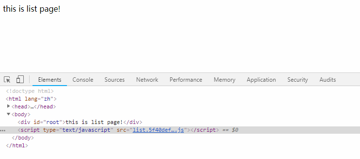

# Webpack配置案例

## PWA配置
::: tip 概念以及作用
PWA全称`Progressive Web Application`(渐进式应用框架)，它能让我们主动缓存文件，这样用户离线后依然能够使用我们缓存的文件打开网页，而不至于让页面挂掉，实现这种技术需要安装`workbox-webpack-plugin`插件
:::

#### 安装插件
``` sh
$ npm install workbox-webpack-plugin -D
```

#### webpack.config.js文件配置
```js {2,7,8,9,10}
// PWA只有在线上环境才有效，所以需要在webpack.prod.js文件中进行配置
const WorkboxWebpackPlugin = require('workbox-webpack-plugin');
const prodConfig = {
  // 其它配置
  plugins: [
    new MiniCssExtractPlugin({}),
    new WorkboxWebpackPlugin.GenerateSW({
      clientsClaim: true,
      skipWaiting: true
    })
  ]
}
module.exports = merge(commonConfig, prodConfig);
```

以上配置完毕后，让我们使用`npm run build`打包看一看生成了哪些文件，`dist`目录的打包结果如下：
``` {5,6}
|-- dist
|   |-- index.html
|   |-- main.f28cbac9bec3756acdbe.js
|   |-- main.f28cbac9bec3756acdbe.js.map
|   |-- precache-manifest.ea54096f38009609a46058419fc7009b.js
|   |-- service-worker.js
```
我们可以代码块高亮的部分，多出来了`precache-manifest.xxxxx.js`文件和`service-worker.js`，就是这两个文件能让我们实现PWA。
#### 改写index.js
::: tip
需要判断浏览器是否支持PWA，支持的时候我们才进行注册，注册的`.js`文件为我们打包后的`service-worker.js`文件。
:::
```js
console.log('hello,world');
if('serviceWorker' in navigator) {
  navigator.serviceWorker.register('/service-worker.js').then((register) => {
    console.log('注册成功');
  }).catch(error => {
    console.log('注册失败');
  })
}
```

#### PWA实际效果
在`npm run dev`后，我们利用`webpack-dev-server`启动了一个小型的服务器，然后我们停掉这个服务器，刷新页面，PWA的实际结果如下图所示


## WebpackDevServer请求转发
在这一小节中，我们要学到的技能有：
* 如何进行接口代理配置
* 如何使用接口路径重写
* 其他常见配置的介绍

假设我们现在有这样一个需求：我有一个URL地址(`http://www.dell-lee.com/react/api/header.json`)，我希望我请求的时候，请求的地址是`/react/api/header.json`，能有一个什么东西能自动帮我把请求转发到`http://www.dell-lee.com`域名下，那么这个问题该如何解决呢？
::: tip 解决办法
可以使用 Webpack 的`webpack-dev-server`这个插件来解决，其中需要配置`proxy`属性。
:::

#### 如何进行接口代理配置
既然我们要做请求，那么安装`axios`来发请求再合适不过了，使用如下命令安装`axios`:
```sh
$ npm install axios --save-dev
```

因为我们的请求代理只能在开发环境下使用，线上的生产环境，需要走其他的代理配置，所以我们需要在`webpack.dev.js`中进行代理配置
```js
const devConfig = {
  // 其它配置
  devServer: {
    contentBase: './dist',
    open: false,
    port: 3000,
    hot: true,
    hotOnly: true,
    proxy: {
      '/react/api': {
        target: 'http://www.dell-lee.com'
      }
    }
  }
}
```
以上配置完毕后，我们在`index.js`文件中引入`axios`模块，再做请求转发。
```js
import axios from 'axios';

axios.get('/react/api/header.json').then((res) => {
  let {data,status} = res;
  console.log(data);
})
```
使用`npm run dev`后， 我们可以在浏览器中看到，我们已经成功请求到了我们的数据。


#### 如何使用接口路径重写
现在依然假设有这样一个场景：`http://www.dell-lee.com/react/api/header.json`这个后端接口还没有开发完毕，但后端告诉我们可以先使用`http://www.dell-lee.com/react/api/demo.json` 这个测试接口，等接口开发完毕后，我们再改回来。
::: tip 解决办法
解决这个问题最佳办法是，代码中的地址不能变动，我们只在`proxy`代理中处理即可，使用`pathRewrite`属性进行配置。
:::
```js {13}
const devConfig = {
  // 其它配置
  devServer: {
    contentBase: './dist',
    open: false,
    port: 3000,
    hot: true,
    hotOnly: true,
    proxy: {
      '/react/api': {
        target: 'http://www.dell-lee.com',
        pathRewrite: {
          'header.json': 'demo.json'
        }
      }
    }
  }
}
```
同样，我们打包后在浏览器中可以看到，我们的测试接口的数据已经成功拿到了。


#### 其他常见配置的含义
**转发到https：** 一般情况下，不接受运行在`https`上，如果要转发到`https`上，可以使用如下配置
```js {7}
module.exports = {
  //其它配置
  devServer: {
    proxy: {
      '/react/api': {
        target: 'https://www.dell-lee.com',
        secure: false
      }
    }
  }
}
```
**跨域：** 有时候，在请求的过程中，由于同源策略的影响，存在跨域问题，我们需要处理这种情况，可以如下进行配置。
```js {7}
module.exports = {
  //其它配置
  devServer: {
    proxy: {
      '/react/api': {
        target: 'https://www.dell-lee.com',
        changeOrigin: true,
      }
    }
  }
}
```

**代理多个路径到同一个target：** 代理多个路径到同一个`target`，可以如下进行配置
```js {5}
module.exports = {
  //其它配置
  devServer: {
    proxy: [{
      context: ['/vue/api', '/react/api'],
      target: 'http://www.dell-lee.com'
    }]
  }
}
```

## 多页打包
现在流行的前端框架都推行单页引用(SPA)，但有时候我们不得不兼容一些老的项目，他们是多页的，那么如何进行多页打包配置呢？
现在我们来思考一个问题：多页运用，即 **多个入口文件+多个对应的html文件** ，那么我们就可以配置 **多个入口+配置多个`html-webpack-plugin`** 来进行。

::: tip 场景
假设现在我们有这样三个页面：`index.html`, `list.html`, `detail.html`，我们需要配置三个入口文件，新建三个`.js`文件。
:::

 在`webpack.common.js`中配置多个`entry`并使用`html-webpack-plugin`来生成对应的多个`.html`页面。
**HtmlWebpackPlugin参数说明**：
* `template`：代表以哪个HTML页面为模板
* `filename`：代表生成页面的文件名
* `chunks`：代表需要引用打包后的哪些`.js`文件
```js
module.exports = {
  // 其它配置
  entry: {
    index: './src/index.js',
    list: './src/list.js',
    detail: './src/detail.js',
  },
  plugins: [
    new HtmlWebpackPlugin({
      template: 'src/index.html',
      filename: 'index.html',
      chunks: ['index']
    }),
    new HtmlWebpackPlugin({
      template: 'src/index.html',
      filename: 'list.html',
      chunks: ['list']
    }),
    new HtmlWebpackPlugin({
      template: 'src/index.html',
      filename: 'detail.html',
      chunks: ['detail']
    }),
    new CleanWebpackPlugin()
  ]
}
```

在`src`目录下新建三个`.js`文件，名字分别是：`index.js`，`list.js`和`detail.js`，它们的代码如下：
```js
// index.js代码
document.getElementById('root').innerHTML = 'this is index page!'

// list.js代码
document.getElementById('root').innerHTML = 'this is list page!'

// detail.js代码
document.getElementById('root').innerHTML = 'this is detail page!'
```

运行`npm run build`进行打包：
``` sh
$ npm run build
```

打包后的`dist`目录：
```js
|-- dist
|   |-- detail.dae2986ea47c6eceecd6.js
|   |-- detail.dae2986ea47c6eceecd6.js.map
|   |-- detail.html
|   |-- index.ca8e3d1b5e23e645f832.js
|   |-- index.ca8e3d1b5e23e645f832.js.map
|   |-- index.html
|   |-- list.5f40def0946028db30ed.js
|   |-- list.5f40def0946028db30ed.js.map
|   |-- list.html
```
随机选择`list.html`在浏览器中运行，结果如下：



::: tip 思考
现在只有三个页面，即我们要配置三个入口+三个对应的`html`，如果我们有十个入口，那么我们也要这样做重复的劳动吗？有没有什么东西能帮助我们自动实现呢？答案当然是有的！
:::

我们首先定义一个`makeHtmlPlugins`方法，它接受一个 Webpack 配置项的参数`configs`，返回一个`plugins`数组
```js
const makeHtmlPlugins = function (configs) {
  const htmlPlugins = []
  Object.keys(configs.entry).forEach(key => {
    htmlPlugins.push(
      new HtmlWebpackPlugin({
        template: 'src/index.html',
        filename: `${key}.html`,
        chunks: [key]
      })
    )
  })
  return htmlPlugins
}
```

通过调用`makeHtmlPlugins`方法，它返回一个`html`的`plugins`数组，把它和原有的`plugin`进行合并后再复制给`configs`
```js
configs.plugins = configs.plugins.concat(makeHtmlPlugins(configs));
module.exports = configs;
```
以上配置完毕后，打包结果依然还是一样的，请自行测试，以下是`webpack.commom.js`完整的代码：
```js
const path = require('path');
const webpack = require('webpack');
const HtmlWebpackPlugin = require('html-webpack-plugin');
const { CleanWebpackPlugin } = require('clean-webpack-plugin');
const miniCssExtractPlugin = require('mini-css-extract-plugin');
const optimizaCssAssetsWebpackPlugin = require('optimize-css-assets-webpack-plugin');
const configs = {
  entry: {
    index: './src/index.js',
    list: './src/list.js',
    detail: './src/detail.js'
  },
  module: {
    rules: [
      {
        test: /\.css$/,
        use: [
          { 
            loader: miniCssExtractPlugin.loader,
            options: {
              hmr: true,
              reloadAll: true
            }
          },
          'css-loader'
        ]
      },
      { 
        test: /\.js$/, 
        exclude: /node_modules/, 
        loader: [
          {
            loader: "babel-loader"
          },
          {
            loader: "imports-loader?this=>window"
          }
        ] 
      }
    ]
  },
  plugins: [
    new CleanWebpackPlugin(),
    new miniCssExtractPlugin({
      filename: '[name].css'
    }),
    new webpack.ProvidePlugin({
      '$': 'jquery',
      '_': 'lodash'
    })
  ],
  optimization: {
    splitChunks: {
      chunks: 'all'
    },
    minimizer: [
      new optimizaCssAssetsWebpackPlugin()
    ]
  },
  output: {
    filename: '[name].js',
    path: path.resolve(__dirname,'../dist')
  }
}
const makeHtmlPlugins = function (configs) {
  const htmlPlugins = []
  Object.keys(configs.entry).forEach(key => {
    htmlPlugins.push(
      new HtmlWebpackPlugin({
        template: 'src/index.html',
        filename: `${key}.html`,
        chunks: [key]
      })
    )
  })
  return htmlPlugins
}
configs.plugins = configs.plugins.concat(makeHtmlPlugins(configs))
module.exports = configs
```


## 如何打包一个库文件(Library)
在上面所有的 Webpack 配置中，几乎都是针对业务代码的，如果我们要打包发布一个库，让别人使用的话，该怎么配置？在下面的几个小节中，我们将来讲一讲该怎么样打包一个库文件，并让这个库文件在多种场景能够使用。

#### 创建一个全新的项目
::: tip 步骤
* 创建library项目
* 使用`npm init -y`进行配置`package.json`
* 新建`src`目录，创建`math.js`文件、`string.js`文件、`index.js`文件
* 根目录下创建`webpack.config.js`文件
* 安装`webpack`、`webpack-cli`
:::

按上面的步骤走完后，你的目录大概看起来是这样子的：
```js
|-- src
|   |-- index.js
|   |-- math.js
|   |-- string.js
|-- webpack.config.js
|-- package.json
```

#### 初始化package.json
```js{8,12}
// 初始化后，改写package.json
{
  "name": "library",
  "version": "1.0.0",
  "description": "",
  "main": "index.js",
  "scripts": {
    "build": "webpack"
  },
  "keywords": [],
  "author": "",
  "license": "MIT"
}

```
#### 创建src目录，并添加文件
在`src`目录下新建`math.js`，它的代码是四则混合运算的方法，如下：
```js
export function add(a, b) {
  return a + b;
}
export function minus(a, b) {
  return a - b;
}
export function multiply(a, b) {
  return a * b;
}
export function division(a, b) {
  return a / b;
}
```
在`src`目录下新建`string.js`，它有一个`join`方法，如下：
```js
export function join(a, b) {
  return a + '' + b;
}
```

在`src`目录下新建`index.js`文件，它引用`math.js`和`string.js`并导出，如下：
```js
import * as math from './math';
import * as string from './string';

export default { math, string };
```

#### 添加webpack.config.js
::: tip 说明
因为我们是要打包一个库文件，所以`mode`只配置为生产环境(`production`)即可。
:::
在以上文件添加完毕后，我们来配置一下`webpack.config.js`文件，它的代码非常简单，如下：
```js
const path = require('path');
module.exports = {
  mode: 'production',
  entry: './src/index.js',
  output: {
    filename: 'library.js',
    path: path.resolve(__dirname, 'dist')
  }
}
```

#### 安装Webpack
根据涉及到 Webpack 打包，所以我们需要使用`npm instll`进行安装：
``` sh
$ npm install webpack webpack-cli -D
```

#### 进行第一次打包
使用`npm run build`进行第一次打包，在`dist`目录下会生成一个叫`library.js`的文件，我们要测试这个文件的话，需要在`dist`目录下新建`index.html`
```sh
$ npm run build
$ cd dist
$ touch index.html
```
在`index.html`中引入`library.js`文件：
```html
<script src="./library.js"></script>
```

至此，我们已经基本把项目目录搭建完毕，现在我们来考虑一下，可以在哪些情况下使用我们打包的文件：
* 使用`ES Module`语法引入，例如`import library from 'library'`
* 使用`CommonJS`语法引入，例如`const library = require('library')`
* 使用`AMD`、`CMD`语法引入，例如`require(['library'], function() {// todo})`
* 使用`script`标签引入，例如`<script src="library.js"></script>`
::: tip 打包方案
针对以上几种使用场景，我们可以在`output`中配置`library`和`libraryTarget`属性(注意：这里的`library`和`libraryTarget`和我们的库名字`library.js`没有任何关系，前者是`webpack`固有的配置项，后者只是我们随意取的一个名字)
:::
```js{8,9}
const path = require('path');
module.exports = {
  mode: 'production',
  entry: './src/index.js',
  output: {
    filename: '[name].js',
    path: path.resolve(__dirname, 'dist'),
    library: 'library',
    libraryTarget: 'umd'
  }
}
```

**配置属性说明：** <br>
* **`library`**：这个属性指，我们库的全局变量是什么，类似于`jquery`中的`$`符号
* **`libraryTarget`**: 这个属性指，我们库应该支持的模块引入方案，`umd`代表支持`ES Module`、`CommomJS`、`AMD`以及`CMD`

在配置完毕后，我们再使用`npm run build`进行打包，并在浏览器中运行`index.html`，在`console`控制台输出`library`这个全局变量，结果如下图所示:


以上我们所写的库非常简单，在实际的库开发过程中，往往需要使用到一些**第三方库**，如果我们不做其他配置的话，第三方库会直接打包进我们的库文件中。<br/><br/>
如果用户在使用我们的库文件时，也引入了这个第三方库，就造成了重复引用的问题，那么如何解决这个问题呢？
::: tip 解决办法
可以在`webpack.config.js`文件中配置`externals`属性
:::

在`string.js`文件的`join`方法中，我们使用第三方库`lodash`中的`_join()`方法来进行字符串的拼接。
```js
import _ from 'lodash';
export function join(a, b) {
  return _.join([a, b], ' ');
}
```
在修改完毕`string.js`文件后，使用`npm run build`进行打包，发现`lodash`直接打包进了我们的库文件，造成库文件积极臃肿，有70.8kb。
```sh {4}
$ npm run build
Built at: 2019-04-05 00:47:25
     Asset      Size  Chunks             Chunk Names
library.js  70.8 KiB       0  [emitted]  main
```
针对以上问题，我们可以在`webpack.config.js`中配置`externals`属性，更多`externals`的用法请点击[externals](https://webpack.js.org/configuration/externals/#root)
```js{5}
const path = require('path');
module.exports = {
  mode: 'production',
  entry: './src/index.js',
  externals: ['lodash'],
  output: {
    filename: 'library.js',
    path: path.resolve(__dirname, 'dist'),
    library: 'library',
    libraryTarget: 'umd'
  }
}
```
配置完`externals`后，我们再进行打包，它的打包结果如下，我们可以看到我们的库文件又变回原来的大小了，证明我们的配置起作用了。
```js {4}
$ npm run build
Built at: 2019-04-05 00:51:22
     Asset      Size  Chunks             Chunk Names
library.js  1.63 KiB       0  [emitted]  main
```

#### 如何发布并使用我们的库文件
在打包完毕后，我们如何发布我们的库文件呢，以下是**发布的步骤**：
::: tip 步骤
* 注册`npm`账号
* 修改`package.json`文件的入口，修改为：`"main": "./dist/library.js"`
* 运行`npm adduser`添加账户名称
* 运行`npm publish`命令进行发布
* 运行`npm install xxx`来进行安装
:::
::: warning 注意

* 为了维护`npm`仓库的干净，我们并未实际运行`npm publish`命令，因为我们的库是无意义的，发布上去属于垃圾代码，所以为了维护`npm`仓库的干净性，请自行尝试发布。
* 自己包的名字不能和`npm`仓库中已有的包名字重复，所以需要在`package.json`中给`name`属性起一个特殊一点的名字才行，例如`"name": "why-library-2019"`
:::


## TypeScript配置
随着`TypeScript`的不断发展，相信未来使用`TypeScript`来编写 JS 代码将变成主流形式，那么如何在 Webpack 中配置支持`TypeScript`呢？可以安装`ts-loader`和`typescript`来解决这个问题。

#### 新建一个项目webpack-typescript
::: tip
新创建一个项目，命名为`webpack-typescript`，并按如下步骤处理：
* 使用`npm init -y`初始化`package.json`文件，并在其中添加`build` Webpack打包命令
* 新建`webpack.config.js`文件，并做一些简单配置，例如`entry`、`output`等
* 新建`src`目录，并在`src`目录下新建`index.ts`文件
* 新建`tsconfig.json`文件，并做一些配置
* 安装`webpack`和`webpack-cli`
* 安装`ts-loader`和`typescript`
:::
按以上步骤完成后，项目目录大概如下所示：
```js
|-- src
|   |-- index.ts
|-- tsconfig.json
|-- webpack.config.js
|-- package.json
```

在`package.json`中添加好打包命令命令：
```js
"scripts": {
  "build": "webpack"
},
```
接下来我们需要对`webpack.config.js`做一下配置：
```js {9}
const path = require('path');
module.exports = {
  mode: 'production',
  module: {
    rules: [
      {
        test: /\.(ts|tsx)?$/,
        use: {
          loader: 'ts-loader'
        }
      }
    ]
  },
  entry: {
    main: './src/index.ts'
  },
  output: {
    filename: '[name].js',
    path: path.resolve(__dirname, 'dist')
  }
}
```

在`tsconfig.json`里面进行`typescript`的相关配置，配置项的说明如下
* `module`: 表示我们使用`ES6`模块
* `target`: 表示我们转换成`ES5`代码
* `allowJs`: 允许我们在`.ts`文件中通过`import`语法引入其他`.js`文件
```js
{
  "compilerOptions": {
    "module": "ES6",
    "target": "ES5",
    "allowJs": true
  }
}
```

在`src/index.ts`文件中书写`TypeScript`代码，像下面这样
```js
class Greeter {
  greeting: string
  constructor(message: string) {
    this.greeting = message;
  }
  greet() {
    return 'hello, ' + this.greeting;
  }
}

let greeter = new Greeter('why');
console.log(greeter.greet());
```

#### 打包测试
* 运行`npm run build`进行打包
* 在生成`dist`目录下，新建`index.html`，并引入打包后的`main.js`文件
* 在浏览器中运行`index.html`


#### 使用其他模块的类型定义文件
::: tip 说明
如果我们要使用`lodash`库，必须安装其对应的类型定义文件，格式为`@types/xxx`
:::
安装`lodash`对应的`typescript`类型文件：
``` sh
$ npm install lodash @types/lodash -D
```
安装完毕后，我们在`index.ts`中引用`lodash`，并使用里面的方法：
```js {1,9}
import * as _ from 'lodash'

class Greeter {
  greeting: string
  constructor(message: string) {
    this.greeting = message;
  }
  greet() {
    return _.join(['hello', this.greeting], '**');
  }
}

let greeter = new Greeter('why');
console.log(greeter.greet());
```

#### 打包测试
使用`npm run build`，在浏览器中运行`index.html`，结果如下：


